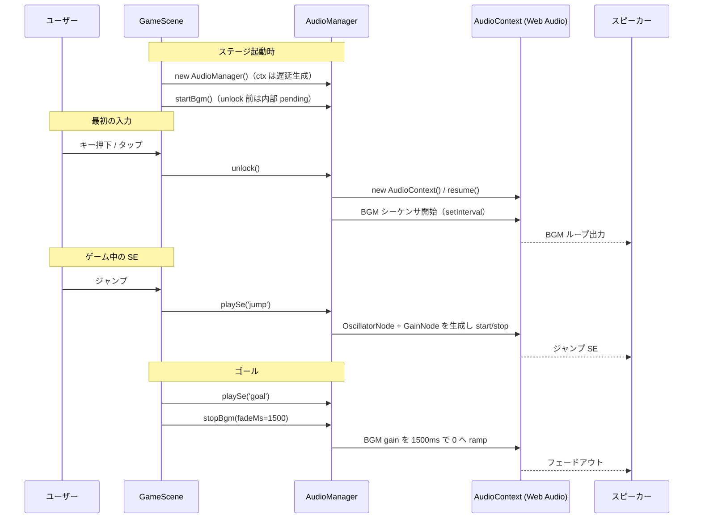
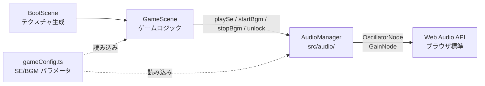
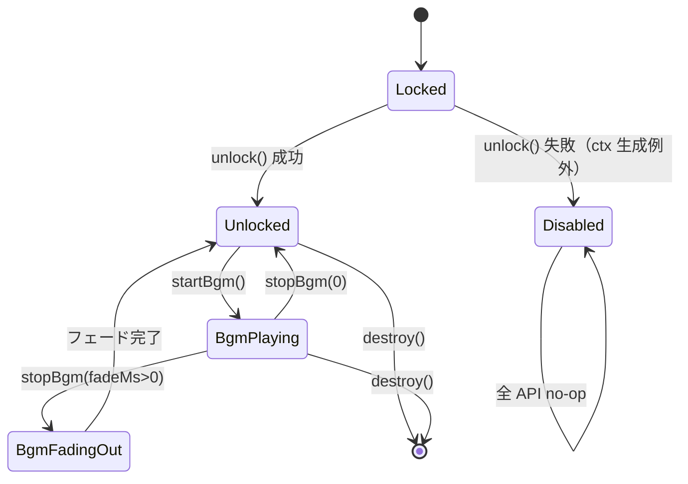

# 設計書: BGM / SE 追加

| 項目 | 内容 |
|------|------|
| 作成日 | 2026-05-04 |
| 担当 | バルベルデ（architecture-designer） |
| 関連要求 | `.steering/20260504-bgm-se/requirements.md` |

---

## 1. 概要

### 設計方針サマリ

- **目的**: ジャンプ・コイン・踏みつけ・ミス・ゴールの SE 5 種、およびステージ BGM 1 曲をループ再生する。バンドルサイズ < 1.5 MB を維持する。
- **方式**: Web Audio API による完全プログラム合成。`OscillatorNode` + `GainNode` を都度生成・破棄する短命グラフで SE を鳴らし、BGM は単一の `setInterval` 駆動シーケンサで矩形波アルペジオを連続発火する。外部音声ファイル・追加 npm 依存ともにゼロ。
- **最小スコープ厳守**: 音量調整 UI・ミュート切替・複数 BGM・空間音響・iOS 以外固有のフォールバックは v0.3 以降に持ち越し。今回は「鳴る／鳴らないフォールバック」の二択のみ。
- **既存資産は壊さない**: `BootScene` のテクスチャ生成（プログラム生成パターン）と同じ思想で `AudioManager` を独立配置。`GameScene` の既存ゲームロジック（敵 AI・コイン・タッチ操作・HUD）は呼び出し追加のみで一切のロジック変更を行わない。`fullRestart()` の `window.location.reload()` 方式も継続（BGM はリロード後の `create()` で自然再開）。
- **ハードコーディング禁止**: 全 SE の周波数・持続時間・波形・エンベロープ係数、BGM の BPM・音符列・マスター音量を `src/config/gameConfig.ts` の末尾に追記する。`AudioManager` 内に数値リテラルを置かない。

### スコープ確定（Q1〜Q4 の採否）

| 論点 | 採用 |
|------|------|
| Q1. 音声実装方式 | **A. Web Audio API による完全プログラム合成**（ファイル同梱なし）。残バンドル余地 10 kB の制約と CSP `default-src 'self'` 維持の両立が確実。OGG/MP3 同梱は将来「音量 UI」スプリントで再評価。 |
| Q2. iOS Safari AudioContext unlock | **GameScene 側の最初のユーザー入力（キー押下 / ポインタダウン）で `AudioManager.unlock()` を 1 回だけ呼ぶ**。AudioManager は `AudioContext` を遅延生成し、`resume()` の冪等呼び出しを内部で吸収する。 |
| Q3. ゴール後の BGM | **B. 1.5 秒フェードアウトして停止**。ゴール SE のファンファーレが BGM に埋もれるのを避けつつ、急なブツ切りも避ける。リスタート（リロード）で完全に再起動。 |
| Q4. BGM の音楽的方向性 | **A. 単純な 8 ステップのアルペジオ・ループ（4 拍 1 小節 × 2 小節 = 16 ステップ）**。矩形波単音 + 任意エンベロープのみで実装可能。構造ありメロディは情報量・実装工数・破綻リスクが大きく今回スコープ外。 |

---

## 2. アーキテクチャ図

### 2.1 シーケンス図 — SE / BGM の再生経路



### 2.2 モジュール配置



`AudioManager` は Phaser に依存しない純粋クラスとし、`GameScene` から DI 風に保持する。Phaser の Sound Manager はデフォルト無効化のままにする（独自実装の方が SE の合成パラメータ制御が直接的なため）。

---

## 3. コンポーネント設計

### 3.1 新規モジュール — `src/audio/AudioManager.ts`

#### 公開 API

```ts
export type SeKey = 'jump' | 'coin' | 'stomp' | 'miss' | 'goal';

export class AudioManager {
  /** 最初のユーザー入力時に 1 回だけ呼ぶ。冪等。失敗してもゲームは続行。 */
  unlock(): void;

  /** SE を再生。unlock 前は no-op（音は鳴らないがエラーは投げない）。 */
  playSe(key: SeKey): void;

  /** BGM ループ開始。unlock 前は pending フラグを立て、unlock 時に開始。 */
  startBgm(): void;

  /** BGM 停止。fadeMs=0 で即停止、>0 で線形フェードアウト後停止。 */
  stopBgm(fadeMs?: number): void;

  /** GameScene のシャットダウン時に呼ぶ。タイマー・グラフを全停止。 */
  destroy(): void;
}
```

#### 内部構造

```ts
class AudioManager {
  private ctx: AudioContext | null = null;     // 遅延生成
  private masterGain: GainNode | null = null;  // 全出力をここに集約（マスター音量）
  private bgmGain: GainNode | null = null;     // BGM 系統のフェード制御用
  private bgmTimer: number | null = null;      // setInterval ハンドル
  private bgmStep = 0;                         // シーケンサのステップカウンタ
  private bgmPending = false;                  // unlock 前に startBgm() された場合のフラグ
  private unlocked = false;
}
```

#### 設計上の重要点

- **遅延生成**: `new AudioContext()` を constructor で呼ばない。iOS Safari は「ユーザー入力イベントのコールスタック内」で生成しないと suspended のまま固まる挙動があるため、`unlock()` の中で初めて生成する。
- **冪等な unlock**: `unlock()` は `unlocked === true` なら即 return。`AudioContext.state === 'suspended'` のときのみ `resume()` を `await` せずファイア・アンド・フォーゲット（GameScene の入力ハンドラを await でブロックしないため）。
- **SE は短命グラフ**: `playSe()` は呼び出し毎に `OscillatorNode` と `GainNode` を生成し、`start(now)` → `stop(now + duration)` で自動破棄。`onended` で参照を null 化。GC 任せにしない。
- **エンベロープ**: `GainNode.gain.setValueAtTime(0, now)` → `linearRampToValueAtTime(peak, now+attack)` → `exponentialRampToValueAtTime(0.0001, now+duration)` の AD 型のみ。SR は使わない（短い SE なので不要）。
- **エラー無害化**: AudioContext 生成失敗（古いブラウザ・iframe 制約等）は `try/catch` で握り潰し、以降のすべての API を no-op にする。**音が鳴らなくてもゲームプレイには支障がない**という要件を保証。
- **毎フレーム処理ゼロ**: `update()` ループから AudioManager を一切呼ばない。SE はイベント駆動、BGM は AudioContext のクロックで動く `setInterval`。Phaser のメインループに音声処理が混ざらない。

#### SE 5 種の合成パラメータ（gameConfig.ts に集約する値）

| key | 波形 | 周波数 | 持続 (ms) | エンベロープ | 用途感 |
|-----|------|--------|----------|-------------|--------|
| `jump`  | square   | 440 → 880 (sweep up)              | 120 | A=5ms, D=115ms | 短い上昇音 |
| `coin`  | square   | 988 (B5) → 1568 (G6) の 2 段     | 140 | A=2ms, D=70ms ×2 | 明るいチャリン |
| `stomp` | square   | 220 → 110 (sweep down)            | 100 | A=2ms, D=98ms  | 低めのドン |
| `miss`  | sawtooth | 330 → 110 (sweep down)            | 500 | A=10ms, D=490ms | 下降する失敗音 |
| `goal`  | square   | 523, 659, 784, 1047 を順次（C E G C） | 各 150（合計 600） | 各 A=5ms, D=145ms | ファンファーレ風 |

擬似コード（`playSe('jump')` の例）:

```ts
private playSe(key: SeKey): void {
  if (!this.ctx || !this.masterGain) return;
  const cfg = SE_PARAMS[key]; // gameConfig.ts から
  const now = this.ctx.currentTime;
  const osc = this.ctx.createOscillator();
  const gain = this.ctx.createGain();
  osc.type = cfg.waveform;
  osc.frequency.setValueAtTime(cfg.freqStart, now);
  if (cfg.freqEnd !== cfg.freqStart) {
    osc.frequency.linearRampToValueAtTime(cfg.freqEnd, now + cfg.durationSec);
  }
  gain.gain.setValueAtTime(0, now);
  gain.gain.linearRampToValueAtTime(cfg.peakGain, now + cfg.attackSec);
  gain.gain.exponentialRampToValueAtTime(0.0001, now + cfg.durationSec);
  osc.connect(gain).connect(this.masterGain);
  osc.start(now);
  osc.stop(now + cfg.durationSec + 0.02);
  osc.onended = () => { osc.disconnect(); gain.disconnect(); };
}
```

`coin` と `goal` は複数音を時間差で発火するため、`playSe()` 内で配列を for ループしてオフセット付きでスケジューリングする（複数 `OscillatorNode` を `start(now + offset)` で並べる）。

#### BGM ループ構造

8 ステップ × 2 小節 = 16 ステップの矩形波アルペジオ。BPM=120 想定で 1 ステップ = 125 ms。`setInterval(125)` で `bgmStep` を回し、各ステップで `playSeAt()` 相当の短い矩形波をスケジュールする。SE と同じ短命グラフ方式だが、出力先は `bgmGain → masterGain` の経路（フェードアウト制御のため）。

| ステップ | ノート | Hz |
|---------|-------|----|
| 0,4,8,12 | C5  | 523.25 |
| 1,5,9,13 | E5  | 659.25 |
| 2,6,10,14 | G5  | 783.99 |
| 3       | C6  | 1046.50 |
| 7       | B5  | 987.77 |
| 11      | A5  | 880.00 |
| 15      | G5  | 783.99 |

各ノートは `duration = 100ms`、`peakGain = 0.08`（SE よりかなり小さく）でマスクを避ける。

擬似コード:

```ts
private startBgm(): void {
  if (!this.ctx) { this.bgmPending = true; return; }
  if (this.bgmTimer !== null) return; // 多重起動防止
  this.bgmStep = 0;
  this.bgmTimer = window.setInterval(() => this.tickBgm(), BGM_STEP_MS);
}

private tickBgm(): void {
  if (!this.ctx || !this.bgmGain) return;
  const note = BGM_PATTERN[this.bgmStep % BGM_PATTERN.length];
  // note.freq の矩形波を BGM_NOTE_DURATION_MS だけ鳴らす（接続先は bgmGain）
  this.scheduleNote(note.freq, BGM_NOTE_DURATION_MS, this.bgmGain);
  this.bgmStep++;
}

private stopBgm(fadeMs = 0): void {
  if (this.bgmTimer !== null) {
    window.clearTimeout(this.bgmStopTimer ?? 0);
    if (fadeMs > 0 && this.ctx && this.bgmGain) {
      const now = this.ctx.currentTime;
      this.bgmGain.gain.cancelScheduledValues(now);
      this.bgmGain.gain.setValueAtTime(this.bgmGain.gain.value, now);
      this.bgmGain.gain.linearRampToValueAtTime(0.0001, now + fadeMs / 1000);
      this.bgmStopTimer = window.setTimeout(() => this.haltBgmTimer(), fadeMs);
    } else {
      this.haltBgmTimer();
    }
  }
}
```

### 3.2 既存改造 — `src/scenes/GameScene.ts`

`GameScene` のクラスメンバに `private audio!: AudioManager;` を追加し、以下のフックポイントから呼び出す。**既存のロジック分岐は変更しない**。呼び出し位置のみ追加。

| 位置 | 追加呼び出し | 理由 |
|------|-------------|------|
| `create()` 末尾 | `this.audio = new AudioManager(); this.audio.startBgm();` | ステージ起動と同時に BGM pending 開始 |
| `setupTouchControls()` 内の `pointerdown` ハンドラ先頭 | `this.audio.unlock();` | iOS Safari 用の最初のタッチで unlock |
| `create()` でキーボード初期化後 | `this.input.keyboard!.once('keydown', () => this.audio.unlock());` | PC 環境用の最初のキー入力で unlock |
| `update()` のジャンプ判定が真になった直後 | `this.audio.playSe('jump');` | ジャンプ SE |
| `onCoinOverlap` の `coinsCollected++` 直後 | `this.audio.playSe('coin');` | コイン SE |
| `onEnemyOverlap` の `isStomp === true` ブランチ内 | `this.audio.playSe('stomp');` | 踏みつけ SE |
| `handleMiss()` の冒頭（多重ガード後） | `this.audio.playSe('miss');` | ミス SE |
| `onGoalHit` の冒頭（`isCleared` ガード後） | `this.audio.playSe('goal'); this.audio.stopBgm(BGM_FADE_OUT_MS);` | ゴール SE + BGM フェードアウト |
| `events.once('shutdown', ...)` を追加 | `this.audio.destroy();` | シーン破棄時のクリーンアップ（実質 reload なので保険） |

**ジャンプ SE の注入位置に注意**: 現行コードは `if ((keyJumpDown || this.touchJumpRequested) && onGround) { this.player.setVelocityY(JUMP_VELOCITY); }` の 1 行ブランチ。SE 呼び出しは**この `if` ブロック内、`setVelocityY` の直後**に入れる。`onGround` 条件外（空中での `keyJumpDown`）では鳴らさない。

### 3.3 設定追加 — `src/config/gameConfig.ts`

末尾に以下のセクションを追記する（既存定数は触らない）。

```ts
// --- v0.3: BGM / SE ---

export type SeWaveform = 'sine' | 'square' | 'sawtooth' | 'triangle';

export interface SeStep {
  freqStart: number;
  freqEnd: number;
  durationSec: number;
  attackSec: number;
  peakGain: number;
  waveform: SeWaveform;
  /** 前ステップ開始からの相対オフセット秒。0 で同時。 */
  offsetSec: number;
}

export interface SeDefinition {
  steps: ReadonlyArray<SeStep>;
}

/** マスター音量（0.0〜1.0）。SE と BGM の最終出力にかかる。 */
export const AUDIO_MASTER_GAIN = 0.5;
/** BGM 系統の追加減衰（マスターにさらに乗算）。 */
export const AUDIO_BGM_GAIN = 0.6;

export const SE_PARAMS: Record<'jump' | 'coin' | 'stomp' | 'miss' | 'goal', SeDefinition> = {
  jump:  { steps: [{ freqStart: 440, freqEnd: 880, durationSec: 0.12, attackSec: 0.005, peakGain: 0.3, waveform: 'square',   offsetSec: 0 }] },
  coin:  { steps: [
    { freqStart: 988,  freqEnd: 988,  durationSec: 0.07, attackSec: 0.002, peakGain: 0.3, waveform: 'square', offsetSec: 0 },
    { freqStart: 1568, freqEnd: 1568, durationSec: 0.07, attackSec: 0.002, peakGain: 0.3, waveform: 'square', offsetSec: 0.07 }
  ] },
  stomp: { steps: [{ freqStart: 220, freqEnd: 110, durationSec: 0.10, attackSec: 0.002, peakGain: 0.4, waveform: 'square',   offsetSec: 0 }] },
  miss:  { steps: [{ freqStart: 330, freqEnd: 110, durationSec: 0.50, attackSec: 0.010, peakGain: 0.35, waveform: 'sawtooth', offsetSec: 0 }] },
  goal:  { steps: [
    { freqStart: 523,  freqEnd: 523,  durationSec: 0.15, attackSec: 0.005, peakGain: 0.35, waveform: 'square', offsetSec: 0 },
    { freqStart: 659,  freqEnd: 659,  durationSec: 0.15, attackSec: 0.005, peakGain: 0.35, waveform: 'square', offsetSec: 0.15 },
    { freqStart: 784,  freqEnd: 784,  durationSec: 0.15, attackSec: 0.005, peakGain: 0.35, waveform: 'square', offsetSec: 0.30 },
    { freqStart: 1047, freqEnd: 1047, durationSec: 0.20, attackSec: 0.005, peakGain: 0.40, waveform: 'square', offsetSec: 0.45 }
  ] }
};

/** BGM の 1 ステップあたりのミリ秒（BPM=120, 16分音符相当）。 */
export const BGM_STEP_MS = 125;
/** BGM 各ノートの実音長（ms）。STEP_MS より短くしてレガート防止。 */
export const BGM_NOTE_DURATION_MS = 100;
/** BGM 1 ノートのピーク gain。 */
export const BGM_NOTE_PEAK_GAIN = 0.08;
/** BGM ノートの波形。 */
export const BGM_WAVEFORM: SeWaveform = 'square';
/** BGM のループパターン（Hz）。長さは任意。 */
export const BGM_PATTERN: ReadonlyArray<number> = [
  523.25, 659.25, 783.99, 1046.50, 783.99, 659.25, 523.25, 987.77,
  523.25, 659.25, 783.99, 880.00, 783.99, 659.25, 523.25, 783.99
];
/** ゴール時の BGM フェードアウト時間（ms）。 */
export const BGM_FADE_OUT_MS = 1500;
```

### 3.4 既存処理の改造ポイント

| 既存処理 | 変更 |
|---------|------|
| `GameScene.create()` | 末尾に `AudioManager` 生成・`startBgm()`・unlock リスナー登録を追加 |
| `GameScene.update()` のジャンプ判定 | `setVelocityY(JUMP_VELOCITY)` 直後に `playSe('jump')` を 1 行追加 |
| `GameScene.onCoinOverlap` | `coinsCollected++` 直後に `playSe('coin')` |
| `GameScene.onEnemyOverlap` | `isStomp === true` ブランチに `playSe('stomp')` |
| `GameScene.handleMiss` | 冒頭ガード後に `playSe('miss')` |
| `GameScene.onGoalHit` | 冒頭ガード後に `playSe('goal')` + `stopBgm(BGM_FADE_OUT_MS)` |
| `GameScene.setupTouchControls` | `pointerdown` ハンドラ先頭で `audio.unlock()` |
| `BootScene` | **変更なし**（テクスチャ生成のみの責務を保つ） |
| `index.html` | **変更なし**（CSP も変更不要、外部 src を一切追加しない） |
| `GameScene.fullRestart` | **変更なし**（`window.location.reload()` で AudioContext ごと再生成される） |

---

## 4. iOS Safari AudioContext unlock 設計（Q2）

### 4.1 課題

iOS Safari / iOS Chrome は「ユーザージェスチャ（タッチ・キー押下・クリック）のコールスタック内で AudioContext を生成または resume しないと suspended のまま音が出ない」という制約を持つ。`GameScene.create()` 内で先に `new AudioContext()` を呼ぶと suspended のまま固まる。

### 4.2 設計

1. **AudioContext は遅延生成**: `AudioManager.unlock()` の中で初めて `new AudioContext()` する。
2. **GameScene の最初の入力で unlock**:
   - **キーボード**: `this.input.keyboard!.once('keydown', () => this.audio.unlock())` を `create()` で 1 回だけ登録。`once` なので自動解除される。
   - **タッチ**: `setupTouchControls()` の `pointerdown` ハンドラ冒頭で毎回 `this.audio.unlock()` を呼ぶ。`unlock()` 自体が冪等（`unlocked` フラグで早期 return）なのでオーバーヘッドはほぼゼロ。
3. **pending BGM**: `unlock()` 前に `startBgm()` が呼ばれた場合、内部で `bgmPending = true` にして AudioContext 生成を待つ。`unlock()` 完了時に `bgmPending` を見て `startBgm()` を実走する。
4. **state 監視**: `unlock()` 内で `ctx.state === 'suspended'` の場合のみ `ctx.resume()` を呼ぶ。`resume()` は Promise を返すが `await` しない（入力ハンドラのレイテンシを増やさない）。
5. **失敗時**: `try/catch` で `new AudioContext()` 失敗を捕捉し、`unlocked = false` のまま全 API を no-op 化。ゲームは無音で続行。

```ts
unlock(): void {
  if (this.unlocked) return;
  try {
    this.ctx = new (window.AudioContext || (window as any).webkitAudioContext)();
    this.masterGain = this.ctx.createGain();
    this.masterGain.gain.value = AUDIO_MASTER_GAIN;
    this.masterGain.connect(this.ctx.destination);
    this.bgmGain = this.ctx.createGain();
    this.bgmGain.gain.value = AUDIO_BGM_GAIN;
    this.bgmGain.connect(this.masterGain);
    if (this.ctx.state === 'suspended') {
      void this.ctx.resume();
    }
    this.unlocked = true;
    if (this.bgmPending) {
      this.bgmPending = false;
      this.startBgm();
    }
  } catch {
    this.unlocked = false; // 全 API は no-op になる
  }
}
```

### 4.3 webkitAudioContext のフォールバック

`(window as any).webkitAudioContext` を OR でフォールバックに入れる。iOS 14 系以降は標準 `AudioContext` で問題ないが、Safari の古めのバージョンでも壊れない保険。

---

## 5. 状態遷移（AudioManager 内部）



`Locked` 状態で `startBgm()` が来た場合は `bgmPending = true` を立てて `Locked` のまま待機し、`unlock()` 成功時に `BgmPlaying` へ遷移する。

---

## 6. エラーハンドリング

| シナリオ | AudioManager 挙動 | GameScene 挙動 |
|---------|------------------|----------------|
| `AudioContext` 生成失敗 | 全 API を no-op 化 | 影響なし。無音でゲーム続行 |
| `unlock()` 前に `playSe()` | 早期 return（`ctx === null`） | 影響なし。最初の数フレーム分の SE が鳴らないだけ |
| `unlock()` 前に `startBgm()` | `bgmPending = true`、`unlock()` 時に開始 | 影響なし |
| `setInterval` が高負荷で遅延 | BGM がややよれる | 60 fps は維持される（メインループ非依存） |
| `OscillatorNode.start()` 例外 | try/catch で握り潰し | 影響なし |
| ページ visibility hidden（タブ非アクティブ） | ブラウザが AudioContext を suspend する場合あり | 復帰時に自然再開（追加コードなし） |

「音が鳴らなくてもゲームプレイに支障がない」という要件は、すべての public API を `try/catch` または null チェックで包むことで保証する。

---

## 7. データモデル / DB 設計

該当なし（バックエンド・永続データなし）。設定値はすべて `src/config/gameConfig.ts` のコンパイル時定数として配置。

---

## 8. 影響範囲

### 8.1 変更/新規ファイル

| ファイル | 種別 | 内容 |
|---------|------|------|
| `src/audio/AudioManager.ts` | 新規 | Web Audio API ラッパー。SE / BGM の合成・再生・unlock を提供 |
| `src/config/gameConfig.ts` | 変更 | 末尾に `SE_PARAMS` / `BGM_PATTERN` / `AUDIO_*` / `BGM_*` 定数を追記。既存定数は不変 |
| `src/scenes/GameScene.ts` | 変更 | `audio` メンバ追加、`create()` に AudioManager 生成・unlock リスナー登録、各 SE フックポイントに `playSe()` 呼び出し追加、`onGoalHit` に `stopBgm()` 追加 |
| `src/scenes/BootScene.ts` | 変更なし | テクスチャ生成のみの責務を維持 |
| `index.html` | 変更なし | CSP も変更不要（外部 src を追加しないため） |
| `package.json` | 変更なし | 追加 npm 依存ゼロ |
| `docs/architecture.md` | 任意 | 「音声レイヤ」節を追記してもよい（P6 タスクで対応可） |

### 8.2 既存機能への影響

| 機能 | 影響 | 緩和策 |
|------|------|------|
| ジャンプ・移動 | なし | 呼び出し追加のみ、ロジック分岐は不変 |
| 敵 AI（巡回・反転） | なし | 触らない |
| コイン取得・HUD | なし | `coinsCollected++` 直後に SE 1 行追加のみ |
| ミス → リスタート | なし | `handleMiss` 冒頭に SE 1 行追加。`fullRestart()` の reload で AudioContext ごと再構築 |
| ゴール演出 | テキスト表示と並行で SE + BGM フェード | 同期 API なので干渉なし |
| タッチ操作 | なし | `pointerdown` 先頭で `unlock()` を 1 行追加するのみ |
| レスポンシブ | なし | DOM/Canvas サイズに非依存 |
| バンドルサイズ | +2〜4 kB（AudioManager + 定数） | 1.5 MB 上限内で十分余裕 |
| 60 fps | なし | update() ループで音声処理を一切行わない |

---

## 9. PoC スコープと成功基準

### 9.1 検証項目（受け入れ条件への対応）

| 受け入れ条件（requirements.md §7） | 検証方法 |
|---------------------------------|---------|
| ジャンプ時に SE が鳴る | Pages デプロイ後、PC でジャンプ／スマホで右タップ |
| コイン取得時に SE が鳴る | コインに重なって明るい音 |
| 敵踏みつけ撃破時に SE が鳴る | 敵を踏んで低めのドン音 |
| ミス時に SE が鳴る | 敵接触・落下それぞれで下降音 |
| ゴール達成時に SE が鳴る | ゴールに触れてファンファーレ + BGM フェードアウト |
| BGM がステージ開始直後からループ再生 | ステージ表示後、最初の入力以降ループが続く |
| リスタート後も BGM が再開 | ミス → reload 後、再び最初の入力で BGM 開始 |
| 既存機能が正常動作 | 敵 AI・コイン・HUD・タッチ・レスポンシブの目視確認 |
| `npm run typecheck` / `npm run build` 通過 | CI および手動 build |
| バンドル < 1.5 MB | `vite build` 出力の警告がないこと |
| クルトワレビューで Critical/High なし | コミット前の security-engineer 実行 |

### 9.2 計測指標

| 指標 | 目標 | 計測点 |
|------|------|-------|
| SE 発火レイテンシ | < 50 ms | イベント発火 → 音出力（実機体感） |
| 60 fps 維持 | 60 fps ± 1 | Chrome DevTools の Performance タブ（必要時） |
| バンドルサイズ | < 1.5 MB | `vite build` 出力 |
| 追加コード行数 | < 250 行 | `git diff --stat` |

**理論値**: Web Audio API の `start(now)` は AudioContext のクロックで 5〜10 ms 以内にスケジュールされる。`setInterval` の jitter を含めても 50 ms 上限に対し十分な余裕がある。

### 9.3 失敗時のフォールバック

- AudioContext 生成失敗（古い iOS など）→ 無音でゲーム続行（要件 §5.2 で許容済み）
- BGM のリズムよれが目立つ → `setInterval` を `AudioContext.currentTime` ベースの先読みスケジューリング（v0.3 で改善余地、今回は採用しない）
- バンドルが想定外に膨らんだ → `BGM_PATTERN` を短縮、`AudioManager` の SE 関数を統合（影響軽微）

---

## 10. 未確定事項・要シャビ判断

### 10.1 Q1〜Q4 のバルベルデ推奨（最終判断）

#### Q1: 音声実装方式

| 案 | トレードオフ | 推奨 |
|----|--------------|------|
| **A. Web Audio API 完全合成** | 利点: バンドル増 ≈ 0、CSP 維持、追加依存ゼロ。欠点: チップチューン風サウンドに限定 | **採用** |
| B. 軽量 OGG/MP3 同梱 | 利点: 音色の自由度大。欠点: 残バンドル 10 kB ではほぼ不可、5 種 + BGM で軽く超過 | 不採用 |
| C. CDN フェッチ | 利点: バンドル不変。欠点: CSP `default-src 'self'` 違反、要件抵触 | 不採用 |

**推奨理由**: 残バンドル予算 10 kB の制約と CSP `default-src 'self'` の維持を両立できる唯一の実用解。`BootScene` がすでにテクスチャをプログラム生成しているため、設計思想の一貫性も保てる。

#### Q2: iOS Safari AudioContext unlock

| 案 | トレードオフ | 推奨 |
|----|--------------|------|
| **A. GameScene 入力ハンドラ + AudioManager.unlock() 冪等呼び出し** | 利点: 入力経路が既に存在、追加 DOM リスナー不要。欠点: AudioManager と GameScene の結合が一段増える | **採用** |
| B. window レベルの 1 回限り `pointerdown`/`keydown` リスナー | 利点: GameScene と完全分離。欠点: Phaser のイベントとの二重ハンドラ、メモリリーク注意 | 不採用 |
| C. AudioManager 自身が `document` にリスナー登録 | 利点: 自己完結。欠点: Phaser Canvas のフォーカス管理と競合する恐れ | 不採用 |

**推奨理由**: `GameScene` には既に `pointerdown` と `keydown` のハンドラ経路が存在し、そこに 1 行追加するだけで済む。`unlock()` を冪等にすれば毎フレームのオーバーヘッドはゼロ。最も影響範囲が小さく、既存ナレッジを壊さない。

#### Q3: ゴール後の BGM 扱い

| 案 | トレードオフ | 推奨 |
|----|--------------|------|
| A. 継続 | 利点: 実装最小。欠点: ゴール SE のファンファーレが BGM に埋もれる | 不採用 |
| **B. 1.5 秒フェードアウトして停止** | 利点: ゴール SE が映える、ブツ切り回避。欠点: フェード制御の実装が必要（既に設計済み） | **採用** |
| C. 即停止 | 利点: 実装シンプル。欠点: 唐突で違和感 | 不採用 |

**推奨理由**: ゴールは「報酬演出」のため、ファンファーレ SE をはっきり聴かせる必要がある。フェード制御は `GainNode.linearRampToValueAtTime` 1 行で実装でき、コスト対効果が最も高い。

#### Q4: BGM の音楽的方向性

| 案 | トレードオフ | 推奨 |
|----|--------------|------|
| **A. 16 ステップのアルペジオ・ループ** | 利点: 実装単純、データ量極小、破綻リスク低。欠点: 単調 | **採用** |
| B. 構造ありメロディ（A-B 2 セクション、ベース付き） | 利点: 聴き応え。欠点: 実装工数 2〜3 倍、定数量も増、デバッグ困難 | 不採用 |
| C. ノイズ系ドラム + ベースの 2 トラック | 利点: ゲームらしい。欠点: 同時発音数増、フィルタ実装が必要 | 不採用 |

**推奨理由**: スプリント目的は「鳴る」ことの達成であり、音楽的完成度は副次目的。アルペジオ・ループは Web Audio API の基本機能だけで実装でき、後続スプリントで容易に差し替え可能（`BGM_PATTERN` 配列を入れ替えるだけ）。

### 10.2 残る未確定事項

| # | 項目 | 内容 |
|---|------|------|
| Q5 | マスター音量のデフォルト値 | `AUDIO_MASTER_GAIN = 0.5` で提案。実機で大きすぎ／小さすぎを感じたら gameConfig 値を調整（コード変更不要） |
| Q6 | BGM 開始タイミング | `create()` 直後に `startBgm()` する設計だが、unlock 前は pending。「最初の入力まで完全無音」が UX 的に許容かは実機確認後に判断 |
| Q7 | タブ非アクティブ時の挙動 | ブラウザ標準の AudioContext suspend に任せる。明示的な `visibilitychange` ハンドリングは v0.3 以降で検討 |

---

## 設計品質チェック

- **セキュリティ**: 外部フェッチなし／CSP `default-src 'self'` 不変／`add.text()` 等への動的文字列注入なし（既存方針継続）／`new Function`・`eval` 不使用。クルトワレビュー対象は新規 `AudioManager.ts` と `gameConfig.ts` 末尾追記のみ。
- **テスタビリティ**: `AudioManager` は Phaser に非依存の純粋クラスのため、ブラウザ環境での単体起動が可能。ただし Web Audio API のモック化はコスト高、自動テストは将来課題（今回スコープ外）。
- **モジュール性**: `src/audio/` ディレクトリを新設し、ゲームロジック（`scenes/`）と音声合成を完全分離。差し替え時は `AudioManager` の interface を保つだけで済む。
- **コスト効率**: 追加 npm 依存ゼロ、追加バイナリゼロ、追加ネットワークコールゼロ。GitHub Pages の配信コストへの影響なし。
- **保守性**: SE / BGM のすべてのパラメータが `gameConfig.ts` 1 ファイルに集約。音楽的調整はコード変更ではなく数値変更のみで完結。
- **可観測性**: 音声系は失敗しても無音で続行する設計のため、現状はログ出力なし。デバッグ時のみ `console.warn` を追加する余地は残す（コミット前に削除）。
- **60 fps 維持**: `update()` ループから AudioManager を一切呼ばない設計。SE はイベント駆動、BGM は `setInterval` 駆動でメインループから完全分離。

---

作成: バルベルデ / 2026-05-04
