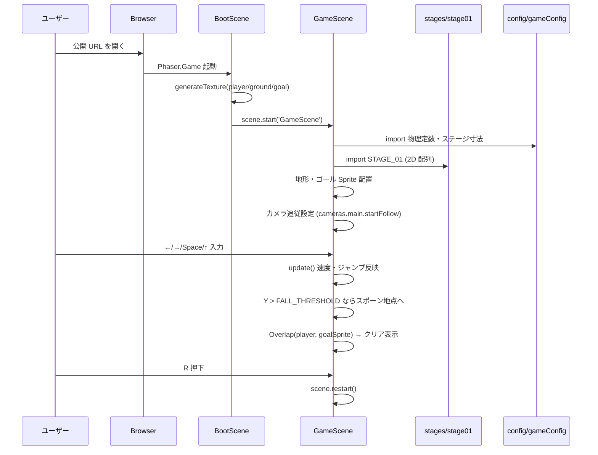
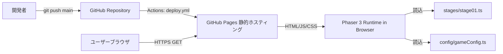
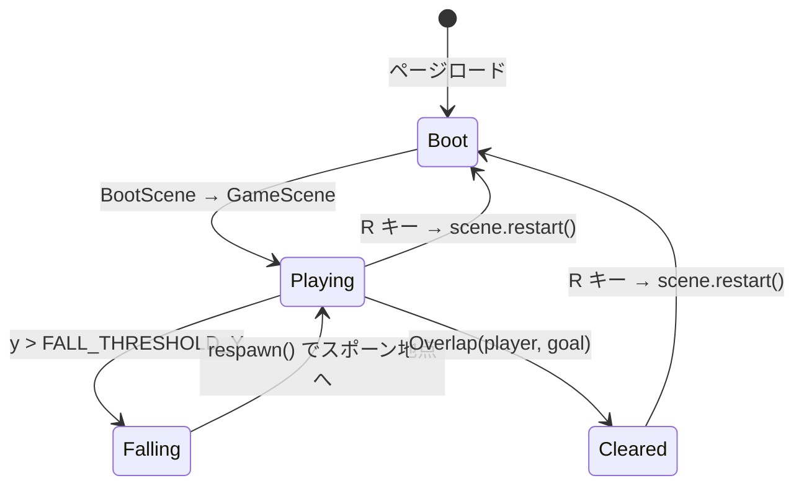

# 設計書: 最小プレイ可能版 v0.1

| 項目 | 内容 |
|------|------|
| 作成日 | 2026-05-04 |
| 担当 | バルベルデ（architecture-designer） |
| 関連要求 | `.steering/20260504-minimum-playable/requirements.md` |

---

## 1. 概要

### 設計方針サマリ

- **目的**: 公開 URL を開くだけで「左右移動 + ジャンプで横スクロール 1 ステージを踏破 → ゴール → R でリスタート」までを遊べる最小版を実装し、GitHub Pages デプロイ動線を初通しする。60 fps / 初回ロード 5 秒以内 / 入力レイテンシ 100 ms 以内。
- **方式**: 既存 `BootScene` / `GameScene` の 2 シーン構成を維持。新規にステージ定義モジュール（`src/stages/`）と定数集約モジュール（`src/config/`）を切り出し、`GameScene` はそれらを読み込んで地形を構築する純粋なランタイムに留める。プレースホルダは現行の `Graphics.generateTexture()` 動的生成を踏襲。
- **最小スコープ厳守**: 敵 / コイン / BGM / SE / 複数ステージ / タッチ操作 / セーブ / タイトル画面は全て v0.2 以降。アセット差し替えも本スプリントでは行わない。
- **既存資産は壊さない**: `vite.config.ts` の `VITE_BASE_PATH` 解決、`index.html` の CSP `<meta>`、`.github/workflows/deploy.yml` のビルド動線、`main.ts` の Phaser ゲーム設定（960×540・gravity 800・FIT スケール）は維持。物理パラメータ（`PLAYER_SPEED=200`, `JUMP_VELOCITY=-450`）は出発点として維持し、調整は実装中に許容。
- **ハードコーディング禁止**: ステージ定義は `src/stages/stage01.ts`、物理・寸法・閾値は `src/config/gameConfig.ts` に集約。GitHub Pages base パスのみ `vite.config.ts` 経由で `VITE_BASE_PATH` 環境変数から取得（既存維持）。

### スコープ確定

| 項目 | 採用 |
|------|------|
| ステージ定義保持方式（Q1） | **A. TypeScript 2 次元配列定数**。v0.1 のサイズ感（横 ≦ 5 画面）に最適、追加依存ゼロ、型補完が効く |
| ゴール判定方式（Q2） | **A. 透明 Sprite + Overlap**。Phaser の責務分離に沿い、リスタート時の生成・破棄も `scene.restart()` で自動回収 |
| リスタート方式（Q3） | **A. `this.scene.restart()`**。状態漏れリスクが最小、UI テキストの解除も自動 |
| プレースホルダ画像（Q4） | **A. `Graphics.generateTexture()` 継続**。ゴール用テクスチャ（黄色）のみ追加 |
| 永続的ドキュメント整備範囲（Q5） | **A. `architecture.md` + `repository-structure.md` の 2 本のみ薄く起こす**。ただし**シャビ判断要**（§10.1 Q5 参照） |

---

## 2. アーキテクチャ図

### 2.1 シーケンス図



### 2.2 全体システム構成



バックエンドなし、外部 CDN なし、永続化なし。攻撃面は実質「静的ファイルの配信のみ」。

---

## 3. コンポーネント設計

### 3.1 ランタイム側 — `src/scenes/`, `src/stages/`, `src/config/`

#### 3.1.1 `src/config/gameConfig.ts`（新規）

ゲーム全体の物理・寸法・閾値を一箇所に集約する。`GameScene` / `main.ts` / `BootScene` から参照。

| エクスポート | 値（初期） | 用途 |
|-------------|-----------|------|
| `VIEWPORT_WIDTH` | `960` | ビューポート幅（`main.ts` と共有） |
| `VIEWPORT_HEIGHT` | `540` | ビューポート高 |
| `TILE_SIZE` | `32` | 1 タイル px。ステージ 2D 配列 1 セル = 1 タイル |
| `GRAVITY_Y` | `800` | 重力 |
| `PLAYER_SPEED` | `200` | 水平移動速度 |
| `JUMP_VELOCITY` | `-450` | ジャンプ初速 |
| `PLAYER_SPRITE_W` | `32` | プレイヤースプライト幅 |
| `PLAYER_SPRITE_H` | `48` | プレイヤースプライト高 |
| `GOAL_SPRITE_W` | `32` | ゴールスプライト幅 |
| `GOAL_SPRITE_H` | `64` | ゴールスプライト高 |
| `FALL_THRESHOLD_Y` | `VIEWPORT_HEIGHT + 200` | この Y を超えたらリスポーン |
| `RESPAWN_DELAY_MS` | `0` | 即時リスポーン（< 3 秒の受入条件は満たす） |
| `BG_COLOR` | `'#5c94fc'` | 背景色（`main.ts` 用） |
| `TEX_KEY` | `{ player:'player', ground:'ground', goal:'goal' }` | テクスチャキーの集約定数 |

#### 3.1.2 `src/stages/stage01.ts`（新規）

ステージを **2 次元配列 + メタデータ** で表現。

```ts
// signature スケッチ
export type TileChar = '.' | '#' | 'P' | 'G';
//  '.' = 空, '#' = 地面, 'P' = プレイヤースポーン, 'G' = ゴール

export interface StageDefinition {
  id: string;
  cols: number;        // 横タイル数 (例: 120 → 120 * 32 = 3840 px)
  rows: number;        // 縦タイル数 (例: 17 → 17 * 32 ≒ 544 px)
  tiles: readonly string[];  // 長さ rows、各要素長さ cols の文字列配列
}

export const STAGE_01: StageDefinition;
```

- **行は上から下へ**（行 0 が天井側、行 rows-1 が床側）
- 隙間は `'.'` の縦列、段差は `'#'` の高さ違いで表現
- `'P'` と `'G'` は各 1 個（バリデーションは §6 参照）

例（縦 5 行 × 横 30 列の縮約イメージ。実体は `cols=120, rows=17` 程度）:

```
..............................
..............................
..............................
..............G...............
.....##.....######............
P..#####...##############.....
##############...#############
```

#### 3.1.3 `src/scenes/BootScene.ts`（既存変更）

`generateTexture()` を `gameConfig` の寸法定数とテクスチャキー定数に置き換え、ゴール用テクスチャ（黄色 `0xffd700`、サイズ `GOAL_SPRITE_W × GOAL_SPRITE_H`）を追加。

| 変更点 | 内容 |
|-------|------|
| 寸法・色定数の参照 | リテラル `32 / 48 / 64 / 32` を `gameConfig` 由来に置換 |
| ゴールテクスチャ生成 | 黄色四角を新規追加（キー `TEX_KEY.goal`） |

#### 3.1.4 `src/scenes/GameScene.ts`（既存変更・拡張）

責務:

1. ステージ定義から地形・スポーン・ゴールを構築
2. プレイヤー操作（左右・ジャンプ）
3. カメラ追従（`cameras.main.startFollow(player)` + `setBounds`）
4. 落下リスポーン（`update()` 内で Y 判定 → スポーン地点へ瞬間移動 + 速度ゼロ）
5. ゴール接触で UI 表示・操作無効化
6. R キーでリスタート

| メソッド | 責務 |
|---------|------|
| `create()` | ステージ構築、スポーン、カメラ設定、入力ハンドラ登録、Overlap 登録 |
| `buildStage(def)` | 内部ヘルパ。2D 配列を走査し `'#'` で staticGroup に地面追加、`'P'` でスポーン座標保持、`'G'` で透明判定用 sprite 配置 |
| `update()` | 入力処理 → 速度反映、落下判定、クリア後は移動入力無視 |
| `respawn()` | プレイヤーをスポーン座標へ瞬間移動・速度リセット |
| `onGoalHit()` | クリアテキスト表示・`isCleared` フラグ立て |
| `onRestart()` | R キー押下で `this.scene.restart()` |

**設計上の重要点**

- カメラの `setBounds` と物理ワールドの `setBounds` は**両方** stage 寸法（`cols * TILE_SIZE` × `rows * TILE_SIZE`）に合わせる。これを忘れると `setCollideWorldBounds` が機能しない / カメラがステージ外まで動く
- 操作説明テキストは `setScrollFactor(0)` で固定（既存実装を踏襲）。クリアテキストも同様に `setScrollFactor(0)`
- `isCleared` を `class` フィールドで保持。`true` の間は左右入力を無視、ジャンプ入力も無視
- R キーは `this.input.keyboard.addKey('R')` で取得。`Phaser.Input.Keyboard.JustDown` でエッジ判定し、押しっぱなし誤動作を防ぐ
- `body.blocked.down` は v0.1 の単一段地形では十分。空中で 2 段ジャンプを許さない既存挙動を維持

### 3.2 フロントエンド側（HTML / Vite 設定）

`index.html`、`vite.config.ts`、`main.ts` の構造は維持。`main.ts` のリテラルだけ `gameConfig` 参照に置換。

```ts
// main.ts (after)
import {
  VIEWPORT_WIDTH, VIEWPORT_HEIGHT, GRAVITY_Y, BG_COLOR
} from './config/gameConfig';

const config: Phaser.Types.Core.GameConfig = {
  type: Phaser.AUTO,
  parent: 'game',
  width: VIEWPORT_WIDTH,
  height: VIEWPORT_HEIGHT,
  pixelArt: true,
  backgroundColor: BG_COLOR,
  physics: { default: 'arcade', arcade: { gravity: { x: 0, y: GRAVITY_Y }, debug: false } },
  scale: { mode: Phaser.Scale.FIT, autoCenter: Phaser.Scale.CENTER_BOTH },
  scene: [BootScene, GameScene]
};
```

**設計上の重要点**

- `index.html` の CSP `<meta>` は既に厳格（`default-src 'self'; script-src 'self'`）。**追加変更不要**。`unsafe-inline` は style にのみ許可（Phaser 内部で必要なケース無し、純粋に既存 HTML の inline `<style>` 用）
- 追加依存はゼロ（Phaser 3.80 のみ）
- パフォーマンスへの配慮: ステージ寸法は `120 × 17 = 2040` セル程度。生成時の単純ループで十分高速

### 3.3 既存処理の改造ポイント

| 既存処理 | 変更 |
|---------|------|
| `src/main.ts` の数値リテラル（width/height/gravity/backgroundColor） | `src/config/gameConfig.ts` から import に差し替え |
| `src/scenes/BootScene.ts` の `generateTexture` | 寸法・色を `gameConfig` 参照に置換、ゴール用テクスチャを追加 |
| `src/scenes/GameScene.ts` の `create()` 地形生成（`for x < 960`） | `buildStage(STAGE_01)` ヘルパ呼び出しに置換 |
| `src/scenes/GameScene.ts` の `PLAYER_SPEED` / `JUMP_VELOCITY` ローカル定数 | `gameConfig` から import |
| `src/scenes/GameScene.ts` `update()` | 落下判定・クリア中入力無効化・R キー処理を追加 |
| `src/scenes/GameScene.ts` カメラ・ワールド境界 | `cameras.main.setBounds` / `physics.world.setBounds` を `STAGE_01` 寸法で設定 |
| `vite.config.ts` | **変更なし**（既存の `VITE_BASE_PATH` 解決を維持） |
| `.github/workflows/deploy.yml` | **変更なし**（既存のビルド・デプロイ動線をそのまま使う） |
| `index.html` | **変更なし**（CSP は既に十分厳格） |

---

## 4. データ構造設計

### 4.1 ステージ定義データ構造

| 要素 | 型 | 用途 | 制約 |
|------|----|------|------|
| `id` | `string` | ステージ識別子 | 一意（v0.1 では `'stage01'` 固定） |
| `cols` | `number` | 横タイル数 | `>= VIEWPORT_WIDTH / TILE_SIZE` (= 30) かつ ≦ 5 画面分（150） |
| `rows` | `number` | 縦タイル数 | `>= VIEWPORT_HEIGHT / TILE_SIZE` (= 17) |
| `tiles` | `readonly string[]` | タイル配列 | `tiles.length === rows` かつ各要素 `length === cols` |

タイル文字: `'.'`（空）/ `'#'`（地面）/ `'P'`（スポーン、1 個）/ `'G'`（ゴール、1 個）

### 4.2 バリデーション規約

`buildStage()` の冒頭で以下を assertion し、違反時は `throw new Error` で開発時に即検知:

- `tiles.length === rows`
- 全 `tiles[i].length === cols`
- `'P'` の出現回数 === 1
- `'G'` の出現回数 === 1
- `'P'` の最終位置が画面右側ではない（左 1/3 以内）

これにより「公開 URL でクラッシュ」を未然に防ぐ（非機能要件 5.2 信頼性に対応）。

### 4.3 ハードコーディング集約表

| 集約先 | 種別 | 値 | 集約理由 |
|-------|------|-----|---------|
| `src/config/gameConfig.ts` | 物理定数 | `GRAVITY_Y=800`, `PLAYER_SPEED=200`, `JUMP_VELOCITY=-450` | プレイ感調整時の単一変更点 |
| `src/config/gameConfig.ts` | 画面寸法 | `VIEWPORT_WIDTH=960`, `VIEWPORT_HEIGHT=540`, `TILE_SIZE=32` | `main.ts` / `GameScene` 双方から参照 |
| `src/config/gameConfig.ts` | スプライト寸法 | `PLAYER_SPRITE_*`, `GOAL_SPRITE_*` | `BootScene` の `generateTexture` 引数 |
| `src/config/gameConfig.ts` | 閾値 | `FALL_THRESHOLD_Y` | リスポーン判定の単一変更点 |
| `src/config/gameConfig.ts` | テクスチャキー | `TEX_KEY.{player,ground,goal}` | typo 防止・参照の集約 |
| `src/stages/stage01.ts` | ステージ定義 | `STAGE_01` | レベル設計を実装から分離 |
| `vite.config.ts`（既存） | 環境変数 | `process.env.VITE_BASE_PATH ?? '/'` | GitHub Pages の `/<repo>/` 配下解決 |
| `.github/workflows/deploy.yml`（既存） | CI 環境変数 | `VITE_BASE_PATH: /${{ github.event.repository.name }}/` | デプロイ時の base 自動設定 |

**`.env` で持つ vs TS 定数で持つの分離原則**:

- `.env` / 環境変数: **デプロイ環境ごとに変わる値**（base パス）→ 既存維持、本スプリントで新規追加なし
- TS 定数: **ゲーム内の物理・寸法・テクスチャキー・ステージデータ**（環境に依存しない）→ `src/config/`, `src/stages/` に集約

---

## 5. 状態遷移



- `Cleared` 状態では入力は R のみ受け付ける（左右・ジャンプ無効）
- `Falling` は実質 1 フレームのトランジェント。即時 `respawn()`

---

## 6. エラーハンドリング

| シナリオ | 発生箇所 | 挙動 |
|---------|---------|------|
| ステージ定義の整合性違反（`'P'` が 0 個 / `tiles[i].length` 不一致 等） | `GameScene.buildStage()` 開頭の assertion | `throw new Error`。開発時に即検知。本番ビルド前の typecheck + 起動確認で潰す |
| Keyboard プラグイン未取得 | `GameScene.create()` | 既存実装の `throw new Error('Keyboard input plugin is not available')` を踏襲 |
| 想定外の Y 落下（`FALL_THRESHOLD_Y` 超過） | `GameScene.update()` | `respawn()` で復帰。受入条件「3 秒以内リスポーン」を即時で満たす |
| クリア後に R 以外を押下 | `GameScene.update()` | 入力無視（ノーオペ） |
| アセット読込失敗 | Phaser 標準 | コンソールエラー、画面はクラッシュさせない（プレースホルダ生成方式のため実質発生しない） |

非機能要件 5.2「ゲーム中の例外で操作不能になっても R で復帰できる」を満たすため、クリア表示テキスト中でも R キーは常時有効。

---

## 7. ハードコーディング集約（DB なしのため §7 を本用途に転用）

**§7 のオリジナル「DB マイグレーション」章は本案件では不要のため省略。代わりに本スプリントの集約規約をここに置く（§4.3 と相互参照）。**

| 集約先 | 環境変数/定数 | 用途 | 既定値 |
|-------|--------------|------|-------|
| `src/config/gameConfig.ts` | `GRAVITY_Y` | 重力 | `800` |
| `src/config/gameConfig.ts` | `PLAYER_SPEED` | 水平速度 | `200` |
| `src/config/gameConfig.ts` | `JUMP_VELOCITY` | ジャンプ初速 | `-450` |
| `src/config/gameConfig.ts` | `FALL_THRESHOLD_Y` | リスポーン閾値 | `740` |
| `src/config/gameConfig.ts` | `TILE_SIZE` | 1 タイル px | `32` |
| `src/config/gameConfig.ts` | `VIEWPORT_WIDTH/HEIGHT` | ビューポート | `960 / 540` |
| `src/stages/stage01.ts` | `STAGE_01` | ステージ定義 | 2D 配列 |
| 環境変数 | `VITE_BASE_PATH` | Pages base パス | `/`（CI では `/<repo>/`） |

**禁止事項**:

- `GameScene` 内で `200`, `-450`, `800`, `32`, `960` などのマジックナンバー直書きは禁止
- ステージのタイル文字列を `GameScene.create()` 内に直書きしない（`stages/` に隔離）
- テクスチャキー文字列（`'player'`, `'ground'`, `'goal'`）を文字列リテラルで書かず `TEX_KEY.*` を使用

---

## 8. 影響範囲

### 8.1 変更/新規ファイル

| ファイル | 種別 | 内容 |
|---------|------|------|
| `src/config/gameConfig.ts` | **新規** | 物理・寸法・閾値・テクスチャキー集約 |
| `src/stages/stage01.ts` | **新規** | `StageDefinition` 型定義 + `STAGE_01` 定数 |
| `src/main.ts` | **変更** | リテラル数値を `gameConfig` import に置換 |
| `src/scenes/BootScene.ts` | **変更** | 寸法・色を `gameConfig` 参照化、ゴール用テクスチャ追加 |
| `src/scenes/GameScene.ts` | **変更** | `buildStage()` ヘルパ追加、カメラ追従、落下リスポーン、ゴール Overlap、クリア表示、R キーリスタート |
| `vite.config.ts` | 変更なし | 既存の `VITE_BASE_PATH` 動線をそのまま使用 |
| `.github/workflows/deploy.yml` | 変更なし | 既存のビルド・デプロイ動線をそのまま使用 |
| `index.html` | 変更なし | CSP は十分厳格 |
| `package.json` | 変更なし | 追加依存ゼロ |
| `docs/architecture.md` | **新規（薄く）** | Q5 採用時。技術スタック・通信経路・パフォーマンス要件 |
| `docs/repository-structure.md` | **新規（薄く）** | Q5 採用時。`src/config/`, `src/stages/`, `src/scenes/` の責務記載 |

### 8.2 既存機能への影響

| 機能 | 影響 | 緩和策 |
|------|------|------|
| 既存の 1 画面地面表示 | **重大**（横スクロールに置換） | requirements.md §4.4 で「Before/After」を明示済み。差分は段階的に確認 |
| 物理パラメータ | **軽微**（値は維持、出処を `gameConfig` に移動のみ） | テストプレイで体感差無しを確認 |
| プレースホルダ生成方式 | **なし**（`generateTexture` 継続） | ゴール用追加のみ |
| GitHub Pages デプロイ | **なし**（`deploy.yml` 不変） | 本スプリントが初通しのため、初回デプロイ後の URL 生存確認を受入条件に含める |
| CSP | **なし** | `<meta>` 既存のままで Phaser 動作確認済み（既存スキャフォールドが動いているため） |

---

## 9. PoC スコープと成功基準

### 9.1 検証項目（受け入れ条件への対応）

| 受け入れ条件（requirements.md §7） | 検証方法 |
|---------------------------------|---------|
| 公開 URL を開くと追加操作なしで `GameScene` が描画される | `npm run build && npm run preview` または Pages デプロイ後の URL を開き、目視で地形・プレイヤー描画を確認 |
| 1 ステージをゴールまで踏破できる（段差 2〜3 段・隙間 1〜2 箇所） | 手動プレイテストで右端 `'G'` まで到達。`STAGE_01` のレイアウトが要件を満たすことを目視 |
| カメラがプレイヤーを横追従する | プレイヤーを右に移動させ、画面が横スクロールすることを目視。`cameras.main.scrollX` が増加することを DevTools で確認 |
| 隙間落下時、3 秒以内にリスポーン | 手動で落下 → 即時（< 1 秒）スポーン地点に戻ることを目視。`FALL_THRESHOLD_Y` 即時判定なので余裕で 3 秒以内 |
| ゴール接触で「クリア！」「R で最初から」表示・操作無効化 | 手動でゴール接触。テキスト表示後、左右キー押しても動かないことを確認 |
| R キーでリスタートし再度プレイできる | クリア表示中に R 押下 → `GameScene` が再構築され、プレイヤーが初期位置に戻ることを確認。プレイ中の R も有効 |
| Chrome / Firefox 最新版で 60 fps 維持 | DevTools Performance タブで 5 秒間記録、平均 fps を確認 |
| 初回ロード 5 秒以内（Pages 環境） | DevTools Network タブで `Disable cache` ON、再読込して `DOMContentLoaded` < 5s を確認 |
| 外部アセット追加なし | `git diff main` で `public/` への追加なし、`package.json` の dependencies 変化なしを確認 |
| 物理定数・ステージ定義が直書きされていない | `grep -nE "(200\|-450\|800)" src/scenes/*.ts` で 0 件を確認（`gameConfig` import のみ） |
| クルトワレビューで Critical / High なし | コミット前に security-engineer 実行、レポート確認 |

### 9.2 計測指標

| 指標 | 目標 | 計測点 |
|------|------|-------|
| 描画 fps | 60 維持 | DevTools Performance、Chrome 最新 |
| 初回ロード時間 | < 5 秒 | DevTools Network、`Disable cache`、Pages URL |
| 入力レイテンシ | 体感 < 100 ms | 手動操作で違和感なし |
| バンドルサイズ | < 1.5 MB（Phaser 込みの目安） | `npm run build` 出力の `dist/assets/*.js` |

**理論値**: Phaser 3.80 の minified バンドルが約 1.1〜1.3 MB。GitHub Pages の CDN（Fastly）経由で初回 HTTPS GET + パース + Phaser 初期化 + シーン遷移 で合計 2〜3 秒（モダン回線）。5 秒目標は十分達成可能。

### 9.3 失敗時のフォールバック

- **60 fps 未達**: ステージ寸法を縮小（`cols=120 → 90`）、または物理ボディ数を削減（地面を `staticGroup` で再利用するのは既に最適）
- **初回ロード 5 秒超過**: バンドルを削減する余地は薄い（Phaser 自体が大半）。CDN 配信不安定なら時間帯を変えて再計測
- **カメラ追従の挙動が不自然**: `cameras.main.startFollow(player, true, 0.1, 0.1)` の lerp パラメータを微調整
- **ステージ 2D 配列のレベルデザインが直感的でない**: v0.2 で Phaser Tilemap への移行を検討（v0.1 では現方式で押し通す）

---

## 10. 未確定事項・要シャビ判断

### 10.1 Q1〜Q5 の判断（バルベルデ推奨）

#### Q1: ステージ定義の保持方式

| 案 | トレードオフ | 推奨 |
|----|--------------|------|
| **A. TypeScript 2 次元配列（文字列 × 行数）** | 利点: 追加依存ゼロ、型補完、git diff で差分が見やすい、テキストエディタで直接レイアウト編集可。欠点: 大規模化（10 ステージ以上）に弱い | **採用** |
| B. JSON ファイル + import | 利点: 非エンジニアでも編集可。欠点: 型安全性が落ちる、Vite の JSON import 設定が必要、v0.1 サイズで過剰 | 不採用 |
| C. Phaser Tilemap (CSV/JSON) | 利点: Tiled エディタ連携、本格レベル設計に強い。欠点: 初期コスト大、エディタ習得必要、v0.1 のシンプルさを損なう | 不採用（v0.2 以降で再検討） |

**推奨理由**: v0.1 はステージ 1 個・横 5 画面以内。**最もシンプルかつ追加依存ゼロ** の案 A が最適。型 `StageDefinition` でバリデーション可能、`grep` で参照箇所が追える。v0.2 でステージが増え、レベル編集が頻繁になったら C への移行を検討する（その際は今回の `StageDefinition` 型を Tilemap → 同型へのアダプタで吸収できる）。

#### Q2: ゴール判定の実装

| 案 | トレードオフ | 推奨 |
|----|--------------|------|
| **A. 透明 Sprite + `physics.add.overlap`** | 利点: Phaser の慣用パターン、コリジョン形状が自然、リスタート時 `scene.restart()` で自動破棄、コイン・敵の追加（v0.2）も同パターンで一貫。欠点: わずかなオーバーヘッド | **採用** |
| B. `update()` 内の座標距離判定 | 利点: 軽量。欠点: 判定ロジックが手書き、形状変更（縦長ゴール等）に弱い、v0.2 で他オブジェクト判定が増えたとき一貫性がない | 不採用 |

**推奨理由**: Phaser の責務分離に乗るのが王道。生成・破棄コストは v0.1 規模では計測不能なレベル。v0.2 で敵・コインを追加する際、同じ Overlap パターンで拡張できる **アーキテクチャの一貫性** が決め手。ゴールスプライトは黄色プレースホルダで可視化し、デバッグも楽になる。

#### Q3: リスタート方式

| 案 | トレードオフ | 推奨 |
|----|--------------|------|
| **A. `this.scene.restart()`** | 利点: 全状態が確実にリセット、UI テキスト・タイマー・物理ボディの解除を Phaser が代行、実装が 1 行。欠点: 微小な再構築コスト（数 ms） | **採用** |
| B. プレイヤー位置・速度・状態フラグの個別リセット | 利点: 再構築コストなし。欠点: リセット漏れリスク（`isCleared` フラグ、UI テキスト、Overlap コールバック等を手動で全部消す必要）、v0.2 で状態が増えるたびにバグの温床 | 不採用 |

**推奨理由**: **状態漏れリスクの排除** が最優先。v0.1 規模ではフレーム時間に対し再構築コストは無視できる。`scene.restart()` は Phaser 推奨パターンで、v0.2 で状態（敵 HP、コイン取得等）が増えても実装が壊れない。クリア表示テキストも自動破棄される。

#### Q4: プレースホルダ画像の方式

| 案 | トレードオフ | 推奨 |
|----|--------------|------|
| **A. `Graphics.generateTexture()` 継続（黄色四角ゴールを追加）** | 利点: 既存方式踏襲、追加ファイルゼロ、CSP `img-src` 緩和不要、v0.2 で実画像差し替え時も `BootScene` の置換のみ。欠点: 見た目が四角のみ | **採用** |
| B. `public/` に PNG を配置し `this.load.image()` | 利点: 実アセットに近い。欠点: 本スプリントで実画像を作らない方針なら無意味、`public/` パス + `VITE_BASE_PATH` 連携の確認工数が発生 | 不採用 |

**推奨理由**: requirements.md §3.2 で「外部アセット導入なし」「プレースホルダの色付き四角のまま」と明記。**現状方式を維持し、ゴール用テクスチャ（黄色 32×64）を追加するだけ** が最小コスト。v0.2 で実画像を入れる際、`BootScene` 内の `generateTexture` を `this.load.image()` に置換するだけで `GameScene` 側は無変更（テクスチャキー `TEX_KEY` で抽象化済み）。

#### Q5: 永続的ドキュメント `docs/` の v0.1 整備範囲（**シャビ判断要**）

| 案 | トレードオフ | バルベルデ推奨 |
|----|--------------|------|
| **A. `architecture.md` + `repository-structure.md` の 2 本のみ薄く起こす** | 利点: 本スプリントの実装と直結する 2 本に絞り、整合性を担保。`CLAUDE.md` から大量に参照される `development-guidelines.md` は v0.2 で別スプリント化。欠点: ガイドライン参照先が暫定的に空のまま | **推奨** |
| B. A + `product-requirements.md` も追加 | 利点: プロダクトの北極星が明文化される。欠点: 本スプリントの実装直結度が低く、書きながら判断が分散。requirements.md と内容重複しやすい | 次点 |
| C. v0.1 では `docs/` に何も書かず、別スプリント `20260YYYY-permanent-docs` で一括整備 | 利点: 実装に集中できる。欠点: `CLAUDE.md` が指す参照先が全部空で「ルール参照不能」期間が続く | 不採用 |

**推奨理由**: 本スプリントは「初回スプリント」かつ「Pages 動線初通し」が主眼。**実装と最も連動するアーキテクチャ図とリポジトリ構造の 2 本** を薄く起こせば、`CLAUDE.md` の主要参照先のうち最重要 2 本が埋まる。`product-requirements.md` はゲーム全体のプロダクトビジョン記述で、v0.1 の `requirements.md` から抽象化して書く必要があり、別スプリントで腰を据えて書く方が品質が出る。`development-guidelines.md` / `glossary.md` / `functional-design.md` は v0.2 以降に送る。

> **シャビへ**: この Q5 は方針判断要素です。バルベルデ推奨は **A（2 本のみ薄く）** ですが、「最初のスプリントで一気に北極星を打つべき」という判断もあり得ます。承認 / 別案指示をお願いします。

### 10.2 残る未確定事項（実装中にシャビ判断が必要になる可能性）

| # | 項目 | トリガ・判断材料 |
|---|------|---|
| Q6 | ステージ寸法の最終値（`cols`, `rows`） | プレイテスト時に「短すぎ / 長すぎ」と感じた場合。初期は `cols=120, rows=17` で着手。±20% の調整は実装中許容 |
| Q7 | カメラ lerp パラメータ（追従の追従感） | 追従が硬すぎ / 緩すぎる場合。初期は `startFollow(player, true, 0.1, 0.1)`。シャビプレイで体感調整 |
| Q8 | クリアテキストのフォントサイズ・配色 | 視認性に問題があった場合。初期は `48px / #ffffff / 黒縁取り` |
| Q9 | 操作説明テキストの追加情報 | 「R: リスタート」を最初から表示するか、クリア後のみ表示するか。初期は **両方表示**（プレイ中も R で頭からやり直せるため） |
| Q10 | `docs/architecture.md` / `docs/repository-structure.md` の章立て深さ | Q5 で A 採用後、テンプレ通りに全章書くか「最低限のみ」に絞るか。バルベルデ判断: **テンプレ全章だが各章 2〜3 行の薄さ**でスタート |

---

## 設計品質チェック

- **セキュリティ**: バックエンドなし・外部 API なし・ユーザー入力なし（キーボードのみ）。`index.html` の CSP `<meta>` は既に `default-src 'self'` で十分厳格、追加変更不要。GitHub Pages のデフォルト HTTPS 配信に依存。攻撃面は実質「静的ファイル改竄（GitHub アカウント奪取）」のみで、本設計範囲外。
- **テスタビリティ**: `gameConfig` は純粋な定数 export で単独 import 可能、`stages/stage01.ts` の `StageDefinition` も同様。`buildStage()` ヘルパは将来テスト可能な純関数として切り出せる構造（v0.1 ではユニットテスト未導入のため任意）。
- **モジュール性**: 単一責任が守られている — `BootScene`=テクスチャ生成、`GameScene`=ランタイム、`stages/`=データ、`config/`=定数。シーン間結合は Phaser 標準の `scene.start` のみ。
- **コスト効率**: 追加依存ゼロ、追加アセットゼロ、追加 CI ステップゼロ。ビルド時間・バンドルサイズ増加は誤差レベル。
- **保守性**: ハードコーディング集約により「物理感を変えたい」は `gameConfig.ts` 1 ファイル、「ステージを変えたい」は `stage01.ts` 1 ファイル、「テクスチャを実画像化したい」は `BootScene.ts` の `generateTexture` 部分のみ変更。v0.2 で敵 / コイン追加時は `stages/` に文字を追加 + `GameScene.buildStage()` に分岐追加するだけで拡張可能。
- **可観測性**: コンソールエラーで開発時検知（assertion）。本番ランタイムでは `console.warn` でリスポーン回数を出すなどは v0.2 以降の課題（v0.1 では不要）。

---

作成: バルベルデ / 2026-05-04
