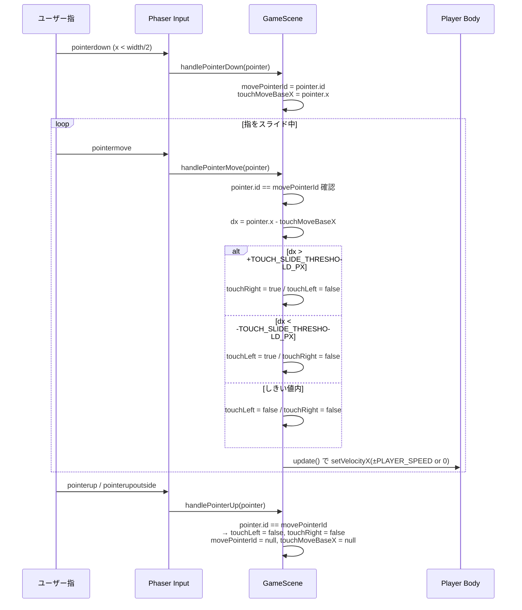
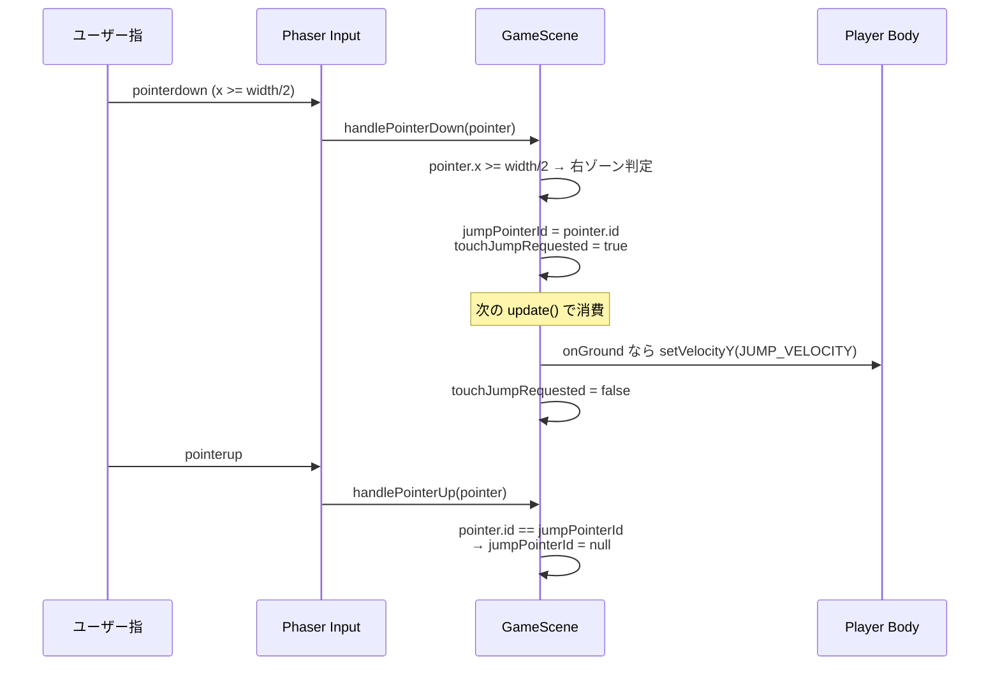
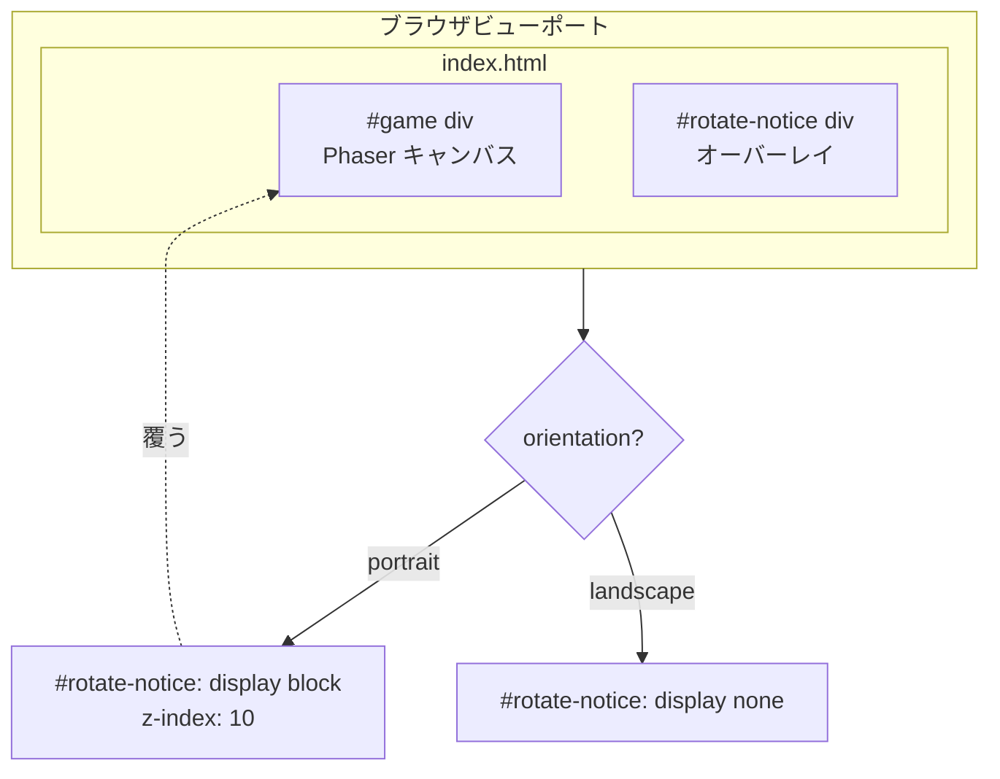
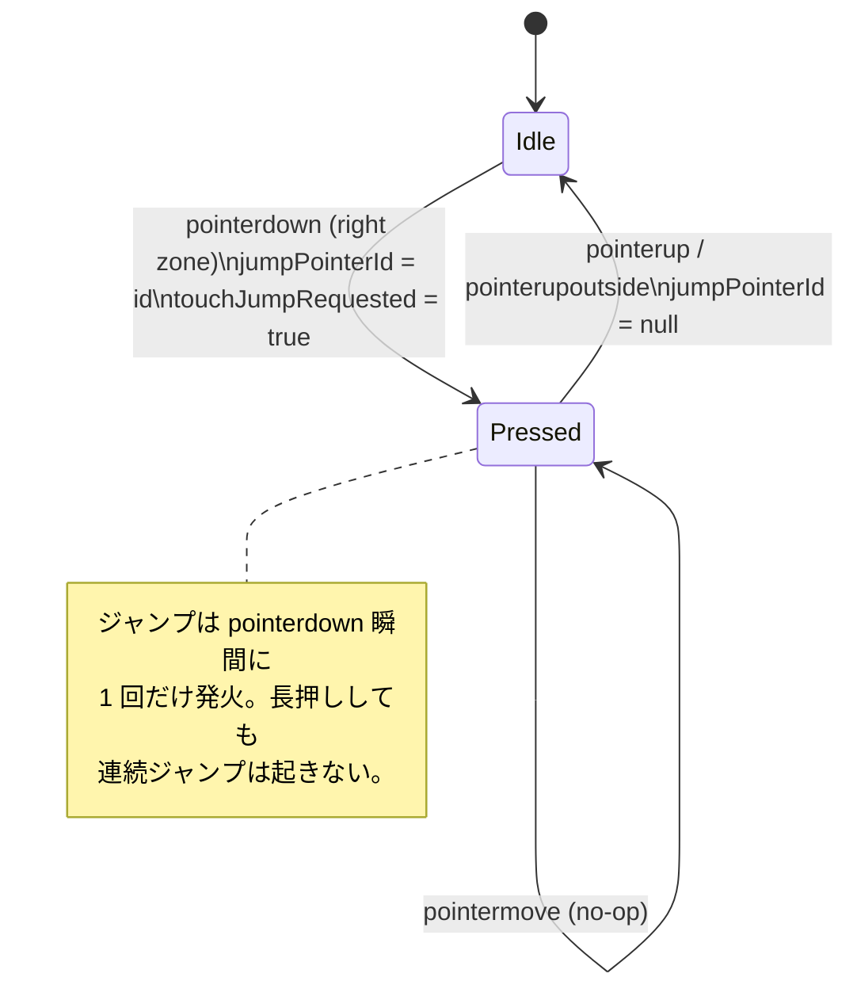
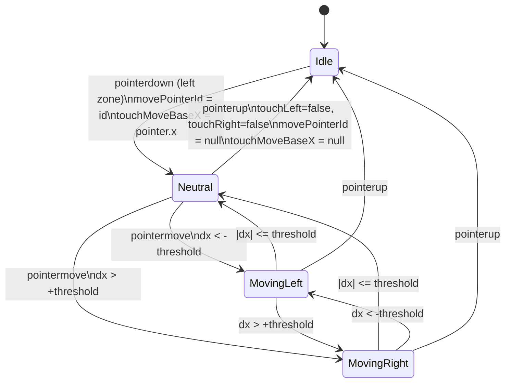

# 設計書: スマホ操作改善 & レスポンシブ対応

| 項目 | 内容 |
|------|------|
| 作成日 | 2026-05-04 |
| 担当 | バルベルデ（architecture-designer） |
| 関連要求 | `.steering/20260504-mobile-controls-responsive/requirements.md` |

---

## 1. 概要

本スプリントは、Phaser 3 製 2D 横スクロールゲームのスマホ操作体系を「ジャンプ専用ゾーン / 移動専用ゾーン」へ完全分離するとともに、`index.html` 側でレスポンシブ対応（縦向き時の横向き促進オーバーレイ・ピンチズーム禁止）を整備する。

設計の核心は次の 3 点。

1. **長押し判定ロジックの完全撤廃** — `TOUCH_HOLD_MS` ベースの「タップ vs 長押し」分岐を削除し、ゾーンごとに独立した入力モデル（左 = スライドベース移動 / 右 = 即時ジャンプ）に置き換える。
2. **マルチポインタ対応** — Phaser 3 の `pointer.id` を用いて左ジャンプポインタと右移動ポインタを別レーンで追跡し、両手同時操作（左ジャンプ + 右スライド）を成立させる。
3. **オーバーレイは HTML/CSS で実装** — Phaser の `scale.mode = FIT` と `@media (orientation)` を協調させ、Phaser シーン側に向き判定責務を持ち込まない。

入力レイテンシ・既存キーボード操作互換性・CSP は従来通り維持する。バックエンドなし、外部ライブラリ追加なし。

---

## 2. アーキテクチャ図（タッチ入力のシーケンス図）

### 2.1 左半分スライド（左右移動）



### 2.2 右半分タップ（ジャンプ）



### 2.3 レスポンシブ表示のレイヤ構造



---

## 3. コンポーネント設計

### 3.1 変更対象ファイル一覧

| ファイル | 変更種別 | 変更概要 |
|---------|---------|---------|
| `src/scenes/GameScene.ts` | 改修 | タッチ入力ハンドラ刷新（長押し撤廃 / スライド導入 / マルチポインタ） |
| `src/config/gameConfig.ts` | 改修 | `TOUCH_HOLD_MS` 削除、`TOUCH_SLIDE_THRESHOLD_PX` 等の追加 |
| `index.html` | 改修 | viewport meta 強化、`#rotate-notice` オーバーレイ + メディアクエリ追加 |

### 3.2 `gameConfig.ts` の定数変更

**削除**:
- `TOUCH_HOLD_MS`

**追加**:
```ts
// --- タッチ操作 (mobile-controls-responsive スプリント) ---
/** 右ゾーンのスライド判定しきい値 (px)。基準Xからこの値を超えた時点で左右移動を開始する。 */
export const TOUCH_SLIDE_THRESHOLD_PX = 12;
/** タッチゾーン分割比率。0.5 で画面中央、左 < 0.5 がジャンプ、>= 0.5 が移動。 */
export const TOUCH_ZONE_SPLIT_RATIO = 0.5;
```

`TOUCH_ZONE_SPLIT_RATIO` を別定数として切り出すのは、後続スプリントで「左 30% ジャンプ / 右 70% 移動」のような調整余地を残すため。

### 3.3 `GameScene.ts` の状態変数変更

**削除**:
| 変数 | 型 | 削除理由 |
|------|----|--------|
| `touchHoldTriggered` | `boolean` | 長押し判定撤廃により不要 |
| `touchHoldTimer` | `Phaser.Time.TimerEvent?` | タイマー不要 |
| `touchPointerSide` | `TouchSide` | ポインタIDで識別するため不要 |
| `type TouchSide` | 型エイリアス | 上記と同じ理由 |

**追加**:
| 変数 | 型 | 役割 |
|------|----|----|
| `jumpPointerId` | `number \| null` | 左ゾーンに着地中のポインタID（null = 未押下） |
| `movePointerId` | `number \| null` | 右ゾーンに着地中のポインタID（null = 未押下） |
| `touchMoveBaseX` | `number \| null` | 右ゾーンのスライド基準X座標（pointerdown 時点の X） |

**維持**:
| 変数 | 型 | 役割 |
|------|----|----|
| `touchLeft` | `boolean` | update() で参照する左移動フラグ |
| `touchRight` | `boolean` | update() で参照する右移動フラグ |
| `touchJumpRequested` | `boolean` | update() で 1 フレーム消費されるジャンプ要求 |

### 3.4 ハンドラ設計

#### 3.4.1 `setupTouchControls()`

```ts
private setupTouchControls(): void {
  this.input.on('pointerdown', this.handlePointerDown, this);
  this.input.on('pointermove', this.handlePointerMove, this);
  this.input.on('pointerup', this.handlePointerUp, this);
  this.input.on('pointerupoutside', this.handlePointerUp, this);
}
```

`pointermove` を新規購読する点が現状との差分。`pointerupoutside` は引き続き `pointerup` と同一ハンドラに束ねる（指がキャンバス外で離れたケースの取りこぼし防止）。

#### 3.4.2 `handlePointerDown(pointer)`

擬似コード:
```
if (isMissed) return
if (isCleared) { fullRestart(); return }

const splitX = scale.width * TOUCH_ZONE_SPLIT_RATIO
if (pointer.x < splitX) {
  // 左ゾーン: 基準X記録（スライド移動）
  if (movePointerId === null) {
    movePointerId = pointer.id
    touchMoveBaseX = pointer.x
    touchLeft = false
    touchRight = false
  }
} else {
  // 右ゾーン: 即時ジャンプ要求
  if (jumpPointerId === null) {
    jumpPointerId = pointer.id
    touchJumpRequested = true   // update() で 1 回だけ消費
  }
}
```

**ガード**: 同ゾーンに既にポインタがいる場合は新ポインタを無視する。これにより 3 本目以降のタッチによるレース状態を防ぐ。

#### 3.4.3 `handlePointerMove(pointer)`

```
if (isMissed || isCleared) return
if (pointer.id !== movePointerId) return        // 移動ポインタ以外は無視
if (touchMoveBaseX === null) return             // 安全ガード

const dx = pointer.x - touchMoveBaseX
if (dx > TOUCH_SLIDE_THRESHOLD_PX) {
  touchLeft = false
  touchRight = true
} else if (dx < -TOUCH_SLIDE_THRESHOLD_PX) {
  touchLeft = true
  touchRight = false
} else {
  touchLeft = false
  touchRight = false
}
```

`pointermove` は毎フレーム多数発火するため、ロジックは O(1) の単純比較のみ。基準X再設定（=「指離さずに方向ロック」）は今回の要件では不要のため実装しない。

#### 3.4.4 `handlePointerUp(pointer)`

```
if (pointer.id === jumpPointerId) {
  jumpPointerId = null
  // touchJumpRequested は update() 側で消費済み or 同フレーム消費されるので触らない
}
if (pointer.id === movePointerId) {
  movePointerId = null
  touchMoveBaseX = null
  touchLeft = false
  touchRight = false
}
```

ポインタIDで識別するため、左ジャンプ用ポインタが離れても右移動用ポインタの状態には触れない（マルチポインタ対応の要）。

#### 3.4.5 `update()` 側の変更

`update()` 内のロジックは現状維持で問題ない。`touchLeft` / `touchRight` / `touchJumpRequested` の3フラグだけを参照しており、それらの更新源が変わるだけのため。

### 3.5 インストラクションテキスト変更

`create()` 内の以下を:

```ts
'PC: ←/→ Space/↑ R   スマホ: 画面左右の長押しで移動 / タップでジャンプ'
```

次の文言に置き換え:

```ts
'PC: ←/→ Space/↑ R   スマホ: 左タップでジャンプ / 右スライドで左右移動'
```

### 3.6 `index.html` の変更

#### 3.6.1 viewport meta

```html
<meta name="viewport"
      content="width=device-width, initial-scale=1.0,
               minimum-scale=1.0, maximum-scale=1.0, user-scalable=no" />
```

#### 3.6.2 CSS 追加（既存 `<style>` 内に追記）

```css
#rotate-notice {
  display: none;                /* 既定は非表示。portrait メディアクエリで上書き */
  position: fixed;
  inset: 0;
  z-index: 10;
  background: #000;
  color: #fff;
  font-size: 24px;
  text-align: center;
  align-items: center;
  justify-content: center;
  padding: 0 24px;
  line-height: 1.6;
}

@media (orientation: portrait) {
  #rotate-notice { display: flex; }
  #game { visibility: hidden; }   /* キャンバス自体も隠して誤タップ防止 */
}

@media (orientation: landscape) {
  #rotate-notice { display: none; }
  #game { visibility: visible; }
}
```

#### 3.6.3 body への DOM 追加

```html
<body>
  <div id="game"></div>
  <div id="rotate-notice">
    端末を横向きにしてプレイしてください<br />
    Please rotate your device.
  </div>
  <script type="module" src="/src/main.ts"></script>
</body>
```

文字列はリテラルのみ（XSS リスクなし、CSP 変更不要）。

---

## 5. 状態遷移（タッチ操作の状態機械）

### 5.1 ジャンプポインタの状態



### 5.2 移動ポインタの状態



### 5.3 シーン状態との直交性

`isCleared` / `isMissed` が `true` のときはハンドラ側で早期 return する。クリア / ミス成立時に進行中だったタッチが残っていても、`update()` ループ側で `setVelocityX(0)` が走るため、状態が残留してもプレイヤー速度には影響しない。安全側設計。

---

## 6. エラーハンドリング

### 6.1 想定エラーケースと対処

| ケース | 対処 |
|-------|------|
| `pointerdown` が同ゾーンに既にいる状態で別指タッチ | 新ポインタを無視（先勝ちロック） |
| `pointermove` が `pointerdown` より前に発火 | `movePointerId` が `null` のため早期 return |
| キャンバス外で `pointerup` | `pointerupoutside` を `handlePointerUp` に束ねて取りこぼしゼロ |
| ゲームクリア中の `pointerdown` | `fullRestart()` 呼び出し（既存仕様維持） |
| ミス演出中の `pointerdown` | 早期 return（既存仕様維持） |
| ブラウザがタッチイベントを `pointercancel` で打ち切り | Phaser 3 は `pointercancel` を `pointerup` 系として扱うため `pointerupoutside` 経由でクリーンアップされる |

### 6.2 縦向き時のタッチ取り扱い

`#rotate-notice` が `position: fixed; inset: 0; z-index: 10` で Phaser キャンバスを覆うため、縦向き時にユーザーがオーバーレイをタップしても Phaser には届かない。`#game { visibility: hidden }` も併用し誤入力ゼロを保証。

---

## 8. 影響範囲

### 8.1 コード

| ファイル | 影響度 | 内容 |
|---------|-------|-----|
| `src/scenes/GameScene.ts` | 高 | タッチハンドラ全面刷新（state変数・3ハンドラ・インストラクション文言） |
| `src/config/gameConfig.ts` | 中 | 定数 1 件削除・2 件追加 |
| `index.html` | 中 | viewport / CSS / DOM 追加 |

### 8.2 ドキュメント

| ファイル | 影響度 | 内容 |
|---------|-------|-----|
| `docs/architecture.md` | 低 | 入力仕様欄を新ゾーンモデルに更新（P6 タスクで対応） |
| `docs/development-guidelines.md` | なし | 規約自体は不変 |
| `docs/glossary.md` | 低 | 「ジャンプゾーン」「移動ゾーン」「スライドしきい値」の用語追加候補（任意） |

### 8.3 テスト・ビルド

- 既存ユニットテストは存在しないため回帰なし。
- Vite ビルド成果物への影響は軽微（数十バイトの増減）。
- GitHub Pages デプロイフローは無変更。

### 8.4 既存機能への影響

- PC キーボード（←/→/Space/↑/R）: 影響なし（`update()` 内の OR 条件で従来通り反映）。
- ゴール / ミス / 敵 AI / コイン取得: 影響なし。
- リスタート（`window.location.reload()`）: 影響なし。

---

## 9. PoC スコープと成功基準

### 9.1 PoC スコープ（最小実装で受け入れ条件を満たす範囲）

1. `gameConfig.ts` の定数変更
2. `GameScene.ts` のハンドラ刷新（マルチポインタ対応含む）
3. `index.html` の viewport / CSS / オーバーレイ DOM 追加
4. インストラクションテキスト文言更新

### 9.2 成功基準（受け入れ条件のうち本設計で担保する項目）

| # | 基準 | 担保箇所 |
|---|------|---------|
| 1 | 左半分スライドで左右移動 | §3.4.3 のしきい値判定 |
| 2 | 右半分タップでジャンプ発火（地面接触中のみ） | §3.4.2 + 既存 `update()` の `onGround` ガード |
| 3 | タッチを離すと移動停止 | §3.4.4 |
| 4 | PC 操作の従来動作 | `update()` 側ロジック未変更 |
| 5 | 縦向きオーバーレイ表示 | §3.6.2 portrait メディアクエリ |
| 6 | 横向き全画面動作 | §3.6.2 landscape メディアクエリ + 既存 `Phaser.Scale.FIT` |
| 7 | ピンチズーム無効 | §3.6.1 viewport meta |
| 8 | クルトワ Critical/High なし | コミット前レビューで担保 |

### 9.3 検証手段

dev サーバーは起動しないため、PR マージ後の GitHub Pages デプロイ環境でシャビが手動検証する。検証手順は `tasklist.md` に記載予定。

---

## 10. 未確定事項・要シャビ判断（Q1〜Q3 回答）

### Q1. スライドしきい値 `TOUCH_SLIDE_THRESHOLD_PX` の値

**推奨値**: `12` (px)

**根拠**:

| 候補 | 評価 |
|-----|-----|
| 6px | 過敏。指の微細な揺れで誤発火する。マウス精度では適切だがタッチでは小さすぎる |
| **12px** | **推奨**。Apple Human Interface Guidelines のタップターゲット最小（44pt ≒ 44px）の 1/4 程度。一般的な指の接地ぶれ（5〜10px）を超え、意図的スライドのみ拾える |
| 20px | 鈍感。スライド開始までの体感ラグが大きく「動かない」と誤解されやすい |

iPhone / Android の DPR 2〜3 倍環境でも、CSS px 基準で 12px は物理 24〜36px に相当し体感的に自然。Phaser の `pointer.x` はキャンバスの論理座標（`scale.mode = FIT` 後の VIEWPORT_WIDTH=960 基準）で取得されるため、論理 12px はビューポート 1280px 表示時に実画面 16px 程度。十分な余裕がある。

### Q2. 縦向きオーバーレイの実装場所

**推奨**: 純 HTML/CSS（`@media (orientation: portrait)`）

**トレードオフ比較**:

| 観点 | Phaser 内（`add.text`） | HTML/CSS（推奨） |
|-----|----------------------|----------------|
| 実装複雑度 | 高（resize イベント購読・テキスト再配置・キャンバス入力ブロック） | 低（CSS メディアクエリのみ） |
| 描画コスト | 毎フレーム Phaser レンダリングに乗る | ブラウザ合成のみ、Phaser 負荷ゼロ |
| 入力ブロック | Phaser 入力を別途無効化する必要あり | `position: fixed; z-index: 10` + `#game { visibility: hidden }` で自動的にブロック |
| 関心の分離 | シーンに表示制御責務が混入 | レイアウト責務は HTML 層に集約 |
| 多言語対応・スタイル変更 | Phaser テキストオブジェクトを書き換え | CSS / HTML 編集で完結 |

**結論**: HTML/CSS 一択。シーンに `orientation` 判定を持ち込むメリットがない。CSP 観点でも `style-src 'self' 'unsafe-inline'` で許可済みのインライン CSS で実装でき、`script-src` への追加要請なし。

### Q3. マルチポインタ対応要否（左ジャンプ + 右スライド同時）

**推奨**: 対応する（実装コストが小さく UX 向上が大きいため）

**Phaser 3 マルチポインタ仕様**:

- `this.input.on('pointerdown', handler)` は**ポインタIDを問わず全タッチで発火**する。
- 各ポインタは `Phaser.Input.Pointer` インスタンスとして個別に存在し、`pointer.id` で識別できる。
- Phaser 3 の `InputManager` は既定で複数ポインタを保持しているが、`addPointer()` を明示しない場合 `pointersTotal = 2`（マウス1 + タッチ1）の上限になっている可能性がある。**`scene.input.addPointer(2)` を明示呼び出しして合計 3〜4 ポインタを確保**する（マウス + 左指 + 右指で最低 3 必要）。

**実装方針**（§3.3〜3.4 と整合）:

1. `create()` 末尾、`setupTouchControls()` の前に `this.input.addPointer(2);` を追加（マウス含めて最大 3 ポインタ）。
2. `jumpPointerId` / `movePointerId` を分離管理し、各ハンドラで `pointer.id` 一致チェックを行う。
3. 同ゾーンの 2 本目以降のタッチは無視（先勝ち）。

これにより「左指でスライド移動しながら右指でジャンプ」というアクションゲームの基本操作が成立する。マルチポインタを諦めると、片手プレイユーザーには影響ないが、両手プレイユーザーが「左スライド中に右タップが効かない」体験になり致命的。

---

## 設計品質チェック

| 項目 | 評価 | コメント |
|-----|-----|---------|
| セキュリティ | 合格 | 外部送信なし、リテラル文字列のみ、CSP 不変。XSS / インジェクション余地なし |
| テスタビリティ | 合格 | フラグベースの状態管理は単純。`update()` 側ロジック未変更で回帰範囲限定 |
| モジュール性 | 合格 | 入力責務は `GameScene` のハンドラ群に閉じ、表示責務は HTML/CSS に分離 |
| コスト効率 | 合格 | バックエンドなし、外部ライブラリ追加なし、ビルドサイズ増加は無視可能 |
| 保守性 | 合格 | 定数集約・マジックナンバーなし。マルチポインタ管理は 2 変数のみで局所的 |
| シンプルさ | 合格 | 長押し判定・タイマー削除でコード量はむしろ減る |
| 既存互換性 | 合格 | PC キーボード / ゴール / ミス / 敵 AI / コインは全て無変更 |

---

作成: バルベルデ / 2026-05-04
