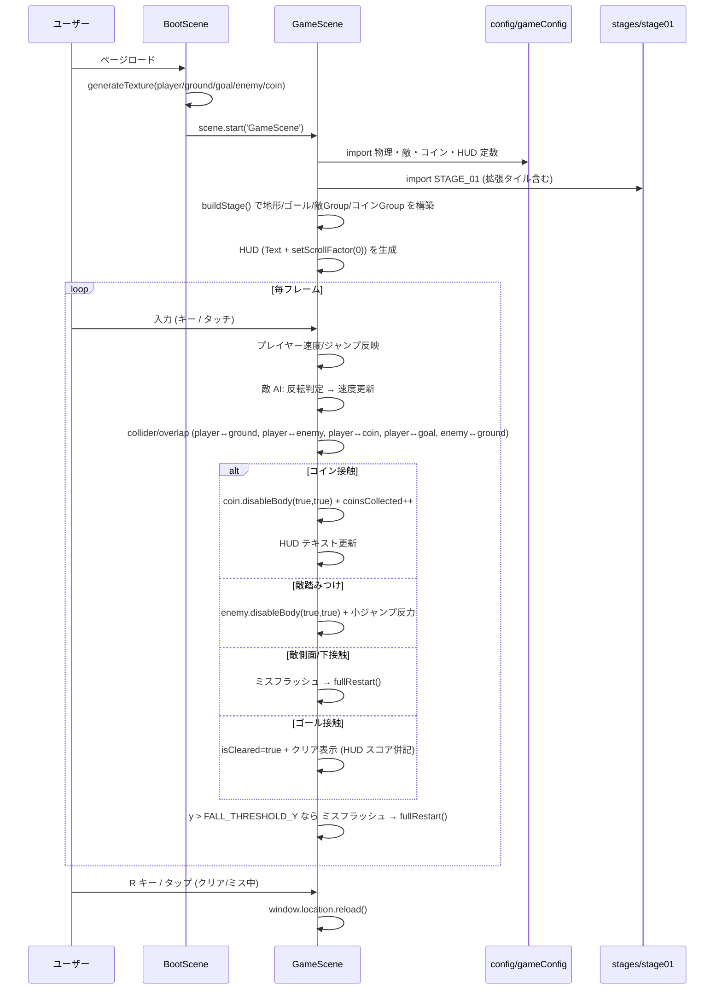
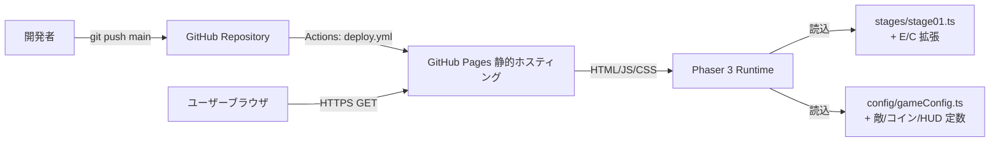
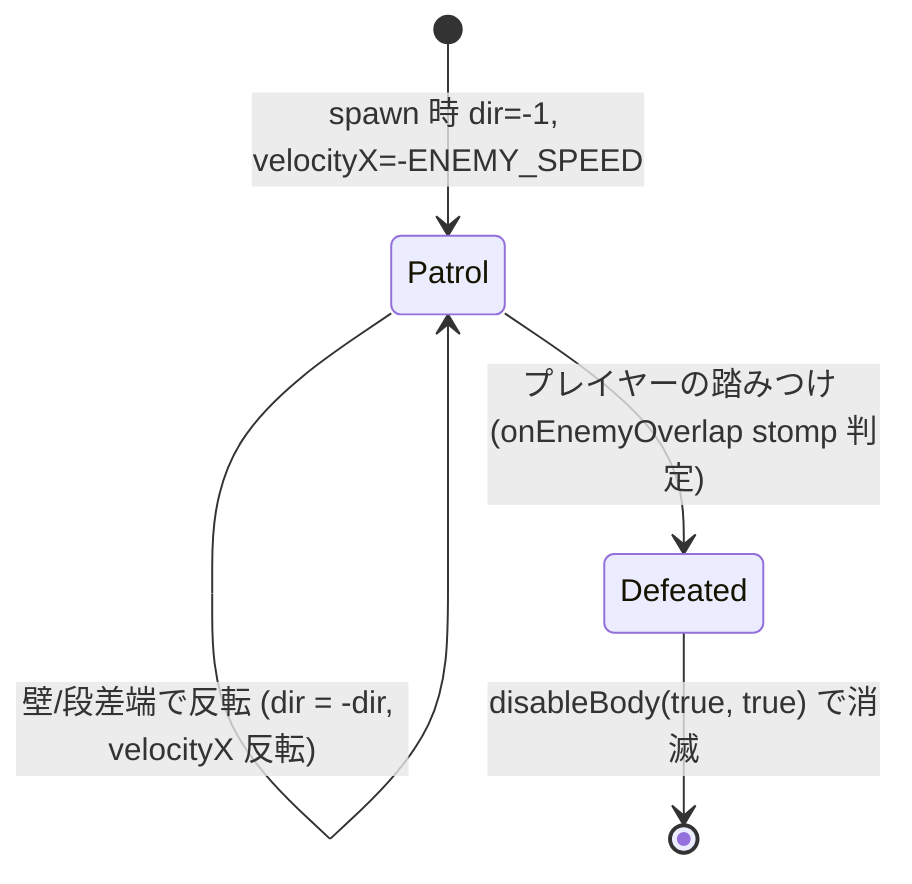
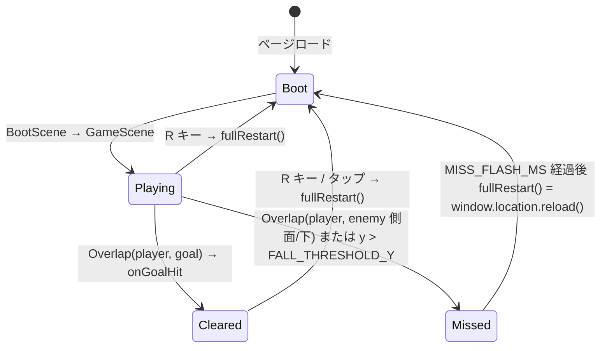

# 設計書: v0.2 敵キャラ + コイン + スコア

| 項目 | 内容 |
|------|------|
| 作成日 | 2026-05-04 |
| 担当 | バルベルデ（architecture-designer） |
| 関連要求 | `.steering/20260504-v0.2-enemies-coins/requirements.md` |

---

## 1. 概要

### 設計方針サマリ

- **目的**: マリオ風コア体験（敵を踏みつけて倒す / コイン取得 / スコア表示）を v0.1 の最小プレイ可能版に追加する。敵 3〜5 体・コイン 8〜15 枚の同時存在で 60 fps を維持し、初回ロード 5 秒以内・バンドル 1.5 MB 以下を継続する。
- **方式**: v0.1 の 2 シーン構成（`BootScene` → `GameScene`）と「ステージ定義 + 定数集約 + プレースホルダ動的生成」のアーキテクチャをそのまま踏襲。敵 / コインも `Phaser.Physics.Arcade.Group` で管理し、ステージ定義のタイル文字 `'E'` `'C'` で配置を表現する。物理 / 寸法 / 色は `gameConfig.ts` に追加し、コードへのマジックナンバー埋め込みを禁止する規約を維持する。
- **最小スコープ厳守**: 敵は 1 種類（クリボー風）のみ。スコアはコイン取得数のみで集計（敵撃破スコアなし）。BGM / SE / 複数ステージ / タイトル画面 / ライフ / パワーアップ / 演出強化 / 外部アセットはすべて v0.3 以降。
- **既存資産は壊さない**: v0.1 の物理定数（`GRAVITY_Y=800`, `PLAYER_SPEED=200`, `JUMP_VELOCITY=-450`）、操作系（キーボード + 画面左右半分タッチ）、カメラ追従、落下リスポーン、ゴール Overlap、`window.location.reload()` リスタート、CSP、`vite.config.ts` の `VITE_BASE_PATH` 解決、`deploy.yml` の動線、すべて維持。`StageDefinition` 型は **後方互換拡張**（既存 `'.', '#', 'P', 'G'` の意味を変えない）。
- **ハードコーディング禁止**: 敵の速度・色・寸法・徘徊範囲、コインの色・寸法、HUD の文言テンプレ、踏みつけ反力、ミス演出時間はすべて `src/config/gameConfig.ts` に追加。配置は `src/stages/stage01.ts` に追加文字 `'E'` `'C'` で表現。`GameScene` / `BootScene` に数値リテラル直書き禁止（v0.1 の規約継続）。

### スコープ確定

| 項目 | 採用 |
|------|------|
| Q1: 敵の徘徊反転検出方式 | **B'. `body.blocked.left/right` で壁反転 + 進行方向の足元タイル有無を毎フレーム検査して段差端で反転**。ステージタイル配列を直接参照するため raycast 不要、停止事故ゼロ |
| Q2: 踏みつけ判定の実装 | **A. `physics.add.overlap` コールバック内で `player.body.velocity.y > 0` かつ `player.body.bottom <= enemy.body.top + STOMP_TOLERANCE_PX` を判定**。Phaser 慣用、`collider` 物理衝突より副作用が少ない |
| Q3: ミス時のステージ完全初期化方式 | **B. v0.1 の `window.location.reload()` を継続（`fullRestart()` 共通化）**。D-5 で `scene.restart()` / `scene.start('BootScene')` 双方の床貫通バグ未解決のため、再現リスクを取らない |
| Q4: 敵 / コインのプレースホルダ寸法・色 | **敵: 茶色 `0x8b572a` 28×28 / コイン: 黄金色 `0xf1c40f` 16×16（円形＝色違いゴールと差別化のため）**。プレイヤー赤 / ゴール黄 / 地面茶系との視認性を確保 |
| Q5: ゴール接触と敵接触の同フレーム発生時の優先制御 | **B. `isCleared` フラグでミス処理を明示的にスキップ + ゴール Overlap を先に登録**。コールバック登録順の暗黙仕様に依存せず、テスタブル |
| Q6: ミス演出の有無 | **C. プレイヤーの色を一瞬変える（白フラッシュ 150ms）+ 操作無効化 + その後 `fullRestart()`**。リロード待ち（数百 ms）と相性が良い「直前 0.15 秒だけ反応」最小演出 |
| Q7: タッチ環境のリスタート UX | **A. v0.1 の `handlePointerDown` 経路（クリア中は画面どこでもタップで `fullRestart()`）をミス時にも適用 + ミス中は移動入力を無効化**。新規ボタン追加なし、既存 UX と一貫 |

---

## 2. アーキテクチャ図

### 2.1 シーケンス図



### 2.2 全体システム構成



v0.1 から構成は変わらず。バックエンドなし、外部 CDN なし、追加依存なし。

---

## 3. コンポーネント設計

### 3.1 `src/config/gameConfig.ts`（既存変更）

v0.1 の集約規約をそのまま拡張する。**既存定数の値・キー名は変更しない**（互換維持）。追加項目は以下:

| 追加エクスポート | 値（初期） | 用途 |
|----------------|-----------|------|
| `ENEMY_SPRITE_W` | `28` | 敵スプライト幅（プレイヤー 32 より小さく区別） |
| `ENEMY_SPRITE_H` | `28` | 敵スプライト高 |
| `ENEMY_COLOR` | `0x8b572a` | 敵色（地面 `0x8b4513` よりやや明度高、暗茶） |
| `ENEMY_SPEED` | `60` | 徘徊速度 px/s（プレイヤー 200 より遅く、踏みやすさ確保） |
| `STOMP_BOUNCE_VELOCITY` | `-280` | 踏みつけ後のプレイヤー反力（通常ジャンプ -450 より弱い小ジャンプ） |
| `STOMP_TOLERANCE_PX` | `6` | 踏みつけ判定の上下許容幅（敵頭頂とプレイヤー足底の差） |
| `COIN_SPRITE_W` | `16` | コイン幅 |
| `COIN_SPRITE_H` | `16` | コイン高 |
| `COIN_COLOR` | `0xf1c40f` | コイン色（ゴール 0xffd700 より彩度高、円形描画で形でも区別） |
| `MISS_FLASH_MS` | `150` | ミス時の白フラッシュ持続 ms（リロード前演出） |
| `MISS_FLASH_COLOR` | `0xffffff` | ミス時のプレイヤー tint 色 |
| `HUD_FONT_SIZE` | `'18px'` | HUD コインカウントのフォントサイズ |
| `HUD_FONT_COLOR` | `'#ffffff'` | HUD 文字色 |
| `HUD_STROKE_COLOR` | `'#000000'` | HUD 文字縁取り色 |
| `HUD_STROKE_THICKNESS` | `4` | HUD 文字縁取り太さ |
| `HUD_COIN_LABEL` | `'コイン'` | HUD ラベル文言（i18n の集約点） |
| `HUD_COIN_X` | `16` | HUD X 座標（既存操作説明テキストの真下に置くため固定） |
| `HUD_COIN_Y` | `40` | HUD Y 座標（操作説明 16+16=32 + 余白 8） |
| `TEX_KEY` 拡張 | `enemy: 'enemy'` / `coin: 'coin'` を追加 | テクスチャキー集約 |

**既存定数で v0.2 で値を見直すもの**: なし。`JUMP_VELOCITY=-450` も維持（requirements §4.5 の互換要件）。`STOMP_BOUNCE_VELOCITY` を別キーで分けたのは、プレイ感の調整単位を分離するため（要求書 §4.5 で許容された「敵踏みつけリアクション速度」専用キー）。

### 3.2 `src/stages/stage01.ts`（既存変更）

#### 型定義の拡張

```ts
// before (v0.1)
export type TileChar = '.' | '#' | 'P' | 'G';

// after (v0.2)
export type TileChar = '.' | '#' | 'P' | 'G' | 'E' | 'C';
//  既存: '.' = 空, '#' = 地面, 'P' = プレイヤースポーン, 'G' = ゴール
//  追加: 'E' = 敵スポーン, 'C' = コイン

export interface StageDefinition {
  readonly id: string;
  readonly cols: number;
  readonly rows: number;
  readonly tiles: readonly string[];
}
```

`StageDefinition` 構造は無変更（`tiles` の文字種だけ増える）。後方互換性 100%。

#### `STAGE_01` の拡張方針

- **敵 (`'E'`)**: 4 体配置。低段右側 / 中段の上 / 隙間越え後の床 / ゴール手前の床直前 など、踏みつけと回避の両方を学べる位置。
- **コイン (`'C'`)**: 12 枚配置。スポーン直後の床上（取得導線）/ 段差ジャンプの頂点（ご褒美）/ 隙間越えの空中（リスク報酬）/ ゴール手前の段差上（コンボ）など。
- 配置時の制約:
  - `'E'` は地面 `'#'` の真上の行にのみ配置（空中浮遊禁止）
  - `'C'` は地面の真上 / ジャンプ届く高さ（床から 1〜3 タイル上）に配置
  - `'E'` の徘徊範囲は連続する `'#'` の上面区間。途中に隙間や 1 タイル以上の段差があれば **その手前で反転**（後述 §3.4 §3.5 の AI 仕様）

レイアウトイメージ（v0.1 の構造を継承し、追加 `'E'` `'C'` のみ示す）:

- row 13（高段 col 80-83 上面）: 上面の真上（row 12）に `'C'` を 1 枚（高段ジャンプご褒美）
- row 14（中段 col 55-58 上面 / ゴール col 110）: 中段上面に `'C'` 2 枚、隙間越え（row 16 col 65-68）の真上に `'C'` 2 枚
- row 15（スポーン col 2 / 低段 col 35-38 上面）: スポーン直後（col 5-7）に `'C'` 3 枚、低段上面に `'C'` 1 枚
- row 16: 床上に `'E'` 4 体（左床区間 1 体、中央床区間 2 体、右床区間 1 体）+ ゴール手前段差上などにコイン補完

最終的な配置はタスクリスト P3 段階で確定。**バリデーション**: `'E'` 1 体以上 8 体以下、`'C'` 1 枚以上 30 枚以下（過剰配置による fps 低下事故回避の上限）。

### 3.3 `src/scenes/BootScene.ts`（既存変更）

`generateTexture()` で敵 / コインのプレースホルダを追加生成する。

| 変更点 | 内容 |
|-------|------|
| 敵テクスチャ生成 | `fillStyle(ENEMY_COLOR)` で `ENEMY_SPRITE_W × ENEMY_SPRITE_H` 矩形 → `generateTexture(TEX_KEY.enemy, ...)` |
| コインテクスチャ生成 | `fillStyle(COIN_COLOR)` で **円**（`fillCircle` で半径 `COIN_SPRITE_W/2`）→ `generateTexture(TEX_KEY.coin, COIN_SPRITE_W, COIN_SPRITE_H)`。形でゴールと差別化 |
| `g.destroy()` の位置 | 全テクスチャ生成後の最後に呼ぶ（v0.1 の最後の `goal` 生成後 `destroy` を維持しつつ、敵 / コイン生成を間に挿入） |

擬似コード:

```ts
preload(): void {
  const g = this.add.graphics();

  // player (既存)
  g.fillStyle(PLAYER_COLOR, 1);
  g.fillRect(0, 0, PLAYER_SPRITE_W, PLAYER_SPRITE_H);
  g.generateTexture(TEX_KEY.player, PLAYER_SPRITE_W, PLAYER_SPRITE_H);
  g.clear();

  // ground (既存)
  g.fillStyle(GROUND_COLOR, 1);
  g.fillRect(0, 0, TILE_SIZE, TILE_SIZE);
  g.generateTexture(TEX_KEY.ground, TILE_SIZE, TILE_SIZE);
  g.clear();

  // goal (既存)
  g.fillStyle(GOAL_COLOR, 1);
  g.fillRect(0, 0, GOAL_SPRITE_W, GOAL_SPRITE_H);
  g.generateTexture(TEX_KEY.goal, GOAL_SPRITE_W, GOAL_SPRITE_H);
  g.clear();

  // enemy (新規)
  g.fillStyle(ENEMY_COLOR, 1);
  g.fillRect(0, 0, ENEMY_SPRITE_W, ENEMY_SPRITE_H);
  g.generateTexture(TEX_KEY.enemy, ENEMY_SPRITE_W, ENEMY_SPRITE_H);
  g.clear();

  // coin (新規, 円形)
  g.fillStyle(COIN_COLOR, 1);
  g.fillCircle(COIN_SPRITE_W / 2, COIN_SPRITE_H / 2, COIN_SPRITE_W / 2);
  g.generateTexture(TEX_KEY.coin, COIN_SPRITE_W, COIN_SPRITE_H);
  g.destroy();
}
```

### 3.4 `src/scenes/GameScene.ts`（既存変更・拡張）

#### 3.4.1 `BuiltStage` インターフェース拡張

```ts
// before (v0.1)
interface BuiltStage {
  ground: Phaser.Physics.Arcade.StaticGroup;
  goal: Phaser.Physics.Arcade.Sprite;
  spawnX: number;
  spawnY: number;
}

// after (v0.2)
interface BuiltStage {
  ground: Phaser.Physics.Arcade.StaticGroup;
  goal: Phaser.Physics.Arcade.Sprite;
  spawnX: number;
  spawnY: number;
  enemies: Phaser.Physics.Arcade.Group;       // 動的物理 group (重力・衝突あり)
  coins: Phaser.Physics.Arcade.StaticGroup;   // 静的 group (重力なし、地面に置く)
  coinTotal: number;                          // ステージ内コイン総数 (HUD 分母)
  groundMask: ReadonlyArray<ReadonlyArray<boolean>>; // 敵 AI が段差端判定で参照する地面マスク [row][col]
}
```

#### 3.4.2 `GameScene` の class フィールド追加

| 追加フィールド | 型 | 用途 |
|--------------|---|------|
| `enemies` | `Phaser.Physics.Arcade.Group` | 敵 group の保持（update で AI 更新） |
| `coins` | `Phaser.Physics.Arcade.StaticGroup` | コイン group の保持 |
| `coinTotal` | `number` | ステージ内総数（HUD 分母） |
| `coinsCollected` | `number` | 取得数（HUD 分子、ミスでも `fullRestart()` で 0 にリセット） |
| `coinHud` | `Phaser.GameObjects.Text` | HUD コインカウントテキスト |
| `groundMask` | `boolean[][]` | 段差端判定用マスク（`buildStage` で生成、`updateEnemyAi` で参照） |
| `isMissed` | `boolean` | ミス進行中フラグ（フラッシュ → リロード待ち中の入力 / 物理を抑止） |

#### 3.4.3 `create()` の処理順序

```
1. フラグ・タッチ状態を初期化（v0.1 と同じ + isMissed=false, coinsCollected=0）
2. physics.world.setBounds()
3. const built = this.buildStage(STAGE_01)
4. this.player = physics.add.sprite(spawnX, spawnY, TEX_KEY.player)
5. ## v0.2 新規 ##
   this.enemies = built.enemies
   this.coins = built.coins
   this.coinTotal = built.coinTotal
   this.coinsCollected = 0
6. collider/overlap 登録（順序が優先制御に効く。Q5 採用案）
   (a) physics.add.collider(player, ground)
   (b) physics.add.collider(enemies, ground)         // 敵が地面に立つため必須
   (c) physics.add.overlap(player, goal, onGoalHit)  // ゴール優先のため最初に登録
   (d) physics.add.overlap(player, enemies, onEnemyOverlap)
   (e) physics.add.overlap(player, coins, onCoinOverlap)
7. キーボード初期化（v0.1 と同じ）
8. カメラ追従設定（v0.1 と同じ）
9. 操作説明テキスト（既存、v0.1 と同じ）
10. ## v0.2 新規 ##
    this.coinHud = this.add.text(HUD_COIN_X, HUD_COIN_Y, this.formatCoinHud(), {...})
      .setScrollFactor(0)
11. setupTouchControls() (v0.1 と同じ)
```

**ゴール優先の実装（Q5 採用案 B）**: コールバック登録順 (c) → (d) で「同フレーム発生時にゴール側を先に評価」しつつ、`onEnemyOverlap` の冒頭で `if (this.isCleared || this.isMissed) return;` ガードを置き、ゴール成立後にミスが走らないことを **二重に保証**する。

#### 3.4.4 `update()` の処理順序

```
1. R キー JustDown → fullRestart() (v0.1 と同じ)
2. if (isCleared || isMissed) → 入力受付を停止 (return) ※既存の isCleared 分岐を拡張
3. プレイヤー入力反映（左右移動 / ジャンプ）(v0.1 と同じ)
4. ## v0.2 新規 ## updateEnemyAi() で全敵の徘徊反転を判定 → 速度設定
5. 落下判定 (player.y > FALL_THRESHOLD_Y) → handleMiss('fall')
   ※ v0.1 の respawn() を handleMiss() に変更（コインリセット込み）
```

#### 3.4.5 主要メソッドのシグネチャ

```ts
// 既存変更
private buildStage(def: StageDefinition): BuiltStage;
// - 走査時に 'E' / 'C' / 地面マスクの収集を追加
// - 戻り値に enemies / coins / coinTotal / groundMask を含める

// 新規
private buildEnemies(
  positions: Array<{ col: number; row: number }>
): Phaser.Physics.Arcade.Group;
// - 各座標に enemy sprite を生成 (足元基準: cy = (row+1)*TILE_SIZE - ENEMY_SPRITE_H/2)
// - 重力ありの動的 body (group.create(..., TEX_KEY.enemy))
// - sprite.setData('dir', -1) で初期進行方向を保持 (左向き)
// - sprite.setVelocityX(-ENEMY_SPEED)

private buildCoins(
  positions: Array<{ col: number; row: number }>
): { group: Phaser.Physics.Arcade.StaticGroup; total: number };
// - StaticGroup で重力なし
// - 各座標の中心 (cx = col*TILE_SIZE + TILE_SIZE/2, cy = row*TILE_SIZE + TILE_SIZE/2) に配置
//   ※ コインはタイル中心配置 ('P'/'G' の足元基準とは別ルール、形が小さく中心対称のため)
// - refreshBody() で static body の位置を確定
// - total = positions.length

private buildGroundMask(def: StageDefinition): boolean[][];
// - mask[row][col] = (def.tiles[row].charAt(col) === '#')
// - 敵 AI が「進行方向の足元タイルが地面か」を O(1) で判定するための事前計算

private updateEnemyAi(): void;
// - this.enemies.children.iterate() で全敵を巡回
// - 各敵について:
//   (a) const dir = enemy.getData('dir') as -1 | 1;
//   (b) 壁衝突判定: enemy.body.blocked.left/right で反転
//   (c) 段差端判定: 進行方向の足元タイル(=enemy 中心 +/- ENEMY_SPRITE_W/2 + 1px の位置の 1 タイル下)
//       を groundMask で参照、地面でなければ反転
//   (d) 反転時は dir を -dir に setData、setVelocityX(dir * ENEMY_SPEED)
//   (e) 通常時も毎フレーム setVelocityX(dir * ENEMY_SPEED) で速度ゼロ事故を防ぐ
//   (f) 死亡済み敵 (enemy.active===false) はスキップ

private onCoinOverlap(
  player: Phaser.Types.Physics.Arcade.GameObjectWithBody,
  coin: Phaser.Types.Physics.Arcade.GameObjectWithBody
): void;
// - if (this.isCleared || this.isMissed) return;
// - (coin as Phaser.Physics.Arcade.Sprite).disableBody(true, true)
// - this.coinsCollected++;
// - this.refreshCoinHud();

private onEnemyOverlap(
  player: Phaser.Types.Physics.Arcade.GameObjectWithBody,
  enemy: Phaser.Types.Physics.Arcade.GameObjectWithBody
): void;
// - if (this.isCleared || this.isMissed) return;     // Q5 二重ガード
// - const pBody = this.player.body as Phaser.Physics.Arcade.Body;
// - const eBody = (enemy as Phaser.Physics.Arcade.Sprite).body as Phaser.Physics.Arcade.Body;
// - const isStomp = pBody.velocity.y > 0
//                 && pBody.bottom <= eBody.top + STOMP_TOLERANCE_PX;
// - if (isStomp) {
//     (enemy as Phaser.Physics.Arcade.Sprite).disableBody(true, true);
//     this.player.setVelocityY(STOMP_BOUNCE_VELOCITY);   // 小ジャンプ反力
//   } else {
//     this.handleMiss('enemy');
//   }

private onGoalHit(): void;
// - v0.1 と同じく isCleared=true、setVelocity(0,0)、クリアテキスト表示
// - クリアテキストの本文に "コイン: X / Y" を改行で追加 (HUD_COIN_LABEL を再利用)

private handleMiss(reason: 'fall' | 'enemy'): void;
// - if (this.isMissed || this.isCleared) return;     // 多重発火防止
// - this.isMissed = true;
// - this.player.setTint(MISS_FLASH_COLOR);
// - this.player.setVelocity(0, 0);
// - this.time.delayedCall(MISS_FLASH_MS, () => this.fullRestart(), [], this);
// - reason は将来の SE 切り替え用に確保 (v0.2 では未使用、ログ目的のみ)

private fullRestart(): void;
// - 既存維持: window.location.reload()  (Q3 採用案 B)

private formatCoinHud(): string;
// - return `${HUD_COIN_LABEL}: ${this.coinsCollected} / ${this.coinTotal}`;

private refreshCoinHud(): void;
// - this.coinHud.setText(this.formatCoinHud());
```

#### 3.4.6 `buildStage` の走査ロジック差分（v0.1 比）

```ts
// (擬似コード差分)
const enemyPositions: Array<{col:number; row:number}> = [];
const coinPositions:  Array<{col:number; row:number}> = [];

for (let r = 0; r < def.rows; r++) {
  const line = def.tiles[r];
  for (let c = 0; c < def.cols; c++) {
    const ch = line.charAt(c);
    if (ch === '#') { /* v0.1 同様 staticGroup.create */ }
    else if (ch === 'P') { /* v0.1 同様 */ }
    else if (ch === 'G') { /* v0.1 同様 */ }
    else if (ch === 'E') { enemyPositions.push({col:c, row:r}); }   // 追加
    else if (ch === 'C') { coinPositions.push({col:c, row:r}); }    // 追加
    else if (ch !== '.') { throw new Error(...); }
  }
}

// バリデーション拡張
if (enemyPositions.length < 1 || enemyPositions.length > 8) {
  throw new Error(`Stage ${def.id}: 'E' count must be 1..8 (got ${enemyPositions.length})`);
}
if (coinPositions.length < 1 || coinPositions.length > 30) {
  throw new Error(`Stage ${def.id}: 'C' count must be 1..30 (got ${coinPositions.length})`);
}

// 'E' 配置の事前バリデーション: 真下が '#' であること（空中浮遊禁止）
for (const p of enemyPositions) {
  if (p.row + 1 >= def.rows || def.tiles[p.row + 1].charAt(p.col) !== '#') {
    throw new Error(
      `Stage ${def.id}: 'E' at (${p.col},${p.row}) must have '#' directly below`
    );
  }
}

const groundMask = this.buildGroundMask(def);
const enemies    = this.buildEnemies(enemyPositions);
const coinPair   = this.buildCoins(coinPositions);

// enemies / ground 衝突は create() 側で collider 登録するため、ここでは group のみ返す
return {
  ground, goal, spawnX, spawnY,
  enemies, coins: coinPair.group, coinTotal: coinPair.total, groundMask
};
```

### 3.5 敵 (`Enemy`) の状態遷移



- 敵に独立したスプライトクラスを作らず、`Phaser.Physics.Arcade.Sprite + setData('dir', ...)` で軽量に表現する（v0.2 のスコープでは 1 種類のみ、複数種類は v0.3 以降）
- `Defeated` 状態は `disableBody(true, true)` の 1 行で代替（active=false + visible=false + body 無効化）。group の iterate 時に `child.active===false` をスキップする
- 物理 body は `Phaser.Physics.Arcade.Body`（動的・重力あり・地面と collider）。`setCollideWorldBounds(false)` で v0.1 のワールド境界規約を継承（プレイヤーと同様、横は通り抜け可能だが今回の敵は段差端で反転するため脱落しない）

### 3.6 既存処理の改造ポイント（差分一覧）

| 既存処理 | 変更 |
|---------|------|
| `gameConfig.ts` 既存定数 | **変更なし**。新規定数を末尾に追加するのみ |
| `TEX_KEY` | `enemy` `coin` キーを追加（既存 `player`/`ground`/`goal` 据え置き） |
| `stage01.ts` `TileChar` | `'E'` `'C'` を追加 |
| `stage01.ts` `STAGE_01.tiles` | 既存タイル（`'#'/'P'/'G'`）の位置は維持しつつ、`'E'` `'C'` を追加配置 |
| `BootScene.preload()` | enemy / coin テクスチャ生成を追加（`g.destroy()` の位置を最後に変更） |
| `GameScene` フィールド | `enemies` / `coins` / `coinTotal` / `coinsCollected` / `coinHud` / `groundMask` / `isMissed` を追加 |
| `GameScene.create()` | collider/overlap 登録、HUD 生成、フィールド初期化を追加（順序は §3.4.3） |
| `GameScene.update()` | `updateEnemyAi()` 呼び出し追加、落下時 `respawn()` を `handleMiss('fall')` に置換、`isMissed` 分岐追加 |
| `GameScene.buildStage()` | 走査ロジック拡張、バリデーション追加、戻り値拡張 |
| `GameScene.respawn()` | **削除**（`handleMiss()` + `fullRestart()` に統合。コインリセット要件のため部分復帰では不十分） |
| `GameScene.onGoalHit()` | クリアテキストにコインスコア併記。`isCleared` チェックは既存維持 |
| `GameScene.fullRestart()` | **変更なし**（`window.location.reload()` 維持、Q3 採用案 B） |
| `GameScene.handlePointerDown()` | `if (this.isMissed) return;` を冒頭に追加（フラッシュ中の誤タップ抑止）。`isCleared` 経路は既存維持 |
| `vite.config.ts` / `deploy.yml` / `index.html` / `package.json` / `main.ts` | **変更なし** |

---

## 4. データ構造設計

### 4.1 拡張ステージ定義

| 要素 | 型 | 用途 | 制約 |
|------|----|------|------|
| `id` | `string` | ステージ識別子 | 一意 |
| `cols` / `rows` | `number` | タイル数 | v0.1 と同じ |
| `tiles` | `readonly string[]` | タイル配列 | 各文字 ∈ `'.', '#', 'P', 'G', 'E', 'C'` |

タイル文字仕様:

| 文字 | 意味 | 個数制約 | 配置制約 |
|------|------|---------|---------|
| `'.'` | 空 | 任意 | なし |
| `'#'` | 地面 | 任意 | なし |
| `'P'` | プレイヤースポーン | 1 | 左 1/3 以内 |
| `'G'` | ゴール | 1 | なし |
| `'E'` | 敵スポーン | 1〜8 | **真下が `'#'`**（buildStage バリデーション） |
| `'C'` | コイン | 1〜30 | なし（空中配置可） |

### 4.2 ハードコーディング集約表（v0.1 から差分）

| 集約先 | 種別 | キー / 値 |
|-------|------|-----------|
| `gameConfig.ts` | 敵物理 | `ENEMY_SPEED=60`, `STOMP_BOUNCE_VELOCITY=-280`, `STOMP_TOLERANCE_PX=6` |
| `gameConfig.ts` | 敵描画 | `ENEMY_SPRITE_W=28`, `ENEMY_SPRITE_H=28`, `ENEMY_COLOR=0x8b572a` |
| `gameConfig.ts` | コイン描画 | `COIN_SPRITE_W=16`, `COIN_SPRITE_H=16`, `COIN_COLOR=0xf1c40f` |
| `gameConfig.ts` | ミス演出 | `MISS_FLASH_MS=150`, `MISS_FLASH_COLOR=0xffffff` |
| `gameConfig.ts` | HUD | `HUD_FONT_SIZE`, `HUD_FONT_COLOR`, `HUD_STROKE_COLOR`, `HUD_STROKE_THICKNESS`, `HUD_COIN_LABEL`, `HUD_COIN_X`, `HUD_COIN_Y` |
| `gameConfig.ts` | テクスチャキー | `TEX_KEY.enemy`, `TEX_KEY.coin` |
| `stage01.ts` | レベルデータ | `'E'` `'C'` を `tiles` に追加 |

**禁止事項（v0.1 から継続 + v0.2 追加）**:

- `GameScene` / `BootScene` 内で `60`, `28`, `16`, `-280`, `150`, `'コイン'`, `'#ffffff'` などの直書き禁止
- 敵のスポーン座標を `GameScene` 内で配列リテラル直書きしない（必ず `stage01.ts` のタイル文字列経由）
- HUD 文言を `'コイン: ' + n + ' / ' + total` のように `GameScene` 内で文字列連結しない（`gameConfig.HUD_COIN_LABEL` + `formatCoinHud()` ヘルパ経由）

---

## 5. 状態遷移

### 5.1 ゲーム全体



- `Cleared` / `Missed` 状態では `update()` 内の入力反映 / 敵 AI 更新を抑止（`if (isCleared || isMissed) return;`）
- `Missed` は `MISS_FLASH_MS=150ms` の短期トランジェント。タッチ操作も `handlePointerDown` 冒頭でガードして二重発火を防ぐ

### 5.2 敵単体

§3.5 で図示済み（Patrol ⇄ Patrol → Defeated → 消滅）。

---

## 6. エラーハンドリング

| シナリオ | 発生箇所 | 挙動 |
|---------|---------|------|
| ステージ定義に未知文字（`'X'` 等） | `buildStage()` 走査時 | 既存ロジック踏襲: `throw new Error('unknown tile ...')` |
| `'E'` の真下が `'#'` でない | `buildStage()` バリデーション | `throw` で開発時即検知（空中浮遊敵は段差端判定で即反転を繰り返し見栄えが悪いため禁止） |
| `'E'` 個数 / `'C'` 個数の上下限違反 | `buildStage()` バリデーション | `throw` で開発時即検知 |
| 敵が壁・段差端で停止（速度 0 化） | `updateEnemyAi()` | 毎フレーム `setVelocityX(dir * ENEMY_SPEED)` を強制 → 速度ゼロ事故ゼロ |
| 同フレームでゴールと敵接触 | `onEnemyOverlap()` | `isCleared` ガードで敵処理スキップ（Q5）→ ゴール優先成立 |
| ミス処理中に再度敵 / 落下発生 | `handleMiss()` | `isMissed` ガードで多重発火を防止 |
| ミスフラッシュ中のタッチ | `handlePointerDown()` | `isMissed` ガードで `fullRestart()` の二重発火防止 |
| コインの取り逃し（取得済みなのに body 残留） | Phaser 標準 | `disableBody(true, true)` で active=false + body 無効化、二重発火しない |
| Keyboard プラグイン未取得 | `create()` | v0.1 の既存例外を踏襲 |

---

## 7. ハードコーディング集約（v0.1 §7 を継承）

§4.2 の表が本スプリント分の追加。v0.1 の集約規約は無変更で継承する。

**追加禁止事項**:

- `GameScene` 内で敵 / コインのスポーン座標を直書きしない（`stage01.ts` のタイル文字列経由）
- HUD テキストの動的文字列構築では `formatCoinHud()` ヘルパを必ず経由（数値以外を埋め込まない）
- 敵テクスチャキー `'enemy'` / コインテクスチャキー `'coin'` を文字列リテラルで書かず `TEX_KEY.enemy` / `TEX_KEY.coin` を使用

---

## 8. 影響範囲

### 8.1 変更/新規ファイル

| ファイル | 種別 | 内容 |
|---------|------|------|
| `src/config/gameConfig.ts` | **変更** | §3.1 の追加定数を末尾に追加。既存定数は不変 |
| `src/stages/stage01.ts` | **変更** | `TileChar` に `'E'` `'C'` 追加、`STAGE_01.tiles` に敵 4 体・コイン 12 枚を追加配置 |
| `src/scenes/BootScene.ts` | **変更** | enemy / coin テクスチャ生成を追加（§3.3 の擬似コード） |
| `src/scenes/GameScene.ts` | **変更** | フィールド追加、`buildStage` 拡張、`updateEnemyAi` / `onEnemyOverlap` / `onCoinOverlap` / `handleMiss` / `formatCoinHud` / `refreshCoinHud` / `buildEnemies` / `buildCoins` / `buildGroundMask` 追加、`respawn` 削除、HUD 生成、`handlePointerDown` ガード追加 |
| `src/main.ts` | **変更なし** | viewport / 重力 / 背景色は v0.1 のまま |
| `vite.config.ts` / `index.html` / `deploy.yml` / `package.json` | **変更なし** | 追加依存ゼロ、CSP 影響なし |
| `docs/architecture.md` | **追記候補（最小）** | 「拡張・将来課題」節の v0.2 項目を「実装済み」に更新する程度。基本構造は変わらないため大幅改訂は不要 |
| `docs/repository-structure.md` | **追記候補（最小）** | `src/scenes/GameScene.ts` の責務に「敵 AI / コイン取得 / HUD」を追記。構造は変わらない |
| `.steering/20260504-v0.2-enemies-coins/decisions.md` | **実装中に必要なら新規** | 実装中の判断発生時に作成（最初は不要） |

### 8.2 既存機能への影響

| 機能 | 影響 | 緩和策 |
|------|------|------|
| v0.1 物理定数（重力 / 速度 / ジャンプ） | **なし**（値据え置き） | テストプレイで体感差ないことを確認 |
| キーボード操作（←/→/Space/↑/R） | **なし** | v0.1 のロジック維持 |
| タッチ操作（左右半分長押し / 短タップ） | **軽微**（`isMissed` ガードを 1 行追加するのみ） | 既存挙動に影響なし、ミス中の誤発火を防ぐのみ |
| カメラ追従 / ワールド境界 | **なし** | `setBounds` は v0.1 のロジック維持 |
| ゴール Overlap / クリア表示 | **軽微**（クリアテキストにコインスコア行を追加） | v0.1 の `setOrigin(0.5).setScrollFactor(0)` 構造維持 |
| 落下リスポーン | **挙動変更**（部分リスポーン → 完全リロード） | requirements §4.4 で「コイン取得数 0 リセット」が要件のため、`window.location.reload()` 統一は仕様 |
| `respawn()` メソッド | **削除** | `handleMiss()` で代替。呼び出し元は `update()` の落下判定 1 箇所のみのため影響範囲最小 |
| `BootScene` プレースホルダ生成方式 | **継続**（追加生成のみ） | 既存 3 種（player/ground/goal）に enemy/coin の 2 種を追加するだけ |
| GitHub Pages デプロイ | **なし** | `deploy.yml` 不変、追加依存ゼロのためバンドルサイズ増加も微小 |
| CSP | **なし** | 追加リソース読み込みなし |

---

## 9. 性能設計（非機能要件達成根拠）

requirements §5 の各非機能要件が達成可能であることを以下で示す。

### 9.1 60 fps 維持（敵 5 + コイン 15 同時）

- **物理ボディ数**: v0.1 の地面 staticGroup（数百個）+ プレイヤー 1 体 + ゴール 1 体 ≒ 数百ボディ。v0.2 追加: 敵 5 体（動的 body）+ コイン 15 個（static body）= +20 ボディ程度。Phaser Arcade Physics は数千ボディまで 60 fps 余裕で耐えるため **影響無視レベル**
- **毎フレーム処理**:
  - 敵 AI: 最大 8 体 × O(1) 判定（壁衝突 + 段差端マスク参照）= 数十ナノ秒オーダー
  - HUD: コイン取得時のみ `setText()` 発火（毎フレームではない）
  - overlap コールバック: ステージ内に存在する間のみ評価、消滅した敵 / コインは active=false でスキップ
- **GC 圧**: 敵 / コインの `disableBody(true, true)` は body の reuse のため新規確保なし、GC 圧低
- **結論**: 60 fps 達成可能

### 9.2 初回ロード 5 秒以内

- 追加依存ゼロ → バンドルサイズ増加は **TS コードの数 KB のみ**（gameConfig 追加定数 + GameScene の追加メソッド）。Phaser 本体 1.4MB に対して 1% 未満
- `BootScene` のテクスチャ生成は同期処理で `generateTexture` 5 回 → 数 ms オーダー
- **結論**: v0.1 と同等のロード時間（< 5 秒）を維持可能

### 9.3 バンドルサイズ 1.5 MB 以下

- v0.1 実測 1,485 kB（gzip 342 kB、`docs/architecture.md` より）
- v0.2 追加コード: 推定 +5〜10 KB（minify 後）
- **結論**: 1.5 MB 以下を維持可能

### 9.4 入力レイテンシ 100 ms 以内

- v0.1 の入力処理経路は無変更（キーボード / タッチハンドラの追加処理は `isMissed` ガードのみ）
- 敵 AI / HUD 更新は入力経路と独立
- **結論**: v0.1 と同等の体感レイテンシ維持

---

## 10. PoC スコープと成功基準

### 10.1 検証項目

| 受け入れ条件（requirements §7） | 検証方法 |
|-------------------------------|---------|
| ステージに敵 3〜5 体・コイン 8〜15 枚配置・表示 | Pages デプロイ後、目視で配置数確認 |
| 敵が壁・段差端で反転、停止しない | 各敵の徘徊範囲を 30 秒以上観察、停止 / 落下 0 件 |
| 敵を上から踏むと消滅 + プレイヤー小ジャンプ反力 | 手動プレイで全敵踏みつけ可能、`STOMP_BOUNCE_VELOCITY` の体感確認 |
| 敵に横 / 下接触でミス → リスタート + コイン 0 + 復活 | 手動でミス再現、リロード後の状態確認 |
| コイン接触で消滅 + HUD +1 | 手動で全コイン取得、HUD カウント確認 |
| HUD「コイン: X / Y」常時表示 + スクロール非追従 | プレイヤーを右端まで移動、HUD が画面左上に固定されることを目視 |
| ゴール踏破でクリア表示にコインスコア併記 | 手動でゴール接触、表示文言確認 |
| R / タップでステージ完全初期化 | クリア後 / プレイ中の R 押下、リロード確認 |
| 落下ミスでもコイン 0 リセット | 隙間に意図的に落下、リロード後の HUD 確認 |
| Chrome / Firefox 60 fps 維持 | DevTools Performance、敵 5 + コイン 15 配置時の 5 秒記録 |
| 初回ロード 5 秒以内 | DevTools Network、Disable cache、Pages URL |
| 外部アセット追加なし | `git diff` で `public/` への追加なし、`package.json` 不変 |
| 寸法・色・速度が `gameConfig.ts` 集約 | `grep -nE "(60\|28\|16\|-280)" src/scenes/*.ts` で 0 件 |
| 配置が `stage01.ts` 集約 | `grep -nE "'E'\|'C'" src/scenes/*.ts` で配列リテラル 0 件 |
| クルトワレビューで Critical / High なし | コミット前の security-engineer 実行 |

### 10.2 計測指標

| 指標 | 目標 | 計測点 |
|------|------|-------|
| 描画 fps | 60 維持 | DevTools Performance、敵 5 + コイン 15 同時 |
| バンドルサイズ | < 1.5 MB | `npm run build` の `dist/assets/*.js` |
| HUD 更新レイテンシ | 体感即時 | コイン取得時のテキスト更新が 1 フレーム以内 |

### 10.3 失敗時のフォールバック

- **60 fps 未達**: 敵 AI を「3 フレームに 1 回判定」に間引く（実装は `this.time.now % N` チェック追加。数百行ではなく数行で対応可能）
- **踏みつけ判定の取りこぼし**: `STOMP_TOLERANCE_PX` を 6 → 10 に拡大、または `velocity.y > 0` の閾値を 50 程度に変更
- **ミスフラッシュが見えない**: `MISS_FLASH_MS` を 150 → 300 に延長、または白フラッシュ → 赤点滅に変更
- **コインの取得判定が硬い**: `Arcade.Body` の `setCircle(COIN_SPRITE_W/2)` で当たり判定を円形化

---

## 11. 受け入れ条件トレーサビリティ

requirements §7 の 14 項目に対する設計上の保証。

| # | 受け入れ条件 | 設計上の保証箇所 |
|---|-------------|-----------------|
| 1 | 敵 3〜5 体・コイン 8〜15 枚配置 | §3.2 STAGE_01 拡張（敵 4 / コイン 12）+ §3.4.6 個数バリデーション |
| 2 | 敵が壁・段差端で反転、停止しない | §3.4.5 `updateEnemyAi()` の (b)(c)(e)（壁判定 + 段差マスク + 速度毎フレーム強制） |
| 3 | 踏みつけで敵消滅 + 小ジャンプ反力 | §3.4.5 `onEnemyOverlap()` `isStomp` 分岐 + `STOMP_BOUNCE_VELOCITY` |
| 4 | 横 / 下接触でミス → 完全リセット | §3.4.5 `onEnemyOverlap()` else 分岐 → `handleMiss()` → `fullRestart()` |
| 5 | コイン接触で消滅 + HUD +1 | §3.4.5 `onCoinOverlap()` |
| 6 | HUD 常時表示 + スクロール非追従 | §3.4.3 ステップ 10 の `setScrollFactor(0)` |
| 7 | ゴール時にコインスコア併記 | §3.4.5 `onGoalHit()` のテキスト本文に `formatCoinHud()` を併記 |
| 8 | R / タップでステージ完全初期化 | §3.4.5 `fullRestart()` = `window.location.reload()`（Q3 採用案 B） |
| 9 | 落下ミスでもコイン 0 リセット | §3.4.4 `update()` の落下判定 → `handleMiss('fall')` → `fullRestart()` |
| 10 | Chrome / Firefox 60 fps 維持 | §9.1 性能根拠（追加ボディ数 +20 程度で影響無視レベル） |
| 11 | 初回ロード 5 秒以内 | §9.2 性能根拠（追加依存ゼロ、TS 数 KB 増加のみ） |
| 12 | 外部アセット追加なし | §3.3 `generateTexture()` 継続、`public/` 変更なし |
| 13 | 寸法・色・速度の集約 | §3.1 `gameConfig.ts` 追加定数表 + §7 禁止事項 |
| 14 | 配置の `stage01.ts` 集約 | §3.2 `STAGE_01` 拡張 + §7 禁止事項 |
| 15 | クルトワレビューで Critical / High なし | §13 リスク章で予防、コミット前 security-engineer 実行（CLAUDE.md ルール） |

---

## 12. 未確定事項・要シャビ判断

§1 のスコープ確定で Q1〜Q7 の採用案を明示済み。実装中に発生し得る追加判断:

| # | 項目 | トリガ・判断材料 |
|---|------|---|
| Q8 | 敵速度 `ENEMY_SPEED` の最終値 | 60 px/s で踏みやすさを優先したが、シャビプレイで「遅すぎ / 速すぎ」感がある場合 ±20 を許容 |
| Q9 | コイン配置数の最終値 | 12 枚を初期値、プレイテスト後に ±3 を許容 |
| Q10 | クリア表示のスコア行フォントサイズ | クリアテキスト（既存 44px）と統一するか、スコアのみ小さく（28px）するか |
| Q11 | ミスフラッシュ色 / 時間 | 白 150ms を初期、視認性次第で赤点滅 / 200ms に変更 |
| Q12 | 敵踏みつけ時の SE プレースホルダ（無音 / `console.log` のみ） | v0.2 では SE 自体がスコープ外。ログ目的の `reason` パラメータは確保済み |
| Q13 | コイン HUD と操作説明テキストの位置関係 | HUD_COIN_Y=40 で重ならない想定。実機で確認、被るなら 48 に調整 |
| Q14 | 段差端判定の前方ピクセル数 | `ENEMY_SPRITE_W/2 + 1px` を初期、足滑り感があれば +2px 程度の調整余地 |

---

## 13. リスクと回避策

| リスク | 発生可能性 | 影響 | 回避策 |
|-------|----------|------|--------|
| 敵が壁 / 段差端で速度 0 のまま停止（v0.1 type のジャンプキャンセル類似） | 中 | 受入条件 §7-2 違反 | §3.4.5 `updateEnemyAi()` で **毎フレーム** `setVelocityX(dir * ENEMY_SPEED)` を強制。壁衝突 / 段差端の `dir` 反転後も即座に速度を再設定する |
| 踏みつけ判定の取りこぼし（高速落下時に `velocity.y` が一瞬で正負変動） | 低 | プレイヤーストレス | §3.4.5 `STOMP_TOLERANCE_PX=6` で許容幅を確保。フォールバック §10.3 で 10 まで拡大可 |
| 同フレームでゴールと敵接触 → ミス処理が走る | 低（要件では低だが要件 §5.2 で「ゴール優先」明記） | クリアできるべき場面でリセット | §3.4.3 collider 登録順 (c) → (d) + §3.4.5 `onEnemyOverlap` 冒頭 `isCleared` ガードの **二重保証** |
| `scene.restart()` 再採用時の v0.1 床貫通バグ再現 | 高（v0.1 で 2 回再現） | リスタート不能 | Q3 採用案 B で `scene.restart()` を **使わない**。`window.location.reload()` 継続。本リスクは設計時点で **完全排除** |
| HUD のスクロール追従漏れ（`setScrollFactor(0)` 忘れ） | 低 | 受入条件 §7-6 違反 | §3.4.3 ステップ 10 の生成時に必ず `setScrollFactor(0)` を呼ぶ。コードレビュー / typecheck で防御 |
| ミス連発時の `fullRestart()` 多重発火（同一フレーム内に複数の handleMiss） | 中 | リロードがキャンセル / 二重実行 | §3.4.5 `handleMiss()` 冒頭 `if (this.isMissed || this.isCleared) return;` ガード |
| ミスフラッシュ中のタップで `fullRestart()` がフラッシュ前に走る | 中 | 演出が見えない | §3.6 `handlePointerDown` 冒頭 `if (this.isMissed) return;` ガード |
| 敵 AI がコイン / ゴールスプライトに引っかかる | 中 | 徘徊ロジックが狂う | コイン / ゴールは `enemies` と collider を **登録しない**（§3.4.3 に明記）。物理層で完全に独立 |
| `'E'` の真下が空中で敵が即落下 | 低 | 敵が出現直後に消える | §3.4.6 buildStage バリデーションで `throw` |
| 敵テクスチャの色（茶 0x8b572a）が地面（茶 0x8b4513）と判別困難 | 中 | 視認性 | 明度差を確保（敵 0x8b572a の方が明るい黄褐色）。実機確認後フォールバック §10.3 で別色に切替可 |
| バンドル膨張（追加コード見積もり外） | 低 | 受入条件 §7-11 違反 | 追加依存ゼロ方針。実装後 `npm run build` のサイズ計測で 1.5 MB 以下を確認 |

---

## 設計品質チェック

- **セキュリティ**: バックエンドなし・外部 API なし継続。ユーザー入力はキーボード + タッチのみで攻撃面拡大なし。HUD テキストへの動的文字列挿入は数値 (`coinsCollected` / `coinTotal`) のみで、`formatCoinHud()` ヘルパ経由で型を `number` に固定 → インジェクション余地なし。CSP / 外部 CDN 影響なし
- **テスタビリティ**: `gameConfig` / `stage01` は純粋な定数 export。`buildGroundMask()` / `formatCoinHud()` / `buildEnemies()` / `buildCoins()` は責務単位で分離されており将来テスト可能（v0.2 ではユニットテスト未導入だが構造は確保）
- **モジュール性**: 単一責任が守られている — `BootScene`=テクスチャ、`GameScene`=ランタイム、`stages/`=データ、`config/`=定数。敵 AI も独立メソッド `updateEnemyAi()` に切り出し、将来の敵種類追加時は分岐追加で拡張可
- **コスト効率**: 追加依存ゼロ、追加アセットゼロ、追加 CI ステップゼロ
- **保守性**: 「敵速度を変えたい」は `gameConfig.ts` 1 行、「敵配置を変えたい」は `stage01.ts` のタイル文字列、「敵テクスチャを実画像化」は `BootScene` の `generateTexture` 部分のみ変更（`TEX_KEY.enemy` で抽象化済み）。v0.3 で敵種類追加・複数ステージ追加時の拡張点も明確
- **可観測性**: 開発時バリデーションで `throw` による即検知。`handleMiss(reason)` の `reason` パラメータで将来のログ / SE 切替に対応

---

作成: バルベルデ / 2026-05-04
