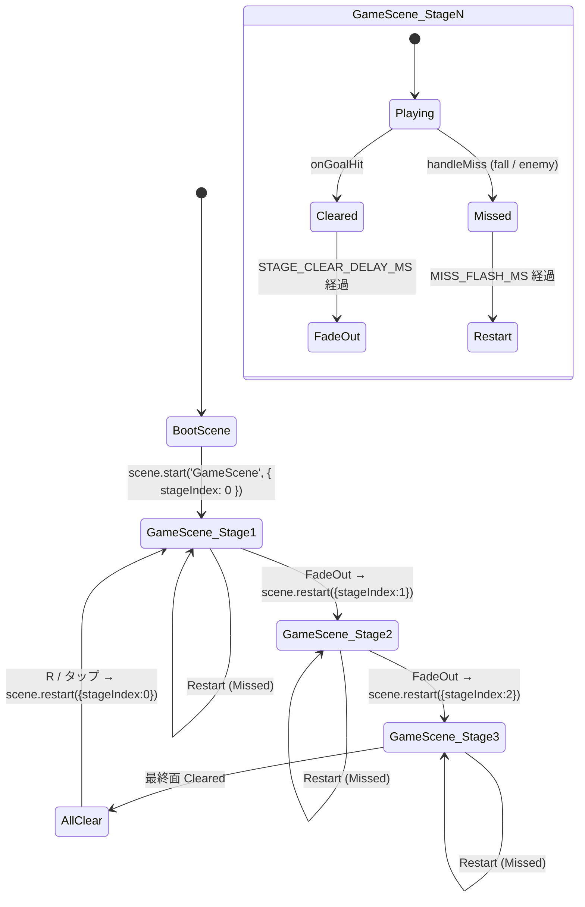
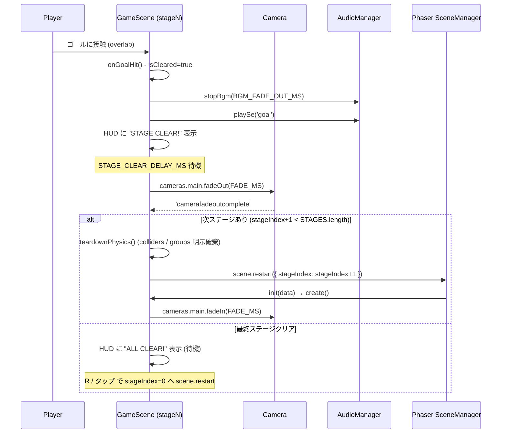
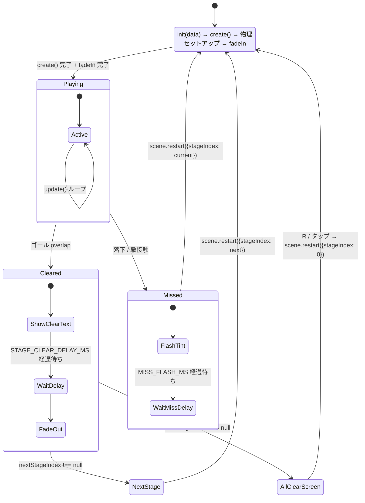

# 設計書: ステージ追加スプリント (stage02 / stage03)

| 項目 | 内容 |
|------|------|
| 作成日 | 2026-05-05 |
| 担当 | バルベルデ（architecture-designer） |
| 関連要求 | `.steering/20260505-add-stages/requirements.md` |

---

## §1 概要

### 1.1 設計方針サマリ

- **方式**: ステージをデータ駆動化する。`StageDefinition` の配列 `STAGES` を `src/stages/index.ts` で公開し、`GameScene` は起動時に渡される `{ stageIndex }` で対象ステージを選択する。
- **最小スコープ**: シーンは `GameScene` 1 つを再利用する（タイトル / ステージセレクト / ライフ等は導入しない）。BootScene は変更せず、テクスチャは引き続き 1 度だけ生成する。
- **既存資産維持**: `StageDefinition` 型・`buildStage()` のバリデーション・タッチ操作・HUD・BGM/SE の挙動は全て温存する。stage02 / stage03 は既存バリデーション (`P` 1 個 / `G` 1 個 / `E` 1..8 / `C` 1..30 / 敵真下 `#` 必須 等) を満たす形で記述する。
- **遷移制御**: ゴール後の自動遷移とミス時の同一ステージ再起動は、`GameScene` 内のシーン再起動 (`scene.restart({ stageIndex })`) を基本とし、安全のため `window.location.reload()` を「フォールバック」として残せる構造にする（§3.3 参照）。

### 1.2 協議論点 Q1〜Q3 の採否決定

| # | 論点 | 採用案 | 理由 |
|---|------|--------|------|
| Q1 | `window.location.reload()` を廃止できるか | **条件付き廃止 + フォールバック維持**。`scene.restart({ stageIndex })` を主経路にし、再起動前に `physics.world.colliders.destroy()` と各 group の `clear(true, true)` を明示実行。検証で床貫通が再発した場合のみ `reload()` に切り替えるトグルを残す（`USE_HARD_RELOAD_FALLBACK` 定数）。 | 床貫通の根本原因はテクスチャ寸法の遅延ではなく、前回の StaticGroup / Collider が残ったまま `create()` が再実行され、新旧 body が二重登録される点にあると推測される。Phaser 3 の `scene.restart()` は GameObject を破棄するが、`physics.add.staticGroup()` を毎回再生成する場合の collider 残留は明示破棄が確実。完全廃止を断言しないのは、検証コストとリスク低減のため。 |
| Q2 | ゴール時の遷移演出 | **フェードアウト → ステージ切替 → フェードイン**（合計 `STAGE_CLEAR_DELAY_MS` = 2000ms 以内に収める） | 即切替はプレイヤーの達成感を削ぐ。Phaser の `cameras.main.fadeOut/fadeIn` は数行で実装でき、ロード待ちが無いのでテンポも崩さない。SE `goal` の再生時間 (約 0.65s) と整合する。 |
| Q3 | ステージ番号の HUD 表示 | **表示する**（左上、コインカウントの上に "STAGE n / N"） | データ駆動化で複数ステージが存在することがプレイヤーに不可視になるため。実装コストは Text オブジェクト 1 個 + `formatStageHud()` のみで小さい。最終ステージクリア後の "ALL CLEAR!" との対称性も取りやすい。 |

---

## §2 アーキテクチャ図

### 2.1 ゲームフロー全体ステートマシン



### 2.2 シーン遷移シーケンス（クリア時）



---

## §3 コンポーネント設計

### 3.1 `src/stages/index.ts` の公開 API

新規ファイル。各ステージ定義の集約と、安全なアクセサを提供する。

```ts
import { STAGE_01 } from './stage01';
import { STAGE_02 } from './stage02';
import { STAGE_03 } from './stage03';
import type { StageDefinition } from './stage01';

/** ステージ進行順の配列。インデックスがそのままステージ番号 (0-origin) を表す。 */
export const STAGES: ReadonlyArray<StageDefinition> = [
  STAGE_01,
  STAGE_02,
  STAGE_03
] as const;

/** 範囲外 / 不正値時は 0 にクランプし、必ず有効な StageDefinition を返す。 */
export function getStage(index: number): { stage: StageDefinition; index: number } {
  if (!Number.isInteger(index) || index < 0 || index >= STAGES.length) {
    return { stage: STAGES[0], index: 0 };
  }
  return { stage: STAGES[index], index };
}

/** 次ステージ番号。最終面では null を返す（呼び出し側が ALL CLEAR を判定）。 */
export function nextStageIndex(current: number): number | null {
  const next = current + 1;
  return next < STAGES.length ? next : null;
}

export type { StageDefinition } from './stage01';
```

### 3.2 stage02 / stage03 の構造

| 項目 | stage02 | stage03 |
|------|---------|---------|
| cols | 140 | 160 |
| rows | 17（既存と同じ） | 17 |
| 隙間数 | 3 箇所 | 4 箇所 |
| 空中足場 | 短い足場 2 箇所 | 長い空中足場連続 3 箇所 |
| 敵 (`E`) | 5 体 | 8 体 |
| コイン (`C`) | 18 枚 | 22 枚 |
| スポーン (`P`) | col 2, row 15 | col 2, row 15 |
| ゴール (`G`) | col 137, row 14 | col 157, row 14 |

`StageDefinition` の既存バリデーションを必ず通過させる。実タイル列は実装フェーズで stage01 の構成パターンを踏襲して記述する。

### 3.3 `GameScene` の変更点

#### 3.3.1 `init(data)` の追加

```ts
private stageIndex = 0;
private stage!: StageDefinition;

init(data: { stageIndex?: number }): void {
  const resolved = getStage(data?.stageIndex ?? 0);
  this.stageIndex = resolved.index;
  this.stage = resolved.stage;
}
```

`init()` は `create()` より先に呼ばれるので、`create()` 内で `STAGE_01` ハードコードの代わりに `this.stage` を参照する。

#### 3.3.2 `create()` の改修ポイント

- `const stage = STAGE_01;` → `const stage = this.stage;` へ置換
- HUD に STAGE 表示用 `Text` を追加 (`STAGE x / N`)
- `BGM` の再生は既存通り `create()` 末尾で `audio.startBgm()`（再起動時も毎回呼ばれる）
- `cameras.main.fadeIn(FADE_MS)` を末尾に追加（前ステージからの遷移時にフェードインする）

#### 3.3.3 `onGoalHit` の改修

```ts
private onGoalHit = (): void => {
  if (this.isCleared) return;
  this.isCleared = true;
  this.audio.playSe('goal');
  this.audio.stopBgm(BGM_FADE_OUT_MS);
  this.player.setVelocity(0, 0);

  const next = nextStageIndex(this.stageIndex);
  if (next === null) {
    this.showAllClear();        // 最終ステージ
    return;
  }
  this.showStageClear();         // "STAGE n CLEAR!"

  this.time.delayedCall(STAGE_CLEAR_DELAY_MS, () => {
    this.cameras.main.fadeOut(STAGE_FADE_MS, 0, 0, 0);
    this.cameras.main.once('camerafadeoutcomplete', () => {
      this.transitionToStage(next);
    });
  });
};
```

#### 3.3.4 `transitionToStage()` の新設

```ts
private transitionToStage(index: number): void {
  this.teardownPhysics();
  if (USE_HARD_RELOAD_FALLBACK) {
    // フォールバック: 床貫通バグが再発した場合のみ true にする (gameConfig)。
    // 直近 stageIndex は sessionStorage に退避してから reload する。
    sessionStorage.setItem(STAGE_INDEX_STORAGE_KEY, String(index));
    window.location.reload();
    return;
  }
  this.scene.restart({ stageIndex: index });
}

private teardownPhysics(): void {
  // 床貫通バグ対策: scene.restart() の前に既存の collider と group を明示破棄する。
  // Phaser 3 は scene.restart() でも GameObject を destroy するが、
  // physics.world の colliders 配列に残った参照が新シーンの body と衝突判定を二重化する事例があるため明示する。
  this.physics.world.colliders.destroy();
  if (this.coins) this.coins.clear(true, true);
  if (this.enemies) this.enemies.clear(true, true);
}
```

#### 3.3.5 `handleMiss` / `fullRestart` の改修

ミス時は同一ステージを再起動。ALL CLEAR 後の R / タップは `stageIndex=0` で再起動。

```ts
private fullRestart(): void {
  this.teardownPhysics();
  if (USE_HARD_RELOAD_FALLBACK) {
    sessionStorage.setItem(STAGE_INDEX_STORAGE_KEY, String(this.stageIndex));
    window.location.reload();
    return;
  }
  this.scene.restart({ stageIndex: this.stageIndex });
}

private restartFromTop(): void {
  this.teardownPhysics();
  this.scene.restart({ stageIndex: 0 });
}
```

`BootScene.create()` では `sessionStorage` から `STAGE_INDEX_STORAGE_KEY` を読み出し、あれば `scene.start('GameScene', { stageIndex: N })`、なければ `{ stageIndex: 0 }` を渡す（reload フォールバック時の継続用）。

### 3.4 `gameConfig.ts` への追記

```ts
// --- v0.4: ステージ進行 ---
/** クリア後、次ステージ遷移までの待ち時間 (ms)。fadeOut 開始までのウェイト。 */
export const STAGE_CLEAR_DELAY_MS = 1200;
/** カメラフェードイン/アウト時間 (ms)。STAGE_CLEAR_DELAY_MS と合わせて 2000ms 程度に収める。 */
export const STAGE_FADE_MS = 600;
/** 床貫通バグが再発した場合のフォールバック。true で window.location.reload() 経路を使う。 */
export const USE_HARD_RELOAD_FALLBACK = false;
/** reload フォールバック時にステージ番号を退避する sessionStorage キー。 */
export const STAGE_INDEX_STORAGE_KEY = 'mario-game.stageIndex';
/** HUD ステージ表示の Y 座標 (画面左上、コインカウントの上)。 */
export const HUD_STAGE_Y = 16;
/** HUD ステージ表示ラベル。 */
export const HUD_STAGE_LABEL = 'STAGE';
```

### 3.5 床貫通バグ対策の実装アプローチ（Q1 詳細）

**仮説**: `scene.restart()` 時、`physics.world.colliders` のリストに前回の Collider 参照が残ることで、新シーンの StaticGroup body と衝突判定が「想定より早く」または「想定より遅く」発火し、`refreshBody()` のタイミングと噛み合わず貫通する。

**対策の段階**:

1. **Phase 1（主案）**: `teardownPhysics()` で `physics.world.colliders.destroy()` と各 group の `clear(true, true)` を実行してから `scene.restart()` を呼ぶ。コミット前に手動検証（同一ステージ 5 回ミス再起動、ステージ間 3 回遷移）して貫通が出ないことを確認。
2. **Phase 2（再発時）**: `USE_HARD_RELOAD_FALLBACK = true` に切り替え、`window.location.reload()` + `sessionStorage` で stageIndex を保持する経路を有効化。`decisions.md` に「Phase 1 で貫通再発したため reload に戻した」と記録する。
3. **Phase 3（恒久）**: 余裕があれば、Phaser の Issue Tracker で類似事例の調査と Phaser バージョン更新を別スプリントで検討。本スプリントのスコープ外。

**判断基準**: Phase 1 検証で 1 度でも貫通が再現した場合、即 Phase 2 に切り替える。プレイヤー体験への影響が大きい不具合のため、決定論的に再現できないリスクは取らない。

---

## §4 ゲームループ状態遷移



---

## §5 エラーハンドリング

| 異常ケース | 検出 | フォールバック |
|----------|------|----------------|
| `stageIndex` が範囲外 (負数 / `STAGES.length` 以上 / 非整数) | `getStage()` 内で `Number.isInteger` + 範囲チェック | `STAGES[0]` を返し、`stageIndex=0` として続行。コンソールには `console.warn` で記録（本番でも黙って初期面に戻る方が UX 上望ましい）。 |
| `stageIndex` が `undefined`（init data 欠落） | `init()` 内で `data?.stageIndex ?? 0` | 0 にフォールバック。 |
| `StageDefinition` バリデーション失敗（`buildStage()` が throw） | 既存 throw を維持 | Phaser のシーン例外として bubble up。開発時はコンソールエラーで気付ける。本番ではゲームが停止するが、stage02 / stage03 はビルド時 / 手動検証で必ず通過確認するため発生しない想定。 |
| `sessionStorage` 利用不可（プライベートブラウジング等） | `try/catch` で囲む | フォールバック無効と同等扱い。reload 経路は使わずに済むため致命的でない。 |
| `cameras.main.fadeOut` が `'camerafadeoutcomplete'` を発火しない（タブ非表示等） | `time.delayedCall(STAGE_FADE_MS + 200ms, ...)` でセーフティタイマー併用 | タイムアウトで強制的に `transitionToStage()` を呼ぶ。 |

---

## §6 影響範囲

### 6.1 新規ファイル

| パス | 内容 |
|------|------|
| `src/stages/stage02.ts` | `STAGE_02` 定数（cols=140, 敵 5, コイン 18） |
| `src/stages/stage03.ts` | `STAGE_03` 定数（cols=160, 敵 8, コイン 22） |
| `src/stages/index.ts` | `STAGES` 配列・`getStage()`・`nextStageIndex()`・`StageDefinition` 再エクスポート |
| `.steering/20260505-add-stages/decisions.md` | 実装中の判断ログ（Phase 1 検証結果含む） |

### 6.2 変更ファイル

| パス | 変更内容 |
|------|---------|
| `src/scenes/GameScene.ts` | `init(data)` 追加 / `create()` で `this.stage` 参照 / `onGoalHit` を遷移制御に改修 / `transitionToStage()` / `teardownPhysics()` / `restartFromTop()` 新設 / HUD に STAGE 表示追加 / fadeIn 呼び出し追加 |
| `src/scenes/BootScene.ts` | `create()` で `sessionStorage` から stageIndex を読んで `scene.start('GameScene', { stageIndex })` に渡す（reload フォールバック対応） |
| `src/config/gameConfig.ts` | `STAGE_CLEAR_DELAY_MS` / `STAGE_FADE_MS` / `USE_HARD_RELOAD_FALLBACK` / `STAGE_INDEX_STORAGE_KEY` / `HUD_STAGE_Y` / `HUD_STAGE_LABEL` 追記 |
| `src/stages/stage01.ts` | 変更なし（後方互換維持。`StageDefinition` 型はここから引き続きエクスポート） |

### 6.3 既存機能への影響

- **stage01 単体プレイ**: `STAGES[0]` として継続動作。挙動変化は HUD への "STAGE 1 / 3" 表示追加とゴール後の挙動変化のみ。
- **タッチ操作**: 変更なし（`setupTouchControls()` はそのまま）。ALL CLEAR 後のタップで `restartFromTop()` を呼ぶよう `handlePointerDown` の分岐を 1 行追加するのみ。
- **BGM/SE**: 変更なし。`audio.startBgm()` は `create()` のたびに呼ばれるのでステージ切替で自然にリスタートする。`audio.destroy()` は既存 `'shutdown'` イベントで実行されるため、シーン再起動時のリーク無し。
- **HUD**: コインカウントは `coinsCollected = 0` で初期化済み（既存コードでステージ切替時もリセットされる）。STAGE 表示が追加されるだけ。

---

## §7 受け入れ条件の検証方法

| 受け入れ条件 | 検証方法 |
|--------------|----------|
| ステージ 1→2→3 の順にゴールで自動遷移する | 手動: stage1 ゴール到達 → 2 秒以内に stage2 が開始すること、HUD が "STAGE 2 / 3" になること。stage2 → 3 も同様。 |
| ステージ 3 クリア後 "ALL CLEAR!" → R/タップで stage1 へ | 手動: stage3 ゴール到達 → "ALL CLEAR!" 表示 → R 押下 / 画面タップで stage1 が開始 + HUD が "STAGE 1 / 3" になること。 |
| ミス時に同一ステージ再起動・コイン/敵/プレイヤー初期状態 | 手動: stage2 でコイン取得後にミス → stage2 が再起動し、コイン HUD が `0 / 18` に戻ること。 |
| HUD のコインカウントがステージ切り替え時にリセット | 手動: stage1 でコイン 5 枚取得 → ゴール → stage2 開始時に HUD が `0 / 18` であること。 |
| stage02 / stage03 が `StageDefinition` バリデーション通過 | `npm run build` が成功し、ステージ起動時に `buildStage()` が throw しないこと。stage03 の敵 8 体が `'E' count must be 1..8` の上限を超えないこと。 |
| stage03（cols=160・敵 8 体）で 60fps 維持 | 手動: Chrome DevTools の Performance パネルで stage3 を 30 秒プレイし、平均 FPS ≥ 58 を確認。 |
| BGM / SE が正常動作 | 手動: 全ステージで BGM ループ / コイン SE / ジャンプ SE / ゴール SE / ミス SE が再生されること。ステージ遷移時に BGM が一旦停止し再開すること。 |
| 床貫通バグが再発しない | 手動: 各ステージで連続 5 回ミス → 再起動後に床に立てること。stage1→2→3 を 3 周連続クリアし、いずれの再起動後も貫通なし。 |

---

## §8 設計品質チェック

| 観点 | 内容 |
|------|------|
| **セキュリティ** | バックエンドなし。新規追加コードは静的データ (`STAGE_02` / `STAGE_03`) と Phaser API 呼び出しのみ。`sessionStorage` 利用箇所は数値文字列のみ書き込み、読み出し時に `Number.parseInt` + 範囲チェックを通すため XSS / Injection の余地なし。クルトワのレビュー観点はハードコーディング（外部 URL / シークレット）が無いことを再確認するのみ。 |
| **テスタビリティ** | `getStage()` / `nextStageIndex()` は純粋関数。Vitest で範囲外 / 非整数 / 境界値 (`-1`, `0`, `STAGES.length-1`, `STAGES.length`) をユニットテスト可能。`buildStage()` は既存テストを stage02 / stage03 でも実行する形に拡張する（ギュレル領分）。 |
| **モジュール性** | ステージデータ (`stages/`) と進行制御 (`GameScene`) を分離。新ステージ追加は `stages/stageNN.ts` を 1 ファイル足して `STAGES` 配列に追加するだけで済む（Open/Closed Principle）。 |
| **コスト効率** | インフラコスト変動なし（GitHub Pages 静的配信）。バンドルサイズ増加は stage02 / stage03 のタイル文字列分のみ（〜10KB 程度）、gzip 後の影響は軽微。 |
| **保守性** | `STAGE_CLEAR_DELAY_MS` / `STAGE_FADE_MS` を `gameConfig.ts` に集約しチューニング容易。`USE_HARD_RELOAD_FALLBACK` トグルで緊急時に旧挙動へ即時復帰可能。決定理由は `decisions.md` に追記。 |
| **シンプルさ** | シーンは 1 つのまま。ステージ進行を新シーン (`StageTransitionScene` 等) に切り出さなかったのは、現状 3 ステージで過剰設計のリスクが上回るため。将来 10 ステージ規模になればその時点で分割を検討。 |

---

## §9 リスクと緩和策

| リスク | 影響 | 緩和策 |
|--------|------|--------|
| Phase 1（明示破棄）で床貫通が再発する | プレイヤー体験悪化 | `USE_HARD_RELOAD_FALLBACK` を即座に `true` 化。フォールバック経路は本スプリント内で実装済みなのでホットスイッチ可能。`decisions.md` に再発条件を記録。 |
| stage03（敵 8 体 + 長い空中足場）で 60fps を割る | プレイ感悪化 | 敵を 7 体に減らす / 空中足場を短縮するなどステージデータ側で調整。レンダリング側の最適化は本スプリント外。 |
| `cameras.main.fadeOut` のイベントがタブ非表示時に発火しない | ステージ遷移が止まる | §5 のセーフティタイマー（`STAGE_FADE_MS + 200ms`）で強制遷移。 |
| `sessionStorage` がブラウザポリシーで利用不可 | reload フォールバック使用時に常に stage1 から再開 | reload フォールバックはあくまで Phase 2 用。通常運用では Phase 1（`scene.restart`）で `sessionStorage` 不要。 |
| stage02 / stage03 のレベルデザインが難しすぎる / 易しすぎる | 体験不均衡 | 実装フェーズで手動プレイ → エンバペ / シャビレビュー → ステージ文字列を調整。design.md で具体的な敵 / コイン数の目安を示しているので大幅な手戻りは想定しない。 |

---

## §10 次のステップ（実装優先順位）

1. **Step 1**: `gameConfig.ts` に新規定数追加（`STAGE_CLEAR_DELAY_MS` / `STAGE_FADE_MS` / `USE_HARD_RELOAD_FALLBACK` / `STAGE_INDEX_STORAGE_KEY` / `HUD_STAGE_*`）
2. **Step 2**: `src/stages/stage02.ts` / `src/stages/stage03.ts` 作成。`buildStage()` バリデーション通過を `npm run build` で確認
3. **Step 3**: `src/stages/index.ts` 作成（`STAGES` / `getStage` / `nextStageIndex`）
4. **Step 4**: `GameScene` に `init(data)` 追加 + `create()` をデータ駆動化（既存 `STAGE_01` ハードコード除去）
5. **Step 5**: `onGoalHit` を遷移制御に改修 + `transitionToStage()` / `teardownPhysics()` / `restartFromTop()` / ALL CLEAR 表示
6. **Step 6**: `BootScene.create()` で `sessionStorage` 読み出し対応（reload フォールバック用）
7. **Step 7**: 手動検証（受け入れ条件 §7 全項目）。床貫通再発時は Phase 2 へ
8. **Step 8**: `decisions.md` に Phase 1/2 の判定結果を記録
9. **Step 9**: クルトワのセキュリティレビュー → コミット

実装担当の主軸はエンバペ（frontend-engineer）。検証フェーズでギュレル（test-engineer）が `getStage()` / `nextStageIndex()` のユニットテストを追加する想定。
