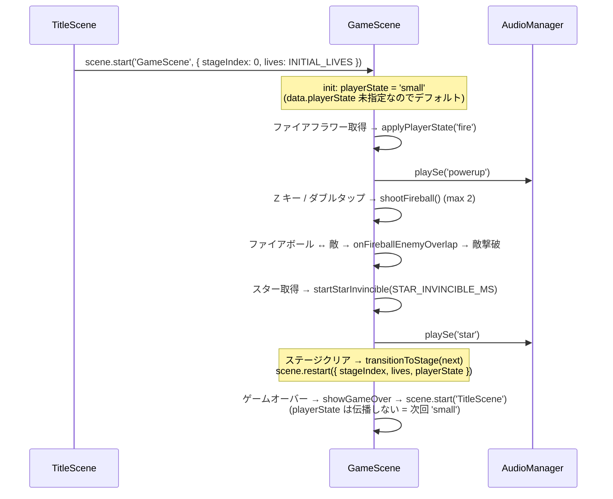
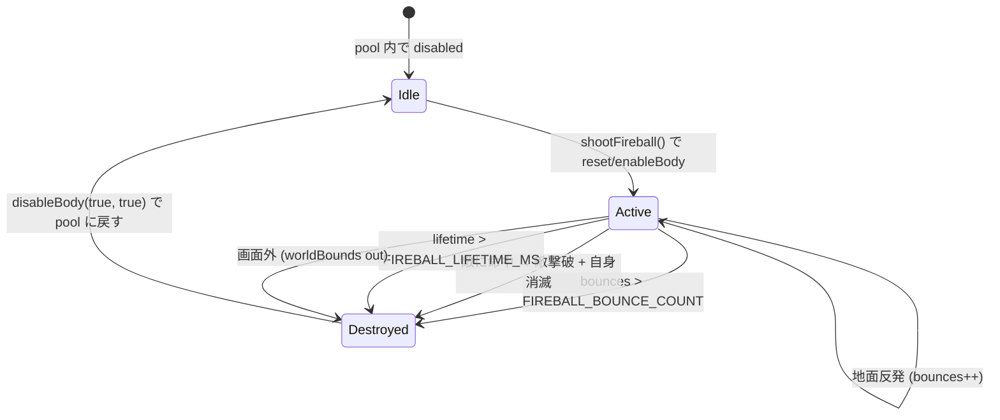
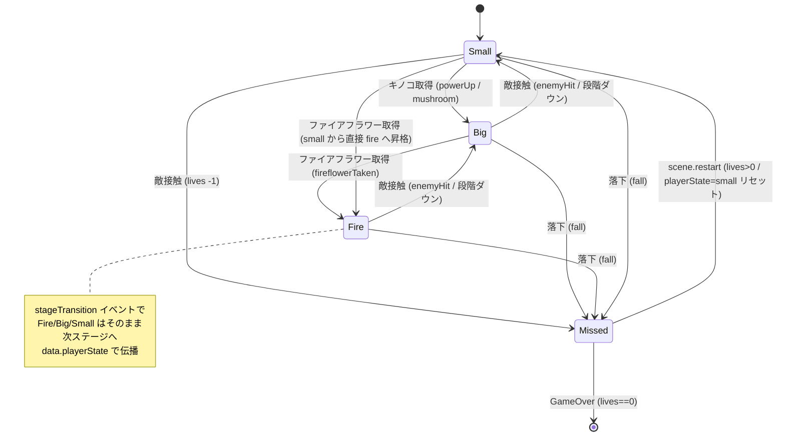
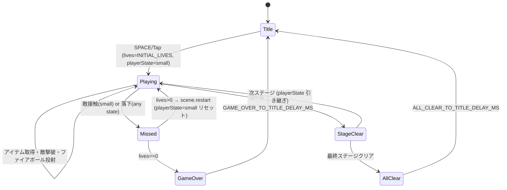

# 設計書: ファイアフラワー / スター追加パワーアップ

| 項目 | 内容 |
|------|------|
| 作成日 | 2026-05-05 |
| 担当 | バルベルデ（architecture-designer） |
| 関連要求 | `.steering/20260505-fire-flower/requirements.md` |
| 前提スプリント | `.steering/20260505-life-powerup/`（v0.9 ライフ + キノコ実装済み） |

---

## 1. 概要

### 設計方針サマリ

- **目的**: v0.9 で導入した「small / big / invincible」状態機械に、`'fire'` を加えた **3 値プレイヤー状態 + 時限バフ（スター無敵）** を実装する。攻撃の選択肢（ファイアボール）と緊急回避手段（スター無敵）を増やし、マリオ風アクションの基本フィーチャを完成させる。
- **方式**:
  - **プレイヤー状態は `'small' | 'big' | 'fire'` の 3 値**。v0.9 の `'invincible'` は「ダメージ無敵フレーム」という直交概念だったため、これを `playerState` から分離して `isInvincible: boolean` フラグへ昇格させる（**v0.9 の状態機械を 1 段リファクタする**）。これによりスター無敵 (`isStarInvincible`) と完全並行な構造が取れる。
  - **ファイアボールは `physics.add.group({ maxSize })` のオブジェクトプール**。reset/disableBody で使い回し、`maxSize = FIREBALL_MAX_COUNT = 2` で物理上の上限を保証。
  - **スター無敵は時限バフ**。`isStarInvincible` フラグ + `time.delayedCall` タイマー + `tweens` 点滅で v0.9 の `startInvincible()` と同じパターンを踏襲。
  - **ファイアフラワー / スターのスプライトは BootScene の `addCanvas` で生成**。既存の `buildMushroomSheet` と並行な構造で `buildFireflowerSheet` / `buildStarSheet` / `buildFireballSheet` を追加。
  - **タッチ操作のファイアボール投射は「右ゾーンのダブルタップ」**。HUD ボタン追加よりもスクロール操作の邪魔にならず、既存ゾーン定義（`TOUCH_ZONE_SPLIT_RATIO`）を温存できる（§3.7 で詳述）。
- **最小スコープ厳守**:
  - BGM 切り替え（スター取得時）・ファイアボール爆発エフェクト・アイスフラワー等は **本スプリント外**。
  - コンティニュー時のパワーアップ状態保存（sessionStorage 永続化）も本スプリント外。
- **既存資産は壊さない**:
  - v0.9 の `buildStage()` バリデーション（P=1, G=1, E=1..8, C=1..30, M=0..5）はそのまま温存。`F` / `S` の枝のみ追加。
  - `coinHud` / `stageHud` / `lifeHud` / `instructionText` の `setScrollFactor(0)` + `toWorldX/toWorldY` パターン維持。
  - `onEnemyOverlap`・`handleMiss`・`fullRestart`・`transitionToStage`・`teardownPhysics` のシグネチャは変えず、内部ロジックのみ拡張。
  - `init` の `data` キーに `playerState` を追加するのみ。`stageIndex` / `lives` の伝播は不変。
- **ハードコーディング禁止**: 全定数（速度・反発・寸法・色・タイマー・配置数）を `src/config/gameConfig.ts` に集約。

### スコープ確定（要求書 §8 への回答）

| 項目 | 採用 | 理由 |
|------|------|------|
| **Q1: タッチでのファイアボール投射 UI** | **右ゾーンのダブルタップを採用**（300ms 以内の連続タップ）。HUD ボタンは追加しない。 | §3.7 で詳述。HUD ボタンは Scale.RESIZE + ズームの座標補正コストが高く、画面占有率も増える。ダブルタップは既存のジャンプ操作（右ゾーン即時タップ）と「シングル / ダブル」で意味分けでき、左ゾーン（移動スライド）に干渉しない。 |
| **Q2: `PlayerState` 型の配置場所** | **`gameConfig.ts` 内に export type で定義**。独立ファイルは作らない。 | v0.9 の踏襲。状態列挙はゲーム全体の設定と密結合（HUD 表示・SE キーと連動）であり、`gameConfig.ts` の 1 ファイルに集約する設計原則が確立済み。新規ファイルは保守 surface を増やすだけ。 |
| **Q3: ファイアフラワー取得時の SE** | **新規 `powerup` SE を追加**（既存 `mushroom` とは別）。 | `mushroom` SE は「強化される瞬間」の感覚として既に確立されている。ファイアは「能力獲得」の質感が異なるため、より華やかなアルペジオ + 高音のフラッシュを別 SE として持つ。後方互換も保てる（v0.9 の mushroom SE を変えない）。 |
| **Q4: スター SE** | **新規 `star` SE を追加**（goal 流用しない）。 | goal は「クリアの達成感」、star は「無敵への興奮 / キラキラ感」で性格が異なる。短い上昇シーケンスでスター獲得らしさを表現する。 |
| **Q5: 各ステージの `F` / `S` 配置数・位置** | **stage01: F=1, S=0 / stage02: F=1, S=1 / stage03: F=1, S=1**（漸増） | §3.6 で詳述。stage01 は導入・stage02 でスター初登場・stage03 で全要素揃える。受け入れ条件 `npm run build` を通すための最小配置。 |
| **Q6: ファイア状態のスプライト表現** | **`setTint(PLAYER_FIRE_TINT)` のみで実装**。新フレーム追加はしない。 | §3.5 で詳述。`PLAYER_FIRE_TINT = 0xffe0a0`（明るい肌色寄り白）で「白〜ピンク」のファイア状態を表現。スプライトシート 4 フレーム分の再描画コストを避け、保守性も向上。tint と big/small スケールの組み合わせで 6 状態（small × {normal, fire}, big × {normal, fire}, fire × {normal, star点滅}）を視覚的に判別できる。 |

---

## 2. アーキテクチャ図

### 2.1 全体構成（差分のみ）

```mermaid
graph LR
    GC[gameConfig.ts<br/>+PlayerState type<br/>+FIREBALL_*<br/>+STAR_*<br/>+FIREFLOWER_*<br/>+PLAYER_FIRE_TINT<br/>+TEX_KEY.fireball/fireflower/star<br/>+SE_PARAMS.powerup/fireball/star]
    SS[spriteSheets.ts<br/>+buildFireflowerSheet<br/>+buildStarSheet<br/>+buildFireballSheet]
    BS[BootScene<br/>+3 つの buildXxxSheet 呼び出し]
    ST[stages/*.ts<br/>+ tile 'F' / 'S']
    GS[GameScene<br/>+playerState 3 値化<br/>+isInvincible 分離<br/>+isStarInvincible<br/>+fireflowers/stars/fireballs<br/>+shootFireball<br/>+onFireballEnemyOverlap<br/>+startStarInvincible/endStarInvincible<br/>+applyPlayerState]
    TS[TitleScene<br/>scene.start payload に playerState 追加なし<br/>※新規ゲーム開始時は 'small' リセット]
    AM[AudioManager<br/>SeKey += 'powerup' \| 'fireball' \| 'star']

    GC --> BS
    GC --> GS
    GC --> AM
    BS --> SS
    ST --> GS
    TS --> GS
```

### 2.2 シーン遷移とパワーアップ伝播



### 2.3 ファイアボールのライフサイクル



---

## 3. コンポーネント設計

### 3.1 `src/config/gameConfig.ts` への追加

#### 3.1.1 PlayerState 型（Q2 への対応）

v0.9 で `GameScene` 内に直接書かれていた `'small' | 'big' | 'invincible'` リテラルユニオンを `gameConfig.ts` に集約し、3 値化する。

```ts
// gameConfig.ts に追加
export type PlayerState = 'small' | 'big' | 'fire';
```

**重要な変更点**: v0.9 の `'invincible'` を **`playerState` から削除**し、`isInvincible: boolean` フラグへ昇格させる（§3.2.1 参照）。理由は §4.1 の「状態と一時バフの直交化」で詳述。

#### 3.1.2 追加定数

| 定数名 | 型 | 値 | 用途 |
|--------|----|----|------|
| `FIREBALL_SPEED_X` | `number` | `360` | ファイアボール水平速度（px/s）。`PLAYER_SPEED=200` より速く、視覚的に「投射」と分かる。 |
| `FIREBALL_SPEED_Y` | `number` | `-180` | ファイアボール初期垂直速度（px/s, 上向き負）。発射直後にやや跳ね上がる挙動。 |
| `FIREBALL_BOUNCE_Y` | `number` | `0.7` | 地面反発係数。`Body.setBounce(_, 0.7)` で 70% の高さで跳ね返る。 |
| `FIREBALL_BOUNCE_COUNT` | `number` | `3` | 最大反発回数。3 回反発したら消滅。 |
| `FIREBALL_LIFETIME_MS` | `number` | `2500` | 投射から消滅までの最大時間（ms）。反発カウントの保険。 |
| `FIREBALL_MAX_COUNT` | `number` | `2` | 同時に存在できるファイアボール数。Group の `maxSize`。 |
| `FIREBALL_COOLDOWN_MS` | `number` | `200` | 連射間隔（ms）。1 フレーム連打で 2 発同時発射されるのを防ぐ。 |
| `FIREBALL_SPRITE_W` | `number` | `16` | ファイアボール表示幅。 |
| `FIREBALL_SPRITE_H` | `number` | `16` | ファイアボール表示高さ。 |
| `FIREBALL_BODY_W` | `number` | `12` | ファイアボール衝突半径（直径相当）。表示より小さく、敵との衝突判定をシビアに。 |
| `FIREBALL_BODY_H` | `number` | `12` | 同上。 |
| `FIREBALL_COLOR` | `number` | `0xff7a00` | ファイアボール本体（オレンジ）。 |
| `FIREBALL_HIGHLIGHT_COLOR` | `number` | `0xffe066` | 中心ハイライト（明るい黄）。 |
| `STAR_INVINCIBLE_MS` | `number` | `8000` | スター無敵時間（ms）。8 秒は 1 ステージ横断には足りないため攻略要素として機能する。 |
| `STAR_BLINK_MS` | `number` | `80` | スター点滅 1 周期（ms）。v0.9 の `INVINCIBLE_BLINK_MS=100` よりやや速くしてキラキラ感を出す。 |
| `STAR_END_WARNING_MS` | `number` | `1500` | スター無敵終了 N ms 前から早い点滅で警告。`STAR_BLINK_MS` を半分にする。 |
| `STAR_SPRITE_W` | `number` | `28` | スター表示幅。 |
| `STAR_SPRITE_H` | `number` | `28` | スター表示高さ。 |
| `STAR_COLOR` | `number` | `0xffd23f` | スター本体（鮮やかな黄）。 |
| `STAR_OUTLINE_COLOR` | `number` | `0xb37700` | スター輪郭（濃い橙）。 |
| `FIREFLOWER_SPRITE_W` | `number` | `32` | ファイアフラワー表示幅（= TILE_SIZE）。 |
| `FIREFLOWER_SPRITE_H` | `number` | `32` | 同上。 |
| `FIREFLOWER_PETAL_COLOR` | `number` | `0xff5252` | 花びら赤。 |
| `FIREFLOWER_CENTER_COLOR` | `number` | `0xffe066` | 花芯黄。 |
| `FIREFLOWER_STEM_COLOR` | `number` | `0x2e8b57` | 茎緑。 |
| `FIREFLOWER_LEAF_COLOR` | `number` | `0x4caf50` | 葉緑（ハイライト）。 |
| `PLAYER_FIRE_TINT` | `number` | `0xffe0a0` | ファイア状態の `setTint`（明るい白〜薄ピンク）。 |
| `STAGE_FIREFLOWER_MIN` | `number` | `0` | F タイル下限。 |
| `STAGE_FIREFLOWER_MAX` | `number` | `3` | F タイル上限。 |
| `STAGE_STAR_MIN` | `number` | `0` | S タイル下限。 |
| `STAGE_STAR_MAX` | `number` | `2` | S タイル上限。 |
| `HUD_FIRE_LABEL` | `string` | `'FIRE: Z / 右ダブルタップ'` | ファイア状態時の操作ヒント文字列（既存 `instructionText` を上書きする小拡張）。 |

#### 3.1.3 `TEX_KEY` の拡張

```ts
export const TEX_KEY = {
  playerSheet: 'player_sheet',
  ground: 'ground',
  goal: 'goal',
  enemySheet: 'enemy_sheet',
  coin: 'coin',
  mushroom: 'mushroom',
  fireflower: 'fireflower',  // ★追加
  star: 'star',              // ★追加
  fireball: 'fireball'       // ★追加
} as const;
```

#### 3.1.4 `SE_PARAMS` の拡張

```ts
// SeKey union を拡張: 'jump' | 'coin' | 'stomp' | 'miss' | 'goal' | 'mushroom' | 'powerup' | 'fireball' | 'star'
export const SE_PARAMS: Record<SeKey, SeDefinition> = {
  // ... 既存 6 件 ...

  // ファイアフラワー取得: 上昇アルペジオ (mushroom より華やか)
  powerup: {
    steps: [
      { freqStart: 523,  freqEnd: 523,  durationSec: 0.06, attackSec: 0.003, peakGain: 0.30, waveform: 'square', offsetSec: 0.00 },
      { freqStart: 659,  freqEnd: 659,  durationSec: 0.06, attackSec: 0.003, peakGain: 0.30, waveform: 'square', offsetSec: 0.06 },
      { freqStart: 784,  freqEnd: 784,  durationSec: 0.06, attackSec: 0.003, peakGain: 0.32, waveform: 'square', offsetSec: 0.12 },
      { freqStart: 1047, freqEnd: 1047, durationSec: 0.06, attackSec: 0.003, peakGain: 0.34, waveform: 'square', offsetSec: 0.18 },
      { freqStart: 1568, freqEnd: 1976, durationSec: 0.20, attackSec: 0.003, peakGain: 0.38, waveform: 'square', offsetSec: 0.24 }
    ]
  },

  // ファイアボール投射: 短い高音のシュッ
  fireball: {
    steps: [
      { freqStart: 880,  freqEnd: 1760, durationSec: 0.08, attackSec: 0.002, peakGain: 0.25, waveform: 'square', offsetSec: 0 }
    ]
  },

  // スター取得: キラキラした上昇アルペジオ + 余韻
  star: {
    steps: [
      { freqStart: 784,  freqEnd: 784,  durationSec: 0.05, attackSec: 0.002, peakGain: 0.28, waveform: 'square', offsetSec: 0.00 },
      { freqStart: 988,  freqEnd: 988,  durationSec: 0.05, attackSec: 0.002, peakGain: 0.28, waveform: 'square', offsetSec: 0.05 },
      { freqStart: 1175, freqEnd: 1175, durationSec: 0.05, attackSec: 0.002, peakGain: 0.30, waveform: 'square', offsetSec: 0.10 },
      { freqStart: 1568, freqEnd: 1568, durationSec: 0.05, attackSec: 0.002, peakGain: 0.32, waveform: 'square', offsetSec: 0.15 },
      { freqStart: 1976, freqEnd: 2349, durationSec: 0.25, attackSec: 0.002, peakGain: 0.36, waveform: 'triangle', offsetSec: 0.20 }
    ]
  }
};
```

`AudioManager.SeKey` も同様に `'powerup' | 'fireball' | 'star'` を追加する。

### 3.2 `GameScene` の変更点

#### 3.2.1 フィールド追加 + リファクタ

| フィールド | 型 | 用途 | v0.9 からの変更 |
|-----------|----|------|----------------|
| `playerState` | `PlayerState` (`'small'\|'big'\|'fire'`) | プレイヤーの装備状態 | **3 値化**。`'invincible'` を削除して下記 `isInvincible` に昇格。 |
| `isInvincible` | `boolean` | ダメージ無敵フレーム中か（v0.9 の playerState='invincible' 相当） | **新規（旧 'invincible' のフラグ化）** |
| `isStarInvincible` | `boolean` | スター無敵中か | 新規 |
| `starTimer` | `Phaser.Time.TimerEvent \| null` | スター無敵終了タイマー | 新規 |
| `starWarningTimer` | `Phaser.Time.TimerEvent \| null` | 終了警告（点滅高速化）タイマー | 新規 |
| `starBlinkTween` | `Phaser.Tweens.Tween \| null` | スター無敵中の点滅 tween | 新規 |
| `fireflowers` | `Phaser.Physics.Arcade.StaticGroup` | F タイルから生成するアイテム群 | 新規 |
| `stars` | `Phaser.Physics.Arcade.StaticGroup` | S タイルから生成するアイテム群 | 新規 |
| `fireballs` | `Phaser.Physics.Arcade.Group` | ファイアボール pool（`maxSize=FIREBALL_MAX_COUNT`） | 新規 |
| `fireKey` | `Phaser.Input.Keyboard.Key` | Z キー（投射） | 新規 |
| `fireCooldownUntil` | `number` | 次に投射可能になる time.now ms | 新規（連打抑止） |
| `lastTapRightAt` | `number` | 右ゾーン直近タップ時刻（ダブルタップ判定） | 新規 |
| `invincibleTimer` | `Phaser.Time.TimerEvent \| null` | （v0.9 既存）ダメージ無敵タイマー | 既存維持 |
| `blinkTween` | `Phaser.Tweens.Tween \| null` | （v0.9 既存）ダメージ無敵点滅 | 既存維持 |

#### 3.2.2 `BuiltStage` 型の拡張

```ts
interface BuiltStage {
  // ... 既存 8 フィールド ...
  fireflowers: Phaser.Physics.Arcade.StaticGroup;  // ★追加
  stars: Phaser.Physics.Arcade.StaticGroup;        // ★追加
}
```

#### 3.2.3 `init` シグネチャ拡張

```ts
init(data: { stageIndex?: number; lives?: number; playerState?: PlayerState }): void {
  const resolved = getStage(data?.stageIndex ?? 0);
  this.stageIndex = resolved.index;
  this.stage = resolved.stage;
  this.lives = Math.max(MIN_LIVES, data?.lives ?? INITIAL_LIVES);

  // ★ パワーアップ状態の引き継ぎ。
  //   - ステージ間遷移: data.playerState に現在の状態を渡す → 'fire' のまま次ステージへ
  //   - ゲームオーバー後 / タイトルからの新規ゲーム: 未指定なので 'small' でリセット
  //   - 不正値が来たら 'small' にクランプ（型ガード）
  const incoming = data?.playerState;
  this.playerState = (incoming === 'small' || incoming === 'big' || incoming === 'fire')
    ? incoming
    : 'small';
}
```

#### 3.2.4 改修メソッド

| 既存メソッド | 変更内容 |
|-------------|---------|
| `create()` | `isInvincible = false`, `isStarInvincible = false`, タイマー / tween null 初期化、`fireflowers`/`stars`/`fireballs` setup、`fireKey = addKey('Z')`、4 種の overlap/collider 追加、`applyPlayerState(this.playerState)` で見た目反映、`shutdown` ハンドラ拡張。 |
| `update()` | `Phaser.Input.Keyboard.JustDown(this.fireKey)` 検知 → `tryShootFireball()`。ファイアボール pool 内 active メンバの寿命チェック（`getData('expireAt')` < `time.now` で `destroyFireball`）。 |
| `buildStage()` | `'F'`/`'S'` の枝を追加。`fireflowerPositions` / `starPositions` 配列を新設、バリデーション（`STAGE_FIREFLOWER_MIN..MAX`, `STAGE_STAR_MIN..MAX`）追加、`buildFireflowers`/`buildStars` 呼び出し。 |
| `onEnemyOverlap` | 早期分岐を追加：`isStarInvincible` なら **stomp 判定をスキップして敵撃破**（ライフ・状態に副作用なし）+ stomp SE。`isInvincible` （ダメージ無敵中）なら早期 return。それ以降は v0.9 ロジック踏襲だが `playerState` の判定を `'big'` / `'fire'` の **2 段階ダウングレード**に拡張（§4.1）。 |
| `handleMiss('enemy')` | 「`fire` + 敵 = `big` に戻す + 無敵フレーム」「`big` + 敵 = `small` に戻す + 無敵フレーム」「`small` + 敵 = ライフ −1」。スター無敵中はそもそもこの関数に来ない。 |
| `handleMiss('fall')` | 落下は常にライフ −1（要求書 §4.1.4）。`fire`/`big`/`small` を問わず `applyPlayerState('small')` でサイズ・tint をリセットしてから `decrementLifeAndContinue`。 |
| `fullRestart()` | `scene.restart({ stageIndex, lives, playerState: this.playerState })` に変更。**ただし**「ライフ −1 後に同ステージで復活」する場合は `playerState` を **小に戻して** から restart する（敵に当たっても fire→big だが、ライフを失うほど被弾した場合は小スタートが妥当 = 既存「敵接触ミス時の挙動」と整合）。実装は `decrementLifeAndContinue` 内で `this.playerState = 'small'` を先に代入してから `fullRestart` を呼ぶ流れで OK。 |
| `transitionToStage(index)` | `scene.restart({ stageIndex: index, lives: this.lives, playerState: this.playerState })`。**ステージクリア時のみ状態を引き継ぐ**。 |
| `restartFromTop()` | `scene.start('TitleScene')` のまま（`playerState` は渡さない → 次回ゲーム開始は `'small'` に確実にリセット）。 |
| `teardownPhysics()` | `this.fireflowers?.clear(true, true)`, `this.stars?.clear(true, true)`, `this.fireballs?.clear(true, true)` を追加。 |
| `setupTouchControls()` / `handlePointerDown` | 右ゾーンタップ時に **ダブルタップ判定**を追加。`time.now - lastTapRightAt < DOUBLE_TAP_MS` なら `tryShootFireball()`、そうでなければ通常のジャンプ要求（既存挙動）。`DOUBLE_TAP_MS = 300` を `gameConfig` 定数として追加。 |
| `events.once('shutdown', ...)` | `starTimer`/`starWarningTimer`/`starBlinkTween` のクリーンアップを追加。 |

#### 3.2.5 新規メソッド（骨格）

```ts
// ─────────────────────────────────────────────────
// 状態適用（small/big/fire の見た目を一括反映）
// ─────────────────────────────────────────────────
private applyPlayerState(newState: PlayerState): void {
  this.playerState = newState;
  const isBigSized = newState === 'big' || newState === 'fire'; // fire も大サイズ
  const w = isBigSized ? PLAYER_SPRITE_W * BIG_SCALE : PLAYER_SPRITE_W;
  const h = isBigSized ? PLAYER_SPRITE_H * BIG_SCALE : PLAYER_SPRITE_H;
  this.player.setDisplaySize(w, h);
  (this.player.body as Phaser.Physics.Arcade.Body).setSize(w, h);

  // tint: スター無敵中はスター点滅 tween に任せるので、ここでは触らない
  if (!this.isStarInvincible) {
    if (newState === 'fire') {
      this.player.setTint(PLAYER_FIRE_TINT);
    } else {
      this.player.clearTint();
    }
  }
}

// ─────────────────────────────────────────────────
// ファイアフラワー取得
// ─────────────────────────────────────────────────
private onFireflowerOverlap: Phaser.Types.Physics.Arcade.ArcadePhysicsCallback = (_p, flower) => {
  if (this.isCleared || this.isMissed) return;
  (flower as Phaser.Physics.Arcade.Sprite).disableBody(true, true);
  this.audio.playSe('powerup');
  // small → fire / big → fire / fire → fire (no-op だが SE は鳴る)
  this.applyPlayerState('fire');
};

// ─────────────────────────────────────────────────
// スター取得
// ─────────────────────────────────────────────────
private onStarOverlap: Phaser.Types.Physics.Arcade.ArcadePhysicsCallback = (_p, star) => {
  if (this.isCleared || this.isMissed) return;
  (star as Phaser.Physics.Arcade.Sprite).disableBody(true, true);
  this.audio.playSe('star');
  this.startStarInvincible();
};

private startStarInvincible(): void {
  // 重複取得: タイマーリセットして延長
  this.starTimer?.remove(false);
  this.starWarningTimer?.remove(false);
  this.starBlinkTween?.stop();

  this.isStarInvincible = true;

  // 点滅 tween（カラーサイクルで「スター取った感」を出す）
  // 実装上は alpha + tintFill を使い、低コストで実現
  this.starBlinkTween = this.tweens.add({
    targets: this.player,
    alpha: 0.6,
    duration: STAR_BLINK_MS,
    yoyo: true,
    repeat: -1
  });

  // 終了警告（残り STAR_END_WARNING_MS で点滅高速化）
  this.starWarningTimer = this.time.delayedCall(STAR_INVINCIBLE_MS - STAR_END_WARNING_MS, () => {
    this.starBlinkTween?.stop();
    this.starBlinkTween = this.tweens.add({
      targets: this.player,
      alpha: 0.4,
      duration: STAR_BLINK_MS / 2,
      yoyo: true,
      repeat: -1
    });
  });

  // 終了
  this.starTimer = this.time.delayedCall(STAR_INVINCIBLE_MS, () => this.endStarInvincible());
}

private endStarInvincible(): void {
  this.isStarInvincible = false;
  this.starBlinkTween?.stop();
  this.starBlinkTween = null;
  this.starWarningTimer = null;
  this.starTimer = null;
  this.player.setAlpha(1);
  // tint を applyPlayerState 経由で正しい状態に戻す
  this.applyPlayerState(this.playerState);
}

// ─────────────────────────────────────────────────
// ファイアボール投射
// ─────────────────────────────────────────────────
private tryShootFireball(): void {
  if (this.isCleared || this.isMissed) return;
  if (this.playerState !== 'fire') return;
  if (this.time.now < this.fireCooldownUntil) return;

  // pool から非アクティブな個体を取得（maxSize 制約により null の場合あり）
  const fb = this.fireballs.get(this.player.x, this.player.y, TEX_KEY.fireball) as Phaser.Physics.Arcade.Sprite | null;
  if (!fb) return; // すでに FIREBALL_MAX_COUNT 個アクティブ

  fb.enableBody(true, this.player.x, this.player.y, true, true);
  fb.setDisplaySize(FIREBALL_SPRITE_W, FIREBALL_SPRITE_H);
  const body = fb.body as Phaser.Physics.Arcade.Body;
  body.setSize(FIREBALL_BODY_W, FIREBALL_BODY_H);
  body.setBounce(0, FIREBALL_BOUNCE_Y);
  body.setAllowGravity(true);
  body.setGravityY(0); // world gravity をそのまま使う

  const dir: 1 | -1 = this.player.flipX ? -1 : 1;
  fb.setVelocity(dir * FIREBALL_SPEED_X, FIREBALL_SPEED_Y);

  fb.setData('bounces', 0);
  fb.setData('expireAt', this.time.now + FIREBALL_LIFETIME_MS);

  this.fireCooldownUntil = this.time.now + FIREBALL_COOLDOWN_MS;
  this.audio.playSe('fireball');
}

private destroyFireball(fb: Phaser.Physics.Arcade.Sprite): void {
  fb.disableBody(true, true);
}

private onFireballGroundCollide: Phaser.Types.Physics.Arcade.ArcadePhysicsCallback = (fb, _ground) => {
  const sprite = fb as Phaser.Physics.Arcade.Sprite;
  const body = sprite.body as Phaser.Physics.Arcade.Body;
  // 「下方向に当たった」場合のみ反発カウント。横壁衝突は寿命管理に任せる
  if (body.blocked.down) {
    const bounces = (sprite.getData('bounces') as number ?? 0) + 1;
    sprite.setData('bounces', bounces);
    if (bounces > FIREBALL_BOUNCE_COUNT) {
      this.destroyFireball(sprite);
    }
  } else if (body.blocked.left || body.blocked.right) {
    // 横壁衝突は即消滅（マリオ準拠）
    this.destroyFireball(sprite);
  }
};

private onFireballEnemyOverlap: Phaser.Types.Physics.Arcade.ArcadePhysicsCallback = (fb, enemy) => {
  const sprite = fb as Phaser.Physics.Arcade.Sprite;
  const eSprite = enemy as Phaser.Physics.Arcade.Sprite;
  if (!sprite.active || !eSprite.active) return;
  eSprite.disableBody(true, true);
  this.destroyFireball(sprite);
  this.audio.playSe('stomp'); // 既存 stomp 流用（要求書 §3.1: 新規 SE は powerup/fireball/star のみ）
};
```

#### 3.2.6 `onEnemyOverlap` の改訂

```ts
private onEnemyOverlap: Phaser.Types.Physics.Arcade.ArcadePhysicsCallback = (_player, enemy) => {
  if (this.isCleared || this.isMissed) return;
  if (this.isInvincible) return;  // ダメージ無敵フレーム中

  const pBody = this.player.body as Phaser.Physics.Arcade.Body;
  const eSprite = enemy as Phaser.Physics.Arcade.Sprite;
  const eBody  = eSprite.body as Phaser.Physics.Arcade.Body;

  // ★ スター無敵中は接触で即敵撃破（stomp 判定よりも優先）
  if (this.isStarInvincible) {
    eSprite.disableBody(true, true);
    this.audio.playSe('stomp');
    return;
  }

  // 既存 stomp 判定
  const isStomp = pBody.velocity.y > 0 && pBody.center.y <= eBody.center.y;
  if (isStomp) {
    eSprite.disableBody(true, true);
    this.player.setVelocityY(STOMP_BOUNCE_VELOCITY);
    this.audio.playSe('stomp');
    return;
  }

  // 接触ダメージ → handleMiss 経由で 2 段階ダウングレード
  this.handleMiss('enemy');
};
```

#### 3.2.7 `handleMiss('enemy')` の改訂（2 段階ダウングレード）

```ts
private handleMiss(reason: 'fall' | 'enemy'): void {
  if (this.isMissed || this.isCleared) return;
  if (this.isInvincible && reason === 'enemy') return;

  if (reason === 'enemy') {
    // 2 段階ダウングレード: fire → big → small。ライフは減らさない。
    if (this.playerState === 'fire') {
      this.applyPlayerState('big');
      this.startInvincible();
      this.audio.playSe('stomp'); // ダメージ SE は v0.9 と同様 stomp 流用
      return;
    }
    if (this.playerState === 'big') {
      this.applyPlayerState('small');
      this.startInvincible();
      this.audio.playSe('stomp');
      return;
    }
    // small + 敵 = ミス確定 (下のフォールスルー)
  }

  // 落下 or (small + 敵)
  this.isMissed = true;
  // 落下時はサイズ・tint を確実に初期化
  if (this.playerState !== 'small') {
    this.applyPlayerState('small');
  }
  this.audio.playSe('miss');
  this.player.setTint(MISS_FLASH_COLOR);
  this.player.setVelocity(0, 0);

  // ★ ライフを失ったので、リスポーン時は small から再開する
  this.playerState = 'small';
  this.decrementLifeAndContinue();
}
```

#### 3.2.8 `startInvincible` のリファクタ（playerState から分離）

```ts
private startInvincible(): void {
  // 既存タイマー / tween があれば停止
  this.invincibleTimer?.remove(false);
  this.blinkTween?.stop();
  this.player.setAlpha(1);

  this.isInvincible = true;

  this.blinkTween = this.tweens.add({
    targets: this.player,
    alpha: 0.3,
    duration: INVINCIBLE_BLINK_MS,
    yoyo: true,
    repeat: -1
  });

  this.invincibleTimer = this.time.delayedCall(INVINCIBLE_MS, () => {
    this.blinkTween?.stop();
    this.blinkTween = null;
    this.player.setAlpha(1);
    this.isInvincible = false;            // ★ ここが v0.9 と決定的に違う
    this.invincibleTimer = null;
    // playerState は変更しない（big / fire / small どれであれ維持）
  });
}
```

### 3.3 ファイアボール pool / collider のセットアップ（`create()` 内）

```ts
// ファイアボール pool: maxSize で物理的に上限を担保
this.fireballs = this.physics.add.group({
  defaultKey: TEX_KEY.fireball,
  maxSize: FIREBALL_MAX_COUNT,
  // 重力は world から効かせる（明示しなくても OK だが将来の拡張余地で残す）
  collideWorldBounds: false,
  allowGravity: true,
  bounceX: 0,
  bounceY: FIREBALL_BOUNCE_Y
});

// 地面との反発
this.physics.add.collider(this.fireballs, built.ground, this.onFireballGroundCollide, undefined, this);
// 敵との衝突
this.physics.add.overlap(this.fireballs, this.enemies, this.onFireballEnemyOverlap, undefined, this);

// アイテム overlap
this.physics.add.overlap(this.player, built.fireflowers, this.onFireflowerOverlap, undefined, this);
this.physics.add.overlap(this.player, built.stars, this.onStarOverlap, undefined, this);
```

#### `update()` 内のファイアボール寿命チェック

```ts
this.fireballs.children.iterate((child) => {
  const fb = child as Phaser.Physics.Arcade.Sprite;
  if (!fb.active) return true;
  const expireAt = fb.getData('expireAt') as number ?? 0;
  if (this.time.now >= expireAt) {
    this.destroyFireball(fb);
    return true;
  }
  // 画面外（ワールド外）チェック: ステージ右端を越えたら消滅
  const worldW = this.stage.cols * TILE_SIZE;
  const worldH = this.stage.rows * TILE_SIZE;
  if (fb.x < -TILE_SIZE || fb.x > worldW + TILE_SIZE || fb.y > worldH + TILE_SIZE) {
    this.destroyFireball(fb);
  }
  return true;
});
```

### 3.4 アイテム配置メソッド（`buildFireflowers` / `buildStars`）

`buildMushrooms` と完全並行な実装。コインと同じくタイル中心配置。

```ts
private buildFireflowers(positions: Array<{ col: number; row: number }>): Phaser.Physics.Arcade.StaticGroup {
  const group = this.physics.add.staticGroup();
  for (const p of positions) {
    const cx = p.col * TILE_SIZE + TILE_SIZE / 2;
    const cy = p.row * TILE_SIZE + TILE_SIZE / 2;
    const flower = group.create(cx, cy, TEX_KEY.fireflower) as Phaser.Physics.Arcade.Sprite;
    flower.setDisplaySize(FIREFLOWER_SPRITE_W, FIREFLOWER_SPRITE_H);
    flower.refreshBody();
  }
  return group;
}

private buildStars(positions: Array<{ col: number; row: number }>): Phaser.Physics.Arcade.StaticGroup {
  const group = this.physics.add.staticGroup();
  for (const p of positions) {
    const cx = p.col * TILE_SIZE + TILE_SIZE / 2;
    const cy = p.row * TILE_SIZE + TILE_SIZE / 2;
    const star = group.create(cx, cy, TEX_KEY.star) as Phaser.Physics.Arcade.Sprite;
    star.setDisplaySize(STAR_SPRITE_W, STAR_SPRITE_H);
    star.refreshBody();
  }
  return group;
}
```

### 3.5 BootScene / spriteSheets.ts のスプライトシート設計（Q6 詳述）

#### 3.5.1 `buildFireflowerSheet`（32×32 px）

赤い 5 枚花びら + 黄色花芯 + 緑の茎・葉。`addCanvas` で単一フレーム。

```
描画レイアウト（pixel 単位、左上原点）
  茎・葉:
    ctx.fillStyle = FIREFLOWER_STEM_COLOR (緑)
    ctx.fillRect(15, 18, 2, 12)            // 中央の茎
    ctx.fillStyle = FIREFLOWER_LEAF_COLOR  (明緑)
    ctx.fillRect(10, 22, 5, 2)             // 左葉
    ctx.fillRect(17, 22, 5, 2)             // 右葉

  花びら（5 枚 = 上 + 上左 + 上右 + 下左 + 下右）:
    ctx.fillStyle = FIREFLOWER_PETAL_COLOR (赤)
    ctx.fillRect(13, 2,  6, 6)             // 上
    ctx.fillRect(6,  6,  6, 6)             // 上左
    ctx.fillRect(20, 6,  6, 6)             // 上右
    ctx.fillRect(8,  13, 5, 5)             // 下左（小さめ）
    ctx.fillRect(19, 13, 5, 5)             // 下右

  花芯:
    ctx.fillStyle = FIREFLOWER_CENTER_COLOR (黄)
    ctx.fillRect(13, 8, 6, 6)
```

#### 3.5.2 `buildStarSheet`（28×28 px）

5 角星（上 1 + 横 2 + 下 2 の 5 つの三角を矩形パッチで近似）+ 濃いオレンジの輪郭。

```
描画レイアウト（pixel 単位、左上原点）
  輪郭層（外枠 + 1 px の濃橙）:
    ctx.fillStyle = STAR_OUTLINE_COLOR
    ctx.fillRect(11, 1,  6, 6)             // 上の点（外）
    ctx.fillRect(1,  9,  26, 6)            // 横バンド（外）
    ctx.fillRect(3,  14, 7, 12)            // 左下の脚（外）
    ctx.fillRect(18, 14, 7, 12)            // 右下の脚（外）

  本体層（黄）:
    ctx.fillStyle = STAR_COLOR
    ctx.fillRect(12, 2,  4, 5)             // 上の点
    ctx.fillRect(2,  10, 24, 4)            // 横バンド
    ctx.fillRect(4,  14, 5, 11)            // 左下脚
    ctx.fillRect(19, 14, 5, 11)            // 右下脚

  ハイライト（中央上の白 1 ドット）:
    ctx.fillStyle = '#ffffff'
    ctx.fillRect(13, 5, 2, 2)
```

> 完全な多角形描画ではなく **矩形パッチで星形を近似** する。既存スプライト（mushroom / coin）と同じドット絵テイストで統一感を保つ目的。完全な polygon が欲しい場合は `ctx.beginPath() + lineTo` で書けるが、保守性を考えるとこの方針がシンプル。

#### 3.5.3 `buildFireballSheet`（16×16 px）

オレンジの円 + 中心の黄色ハイライト。`ctx.arc` を使う。

```
描画レイアウト:
  // 外側オレンジ（直径 14）
  ctx.fillStyle = FIREBALL_COLOR
  ctx.beginPath(); ctx.arc(8, 8, 7, 0, Math.PI * 2); ctx.fill()
  // 中心黄ハイライト（直径 6）
  ctx.fillStyle = FIREBALL_HIGHLIGHT_COLOR
  ctx.beginPath(); ctx.arc(8, 8, 3, 0, Math.PI * 2); ctx.fill()
```

#### 3.5.4 BootScene への組み込み

```ts
// BootScene.create() に追加
buildFireflowerSheet(this);
buildStarSheet(this);
buildFireballSheet(this);
```

### 3.6 各ステージへのアイテム配置（Q5 詳述）

**設計原則**:
- F は「敵が複数いるエリアの直前」（取ると有利になる位置）
- S は「ステージ後半の難所」（リカバリ手段として）
- すべてバリデーション（`STAGE_FIREFLOWER_MAX=3`, `STAGE_STAR_MAX=2`）内に収める。

#### stage01（cols=120）: F=1, S=0

- **F: (col=68, row=14)** — 隙間越えコインエリア（col=66-67）の直後の床上。すでに M は col=33 にあるので、F は中盤に置く。
- 設計意図: スポーン → キノコ（big 化）→ 敵 2〜3 体 → ファイアフラワー（fire 化）→ 残りの敵を投射で楽に倒せる、という難度勾配。

#### stage02（cols=140）: F=1, S=1

- **F: (col=50, row=15)** — 序盤の敵（col=11）と中盤の敵地帯（col=70 前後）の間の床上。
- **S: (col=100, row=12)** — 中盤足場上（既存の M=col=98 と近接）。big + fire + star でクライマックスへ突入する設計。
- 設計意図: 「キノコ → ファイア → スター」の順に取って終盤の敵地帯を駆け抜ける。

#### stage03（cols=160）: F=1, S=1

- **F: (col=55, row=15)** — 中盤序盤の床上、敵 (col=10, col=40 前後) を越えた直後。
- **S: (col=120, row=15)** — 終盤手前、ゴール (col=140 前後) への最終アプローチ。スター無敵で残り敵を一気に突破。
- 設計意図: stage02 と同じパターンを最長ステージで再演し、習熟度を確認する構成。

> **注**: 上記列番号は設計時の指標。実装時にエンバペが既存タイル（`#`/`E`/`C`/`M`/`G`）と衝突しない位置に微調整する（`buildStage()` のバリデーションを通せること）。**E と F/S が同列に置かれて取得困難にならないか、stage02/03 のレイアウト確認時に注意**。

### 3.7 タッチ操作の設計（Q1 詳述）

要求書 §8 Q1 で「専用ボタン」「長押し」「ダブルタップ」が候補として上がる。比較表:

| 案 | メリット | デメリット | 採用 |
|----|---------|-----------|------|
| **A. 右下に専用ファイアボタン HUD** | 直感的・操作迷いなし | (1) HUD ボタンは `setScrollFactor(0)` + Scale.RESIZE + ズーム逆変換で座標補正コストが高い (2) ジャンプゾーンを縮小すると既存 UX が壊れる (3) ファイア状態でないとき表示するか・どうするかの分岐が必要 | × |
| **B. 右ゾーン長押し（200ms）でファイア** | 既存ジャンプ操作との分離が時間軸で取れる | (1) 連続ジャンプができなくなる (2) 長押し中の挙動（ジャンプか溜めか）が直感に反する | × |
| **C. 右ゾーンのダブルタップ（300ms 以内）** | (1) 既存ゾーン分割を維持 (2) シングルタップ＝ジャンプ、ダブルタップ＝ファイアで意味分けが直感的 (3) 左ゾーン（移動スライド）に干渉しない (4) HUD レイアウト変更不要 | (1) ダブルタップに慣れが要る (2) ファイア状態でないときダブルタップは「2 連ジャンプ」になる（地上で 2 回目はジャンプ判定が空振りなので実質害なし） | **○** |

**採用: 案 C**。既存の `handlePointerDown` に最小差分で追加できる:

```ts
private handlePointerDown(pointer: Phaser.Input.Pointer): void {
  // ... 既存ガード ...
  const splitX = this.scale.width * TOUCH_ZONE_SPLIT_RATIO;
  if (pointer.x < splitX) {
    // 左ゾーン: 既存挙動 (スライド移動)
    // ...
  } else {
    // 右ゾーン
    const now = this.time.now;
    const isDoubleTap = (now - this.lastTapRightAt) <= DOUBLE_TAP_MS;
    this.lastTapRightAt = now;

    if (isDoubleTap && this.playerState === 'fire') {
      // ダブルタップ + ファイア状態 = 投射
      this.tryShootFireball();
      // ジャンプはトリガしない（誤操作防止）
      return;
    }

    // 既存挙動: ジャンプ要求
    if (this.jumpPointerId === null) {
      this.jumpPointerId = pointer.id;
      this.touchJumpRequested = true;
    }
  }
}
```

`DOUBLE_TAP_MS = 300` を `gameConfig.ts` 追加。`HUD_FIRE_LABEL` を `'FIRE: Z / 右ダブルタップ'` として、ファイア状態取得時に `instructionText` を **書き換える**（`applyPlayerState` 内で）と UX が向上する。

### 3.8 HUD への影響

v0.9 で確立した HUD 4 行構造（STAGE/COIN/LIFE/instruction）は **不変**。本スプリントでは:

- **`instructionText` の動的書き換え**: ファイア状態取得時に「FIRE: Z / 右ダブルタップ」を末尾に追記。スター取得時は触らない（時限なので追記する価値が薄い）。
- **新規 HUD 行は追加しない**（要求書 §4.5「ライフ HUD・コイン HUD・ステージ HUD は変更なし」を厳守）。

---

## 4. 状態遷移図

### 4.1 PlayerState（3 値）と一時バフフラグの直交化

**v0.9 の状態機械の問題点**: `'small' | 'big' | 'invincible'` に「無敵フレーム中」を入れていたため、「fire 状態 + 無敵フレーム中」が表現できない。本スプリントで `playerState` から無敵を分離する。



### 4.2 一時バフ（直交フラグ）

| フラグ | 効果 | 起動 | 終了 | playerState への影響 |
|--------|------|------|------|---------------------|
| `isInvincible` | 敵接触ダメージを無視 | 敵接触で fire→big / big→small した直後 | `INVINCIBLE_MS` (1500ms) 経過 | なし（独立） |
| `isStarInvincible` | 敵接触で敵を撃破 + 自分はノーダメージ | スター取得 | `STAR_INVINCIBLE_MS` (8000ms) 経過 | なし（独立） |

**重要な不変条件**:

- **`isInvincible` と `isStarInvincible` は同時に true になりうる**。ただしスター無敵中は敵接触自体が「敵撃破」になるため、`isInvincible` が立つ経路は事実上スター中はない。
- **`onEnemyOverlap` のガード順**: `isCleared/isMissed` → `isInvincible` → `isStarInvincible` → stomp → `handleMiss`。スター中は stomp より先に「即敵撃破」。
- **stomp 判定はファイア状態でも常に有効**（要求書 §4.5「踏みつけはファイア状態でも動作する」）。
- **落下ミスは playerState に関係なく常にライフ −1**（要求書 §4.1.4）。落下時は `applyPlayerState('small')` でサイズ・tint をリセットしてからミス処理。

### 4.3 ゲームフロー（パワーアップ視点）



---

## 5. プロトコル / データ構造

### 5.1 `init` ペイロード（拡張）

| キー | 型 | 必須 | 範囲 | 用途 | 変更 |
|------|----|----|----|------|------|
| `stageIndex` | `number` | 任意 | `0 <= n < STAGES.length` | 開始ステージ番号 | 既存 |
| `lives` | `number` | 任意 | `0 <= n` | 残機。未指定時は `INITIAL_LIVES` | 既存 |
| `playerState` | `PlayerState` | 任意 | `'small' \| 'big' \| 'fire'` | パワーアップ状態。未指定時 `'small'` | **新規** |

**バリデーション**: `init` 内で型ガードしてフォールバック `'small'`。不正値（数値や undefined）は `'small'` 扱い。

### 5.2 ステージタイル仕様（拡張）

| タイル | 意味 | 制約 |
|--------|------|------|
| `.` | 空 | — |
| `#` | 地面 | — |
| `P` | スポーン | 1 個必須・左 1/3 内 |
| `G` | ゴール | 1 個必須 |
| `E` | 敵 | 1..8 個・真下 `#` 必須 |
| `C` | コイン | 1..30 個 |
| `M` | キノコ | 0..5 個 |
| `F` | ファイアフラワー | **0..3 個（新規）** |
| `S` | スター | **0..2 個（新規）** |

### 5.3 ファイアボールの内部データ

| キー | 型 | 用途 |
|------|----|------|
| `bounces` | `number` | 地面反発カウント。`FIREBALL_BOUNCE_COUNT` 超過で消滅 |
| `expireAt` | `number` (ms) | `time.now + FIREBALL_LIFETIME_MS` で寿命 |

---

## 6. ファイアボール物理設計（要求書 §6 対応）

### 6.1 オブジェクトプール

```ts
this.fireballs = this.physics.add.group({
  defaultKey: TEX_KEY.fireball,
  maxSize: FIREBALL_MAX_COUNT,        // ★ 物理上限
  collideWorldBounds: false,
  allowGravity: true,
  bounceY: FIREBALL_BOUNCE_Y
});
```

`group.get()` は `maxSize` 到達時に **null** を返す。`tryShootFireball` で null チェック → 無音スキップ（連射制限）。

### 6.2 物理パラメータ

| パラメータ | 値 | 理由 |
|-----------|----|------|
| 水平速度 | `FIREBALL_SPEED_X = 360 px/s` | プレイヤー速度の 1.8 倍。視覚的に「投射」と分かる |
| 初期垂直速度 | `FIREBALL_SPEED_Y = -180 px/s` | 発射直後にやや跳ね上がる（マリオの挙動準拠） |
| 反発係数 | `FIREBALL_BOUNCE_Y = 0.7` | 70% で跳ね返り、ステージ床上で 3 回反発できる |
| 最大反発回数 | `FIREBALL_BOUNCE_COUNT = 3` | 3 回バウンドで消滅 |
| 寿命 | `FIREBALL_LIFETIME_MS = 2500` | 反発カウント漏れの保険。約 2.5 秒で必ず消える |
| 衝突判定 | `FIREBALL_BODY_W/H = 12` | 表示 16 px より小さく、敵との衝突をシビアに |

### 6.3 collider / overlap

```ts
// 地面反発
this.physics.add.collider(this.fireballs, built.ground, this.onFireballGroundCollide, undefined, this);
// 敵命中（同時撃破）
this.physics.add.overlap(this.fireballs, this.enemies, this.onFireballEnemyOverlap, undefined, this);
```

**コリジョン処理の意図**:
- 床に対しては `collider`（物理反発）。Phaser が反発処理を自動でやり、コールバックで bounces++
- 敵に対しては `overlap`（透過 + コールバック）。当たった瞬間に両方 disableBody

### 6.4 消滅条件（OR）

1. 地面反発 > `FIREBALL_BOUNCE_COUNT` 回
2. 横壁衝突（`body.blocked.left || body.blocked.right`）
3. 寿命超過（`time.now >= expireAt`）
4. 画面外（`fb.y > worldH + TILE_SIZE` 等）
5. 敵に命中

すべて `destroyFireball(fb)` = `fb.disableBody(true, true)` で pool に戻す。`destroy()` は呼ばない（プール再利用のため）。

---

## 7. エラーハンドリング

| シナリオ | 挙動 |
|---------|------|
| `data.playerState` に不正値（数値・null・未知文字列） | `init` の型ガードで `'small'` にフォールバック |
| ステージに `F` 4 個以上 / `S` 3 個以上 | `buildStage()` バリデーションで例外 → 開発時に検知 |
| ファイアボール投射時に pool 満杯 | `group.get()` が null → `tryShootFireball` が無音スキップ。SE も鳴らさない |
| ファイア状態取得直後に Z 連打 | `fireCooldownUntil` で 200ms ロック |
| スター取得中に再度スター取得 | `startStarInvincible` 冒頭で既存タイマー / tween を破棄 → 延長扱い |
| スター無敵中にステージクリア | `isCleared = true` で update が早期 return。点滅 tween は shutdown で停止 |
| スター無敵中にゲームオーバー | `decrementLifeAndContinue` 経由で `scene.start` → shutdown ハンドラで `starTimer` クリア |
| `shutdown` 時のリーク | `events.once('shutdown', ...)` で `starTimer`/`starWarningTimer`/`starBlinkTween` を明示クリーンアップ |
| ファイアボールが地面 collider に当たらず無限飛翔 | `FIREBALL_LIFETIME_MS = 2500ms` のセーフティで必ず消滅 |
| 大状態スプライトが地形にハマる | v0.9 既存リスク。本スプリントで body サイズ計算を `applyPlayerState` に集約 → 保守性向上 |

---

## 8. 影響範囲

### 8.1 変更/新規ファイル

| ファイル | 種別 | 内容 |
|---------|------|------|
| `src/config/gameConfig.ts` | 変更 | §3.1 の型 `PlayerState` + 約 25 個の定数 + `TEX_KEY` 3 件追加 + `SE_PARAMS` 3 件追加 + `SeKey` union 拡張 |
| `src/scenes/spriteSheets.ts` | 変更 | `buildFireflowerSheet` / `buildStarSheet` / `buildFireballSheet` を追加（既存 `toHex` 利用） |
| `src/scenes/BootScene.ts` | 変更 | `create()` に 3 つの `buildXxxSheet(this)` 呼び出しを追加 |
| `src/scenes/GameScene.ts` | 変更 | フィールド追加・`init` 拡張・`buildStage` 拡張・`onFireflowerOverlap`/`onStarOverlap`/`onFireballEnemyOverlap`/`onFireballGroundCollide`/`tryShootFireball`/`destroyFireball`/`startStarInvincible`/`endStarInvincible`/`applyPlayerState` 追加・`onEnemyOverlap`/`handleMiss`/`startInvincible`/`fullRestart`/`transitionToStage`/`teardownPhysics`/`update`/`handlePointerDown` 改修 |
| `src/scenes/TitleScene.ts` | 変更なし | `scene.start('GameScene', { stageIndex: 0, lives: INITIAL_LIVES })` で `playerState` 未指定 = `'small'` リセットが既定動作 |
| `src/audio/AudioManager.ts` | 変更 | `SeKey` union に `'powerup' \| 'fireball' \| 'star'` を追加 |
| `src/stages/stage01.ts` | 変更 | row=14 に `F` を 1 個追加 |
| `src/stages/stage02.ts` | 変更 | `F` 1 個 + `S` 1 個追加 |
| `src/stages/stage03.ts` | 変更 | `F` 1 個 + `S` 1 個追加 |
| `src/stages/index.ts` | 変更 | `TileChar` の union に `'F' \| 'S'` 追加 |

### 8.2 既存機能への影響

| 機能 | 影響 | 緩和策 |
|------|------|------|
| 3 ステージ進行 | **軽微**（`playerState` 引き継ぎ追加） | `transitionToStage` の `scene.restart` 引数に `playerState` を追加するのみ |
| ライフシステム | **軽微**（落下時の状態リセットを `applyPlayerState` 経由に統一） | v0.9 の `handleMiss` 内で散らばっていたサイズ復元処理を 1 箇所に集約 |
| キノコ | **軽微**（small→fire の遷移経路で「キノコ取得済み」を上書き） | 仕様通り。`applyPlayerState('fire')` は big サイズも兼ねる |
| stomp（踏みつけ） | **影響なし** | ファイア状態でも stomp 判定は有効 |
| BGM/SE | **軽微**（3 SE 追加） | 既存 BGM スケジュールには手を入れない |
| タッチ操作 | **中**（ダブルタップ判定追加） | §3.7 の通り、シングルタップ＝ジャンプ既定挙動を保ったまま、`time.now - lastTapRightAt` 判定で分岐 |
| タイトル画面 | **影響なし** | `playerState` 未指定で `'small'` フォールバック |
| HUD 表示 | **軽微**（`instructionText` を fire 状態時に書き換え） | 既存 HUD 4 行構造は維持 |
| Scale.RESIZE / カメラズーム | **影響なし** | HUD 行追加なし、ファイアボールはワールド座標で動くため補正不要 |
| ハードリロード経路（`USE_HARD_RELOAD_FALLBACK`） | **軽微**（`playerState` が sessionStorage 経由で保存されない） | 本スプリントでは扱わない（要求書 §3.2 「コンティニュー時の引き継ぎ」スコープ外）。`USE_HARD_RELOAD_FALLBACK = false` のままで運用。**decisions.md に明記**。 |

### 8.3 v0.9 既存実装からのリファクタ箇所

| 項目 | 変更前 (v0.9) | 変更後 (v1.0) | 理由 |
|------|--------------|--------------|------|
| `playerState` 型 | `'small' \| 'big' \| 'invincible'` | `'small' \| 'big' \| 'fire'` | 3 値化 + 一時バフ分離 |
| 無敵フレーム表現 | `playerState = 'invincible'` | `isInvincible: boolean` | 状態と直交化 |
| サイズ・tint 適用 | `powerUp` / `powerDown` 内で都度実装 | `applyPlayerState(state)` に集約 | DRY 原則 |
| `handleMiss('enemy')` | big→small の 1 段階のみ | fire→big→small の 2 段階 | 拡張対応 |
| `handleMiss('fall')` | サイズリセットを inline 実装 | `applyPlayerState('small')` を呼ぶ | DRY 原則 |
| `init` payload | `{ stageIndex, lives }` | `{ stageIndex, lives, playerState }` | 状態伝播 |

---

## 9. 受け入れ条件の検証方法

| 受け入れ条件 | 検証方法 |
|-------------|---------|
| ファイアフラワーを取るとファイア状態になり、スプライト色が変わる | F に触れて (1) サイズが大きいまま (2) `setTint` 適用で白〜薄ピンクに変化 (3) `instructionText` 末尾に「FIRE: Z / 右ダブルタップ」追記 |
| Z キー / ダブルタップでファイアボール前方投射 | ファイア状態で Z 連打 → オレンジ円が右（または左、flipX 反映）へ飛ぶ |
| 最大 2 発同時、3 発目は発射されない | Z 連打で 3 発目以降は無音・無発射（pool 満杯ガード） |
| 地面で跳ね、敵に当たると撃破 | ファイアボールが床で 2〜3 回跳ねたあと敵に命中 → 敵消滅 + ファイアボール消滅 |
| ファイア状態 + 敵接触 → ビッグ + 無敵フレーム | (1) ライフ HUD 不変 (2) サイズは big 維持 (3) tint 解除 (4) 短時間の点滅 |
| スター取得で点滅 + 一定時間無敵 | S に触れて 8 秒間 alpha 点滅、終了直前に高速点滅 |
| スター無敵中の敵接触 → 敵撃破（ライフ減算なし） | スター中に敵に触れて (1) 敵消滅 (2) ライフ HUD 不変 |
| スター無敵時間終了後、状態が取得前に戻る | 8 秒後に点滅停止、`playerState` は維持（fire のままなど） |
| ステージをまたいでパワーアップ状態が引き継がれる | stage1 でファイア取得 → ゴール → stage2 開始時もファイア状態（tint + サイズ確認） |
| ゲームオーバー後の再スタートは small 状態 | 3 連続ミス → タイトル → 再開 → 通常サイズ・tint なし |
| 既存の踏みつけ・ライフ・キノコ・3 ステージ・BGM/SE が壊れていない | 3 ステージ通しプレイで既存機能を全確認 |
| `npm run build` が TypeScript エラー 0 で通る | CI 上で確認 |
| クルトワレビューで Critical/High なし | コミット前にクルトワへ依頼 |

---

## 10. 設計品質チェック

- **セキュリティ**:
  - `init.data.playerState` の型ガード（`'small'|'big'|'fire'` 以外は `'small'` フォールバック）で外部入力経由の不正状態注入を防止。
  - ステージタイル `F`/`S` のバリデーションは既存 `buildStage()` パターンに統合 → 開発時に確実に検知。
  - 外部入力・URL・ストレージ書き込みなし。XSS / Injection 経路の新規追加はゼロ。
  - ハードコーディング集約原則を厳守（§3.1 の表で全定数を `gameConfig.ts` 集約）。クルトワレビュー観点もここで満たす。
- **テスタビリティ**:
  - `applyPlayerState(state)` の 1 メソッドで状態適用が完結 → ユニットテスト容易（GameScene を mock してメソッド単体で「サイズ・body サイズ・tint」の事後条件を検証可能）。
  - `tryShootFireball` の cooldown 判定は `time.now` の引数化で純粋関数化できる（リファクタ余地）。
  - ファイアボール pool の `maxSize` 制約は `expect(this.fireballs.getLength()).toBeLessThanOrEqual(FIREBALL_MAX_COUNT)` で検証可能。
  - `buildStage()` のタイル数バリデーションは `expect().toThrow()` テスト可能。
- **モジュール性**:
  - 既存 mushroom 系（`buildMushrooms`, `onMushroomOverlap`）と完全並行な構造を fireflower / star でも採用 → 将来の追加パワーアップ（アイス・羽など）も同じパターンで拡張可能。
  - ファイアボールは独立した pool + 独立した collider なので、他の投射物（プレイヤーの弾以外）を追加する際の参考実装になる。
  - `applyPlayerState` で見た目処理を集約 → 将来「fire 状態専用フレーム」を追加する場合も 1 箇所改修で済む。
- **コスト効率**:
  - 追加ライブラリ 0。Phaser 3.80 既存 API のみ。
  - 追加テクスチャは 32×32（fireflower）+ 28×28（star）+ 16×16（fireball）の計 3 枚。GPU テクスチャアトラスへの影響は無視できる範囲。
  - ファイアボールは pool で再利用 → GC 圧 0。
- **保守性**:
  - `PlayerState` 型を `gameConfig.ts` で export → 全ファイル横断で参照可能。
  - `playerState` 文字列リテラル union 型なので、TypeScript が分岐網羅性を強制（`switch` で `never` チェック可）。
  - 定数化により、レベルデザイン（ファイアボール速度・スター時間）の調整は `gameConfig.ts` のみで完結。
- **可観測性**:
  - 既存 `console.warn` パターンを踏襲。`buildStage()` のバリデーションは throw で早期発見。
  - パワーアップ状態は HUD（`instructionText`）+ スプライト tint + サイズで常時可視化。

---

## 11. リスクと緩和策

| # | リスク | 影響度 | 緩和策 |
|---|-------|------|------|
| R1 | `playerState` の `'invincible'` を削除する v0.9 互換変更でリグレッション | **中** | (1) v0.9 の `playerState === 'invincible'` 参照を全て `isInvincible` に置換 (2) ユニットテスト or 手動で v0.9 の受け入れ条件を再確認 |
| R2 | ファイアボールが ground collider のコールバックで反発カウントを取りこぼす（Phaser の collider は連続フレームで `body.blocked.down` が立たないことがある） | 中 | `FIREBALL_LIFETIME_MS = 2500` のセーフティで最終的に必ず消滅。テストは時計を進めて消滅確認 |
| R3 | スター中のステージ遷移で点滅 tween がリーク | 低 | `events.once('shutdown', ...)` で `starBlinkTween?.stop()` を保証。`teardownPhysics` でも fireballs クリア |
| R4 | ダブルタップ判定が「ジャンプ + 即ジャンプ」誤動作になる | 中 | 「ファイア状態 + ダブルタップ」のときのみ投射、それ以外は通常ジャンプ。`lastTapRightAt` リセット条件は単純化（左ゾーンタッチでもリセットしない） |
| R5 | ファイアボールが pool 内 disabled 状態で `update()` の寿命チェックに巻き込まれる | 低 | `update` の iterate 内冒頭で `if (!fb.active) return true` ガード |
| R6 | ファイア状態を保ったまま敵接触の「2 段階ダウングレード」の最中にスター取得 | 低 | スター取得 = `isStarInvincible = true` で onEnemyOverlap が早期 return。降格処理は中断されない（既に降格済みのため問題なし） |
| R7 | `applyPlayerState('fire')` 直後のフレームで body サイズが反映されず、足元判定が浮く | 中 | `body.setSize` を `setDisplaySize` の直後に呼ぶ。v0.9 の big 状態で確認済みパターンを踏襲 |
| R8 | スター中の点滅 tween が無敵フレーム点滅 tween と競合 | 低 | スター中は `isInvincible` が立つ経路がない（敵接触 = 即敵撃破でダウングレードしない）。理論的に競合不可 |

---

## 12. 未確定事項（残）

| # | 項目 | 内容 | トリガ |
|---|------|------|--------|
| Q7 | スター無敵中の BGM 切り替え | 本スプリント外。要求書 §3.2 で除外確認済み。次スプリント候補 | プレイテストでスター時の高揚感が弱ければ次回検討 |
| Q8 | ファイアボール爆発エフェクト（命中時のパーティクル） | 本スプリント外。`destroyFireball` の前に `tweens.add({ scale, alpha })` で擬似演出する余地あり | プレイテストで「弱く感じる」場合次回追加 |
| Q9 | ステージレイアウト微調整（F/S の最終配置列） | §3.6 の指標を起点にエンバペが実装時に微調整 | 実装着手時に決定。decisions.md に最終位置を記録 |
| Q10 | キャラクタ向きと flipX の整合（ファイアボール発射方向） | 設計上は `this.player.flipX` を採用。停止中（vx=0）でも直前の向きが維持されるはず | 実装後にプレイテストで確認 |

---

作成: バルベルデ / 2026-05-05
