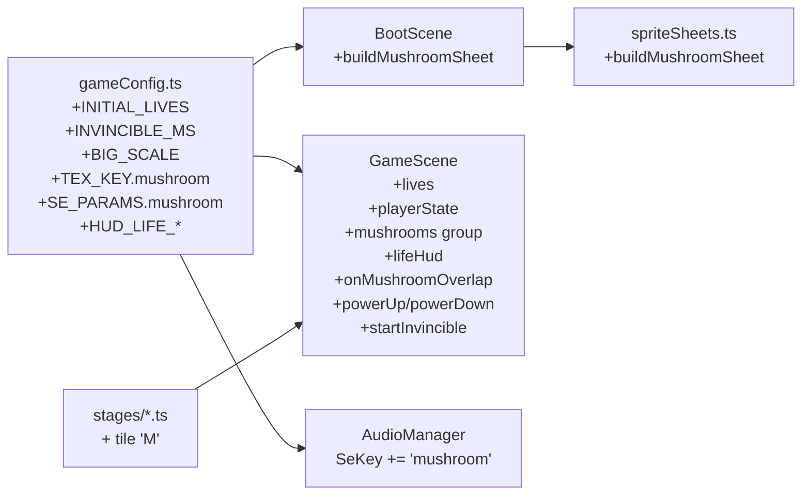
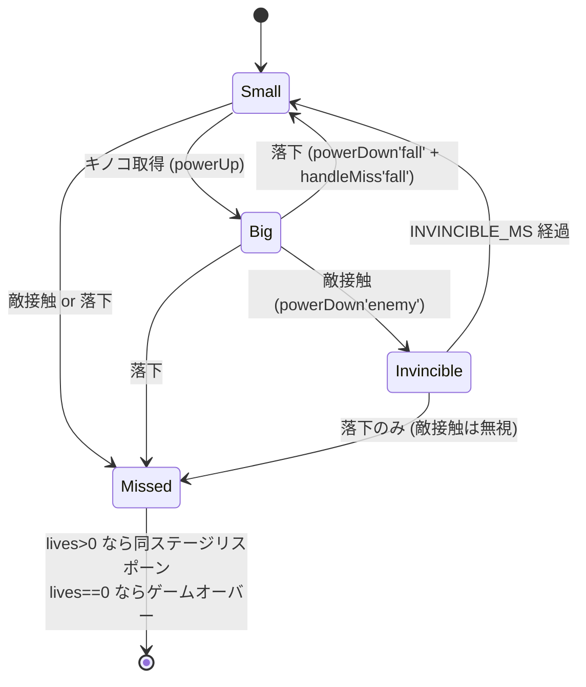
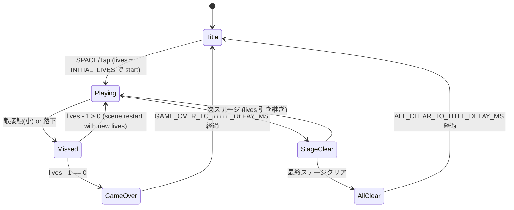

# 設計書: ライフ / パワーアップシステム

| 項目 | 内容 |
|------|------|
| 作成日 | 2026-05-05 |
| 担当 | バルベルデ（architecture-designer） |
| 関連要求 | `.steering/20260505-life-powerup/requirements.md` |

---

## 1. 概要

### 設計方針サマリ

- **目的**: 残機制（初期 3）と「キノコによる小→大変身」を導入し、ミスのコスト・パワーアップによる戦略性を生み出す。`v0.8` の「即リスポーン」体験を「ライフ管理ゲーム」へ昇格させる。
- **方式**:
  - ライフ数は `GameScene` の `init(data)` で受け渡す **シーン横断の値**。`{ stageIndex, lives }` 形式で `scene.restart` / `scene.start` 経由で伝播する。
  - プレイヤー状態は `'small' | 'big' | 'invincible'` の有限ステートマシンとして `GameScene` のフィールドで管理。
  - 無敵フレームは `time.delayedCall` + `tweens.add({ alpha })` 点滅 + `overlap` コールバック内のガードで実現（衝突自体は止めない）。
  - キノコスプライトは既存パターン踏襲で `BootScene` の `create()` 段階で `buildMushroomTexture()` により `addCanvas` テクスチャを生成。
- **最小スコープ厳守**: ファイアフラワー / スター / セーブデータ / コンティニュー機能 / ステージセレクトは本スプリント外。
- **既存資産は壊さない**:
  - `buildStage()` 既存バリデーション（P=1, G=1, E=1..8, C=1..30, spawn 左1/3, E 真下 # 必須）はそのまま温存。`M` の枝のみ追加。
  - `coinHud` / `stageHud` / `instructionText` の `setScrollFactor(0)` + `toWorldX/toWorldY` パターンを維持。
  - 既存 `onGoalHit`・`onCoinOverlap`・`onEnemyOverlap`・`fullRestart`・`transitionToStage`・`restartFromTop` のシグネチャは大きく変えず、内部のみ拡張。
- **ハードコーディング禁止**: 初期ライフ・無敵時間・点滅周期・キノコサイズ・大状態スケール・HUD 位置・SE 定義はすべて `src/config/gameConfig.ts` に集約。

### スコープ確定

| 項目 | 採用 |
|------|------|
| Q1: 「大」状態で落下した場合の扱い | **「大→小に戻してライフ −1」を採用**。落下は地形ミスで「敵接触」より重く、リスポーン後の救済として小に戻すのが自然。 |
| Q2: キノコ SE | **新規 `mushroom` を追加**。`coin` 流用は取得感が混ざるため不採用。短い上昇アルペジオを定義。 |
| Q3: キノコスプライトの色・サイズ | **赤い傘 + 白水玉 4 点 + ベージュ柄、32×32 px**（`TILE_SIZE` と同寸）。`BootScene` で `addCanvas` 生成。 |
| Q4: 各ステージのキノコ配置数・位置 | **stage01: 1 個 / stage02: 2 個 / stage03: 3 個** の漸増配置。詳細位置は §3.5 に明記。 |

---

## 2. アーキテクチャ図

### 2.1 シーンフロー（ライフ伝播）

```mermaid
sequenceDiagram
    participant Title as TitleScene
    participant Game as GameScene
    participant Boot as BootScene

    Title->>Game: scene.start('GameScene', { stageIndex: 0, lives: INITIAL_LIVES })
    Note over Game: init(data) で this.lives = data.lives ?? INITIAL_LIVES
    Game->>Game: ミス発生 → handleMiss()
    alt lives - 1 > 0
        Game->>Game: scene.restart({ stageIndex, lives: lives - 1 })
    else lives - 1 == 0
        Game->>Game: showGameOver()
        Game->>Title: scene.start('TitleScene') [delay 後]
    end
    Game->>Game: ステージクリア → transitionToStage(next)
    Note over Game: scene.restart({ stageIndex: next, lives: this.lives })
```

### 2.2 全体構成（差分のみ）



---

## 3. コンポーネント設計

### 3.1 `src/config/gameConfig.ts` への追加定数

| 定数名 | 型 | 値 | 用途 |
|--------|----|----|------|
| `INITIAL_LIVES` | `number` | `3` | ゲーム開始時のライフ数 |
| `MIN_LIVES` | `number` | `0` | ライフ下限（負数化防止のクランプ用） |
| `INVINCIBLE_MS` | `number` | `1500` | 大→小ダウングレード後の無敵時間（ms） |
| `INVINCIBLE_BLINK_MS` | `number` | `100` | 無敵中の点滅 1 周期（ms。`tweens.add` の duration） |
| `BIG_SCALE` | `number` | `1.5` | 「大」状態時の `setDisplaySize` 倍率 |
| `MUSHROOM_SPRITE_W` | `number` | `32` | キノコ表示幅（= `TILE_SIZE`） |
| `MUSHROOM_SPRITE_H` | `number` | `32` | キノコ表示高さ |
| `MUSHROOM_CAP_COLOR` | `number` | `0xe53935` | キノコ傘の赤 |
| `MUSHROOM_DOT_COLOR` | `number` | `0xffffff` | 傘の水玉白 |
| `MUSHROOM_STEM_COLOR` | `number` | `0xfff1c1` | 柄のベージュ |
| `MUSHROOM_STEM_DARK_COLOR` | `number` | `0xc9a96e` | 柄のシェード |
| `STAGE_MUSHROOM_MIN` | `number` | `0` | ステージあたり M タイル下限 |
| `STAGE_MUSHROOM_MAX` | `number` | `5` | ステージあたり M タイル上限 |
| `HUD_LIFE_LABEL` | `string` | `'ライフ'` | ライフ HUD ラベル |
| `HUD_LIFE_HEART` | `string` | `'♥'` | ハート文字（U+2665） |
| `HUD_LIFE_X` | `number` | `16` | ライフ HUD X（既存 HUD と同じ左寄せ） |
| `HUD_LIFE_Y` | `number` | `64` | ライフ HUD Y（STAGE=16, COIN=40 の下に配置） |
| `HUD_INSTRUCTION_Y` | `number` | `88` | 操作説明テキスト Y（既存 `HUD_COIN_Y + 24` のマジック解消も兼ねる） |
| `GAME_OVER_TEXT` | `string` | `'GAME OVER'` | ゲームオーバー画面のメインテキスト |
| `GAME_OVER_TO_TITLE_DELAY_MS` | `number` | `2500`（= `ALL_CLEAR_TO_TITLE_DELAY_MS` と同値） | ゲームオーバー → タイトル遷移の待機時間 |

加えて、既存の `TEX_KEY` と `SE_PARAMS` を以下のように拡張する。

```ts
// TEX_KEY 拡張
export const TEX_KEY = {
  playerSheet: 'player_sheet',
  ground: 'ground',
  goal: 'goal',
  enemySheet: 'enemy_sheet',
  coin: 'coin',
  mushroom: 'mushroom'   // ★追加
} as const;

// SE_PARAMS 拡張
export const SE_PARAMS: Record<'jump' | 'coin' | 'stomp' | 'miss' | 'goal' | 'mushroom', SeDefinition> = {
  // ... 既存 ...
  mushroom: {
    steps: [
      { freqStart: 523,  freqEnd: 523,  durationSec: 0.08, attackSec: 0.003, peakGain: 0.30, waveform: 'square', offsetSec: 0    },
      { freqStart: 659,  freqEnd: 659,  durationSec: 0.08, attackSec: 0.003, peakGain: 0.30, waveform: 'square', offsetSec: 0.08 },
      { freqStart: 784,  freqEnd: 784,  durationSec: 0.10, attackSec: 0.003, peakGain: 0.32, waveform: 'square', offsetSec: 0.16 },
      { freqStart: 1047, freqEnd: 1319, durationSec: 0.18, attackSec: 0.003, peakGain: 0.35, waveform: 'square', offsetSec: 0.26 }
    ]
  }
};
```

`AudioManager.SeKey` も同様に `'mushroom'` を追加する。

### 3.2 `GameScene` の変更点

#### 3.2.1 新規フィールド

| フィールド | 型 | 用途 |
|-----------|----|------|
| `lives` | `number` | 現在の残機。`init(data)` で設定。`handleMiss` で −1。 |
| `playerState` | `'small' \| 'big' \| 'invincible'` | プレイヤーの状態。状態遷移は §4.1 参照。 |
| `mushrooms` | `Phaser.Physics.Arcade.StaticGroup` | キノコグループ。`buildStage()` で構築。 |
| `lifeHud` | `Phaser.GameObjects.Text` | 「♥ × N」テキスト。 |
| `invincibleTimer` | `Phaser.Time.TimerEvent \| null` | 無敵終了用のタイマー（多重起動防止のため保持）。 |
| `blinkTween` | `Phaser.Tweens.Tween \| null` | 点滅 tween（無敵終了時に明示停止）。 |

#### 3.2.2 `init` シグネチャ拡張

```ts
init(data: { stageIndex?: number; lives?: number }): void {
  const resolved = getStage(data?.stageIndex ?? 0);
  this.stageIndex = resolved.index;
  this.stage = resolved.stage;
  // ライフ伝播: data.lives が未指定（タイトル → 初回 GameScene 起動時）なら INITIAL_LIVES。
  // 0 以下が来た場合のセーフティクランプ。
  this.lives = Math.max(MIN_LIVES, data?.lives ?? INITIAL_LIVES);
}
```

`TitleScene` 側からは `scene.start('GameScene', { stageIndex: 0, lives: INITIAL_LIVES })` を呼ぶよう変更（明示する）。

#### 3.2.3 改修メソッド

| 既存メソッド | 変更内容 |
|-------------|---------|
| `create()` | `playerState = 'small'` 初期化、ライフ HUD 追加、`mushrooms` を `built.mushrooms` から取得、`physics.add.overlap(this.player, this.mushrooms, this.onMushroomOverlap, ...)` 登録。 |
| `buildStage()` | 戻り値型 `BuiltStage` に `mushrooms: Phaser.Physics.Arcade.StaticGroup` を追加。`for` ループ内に `'M'` 分岐を追加し、`mushroomPositions` を収集。バリデーション（0..5）も追加。`buildMushrooms(positions)` を呼び出し。 |
| `onEnemyOverlap` | 状態分岐を導入。`isStomp` は従来通り。それ以外は `playerState === 'big'` なら `powerDown('enemy')`、`'invincible'` なら何もしない、`'small'` なら従来の `handleMiss('enemy')`。 |
| `handleMiss('fall')` | 「大」で落下した場合は `powerDown('fall')` 経由でサイズリセットしてからライフ −1。実装上は §4.1 の遷移に従う。 |
| `handleMiss('enemy')` | 「小」のときのみ呼ばれる経路に変更。共通のライフ減算 → ゲームオーバー判定処理を `decrementLifeAndContinue()` に切り出す。 |
| `fullRestart()` | `scene.restart({ stageIndex: this.stageIndex, lives: this.lives })` に変更（lives も渡す）。 |
| `transitionToStage(index)` | 同上。`scene.restart({ stageIndex: index, lives: this.lives })`。 |
| `restartFromTop()` | `scene.start('TitleScene')` のまま（タイトルからリスタートで lives は `INITIAL_LIVES` に戻る）。 |
| `updateHudPositions()` | `lifeHud.setPosition(toWorldX(HUD_LIFE_X), toWorldY(HUD_LIFE_Y))` を追加。`instructionText` を `HUD_INSTRUCTION_Y` 基準に変更。 |

#### 3.2.4 新規メソッド

```ts
// キノコ取得
private onMushroomOverlap: Phaser.Types.Physics.Arcade.ArcadePhysicsCallback = (_player, mush) => {
  if (this.isCleared || this.isMissed) return;
  (mush as Phaser.Physics.Arcade.Sprite).disableBody(true, true);
  this.audio.playSe('mushroom');
  this.powerUp();
};

// 小 → 大
private powerUp(): void {
  if (this.playerState !== 'small') return; // 大状態 / 無敵中の重ね取得は無視（消費だけする）
  this.playerState = 'big';
  this.player.setDisplaySize(PLAYER_SPRITE_W * BIG_SCALE, PLAYER_SPRITE_H * BIG_SCALE);
  // body サイズも合わせて更新（敵 overlap の判定面積も拡大）
  this.player.body!.setSize(PLAYER_SPRITE_W * BIG_SCALE, PLAYER_SPRITE_H * BIG_SCALE);
}

// 大 → 小（敵接触 or 落下からの呼び出し）
private powerDown(reason: 'enemy' | 'fall'): void {
  this.playerState = 'invincible';
  this.player.setDisplaySize(PLAYER_SPRITE_W, PLAYER_SPRITE_H);
  this.player.body!.setSize(PLAYER_SPRITE_W, PLAYER_SPRITE_H);
  if (reason === 'enemy') {
    this.startInvincible(); // 無敵フレーム + 点滅
  }
  if (reason === 'fall') {
    // 落下は handleMiss 側でライフ −1 まで進む
  }
}

// 無敵フレーム + 点滅
private startInvincible(): void {
  // 既存タイマー / tween があれば停止
  this.invincibleTimer?.remove(false);
  this.blinkTween?.stop();
  this.player.setAlpha(1);

  this.blinkTween = this.tweens.add({
    targets: this.player,
    alpha: 0.3,
    duration: INVINCIBLE_BLINK_MS,
    yoyo: true,
    repeat: -1
  });

  this.invincibleTimer = this.time.delayedCall(INVINCIBLE_MS, () => {
    this.blinkTween?.stop();
    this.blinkTween = null;
    this.player.setAlpha(1);
    this.playerState = 'small';
    this.invincibleTimer = null;
  });
}

// ライフ −1 → 続行 or ゲームオーバー
private decrementLifeAndContinue(): void {
  this.lives = Math.max(MIN_LIVES, this.lives - 1);
  this.refreshLifeHud();
  if (this.lives <= 0) {
    this.showGameOver();
  } else {
    // 既存 fullRestart 経路（MISS_FLASH_MS 後）
    this.time.delayedCall(MISS_FLASH_MS, () => this.fullRestart(), [], this);
  }
}

// ゲームオーバー画面
private showGameOver(): void {
  this.add
    .text(this.scale.width / 2, this.scale.height / 2, GAME_OVER_TEXT, {
      fontFamily: 'system-ui, sans-serif',
      fontSize: '64px',
      color: '#ff3030',
      stroke: '#000000',
      strokeThickness: 8,
      align: 'center'
    })
    .setOrigin(0.5)
    .setScrollFactor(0);
  this.audio.stopBgm(BGM_FADE_OUT_MS);
  this.time.delayedCall(GAME_OVER_TO_TITLE_DELAY_MS, () => this.scene.start('TitleScene'), [], this);
}

// ライフ HUD
private formatLifeHud(): string {
  return `${HUD_LIFE_LABEL}: ${HUD_LIFE_HEART} × ${this.lives}`;
}
private refreshLifeHud(): void {
  this.lifeHud.setText(this.formatLifeHud());
}
```

#### 3.2.5 `handleMiss` の再構成（要点）

```ts
private handleMiss(reason: 'fall' | 'enemy'): void {
  if (this.isMissed || this.isCleared) return;

  // 大 + 敵: 小に戻すだけ。ライフ減らさない・isMissed にしない。
  if (reason === 'enemy' && this.playerState === 'big') {
    this.powerDown('enemy');
    this.audio.playSe('stomp'); // または専用「ダメージ」SE。本スプリントは stomp 流用で許容。
    return;
  }
  // 無敵中の敵接触は完全無視（onEnemyOverlap 側で早期 return するため通常は到達しない）
  if (reason === 'enemy' && this.playerState === 'invincible') return;

  // それ以外（小+敵 / 大+落下 / 小+落下）はミス確定
  this.isMissed = true;
  if (this.playerState === 'big') {
    // 落下時はサイズだけ戻す（点滅は不要 — どうせリスポーンする）
    this.player.setDisplaySize(PLAYER_SPRITE_W, PLAYER_SPRITE_H);
    this.player.body!.setSize(PLAYER_SPRITE_W, PLAYER_SPRITE_H);
    this.playerState = 'small';
  }
  this.audio.playSe('miss');
  this.player.setTint(MISS_FLASH_COLOR);
  this.player.setVelocity(0, 0);
  this.decrementLifeAndContinue();
}
```

### 3.3 `BootScene` / `spriteSheets.ts` の変更点

- `spriteSheets.ts` に `buildMushroomSheet(scene)` を追加。`addCanvas` で 32×32 px の単一フレームテクスチャを生成。
- `BootScene.create()` で `buildPlayerSheet`・`buildEnemySheet` の隣に `buildMushroomSheet(this)` を追加。

```ts
// spriteSheets.ts: 追加分（要点のみ）
export function buildMushroomSheet(scene: Phaser.Scene): void {
  if (scene.textures.exists(TEX_KEY.mushroom)) return;
  const W = MUSHROOM_SPRITE_W; // 32
  const H = MUSHROOM_SPRITE_H; // 32
  const canvas = document.createElement('canvas');
  canvas.width = W;
  canvas.height = H;
  const ctx = canvas.getContext('2d');
  if (!ctx) throw new Error('canvas 2d context unavailable');

  // 柄（下半分の中央矩形）
  ctx.fillStyle = toHex(MUSHROOM_STEM_COLOR);
  ctx.fillRect(10, 18, 12, 12);
  ctx.fillStyle = toHex(MUSHROOM_STEM_DARK_COLOR);
  ctx.fillRect(10, 27, 12, 3);

  // 傘（上半分のドーム = 段階的に幅を広げた矩形 3 段）
  ctx.fillStyle = toHex(MUSHROOM_CAP_COLOR);
  ctx.fillRect(6, 12, 20, 6);
  ctx.fillRect(4, 8, 24, 4);
  ctx.fillRect(8, 4, 16, 4);

  // 水玉（白）
  ctx.fillStyle = toHex(MUSHROOM_DOT_COLOR);
  ctx.fillRect(8, 10, 4, 4);
  ctx.fillRect(20, 10, 4, 4);
  ctx.fillRect(14, 6, 4, 4);
  ctx.fillRect(13, 14, 6, 3);

  if (!scene.textures.addCanvas(TEX_KEY.mushroom, canvas)) {
    throw new Error(`Failed to create texture: ${TEX_KEY.mushroom}`);
  }
}
```

### 3.4 `StageDefinition` / `buildStage()` の拡張

- `TileChar` の union に `'M'` を追加: `'.' | '#' | 'P' | 'G' | 'E' | 'C' | 'M'`
- `buildStage()` のタイル走査に分岐を追加:
  ```ts
  } else if (ch === 'M') {
    mushroomPositions.push({ col: c, row: r });
  } else if (ch !== '.' && ch !== '#') { ... }
  ```
- バリデーション追加（`STAGE_MUSHROOM_MIN..STAGE_MUSHROOM_MAX`）:
  ```ts
  if (mushroomPositions.length < STAGE_MUSHROOM_MIN || mushroomPositions.length > STAGE_MUSHROOM_MAX) {
    throw new Error(`Stage ${def.id}: 'M' count must be ${STAGE_MUSHROOM_MIN}..${STAGE_MUSHROOM_MAX} (got ${mushroomPositions.length})`);
  }
  ```
- `buildMushrooms(positions)` メソッドを新設（コインと同じくタイル中心配置）。
- `BuiltStage.mushrooms: Phaser.Physics.Arcade.StaticGroup` をフィールド追加。

### 3.5 各ステージへのキノコ配置（レベルデザイン）

**設計原則**: 「危険地帯の手前」「クリアに必須でない」「取ると先の難所が楽になる」位置に置く。

#### stage01（cols=120, 1 個）

- **(col=33, row=15)**: 低段ジャンプ（col=35-38）の手前。床の上、敵 (col=22, 45) の中間。
- 既存タイル `..P..C.C.C............E............####......E..............E.............................E....C........................` の row=15 を以下に変更:
  - `..P..C.C.C............E.........M.####......E..............E.............................E....C........................`

#### stage02（cols=140, 2 個）

- **(col=18, row=15)**: 序盤の床上、敵 (col=11) の直後。
- **(col=98, row=14)**: 中盤の空中足場 (####, col=98-101 row=13) の上面。ジャンプで取りに行く配置。
- row=15 修正: `##P##CCCC#####################....##############################################....##########################....##########################`
  - col=18 を空きにできないので **row=14 の対応列**にキノコを置く。`...........E.................................E......................E...............................E...................E................G..` の col=18 を `M` に置換 → `...........E......M.........................E......................E...............................E...................E................G..`
- row=12 の col=98 上にキノコを浮かせる代わり、足場上面（row=12 の col=98 直上の row=12）が空中になるため、**row=12 の `M` 配置**にする（足場 row=13 の真上 = row=12 のセル）。
- 配置 2 箇所合計、`STAGE_MUSHROOM_MAX=5` 内。

#### stage03（cols=160, 3 個）

- **(col=20, row=15)**: 序盤の床上、敵 (col=10) の直後。
- **(col=83, row=11)**: 中盤の空中足場 (####, col=85-90 row=10) 直前の足場上。
- **(col=140, row=15)**: 終盤、ゴール手前の床上。最後の敵 (col=141 周辺) を「大」状態で乗り切るための救済。
- 配置 3 箇所合計、`STAGE_MUSHROOM_MAX=5` 内。

> **注**: 上記のセル番号は設計時の指標であり、実装時にステージの既存タイル（`#`/`E`/`C`/`G`）と衝突しないよう、`buildStage()` のバリデーションを通せる位置にエンバペが微調整可能とする。

---

## 4. 状態遷移

### 4.1 プレイヤー状態（`playerState`）



**重要な不変条件**:

- `Invincible` 中の敵 `overlap` コールバックは早期 return（ライフ・状態に副作用なし）。stomp 判定だけは通常通り通過させる（敵を踏める）。
- `Big` 状態の `body` サイズも `BIG_SCALE` 倍にして、stomp 判定面積を視覚と一致させる。
- 状態遷移と `isMissed`/`isCleared` フラグは直交。`isMissed` 中はそもそも `update()` の入力受付・`overlap` を全部止める（既存挙動）。

### 4.2 ゲームフロー（ライフ視点）



---

## 5. プロトコル / データ構造

### 5.1 `init` ペイロード

| キー | 型 | 必須 | 範囲 | 用途 |
|------|----|----|----|------|
| `stageIndex` | `number` | 任意 | `0 <= n < STAGES.length` | 開始ステージ番号 |
| `lives` | `number` | 任意 | `0 <= n` | 残機。未指定時は `INITIAL_LIVES` |

**バリデーション**: `init` 内で `Math.max(MIN_LIVES, data?.lives ?? INITIAL_LIVES)` のクランプを必須化。負数注入されてもゲームオーバー直行で済む。

### 5.2 ステージタイル仕様（拡張）

| タイル | 意味 | 制約 |
|--------|------|------|
| `.` | 空 | — |
| `#` | 地面 | — |
| `P` | スポーン | 1 個必須・左 1/3 内 |
| `G` | ゴール | 1 個必須 |
| `E` | 敵 | 1..8 個・真下 `#` 必須 |
| `C` | コイン | 1..30 個 |
| `M` | キノコ | **0..5 個（新規）** |

---

## 6. エラーハンドリング

| シナリオ | 挙動 |
|---------|------|
| `data.lives` に負数 / NaN が来る | `init` で `Math.max(0, ...)` クランプ → 0 ならゲームオーバー直行 |
| `STAGES` に `M` 6 個以上のステージが混入 | `buildStage()` バリデーションで例外 → 開発時に検知 |
| キノコ取得後すぐ別キノコに触れる | `playerState !== 'small'` で `powerUp()` を no-op（消費はする） |
| 大状態で複数敵に同フレーム接触 | `powerDown('enemy')` で `playerState='invincible'` 即座セット → 後続 overlap は早期 return |
| 無敵中にゴール到達 | `isCleared = true` で blink tween は表示残るが、`shutdown` 時に scene 全体が片付くため放置で OK |
| `shutdown` 時に `invincibleTimer`・`blinkTween` が残存 | `events.once('shutdown', ...)` で `invincibleTimer?.remove(false)`・`blinkTween?.stop()` を明示クリーンアップ |

---

## 7. 影響範囲

### 7.1 変更/新規ファイル

| ファイル | 種別 | 内容 |
|---------|------|------|
| `src/config/gameConfig.ts` | 変更 | §3.1 の定数追加。`TEX_KEY.mushroom`・`SE_PARAMS.mushroom`・SeKey union 拡張。`HUD_INSTRUCTION_Y` を導入してマジック解消。 |
| `src/scenes/spriteSheets.ts` | 変更 | `buildMushroomSheet()` を追加。`toHex` は既存利用。 |
| `src/scenes/BootScene.ts` | 変更 | `create()` に `buildMushroomSheet(this)` を追加。 |
| `src/scenes/GameScene.ts` | 変更 | フィールド追加・`init` 拡張・`buildStage` 拡張・`onMushroomOverlap`・`powerUp/powerDown/startInvincible/decrementLifeAndContinue/showGameOver/formatLifeHud/refreshLifeHud` 追加・`onEnemyOverlap`・`handleMiss`・`fullRestart`・`transitionToStage`・`updateHudPositions` 改修。 |
| `src/scenes/TitleScene.ts` | 変更 | `scene.start('GameScene', { stageIndex: 0, lives: INITIAL_LIVES })` を明示。 |
| `src/audio/AudioManager.ts` | 変更 | `SeKey` の union に `'mushroom'` を追加。 |
| `src/stages/stage01.ts` | 変更 | row=15 に `M` を 1 個追加。 |
| `src/stages/stage02.ts` | 変更 | `M` を 2 個追加。 |
| `src/stages/stage03.ts` | 変更 | `M` を 3 個追加。 |
| `src/stages/index.ts` | 変更 | `TileChar` の union 拡張 export（型の伝播）。 |

### 7.2 既存機能への影響

| 機能 | 影響 | 緩和策 |
|------|------|------|
| 3 ステージ進行 | **軽微**（lives 引き継ぎが追加されるが、stageIndex の伝播は不変） | `transitionToStage` の `scene.restart` 引数に `lives` を追加するのみ |
| BGM/SE | **軽微**（`mushroom` SE 追加） | 既存 BGM スケジュールには手を入れない |
| タッチ操作 | **影響なし** | — |
| タイトル画面 | **軽微**（`GameScene` 起動時のペイロード変更） | 既存呼び出し箇所を 1 箇所更新するだけ |
| HUD 表示 | **中**（行が 1 行増える + Y 座標再配置） | `updateHudPositions` を一括更新。マジック数値は定数化 |
| ハードリロード経路（`USE_HARD_RELOAD_FALLBACK`） | **軽微**（lives が sessionStorage 経由で保存されない） | 本スプリントでは扱わない（要求書スコープ外）。`USE_HARD_RELOAD_FALLBACK = false` のままで運用。**decisions.md に明記**。 |

---

## 8. 受け入れ条件の検証方法

| 受け入れ条件 | 検証方法 |
|-------------|---------|
| ライフ = 3 で開始、HUD に「♥ × 3」表示 | タイトル → ゲーム遷移直後に左上 HUD を目視確認 |
| ミスのたびにライフ −1、HUD リアルタイム更新 | 落下 → リスポーン後に「♥ × 2」を目視 |
| ライフ 0 で GAME OVER → タイトル | 3 連続ミスで GAME OVER 表示・`GAME_OVER_TO_TITLE_DELAY_MS` 後にタイトル復帰 |
| ステージ間ライフ引き継ぎ | stage1 で 1 回ミス → stage1 クリア → stage2 で HUD「♥ × 2」表示 |
| キノコ取得で「大」状態 + SE 再生 | キノコに触れて見た目 1.5 倍 + `mushroom` SE 鳴動 |
| 大 + 敵接触で小に戻る、ライフ減らない | 大状態で敵に触れて HUD ライフ不変・サイズ縮小 |
| 無敵中の点滅・多重ダメージなし | 大→小移行直後に再度敵に触れてもライフ不変・点滅中 |
| 落下はライフ −1（大小問わず） | 大状態で奈落落下 → ライフ −1 + サイズ初期化 |
| 既存機能維持 | `npm run build` 成功 / 3 ステージ通しプレイで BGM・SE・タッチ・タイトル動作確認 |
| ビルド成功 | `npm run build` で TypeScript エラー 0 |
| クルトワレビュー Critical/High なし | コミット前にクルトワへ依頼 |

---

## 9. 設計品質チェック

- **セキュリティ**:
  - `init.data` のライフ値を `Math.max(0, ...)` でクランプ → 負数注入による無限プレイ防止。
  - ステージタイル `M` のバリデーションは既存の `buildStage()` パターンに統合 → エラーは開発時に確実に検知。
  - 外部入力・URL・ストレージ書き込みなし。XSS/Injection 経路の新規追加はゼロ。
  - ハードコーディング集約原則を厳守（§3.1 の表）。クルトワレビュー観点もここで満たす。
- **テスタビリティ**:
  - `playerState` の状態遷移を `powerUp` / `powerDown` / `startInvincible` の 3 メソッドに分離 → ユニットテスト容易（GameScene を mock してメソッド単体検証可能）。
  - `decrementLifeAndContinue` を切り出すことで「ライフ −1 → ゲームオーバー判定」の分岐をテストしやすくする。
  - キノコ配置数のバリデーションは例外スローなので Vitest で `expect().toThrow()` テスト可能。
- **モジュール性**:
  - 既存 `coin` 系（`buildCoins`, `onCoinOverlap`）と完全並行な構造を `mushroom` でも採用 → 将来のファイアフラワー追加時にも同じパターンで拡張可能。
  - `gameConfig.ts` への定数集約により、レベルデザイン調整（無敵時間・スケール）はコード本体無改修で可能。
- **コスト効率**:
  - 追加ライブラリ 0。Phaser 3.80 既存 API のみ。
  - キノコテクスチャは 32×32 px の生成画像 1 枚。GPU テクスチャアトラスへの影響は無視できる範囲。
- **保守性**:
  - `BuiltStage` 型を拡張するだけで、`create()` 側の組み立てロジックは表現が均一。
  - `playerState` の文字列リテラル union 型なので、TypeScript が分岐網羅性を強制。
- **可観測性**:
  - 既存 `console.warn`（`getStage` の不正 index）と同じ温度で、`buildStage()` のバリデーションエラーは throw により早期発見。
  - ライフ・状態遷移は HUD で常時可視化されるためログ追加は不要。

---

## 10. リスクと緩和策

| # | リスク | 影響度 | 緩和策 |
|---|-------|------|------|
| R1 | 「大」状態で `body.setSize` を変えると地面 collider が引っかかる | 中 | `setDisplaySize` と同時に `body.setSize` し、`refreshBody` 不要（dynamic body）。実装時にエンバペが stage01 で踏破確認 |
| R2 | 無敵中に他のキノコに触れて取り損ねる | 低 | `powerUp` は `playerState === 'small'` の時のみ有効。invincible 中はキノコを消費せずスキップにするか、消費するが状態は据え置きにするかを実装時に最終決定（**設計上は「消費するが state 据え置き」**：単純化のため） |
| R3 | `tweens.add({ alpha, yoyo, repeat: -1 })` を `stop()` 前にシーン破棄するとリーク | 低 | `events.once('shutdown', ...)` でクリーンアップを保証 |
| R4 | TitleScene からの再起動時に lives が古い値を引きずる | 中 | `restartFromTop` / `scene.start('TitleScene')` 経由では lives を **渡さない**（next start で `INITIAL_LIVES` がデフォルトとして使われる）。これを `init` のデフォルト値で確実化 |
| R5 | Scale.RESIZE + ズーム時の lifeHud 位置ずれ | 低 | 既存の `toWorldX/toWorldY` パターンを踏襲（`setScrollFactor(0)` ＋逆変換）|

---

## 11. 未確定事項（残）

| # | 項目 | 内容 | トリガ |
|---|------|------|--------|
| Q5 | キノコの「大→小」移行時の SE | 現状 `stomp` 流用。違和感あれば `mushroom_down` を新設 | 実装後のプレイテストでシャビ判断 |
| Q6 | ゲームオーバー時に BGM をフェード or 即停 | 現状 `BGM_FADE_OUT_MS` フェード採用 | プレイテストで「やられた感」が弱ければ即停に変更 |
| Q7 | キノコ取得時の演出（短い拡大エフェクト等） | スコープ外。`setDisplaySize` 即時切替 | 不評なら次スプリントで `tween` 拡大演出を追加 |

---

作成: バルベルデ / 2026-05-05
