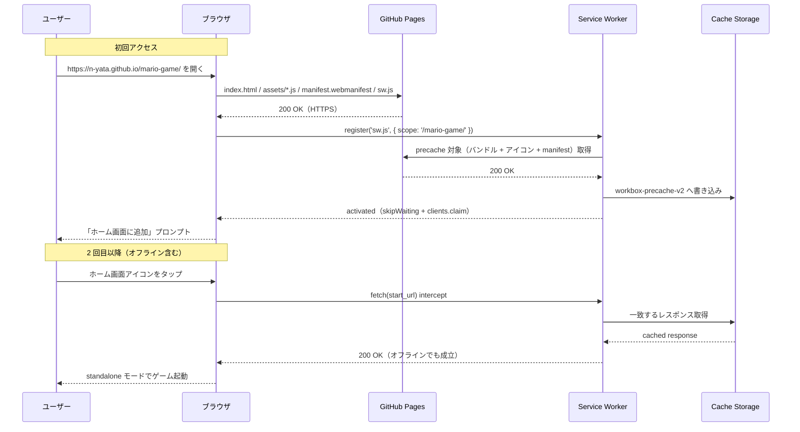
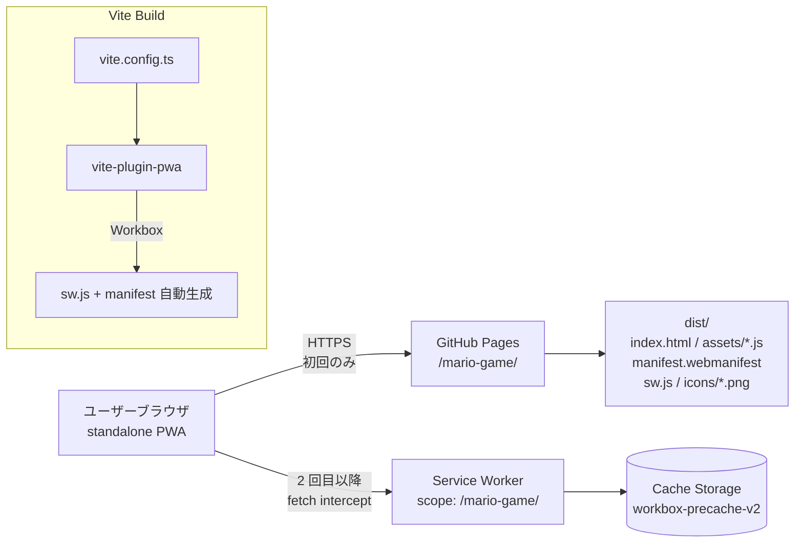
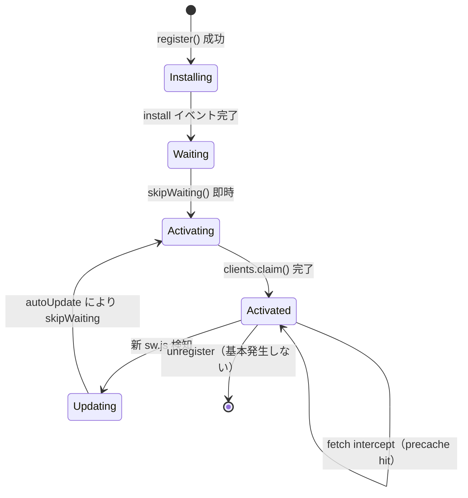

# 設計書: PWA 対応

| 項目 | 内容 |
|------|------|
| 作成日 | 2026-05-05 |
| 担当 | バルベルデ（architecture-designer） |
| 関連要求 | `.steering/20260505-pwa/requirements.md` |

---

## 1. 概要

### 設計方針サマリ

- **目的**: GitHub Pages 配信の mario-game を PWA 化し、Lighthouse PWA 全項目 Pass / Android Chrome のインストールプロンプト表示 / 機内モードでの全 3 ステージプレイを達成する。
- **方式**: `vite-plugin-pwa`（Workbox ベース）を採用し、Web App Manifest と Service Worker を Vite ビルドパイプラインで生成する。アイコンは外部依存ゼロを保つため Node スクリプト（`node-canvas` 系不使用）から PNG を生成し `public/icons/` に静的配置する。
- **最小スコープ厳守**: プッシュ通知 / Background Sync / 更新通知 UI / アイコン凝りデザインは今回スコープ外。SW は Precache のみ（Runtime Cache なし、外部 URL 取得なし）。
- **既存資産は壊さない**: Phaser シーン構成・Scale.RESIZE・タッチ操作・data URI 埋め込みスプライト・Web Audio API 合成 BGM/SE は一切変更しない。`vite.config.ts` の `base` 取り扱いは現状を踏襲する。
- **ハードコーディング禁止**: base path は `process.env.VITE_BASE_PATH ?? '/'` を `vite-plugin-pwa` にも引き渡し、manifest の `start_url` / `scope` / SW スコープが自動で `/mario-game/` に解決されるようにする。リポジトリ名はワークフロー側 (`${{ github.event.repository.name }}`) のまま。

### スコープ確定

| 項目 | 採用 |
|------|------|
| Q1: SW 実装方式 | **A. `vite-plugin-pwa` (Workbox)** — Vite の base path / バンドル名ハッシュを自動で吸収し precache manifest を生成。手書きより事故率が圧倒的に低い |
| Q2: アイコン調達方法 | **A. Node スクリプトでプログラム生成（依存追加なし）** — `pngjs` も使わず、最小 PNG をバイナリ手書きするか、ビルド時に Phaser 不要の Pure TS で `Buffer` 経由生成。Kenney 流用は今回スコープ外（ライセンス確認コスト回避） |
| Q3: SW キャッシュ戦略 | **A. Precache のみ（Workbox `generateSW` の precacheAndRoute）** — バックエンド/CDN なし・全アセット同一オリジンのため Runtime Cache 不要 |
| Q4: GitHub Pages サブパス対応 | **A. `vite-plugin-pwa` に Vite の `base` を引き継がせる + manifest の `start_url`/`scope` を `'./'` 相対 + SW 登録時 `scope: import.meta.env.BASE_URL`** — base path をコード上で 1 箇所に集約 |

---

## 2. アーキテクチャ図

### 2.1 シーケンス図（インストール → オフライン起動）



### 2.2 全体システム構成（更新版）



---

## 3. コンポーネント設計

### 3.1 ビルド設定 — `vite.config.ts`

| 関数/設定 | 責務 |
|-----------|------|
| `defineConfig` | 既存の base / server / build を維持 |
| `VitePWA({ ... })` | manifest / SW / precache manifest を一括生成 |
| `registerType: 'autoUpdate'` | 新バージョン公開時に skipWaiting + clients.claim で即時切替 |
| `injectRegister: 'auto'` | index.html に SW 登録スクリプトを自動注入（手書き不要） |
| `workbox.globPatterns` | `**/*.{js,css,html,png,ico,svg,webmanifest}` を precache 対象に |
| `workbox.navigateFallback` | `index.html`（SPA フォールバック、Phaser はルーティング無しだが将来安全） |
| `manifest.start_url` | `'.'` または `import.meta.env.BASE_URL` — Vite の base が前置 |
| `manifest.scope` | `'.'` （base 相対）→ ビルド後は `/mario-game/` |

**設計上の重要点**

- `vite-plugin-pwa` は Vite の `base` 設定を読み取り、`manifest.webmanifest` の `start_url` / `scope` / `icons[].src` を **自動的に base path 付きの絶対パス** に書き換えてくれる。これがサブパス Hosting 採用の最大の理由。
- `injectRegister: 'auto'` を選ぶと `<head>` に SW 登録 script が自動注入される。手書きで `navigator.serviceWorker.register('/mario-game/sw.js')` を書くとサブパスを誤りやすいため避ける。
- `registerType: 'autoUpdate'` は更新時に **ユーザー操作なしで** 新 SW がアクティブ化される。今回はゲーム単体・状態保存なしのため許容。`prompt` 方式（更新通知 UI）は今回不要。
- `workbox.cleanupOutdatedCaches: true` で旧バージョン cache を確実に破棄する。
- `devOptions.enabled: false`（既定）— 開発時は SW を有効化しない（ビルド成果物のみで検証）。

### 3.2 アイコン生成スクリプト — `scripts/generate-icons.mjs`（新規）

```js
// 192/512/maskable の 3 種を Pure Node で生成
// Canvas / sharp / pngjs などの追加依存なし
// 単純な単色背景 + 中央 'M' 文字 / マリオ風カラー（赤背景・白文字）
// PNG は Buffer 操作で minimal 8-bit RGBA を構築

import { writeFile, mkdir } from 'node:fs/promises';
import { join } from 'node:path';

interface IconSpec {
  size: number;      // 192 | 512
  filename: string;  // 'icon-192.png' | 'icon-512.png' | 'icon-maskable-512.png'
  maskable: boolean; // true なら safe zone（中央 80%）に図柄を収める
}

async function generatePng(spec: IconSpec): Promise<Buffer> {
  // 1. RGBA バイト列を生成（赤背景 #E52521 + 白い 'M' のドット絵）
  // 2. PNG シグネチャ + IHDR + IDAT(zlib) + IEND をバイナリで書き出す
  // 3. Node 標準 zlib のみ使用（追加依存ゼロ）
}

async function main() {
  await mkdir(new URL('../public/icons/', import.meta.url), { recursive: true });
  const specs = [
    { size: 192, filename: 'icon-192.png', maskable: false },
    { size: 512, filename: 'icon-512.png', maskable: false },
    { size: 512, filename: 'icon-maskable-512.png', maskable: true },
  ];
  for (const s of specs) {
    const buf = await generatePng(s);
    await writeFile(join('public/icons', s.filename), buf);
  }
}
main();
```

**設計上の重要点**

- アイコンは `public/icons/*.png` に **コミットして** 配置する（ビルド時生成にしない）。理由: GitHub Actions ビルドの再現性確保 / ジェネレータ起動失敗時の影響をローカルに閉じる / `vite-plugin-pwa` の precache スキャンに確実にヒットさせる。
- 生成スクリプトは `npm run generate-icons` として `package.json` に追加するが、CI では実行しない。シャビ / バルベルデが手元で 1 回回せば良い。
- 追加依存ゼロ。Node 標準の `zlib` で deflate するだけで PNG は構築可能。コードはシンプルなドット絵パターンのため可読性も保てる。
- maskable アイコンは Android のアダプティブアイコン用。中央 80% safe zone を確保。

### 3.3 SW 登録 — `index.html` / `src/main.ts`（変更最小）

`vite-plugin-pwa` の `injectRegister: 'auto'` により、ビルド後の `index.html` に以下相当のコードが自動注入される（**手で書かない**）。

```ts
// vite-plugin-pwa が自動生成する登録コード（イメージ）
if ('serviceWorker' in navigator) {
  window.addEventListener('load', () => {
    navigator.serviceWorker.register(
      `${import.meta.env.BASE_URL}sw.js`,
      { scope: import.meta.env.BASE_URL }
    ).catch((err) => {
      // 登録失敗してもゲーム本体は動作する
      console.warn('SW register failed:', err);
    });
  });
}
```

**設計上の重要点**

- 登録コードは `vite-plugin-pwa` 任せ。`src/main.ts` はゲーム初期化だけに専念し、SW 関連コードを混ぜない（責務分離 / テスタビリティ）。
- 登録失敗は `.catch()` で握りつぶす（既存ナレッジ: SW 不在でもゲームは動かなければならない）。
- iOS Safari は `beforeinstallprompt` 非対応のため、独自プロンプト UI は実装しない（要件 3.2「含まないもの」と整合）。

### 3.4 既存処理の改造ポイント

| 既存処理 | 変更 |
|---------|------|
| `vite.config.ts` | `vite-plugin-pwa` 追加 / 既存 `base` 設定はそのまま |
| `index.html` | `<link rel="manifest">` と `<meta name="theme-color">` の追加 / SW 登録 script は plugin が自動注入 |
| `src/main.ts` | **変更なし**（既知ナレッジ厳守 — Phaser 初期化に SW を混入させない） |
| `src/scenes/*` | **変更なし** |
| `package.json` | devDependencies に `vite-plugin-pwa` 追加 / `generate-icons` script 追加 |
| `.github/workflows/deploy.yml` | **変更なし**（`VITE_BASE_PATH` で base が plugin に伝わる） |

---

## 4. プロトコル / データ構造設計

### 4.1 manifest.webmanifest（plugin 生成、設計値）

| キー | 値 | 備考 |
|------|----|------|
| `name` | `"mario-game"` | フル名 |
| `short_name` | `"mario-game"` | 12 文字以内推奨 |
| `description` | `"Browser-based 2D side-scrolling platformer."` | |
| `lang` | `"ja"` | |
| `start_url` | `"."` → ビルド後 `"/mario-game/"` | plugin が base 解決 |
| `scope` | `"."` → ビルド後 `"/mario-game/"` | plugin が base 解決 |
| `display` | `"standalone"` | ブラウザ UI 非表示 |
| `orientation` | `"any"` | Scale.RESIZE と整合 |
| `theme_color` | `"#000000"` | index.html の背景色と一致 |
| `background_color` | `"#000000"` | スプラッシュ背景 |
| `icons` | 192 / 512 / maskable-512 の 3 件 | `purpose: "any"` / `"maskable"` |

### 4.2 Workbox 生成 sw.js の precache 対象

ビルド成果物のうち以下を precache する（`globPatterns` で指定）:

| パターン | 対象例 | 理由 |
|----------|--------|------|
| `index.html` | エントリ HTML | navigateFallback に必須 |
| `assets/*.js` | バンドル JS（data URI 画像 / Phaser 含む） | コア実行コード |
| `assets/*.css` | （将来） | 念のため |
| `icons/*.png` | アプリアイコン 3 種 | manifest 参照先 |
| `manifest.webmanifest` | plugin 生成 | iOS のホーム画面追加で参照 |

`maximumFileSizeToCacheInBytes`: 既定 2 MiB のままで OK（バンドル ~1.5 MB）。万が一超えたら明示的に 4 MiB へ上げる（環境変数化はしない、Workbox 設定で完結）。

### 4.3 ペイロード上限 / 設定値

| 項目 | 値 | 集約先 |
|------|----|-----|
| base path | `'/mario-game/'`（CI）/ `'/'`（local） | `process.env.VITE_BASE_PATH` （`vite.config.ts` で参照） |
| Workbox max cache file size | 2 MiB（既定） | `vite.config.ts` の `VitePWA.workbox.maximumFileSizeToCacheInBytes` |
| precache glob | `**/*.{js,css,html,png,ico,svg,webmanifest}` | `vite.config.ts` の `VitePWA.workbox.globPatterns` |

> ハードコーディング集約原則: base path 系は `vite.config.ts` の 1 箇所のみ。manifest / SW のスコープは plugin が自動派生。

---

## 5. 状態遷移（SW ライフサイクル）



---

## 6. エラーハンドリング

| シナリオ | SW / Workbox 側挙動 | フロントエンド側挙動 |
|---------|---------------------|---------------------|
| SW 登録失敗（HTTPS でない / ブラウザ非対応） | register() reject | `.catch()` で握りつぶし、ゲームは通常起動 |
| Precache 失敗（ネット不通で初回） | install イベント reject → SW 未アクティブ | 通常の HTTP リクエストでゲーム起動（degrade gracefully） |
| Cache Storage クォータ超過 | Workbox が古いキャッシュを削除 | 影響なし |
| 新バージョンデプロイ後の差分 | autoUpdate で skipWaiting → 次回ロード時に新バージョン適用 | ユーザー通知なし（要件と整合） |
| iOS Safari の install プロンプト | 発火しない（仕様） | 「共有 → ホーム画面に追加」を README で案内 |

**タイムアウト値**: 設定なし（Precache のみ・外部通信なし）。

---

## 7. データモデル / DB 設計

該当なし（バックエンド・DB なし方針を維持）。

---

## 8. 影響範囲

### 8.1 変更/新規ファイル

| ファイル | 種別 | 内容 |
|---------|------|------|
| `vite.config.ts` | 変更 | `vite-plugin-pwa` を import / `VitePWA(...)` を `plugins` に追加 |
| `index.html` | 変更 | `<link rel="manifest">` と `<meta name="theme-color">` 追加 / CSP は変更なし（後述） |
| `package.json` | 変更 | `devDependencies.vite-plugin-pwa` 追加 / `scripts.generate-icons` 追加 |
| `package-lock.json` | 変更 | `npm install` で自動更新 |
| `scripts/generate-icons.mjs` | 新規 | アイコン PNG 生成（Node 標準のみ） |
| `public/icons/icon-192.png` | 新規 | 192×192 アイコン |
| `public/icons/icon-512.png` | 新規 | 512×512 アイコン |
| `public/icons/icon-maskable-512.png` | 新規 | maskable 512×512 |
| `dist/manifest.webmanifest` | ビルド成果物 | plugin 自動生成 |
| `dist/sw.js` | ビルド成果物 | plugin 自動生成 |
| `dist/workbox-*.js` | ビルド成果物 | plugin 自動生成 |
| `.github/workflows/deploy.yml` | **変更なし** | `VITE_BASE_PATH` 経由で plugin に base 伝達済み |
| `src/**/*.ts` | **変更なし** | ゲームロジックは無傷 |

### 8.2 既存機能への影響

| 機能 | 影響 | 緩和策 |
|------|------|------|
| ゲームプレイ全般（移動 / ジャンプ / 敵 / コイン / ゴール / 3 ステージ） | なし | コアコード変更なし |
| Phaser.Scale.RESIZE / カメラズーム / HUD 補正 | なし | 既知ナレッジ厳守 |
| Web Audio API による BGM/SE | なし | SW は audio コンテキストに干渉しない |
| GitHub Actions デプロイ | 軽微 | `npm ci` で `vite-plugin-pwa` が追加インストールされる（ビルド時間 +数秒） |
| CSP `script-src 'self'` | なし | SW スクリプトは同一オリジン配信のため `'self'` で許可される（後述 §10.1 検証） |
| バンドルサイズ | 軽微 | sw.js + workbox runtime（~10 KB gzip）が追加されるが SW なので実行時影響は precache 効果で相殺 |

---

## 9. PoC スコープと成功基準

### 9.1 検証項目（受け入れ条件への対応）

| 受け入れ条件 | 検証方法 |
|-------------|---------|
| Lighthouse PWA 全項目 Pass | Chrome DevTools → Lighthouse → Mobile / Progressive Web App でスコア確認 |
| Android Chrome でインストールプロンプト | 実機 or Chrome DevTools の Application → Manifest で `Add to homescreen` テスト |
| 機内モードで全 3 ステージプレイ | DevTools → Network → Offline にして reload → ステージ 1 → 2 → 3 までクリア |
| iOS Safari で「共有 → ホーム画面に追加」 | iPhone 実機で Safari から手動追加 → standalone 起動確認 |
| 既存ゲームプレイ正常動作 | 手動プレイ全機能チェック（移動 / ジャンプ / 敵踏み / コイン / ゴール / ステージ進行 / BGM / SE） |
| GitHub Actions デプロイ正常完了 | main push 後に Actions タブで build / deploy ジョブ green 確認 |
| クルトワレビュー Critical/High なし | コミット前にクルトワへレビュー依頼 |

### 9.2 計測指標

| 指標 | 目標 | 計測点 |
|------|------|-------|
| Lighthouse PWA スコア | 100 / 100（installable + PWA optimized 全項目 Pass） | DevTools Lighthouse |
| 2 回目ロードのネットワークリクエスト数 | 0（全 precache hit） | DevTools Network |
| 2 回目ロード TTI（Time to Interactive） | < 1.5s（オフライン時） | DevTools Performance |
| バンドルサイズ増加 | < 30 KB gzip（plugin 注入分） | `dist/` のサイズ比較 |

**理論値**: 既存バンドル ~1.5 MB の precache に約 3〜5 秒（初回のみ、バックグラウンド）。Workbox runtime 自体は ~10 KB gzip。Cache Storage 読み出しは IndexedDB 経由で <50ms / file → 全ファイル並列 fetch で TTI 1s 切りも視野。

### 9.3 失敗時のフォールバック

- **`vite-plugin-pwa` がビルドエラー / 想定通り動かない場合**: 手書き SW（`public/sw.js` を直接配置 + `src/main.ts` で `register('/mario-game/sw.js', { scope: '/mario-game/' })`）にフォールバック。base path はビルド時に文字列置換で解決。
- **アイコン PNG 生成スクリプトが破綻**: 一時的に 1×1 透明 PNG を base64 で配置し受け入れテスト先行 → 後日デザイン差し替え。
- **iOS Safari で installable 判定が出ない**: iOS は仕様上 prompt なし。「共有 → ホーム画面に追加」案内を README に追記して妥協（受け入れ条件と整合）。
- **Lighthouse PWA の `installable` が False**: manifest の `start_url` / `scope` / アイコンサイズを再点検。多くの場合 base path 解決か icons の `purpose` 不足が原因。

---

## 10. 未確定事項・要シャビ判断

### 10.1 Q1〜Q4 の判断（バルベルデ推奨）

#### Q1: SW 実装方式（`vite-plugin-pwa` vs 手書き）

| 案 | トレードオフ | 推奨 |
|----|--------------|------|
| **A. `vite-plugin-pwa`（Workbox）** | + Vite の base path / バンドル名ハッシュを自動吸収<br>+ precache manifest 自動生成（手で漏らさない）<br>+ Workbox の枯れた更新ロジック<br>− devDependencies +1（ビルド時のみ、ランタイム影響なし） | **採用** |
| B. 手書き SW（`public/sw.js`） | + 依存ゼロ<br>− バンドル名がビルドごとに変わるため precache リスト手書きは現実的でない<br>− base path / scope のミスでインストール失敗しやすい | 不採用 |

**推奨理由**: GitHub Pages サブパス + Vite のハッシュ付きファイル名という組み合わせでは、手書き SW の precache リスト保守が非現実的。`vite-plugin-pwa` はこの問題を完全に吸収する標準的な解で、追加依存はビルド時のみのため要件 5.3「追加依存最小化」とも矛盾しない（ランタイムバンドルへの影響は ~10 KB gzip の Workbox ランタイムのみ）。

#### Q2: アイコン画像の調達方法

| 案 | トレードオフ | 推奨 |
|----|--------------|------|
| **A. Node スクリプトでプログラム生成（zlib のみ）** | + 追加依存ゼロ<br>+ 再現性 100%<br>+ シャビが好みに応じて色を変えやすい<br>− 凝ったデザインは無理 | **採用** |
| B. Kenney 流用 | + 既存アセット活用<br>− 該当 192/512 アイコンが揃っていない<br>− ライセンス再確認コスト | 不採用 |
| C. 手作り PNG（外部ツール） | + 自由度最大<br>− ツール依存・属人化 | 不採用 |

**推奨理由**: 要件 3.2「アイコンデザインの凝った制作はスコープ外」と整合。シンプルな赤背景 + 白文字「M」で必要十分。生成スクリプトをコミットしておけば後日のデザイン差し替えも容易。

#### Q3: SW キャッシュ戦略

| 案 | トレードオフ | 推奨 |
|----|--------------|------|
| **A. Precache のみ（generateSW + precacheAndRoute）** | + シンプル / 全アセット同一オリジンと整合<br>+ オフライン動作要件を確実に満たす<br>− 初回 precache サイズ ~1.5 MB | **採用** |
| B. Precache + Runtime Cache | + 動的取得アセットに対応<br>− 今回は動的取得なし → 過剰設計 | 不採用 |

**推奨理由**: バックエンドなし / 外部 CDN なし / 動的取得なしのため Runtime Cache は設計上不要。「シンプルさを優先する（過剰設計を避ける）」原則と整合。

#### Q4: GitHub Pages サブパス対応

| 案 | トレードオフ | 推奨 |
|----|--------------|------|
| **A. plugin に Vite の `base` を引き継がせる + manifest を `'.'` 相対 + `BASE_URL` 利用** | + base path を 1 箇所（`vite.config.ts`）に集約<br>+ ローカル `'/'` / 本番 `'/mario-game/'` 双方で動く<br>+ ハードコーディング禁止と整合 | **採用** |
| B. manifest / SW を直接 `/mario-game/` ハードコード | + 設定単純<br>− ローカル開発で URL 不一致<br>− リポジトリ名変更時に複数箇所修正 | 不採用 |

**推奨理由**: `vite-plugin-pwa` は `import.meta.env.BASE_URL` を SW 登録時に自動展開し、manifest 内の `start_url`/`scope`/`icons[].src` も Vite の `base` を前置してくれる。CI 環境変数経由の base path 制御という既存設計に綺麗に乗る。

### 10.2 残る未確定事項（実装中にシャビ判断が必要になる可能性）

| # | 項目 | 内容 |
|---|------|------|
| Q5 | アイコン色 / 文字 | 既定は赤背景 (#E52521) + 白文字 'M'。シャビ好みの配色希望があれば `scripts/generate-icons.mjs` 内の定数差し替え |
| Q6 | theme_color / background_color | 既定は黒 (#000000) で `index.html` 背景と一致。スプラッシュを派手にしたい場合は別色検討 |
| Q7 | autoUpdate vs prompt | 既定は autoUpdate（無告知更新）。将来「新バージョンあります」UI を出したくなったら `prompt` モードへ移行 |
| Q8 | maskable アイコン図柄 | 中央 80% safe zone に文字を収める。アイコン丸抜きの見え方確認は実機でシャビ判断 |

---

## 設計品質チェック

- **セキュリティ**: SW は同一オリジン配信のため CSP `script-src 'self'` で許可される（追加 directive 不要）。manifest 配信は `default-src 'self'` でカバー。`manifest-src` / `worker-src` の明示追加は **不要**（仕様上 default-src にフォールバック）。ただし将来 CSP を厳格化する場合は `worker-src 'self'; manifest-src 'self'` を明示するのが望ましい。SW スコープは `/mario-game/` に限定されサブパス外への fetch 傍受なし。Precache のみのため Cache Poisoning リスクなし。外部 URL を一切含まない。
- **テスタビリティ**: SW 登録ロジックは plugin 任せで `src/main.ts` から分離 → ゲームロジックの単独テストが可能。アイコン生成スクリプトは Pure Node で Jest/Vitest からも呼べる。Lighthouse + DevTools Application タブで完全に検証可能。
- **モジュール性**: コア（Phaser シーン）不変 / ビルド設定（`vite.config.ts`）と manifest（plugin）と SW（plugin）が責務分離。アイコン生成も独立スクリプト。
- **コスト効率**: 追加ランタイム依存なし（plugin は devDeps）。GitHub Pages 帯域は precache により **削減**（2 回目以降ゼロリクエスト）。CI ビルド時間 +数秒のみ。
- **保守性**: base path は 1 箇所集約。Workbox の precache manifest はビルドごとに自動更新でハッシュ整合性が保たれる。アイコン色変更は定数 1 行。
- **可観測性**: SW 登録結果は `console.warn` のみ（外部ロギングなし、要件と整合）。Lighthouse スコアを定期確認することで PWA 健全性を監視。

---

作成: バルベルデ / 2026-05-05
