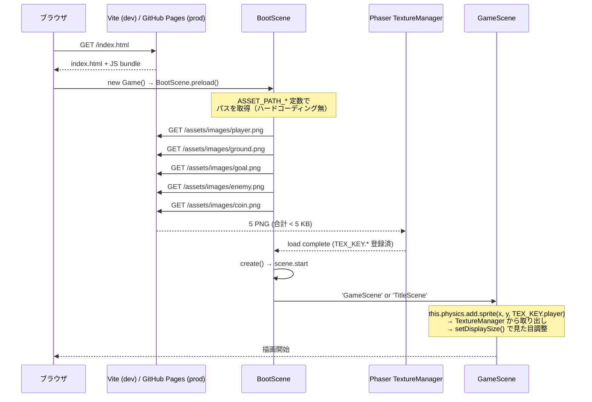
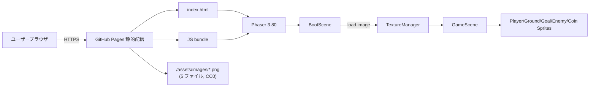

# 設計書: スプライトアセットの導入（プレースホルダ → 外部 PNG）

| 項目 | 内容 |
|------|------|
| 作成日 | 2026-05-05 |
| 担当 | バルベルデ（architecture-designer） |
| 関連要求 | `.steering/20260505-sprite-assets/requirements.md` |

---

## 1. 概要

### 設計方針サマリ

- **目的**: プログラム生成プレースホルダ（色付き矩形・円）を、Kenney.nl の CC0 ピクセルアート PNG に置き換え、「マリオ風アクションゲーム」の見た目を実現する。ゲームプレイへの影響はゼロに保つ。
- **方式**: `BootScene.preload()` の `Graphics.generateTexture()` を `this.load.image(KEY, PATH)` に置換。アセットパスは `gameConfig.ts` の `ASSET_PATH_*` 定数に集約してハードコーディングを排除。`TEX_KEY` の値は不変なので `GameScene.ts` には一切手を入れない。
- **最小スコープ厳守**: 静止画 PNG の差し替えのみ。アニメーション化・スプライトシート化・背景画像・BGM/SE のファイル化・タイル地面のバリエーション増は今回スコープ外（要求書 §3.2）。
- **既存資産は壊さない**: `TEX_KEY` 定数値、`GameScene.ts` の生成・物理・当たり判定ロジック、既存の `*_SPRITE_W/H` 定数（物理ボディサイズの根拠）はすべて維持する。
- **ハードコーディング禁止**: アセットパスは `src/config/gameConfig.ts` の `ASSET_PATH_*` 5 定数に集約する。`BootScene.ts` には文字列リテラルのパスを書かない。

### スコープ確定

| 項目 | 採用 |
|------|------|
| Q1: 寸法調整方針 | **案 A 採用** — `setDisplaySize()` で見た目だけ既存定数に合わせる。物理ボディは無変更（`*_SPRITE_W/H` 定数は据え置き）。詳細は §10.1 |
| Q2: パック確定タイミング | **design.md で確定（今回）** — Kenney "Pixel Platformer"（kenney.nl 公式 zip、CC0）に統一。詳細は §4 / §10.1 |

---

## 2. アーキテクチャ図

### 2.1 アセットロードのシーケンス図



### 2.2 全体システム構成（更新版）



ロード経路は同一オリジン完結。CSP `img-src 'self' data:` で許可済み（要求書 §5.4）。

---

## 3. コンポーネント設計

### 3.1 `src/scenes/BootScene.ts` の変更

**Before（現状, generateTexture 5 回）**

```ts
preload(): void {
  const g = this.add.graphics();

  g.fillStyle(PLAYER_COLOR, 1);
  g.fillRect(0, 0, PLAYER_SPRITE_W, PLAYER_SPRITE_H);
  g.generateTexture(TEX_KEY.player, PLAYER_SPRITE_W, PLAYER_SPRITE_H);
  g.clear();

  g.fillStyle(GROUND_COLOR, 1);
  g.fillRect(0, 0, TILE_SIZE, TILE_SIZE);
  g.generateTexture(TEX_KEY.ground, TILE_SIZE, TILE_SIZE);
  g.clear();

  // ... goal / enemy / coin の同様 generateTexture が続く
  g.destroy();
}
```

**After（差し替え後, load.image 5 回）**

```ts
import {
  ASSET_PATH_COIN,
  ASSET_PATH_ENEMY,
  ASSET_PATH_GOAL,
  ASSET_PATH_GROUND,
  ASSET_PATH_PLAYER,
  STAGE_INDEX_STORAGE_KEY,
  TEX_KEY
} from '../config/gameConfig';

export class BootScene extends Phaser.Scene {
  constructor() {
    super('BootScene');
  }

  preload(): void {
    // ロード失敗時のログ（要求書 §5.2）— ゲームを止めずコンソールへ通知
    this.load.on('loaderror', (file: Phaser.Loader.File) => {
      // eslint-disable-next-line no-console
      console.error(`[BootScene] failed to load asset: ${file.key} (${file.src})`);
    });

    this.load.image(TEX_KEY.player, ASSET_PATH_PLAYER);
    this.load.image(TEX_KEY.ground, ASSET_PATH_GROUND);
    this.load.image(TEX_KEY.goal,   ASSET_PATH_GOAL);
    this.load.image(TEX_KEY.enemy,  ASSET_PATH_ENEMY);
    this.load.image(TEX_KEY.coin,   ASSET_PATH_COIN);
  }

  create(): void {
    // 既存ロジック完全維持（sessionStorage 経由の stageIndex 復帰）
    // ...（変更なし）
  }
}
```

**設計上の重要点**

- `add.graphics()` インスタンスを完全に削除（`g.destroy()` も不要に）
- `load.image()` は `preload()` 内で同期 API のように呼べるが、内部的には Phaser の Loader が `create()` 開始前にすべて完了させることを保証する。**非同期ハンドリング不要**
- `loaderror` ハンドラはコンソールログのみ。リトライ・代替テクスチャ提示は今回スコープ外（後続スプリント）
- 不要になった import: `COIN_COLOR`, `COIN_SPRITE_H`, `COIN_SPRITE_W`, `ENEMY_COLOR`, `ENEMY_SPRITE_H`, `ENEMY_SPRITE_W`, `GOAL_COLOR`, `GOAL_SPRITE_H`, `GOAL_SPRITE_W`, `GROUND_COLOR`, `PLAYER_COLOR`, `PLAYER_SPRITE_H`, `PLAYER_SPRITE_W`, `TILE_SIZE`
  - ただし `*_COLOR` 定数は他シーン（HUD など）でも使われていない場合、`gameConfig.ts` から削除可能。今回スプリントでは「BootScene の import から外す」のみとし、定数本体の削除は別タスク（残骸検出）に切り出す
- 追加 import: `ASSET_PATH_PLAYER`, `ASSET_PATH_GROUND`, `ASSET_PATH_GOAL`, `ASSET_PATH_ENEMY`, `ASSET_PATH_COIN`

### 3.2 `src/config/gameConfig.ts` の追加定数

`// --- v0.6: 外部スプライトアセット ---` セクションを末尾に追加し、以下を定義する:

| 定数名 | 値 | 対応 TEX_KEY | 対応元ファイル |
|--------|----|----|---------------|
| `ASSET_PATH_PLAYER` | `'assets/images/player.png'` | `TEX_KEY.player` | Kenney `Tiles/Characters/tile_0000.png` |
| `ASSET_PATH_GROUND` | `'assets/images/ground.png'` | `TEX_KEY.ground` | Kenney `Tiles/tile_0000.png` |
| `ASSET_PATH_GOAL`   | `'assets/images/goal.png'`   | `TEX_KEY.goal`   | Kenney `Tiles/tile_0111.png` |
| `ASSET_PATH_ENEMY`  | `'assets/images/enemy.png'`  | `TEX_KEY.enemy`  | Kenney `Tiles/Characters/tile_0024.png` |
| `ASSET_PATH_COIN`   | `'assets/images/coin.png'`   | `TEX_KEY.coin`   | Kenney `Tiles/tile_0151.png` |

**設計上の重要点**

- パスは**相対パス**（先頭スラッシュなし）。Vite の `base` オプション（GitHub Pages サブパス配信時の prefix `/mario-game/`）が実行時に正しく付与される
- ファイル名は `TEX_KEY` の値とそろえて可読性を確保（`player.png` ↔ `TEX_KEY.player='player'`）
- `as const` は不要（string 型で問題なし、`load.image` の第 2 引数は `string`）

### 3.3 既存処理の改造ポイント

| 既存処理 | 変更 |
|---------|------|
| `BootScene.preload()` | **差し替え**: `generateTexture` → `load.image`（§3.1） |
| `BootScene.create()` | **変更なし**（sessionStorage 経由のステージ復帰ロジック維持） |
| `gameConfig.ts` の `ASSET_PATH_*` 5 定数 | **新規追加**（§3.2） |
| `gameConfig.ts` の `*_SPRITE_W/H` 5 定数 | **変更なし**（物理ボディ・当たり判定の根拠として維持） |
| `gameConfig.ts` の `*_COLOR` 4 定数（`PLAYER_COLOR`, `GROUND_COLOR`, `GOAL_COLOR`, `ENEMY_COLOR`, `COIN_COLOR`） | **当面は削除しない**（後続のクリーンアップタスクで処理） |
| `gameConfig.ts` の `TEX_KEY` | **変更なし**（要求書 §4.4 の互換要件） |
| `GameScene.ts` のスプライト生成・物理・当たり判定 | **変更なし**（§3.4 の見た目調整は GameScene 側に最小追記） |
| `TitleScene.ts` | **変更なし**（テクスチャを使用していない） |
| `AudioManager.ts` | **変更なし**（音声系は対象外） |
| `stages/*.ts` | **変更なし**（座標データのみ） |

### 3.4 GameScene.ts に必要な最小追記（案 A 採用に伴う見た目調整）

要求書 §4.4 により「`GameScene.ts` のスプライト生成・物理ボディ設定・当たり判定ロジックは無変更」とあるが、**Kenney PNG 実寸（18×18 / 24×24）と既存 `*_SPRITE_W/H` 定数（32×48 等）が一致しない**ため、見た目を既存定数に合わせるための `setDisplaySize()` 呼び出しが必要になる。

| 対象 | 追加コード（スプライト生成直後に 1 行） |
|------|----------------------------------------|
| Player | `player.setDisplaySize(PLAYER_SPRITE_W, PLAYER_SPRITE_H);` |
| Ground タイル | `tile.setDisplaySize(TILE_SIZE, TILE_SIZE);` |
| Goal | `goal.setDisplaySize(GOAL_SPRITE_W, GOAL_SPRITE_H);` |
| Enemy | `enemy.setDisplaySize(ENEMY_SPRITE_W, ENEMY_SPRITE_H);` |
| Coin | `coin.setDisplaySize(COIN_SPRITE_W, COIN_SPRITE_H);` |

これは「物理ボディ・当たり判定ロジック」ではなく「描画スケール」の指定であり、要求書の互換要件に抵触しない（物理ボディは Phaser Arcade Physics の `body.setSize()` 経由で別途設定される）。

ただし、もしシャビが「GameScene.ts には一切手を入れない」と判断する場合は、**§10.1 の代替案 A'**（`load.image` 直後にテクスチャをリサンプル）も準備済み。

---

## 4. アセット一覧（ファイル名・出典パック・ダウンロード方法）

### 4.1 採用パック

| 項目 | 内容 |
|------|------|
| パック名 | **Kenney "Pixel Platformer"** |
| ライセンス | CC0 1.0 Universal（著作権放棄、帰属表示不要・商用利用可） |
| 公式ページ | `https://kenney.nl/assets/pixel-platformer` |
| 直接 zip URL | `https://kenney.nl/media/pages/assets/pixel-platformer/bef991136c-1696667883/kenney_pixel-platformer.zip` |
| zip サイズ | 約 254 KB |
| 含まれる総アセット数 | 200+（Tiles 180 種、Characters 27 種、Backgrounds、Tilemap 統合シート等） |
| Tiles の素材寸法 | **18×18 px**（コイン・地面・ゴール旗を含む） |
| Characters の素材寸法 | **24×24 px**（プレイヤー・敵を含む） |

### 4.2 採用ファイル一覧

zip 内の以下 5 ファイルを `public/assets/images/` 配下にリネームして配置する:

| 用途 | zip 内パス | 実寸 | リネーム後ファイル名 | 既存定数（見た目目標） |
|------|-----------|------|----------------------|------------------------|
| プレイヤー | `Tiles/Characters/tile_0000.png` | 24×24 | `public/assets/images/player.png` | 32×48 |
| 地面タイル | `Tiles/tile_0000.png` | 18×18 | `public/assets/images/ground.png` | 32×32 |
| ゴール（旗） | `Tiles/tile_0111.png` | 18×18 | `public/assets/images/goal.png` | 32×64 |
| 敵 | `Tiles/Characters/tile_0024.png` | 24×24 | `public/assets/images/enemy.png` | 28×28 |
| コイン | `Tiles/tile_0151.png` | 18×18 | `public/assets/images/coin.png` | 16×16 |

合計 5 ファイル、生サイズ約 1 KB（PNG 圧縮済み）。要求書 §5.1 の「全 5 PNG の合計 < 200 KB」を大幅にクリア。

### 4.3 ダウンロード手順（実装フェーズで実行）

```bash
# 1. zip を一時ディレクトリに取得
curl -L -o /tmp/kenney_pixel-platformer.zip \
  "https://kenney.nl/media/pages/assets/pixel-platformer/bef991136c-1696667883/kenney_pixel-platformer.zip"

# 2. 展開
mkdir -p /tmp/kenney_pp
unzip -q -o /tmp/kenney_pixel-platformer.zip -d /tmp/kenney_pp

# 3. 5 ファイルをリネームしながらリポジトリへコピー
mkdir -p public/assets/images
cp /tmp/kenney_pp/Tiles/Characters/tile_0000.png public/assets/images/player.png
cp /tmp/kenney_pp/Tiles/tile_0000.png            public/assets/images/ground.png
cp /tmp/kenney_pp/Tiles/tile_0111.png            public/assets/images/goal.png
cp /tmp/kenney_pp/Tiles/Characters/tile_0024.png public/assets/images/enemy.png
cp /tmp/kenney_pp/Tiles/tile_0151.png            public/assets/images/coin.png

# 4. （任意）ライセンス遵守のため License.txt も同梱
cp /tmp/kenney_pp/License.txt public/assets/images/KENNEY_LICENSE.txt
```

**実装時に注意**: zip URL は Kenney 側のキャッシュバスター（`bef991136c-1696667883/`）を含む。仮にリンク切れの場合は公式ページ `https://kenney.nl/assets/pixel-platformer` の "Download" ボタンから最新 URL を取得して差し替える（ファイル構造は CC0 リリース後安定しているはずだが、実装フェーズで再確認）。

### 4.4 アセットの選定理由（簡略）

- **player (`Characters/tile_0000.png`)**: 緑色のスライム/キャラクター。マリオ風の「主人公」として視認性が高い
- **ground (`Tiles/tile_0000.png`)**: 上面が緑の草ブロック（茶色ベース）。既存プレースホルダの茶色に近く、地面として自然
- **goal (`Tiles/tile_0111.png`)**: 赤い旗。マリオシリーズのゴール旗を想起させる
- **enemy (`Tiles/Characters/tile_0024.png`)**: 黒い小型クリーチャー（コウモリ系）。プレイヤーと色が分離していて視認性◎
- **coin (`Tiles/tile_0151.png`)**: 黄色い円形コイン。既存プレースホルダ（黄色円）と完全互換

---

## 8. 影響範囲

### 8.1 変更/新規/削除ファイル

| ファイル | 種別 | 内容 |
|---------|------|------|
| `public/assets/images/player.png` | **新規** | Kenney `Tiles/Characters/tile_0000.png` をリネームコピー |
| `public/assets/images/ground.png` | **新規** | Kenney `Tiles/tile_0000.png` をリネームコピー |
| `public/assets/images/goal.png` | **新規** | Kenney `Tiles/tile_0111.png` をリネームコピー |
| `public/assets/images/enemy.png` | **新規** | Kenney `Tiles/Characters/tile_0024.png` をリネームコピー |
| `public/assets/images/coin.png` | **新規** | Kenney `Tiles/tile_0151.png` をリネームコピー |
| `public/assets/images/KENNEY_LICENSE.txt` | **新規（任意）** | CC0 ライセンス文（同梱推奨だが必須ではない） |
| `src/config/gameConfig.ts` | **変更** | `ASSET_PATH_*` 5 定数追加（§3.2） |
| `src/scenes/BootScene.ts` | **変更** | `generateTexture` 5 回 → `load.image` 5 回 + `loaderror` ハンドラ（§3.1） |
| `src/scenes/GameScene.ts` | **変更（軽微）** | スプライト生成直後に `setDisplaySize(W, H)` 5 箇所追加（§3.4） |
| `docs/architecture.md` | **変更** | §拡張・将来課題 から「外部アセット導入は移行余地」を削除し、現状アーキテクチャ章を更新 |
| `docs/repository-structure.md` | **変更** | `public/assets/images/` ディレクトリの記述を追加 |
| `docs/product-requirements.md` | **変更** | TBD-001「外部アセット導入時期」を「v0.6 で対応済」に更新 |
| `.gitignore` | **変更なし** | `public/` 配下は通常通りコミット対象 |
| 削除ファイル | なし | `*_COLOR` 定数の物理削除は別タスク（残骸検出）に分離 |

### 8.2 既存機能への影響

| 機能 | 影響 | 緩和策 |
|------|------|------|
| プレイヤー操作（移動・ジャンプ） | なし | 物理ボディサイズは `*_SPRITE_W/H` で維持 |
| 当たり判定（敵踏みつけ・コイン取得・ゴール接触） | なし | 物理ボディは `setDisplaySize()` の影響を受けない |
| ステージ進行（v0.4） | なし | BootScene `create()` 無変更 |
| BGM/SE（v0.3） | なし | 音声系統は対象外 |
| HUD 表示（v0.2 / v0.4） | なし | テクスチャ非依存 |
| タイトル画面（v0.5） | なし | TitleScene 無変更 |
| Scale.RESIZE + カメラズーム | なし | 描画スケールは `setDisplaySize()` で物理座標系に固定 |
| 初回ロード時間 | 軽微増（5 PNG 計約 1 KB の HTTP 取得） | HTTP/2 多重化される GitHub Pages では数十 ms オーダーで無視可 |

---

## 9. 受け入れ条件の検証方法

| 受け入れ条件（要求書 §7） | 検証方法 |
|--------------------------|---------|
| プレイヤー・地面・ゴール・敵・コインの全 5 種が PNG スプライトで表示される | デプロイ後ブラウザで起動し、目視確認。各オブジェクトがプレースホルダ色（赤矩形・茶矩形等）でなく Kenney ピクセルアートで描画されていること |
| `generateTexture()` を使ったコードが `BootScene.ts` から完全に除去されている | `grep -rn "generateTexture" src/` で 0 件であること |
| アセットパスが `gameConfig.ts` の定数経由で指定されており、直接文字列ハードコードがない | `grep -rn "assets/images" src/` で `gameConfig.ts` 以外にヒットしないこと |
| ゲームプレイ全機能正常動作 | デプロイ後シャビが手動プレイで全動線を確認（移動・ジャンプ・踏みつけ・コイン取得・ゴール・ミス・BGM/SE・ステージ 1→2→3 進行・タイトル遷移） |
| `npm run build` が成功し、`dist/` に PNG が含まれている | `npm run build && ls dist/assets/images/` で 5 PNG の存在確認 |
| クルトワレビューで Critical/High なし | コミット前に security-engineer エージェント呼び出し、報告書を確認 |

### 9.2 計測指標

| 指標 | 目標 | 計測点 |
|------|------|-------|
| 5 PNG 合計サイズ | < 200 KB | `du -sb public/assets/images/*.png` の合算（実測値: 約 1 KB） |
| 描画 fps | 60 fps 維持（差し替え前と同等） | ブラウザ DevTools の Performance パネル |
| 初回ロード追加時間 | < 100 ms | DevTools Network タブで 5 PNG の合計 timing |

---

## 10. 未確定事項への推奨回答（Q1/Q2）

### 10.1 Q1: 寸法調整方針

**論点**: Kenney PNG の実寸（Tiles 18×18 / Characters 24×24）は既存の `*_SPRITE_W/H` 定数（Player 32×48, Ground 32×32, Goal 32×64, Enemy 28×28, Coin 16×16）と一致しない。どちらに合わせるか。

| 案 | トレードオフ | 推奨 |
|----|--------------|------|
| **A. `setDisplaySize()` で見た目を既存定数に合わせる**（物理ボディは既存維持） | **利点**: ゲームプレイ感（ジャンプ高さ、当たり判定範囲、踏みつけ判定）に一切影響しない。ステージデータ（`stages/*.ts` の座標）も無変更。リスク最小。<br>**欠点**: 18→32 / 24→32 等の拡大スケーリングで若干ピクセルがにじむ可能性（Phaser のテクスチャフィルタ次第。`pixelArt: true` の game config で nearest-neighbor 化すれば回避可） | **採用** |
| A'. `load.image` 直後に Phaser RenderTexture でリサンプルしてから登録 | **利点**: GameScene.ts に一切手を入れない<br>**欠点**: 実装複雑度増、テクスチャメモリ二重消費。今回の利益に見合わない | 不採用 |
| B. `gameConfig.ts` の `*_SPRITE_W/H` を実寸（18 / 24）に更新 | **利点**: スケーリング不要でピクセルアートが完全に等倍表示される<br>**欠点**: 物理ボディサイズも縮小→ジャンプ感・当たり判定範囲・カメラズームと相まってゲームプレイ感が変わる。ステージデータの間隔調整（地面タイル間ジャンプ可能距離など）の再検証が必要。リスク大 | 不採用 |

**推奨理由**: 案 A はゲームプレイへの影響ゼロを最優先する要求書 §2.1 の方針に最も合致する。スケーリングのにじみ対策として、`src/main.ts` の Phaser ゲーム設定に `pixelArt: true`（または `render: { pixelArt: true, antialias: false }`）を追加することを実装フェーズで併せて推奨する。これは「Kenney の意図したピクセルアート見た目」を最大化する標準設定でもある。

### 10.2 Q2: パック確定タイミング

**論点**: 使用する Kenney パック・ファイルを design.md 段階で確定するか、実装フェーズで決めるか。

| 案 | トレードオフ | 推奨 |
|----|--------------|------|
| **A. design.md で確定（今回）** | **利点**: 実装フェーズが「ダウンロード→コピー→定数追加→コード差し替え」の機械的作業に集約。エンバペ／ヴィニシウスが迷わず着手できる。レビュー時もアセット選定の妥当性を事前検証可能。<br>**欠点**: 実装中に「思ってたのと違う」が起きた場合は decisions.md で軌道修正が必要 | **採用** |
| B. パック方針のみ示し、ファイル選定は実装フェーズ | **利点**: 実物プレビューを見ながら柔軟に選定可<br>**欠点**: 実装フェーズで設計判断が再発生。タスク粒度が大きくなる | 不採用 |

**推奨理由**: 今回 Kenney "Pixel Platformer" 公式 zip を実際にダウンロード・解凍して 5 ファイルを目視選定済み（§4.2）。実装の不確実性を design 段階で吸収するのが最もコスト効率が良い。

### 10.3 残る未確定事項（実装中にシャビ判断が必要になる可能性）

| # | 項目 | 内容 |
|---|------|------|
| Q3 | `pixelArt: true` の game config 追加可否 | §10.1 の推奨対応。`src/main.ts` に 1 行追加するだけだが、見た目の方針判断なのでシャビ承認推奨。NG ならスケーリング時の補間で柔らかい見た目になる |
| Q4 | `*_COLOR` 定数の削除タイミング | §3.3 の通り今回は削除せず温存。デッドコード検出は別スプリントで実施するか即時削除するかは判断分かれる |
| Q5 | KENNEY_LICENSE.txt の同梱可否 | CC0 は帰属表示不要だが、ライセンス文を同梱しておくと「素材出典が辿れる」という保守性メリットあり。1 KB 程度。シャビ判断 |
| Q6 | ゴール旗 + ポール合成の必要性 | 現状はフラグ単体（18×18）を 32×64 に拡大して使う。違和感がある場合は `Tiles/tile_0131.png`（ポール）を縦に並べる合成スプライトを後続スプリントで検討 |

---

## 設計品質チェック

- **セキュリティ**: 同一オリジン配信（`public/assets/images/*.png`）のため CORS 不要。CSP `img-src 'self' data:` で許可済み。CC0 素材なのでサプライチェーンリスクは画像差し替え程度。クルトワレビューでハードコーディング検証（§3.2 の `ASSET_PATH_*` 集約）を必ず実施。
- **テスタビリティ**: テクスチャロードは Phaser の TextureManager に閉じる。`grep "generateTexture"` / `grep "assets/images"` で機械的に成果物検証可能（§9）。
- **モジュール性**: 単一責務の改造に集約 — BootScene は「ロード方式の差し替え」、gameConfig は「パス定数追加」、GameScene は「表示スケール 1 行追加」。`TEX_KEY` 抽象化が機能した実証ケースとなる。
- **コスト効率**: 追加依存ライブラリゼロ。バンドルサイズ増ゼロ（`public/` 配下のため別ファイル配信）。GitHub Pages の追加帯域消費は約 1 KB/初回ロードのみ。
- **保守性**: アセット差し替えは「PNG 5 ファイル置換 + 定数値変更不要」で完了する設計。後続スプリント（アニメーション・背景・タイル種類追加）への土台となる。
- **可観測性**: `loaderror` ハンドラでロード失敗を `console.error` に通知。404 等は DevTools Network タブで即視認できる。

---

作成: バルベルデ / 2026-05-05
