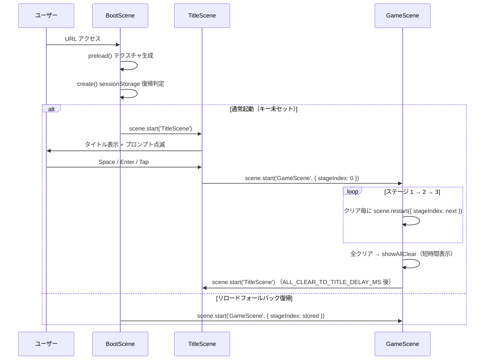
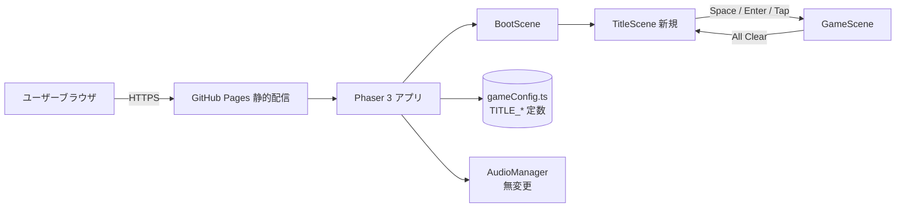
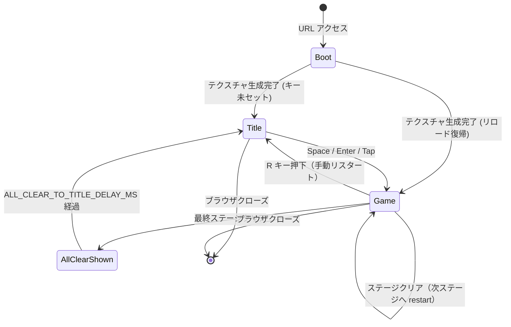

# 設計書: タイトル画面の追加

| 項目 | 内容 |
|------|------|
| 作成日 | 2026-05-05 |
| 担当 | バルベルデ（architecture-designer） |
| 関連要求 | `.steering/20260505-title-screen/requirements.md` |

---

## 1. 概要

### 設計方針サマリ

- **目的**: `BootScene` と `GameScene` の間に `TitleScene` を挿入し、URL 直アクセスでも「ゲームが始まった感」のある入口を提供する。同時に全クリア後の戻り先を `TitleScene` にして「終わり感」と再プレイ動線を確立する。
- **方式**: Phaser 3 の `Phaser.Scene` を 1 つ追加するだけのミニマル構成。タイトル文字列・点滅周期・操作キー一覧は `gameConfig.ts` に集約し、ハードコーディングを排除する。タイマー（点滅）と入力イベントは `shutdown` で確実に解放する。
- **最小スコープ厳守**: ステージセレクト・ハイスコア・専用 BGM・キャラ演出は今回スコープ外。`TitleScene` はテキスト 2 つ + 入力ハンドラのみで構成し、後続スプリント（拡張）の土台に留める。
- **既存資産は壊さない**: `GameScene` の物理・ステージロジックには触らず、変更点は「全クリア後の遷移先」「`R` キー押下後の遷移先」「ALL CLEAR テキストの誘導文」のみ。HUD 座標補正ロジック・モバイル対応・BGM/SE は無変更。
- **ハードコーディング禁止**: タイトル文字列、サブテキスト、点滅周期、フォントサイズ、サブテキスト Y オフセットは全て `src/config/gameConfig.ts` に新設する `TITLE_*` 定数に集約する。

### スコープ確定

| 項目 | 採用 |
|------|------|
| Q1: `TitleScene` のカメラズーム | **デフォルト zoom=1 を採用**（HUD 座標補正の副作用を避け、`Scale.RESIZE` のみで中央配置を成立させる） |
| Q2: 全クリア時の「All Clear!」表示位置 | **`GameScene` 内で短時間表示 → `TitleScene` 遷移**（既存 `showAllClear` を踏襲、`TitleScene` には引き継ぎフラグを渡さない＝シーン責務の分離） |
| シーン登録順 | `[BootScene, TitleScene, GameScene]` に変更し、`BootScene.create()` の遷移先を `GameScene` → `TitleScene` に変更 |
| sessionStorage の `STAGE_INDEX_STORAGE_KEY` | 既存挙動を維持（リロードフォールバック経路のため。タイトル経由フローではキー未セット時 stageIndex=0 で `GameScene` 起動） |

---

## 2. アーキテクチャ図

### 2.1 シーケンス図（タイトル経由フロー）



### 2.2 全体システム構成（更新版）



---

## 3. コンポーネント設計

### 3.1 新規シーン — `src/scenes/TitleScene.ts`

| クラス/メソッド | 責務 |
|-----------------|------|
| `class TitleScene extends Phaser.Scene` | タイトル画面の生成・入力受付・遷移を司る |
| `create()` | テキスト生成・入力リスナ登録・点滅 Tween 開始・resize リスナ登録 |
| `layout()` | `this.scale.width / 2`, `this.scale.height / 2` を起点にタイトル/サブテキストを再配置（初回 + resize 共通） |
| `startGame()` | 入力受付後に `scene.start('GameScene', { stageIndex: 0 })` を呼ぶ。多重発火防止フラグを保持 |
| `shutdown()` | resize リスナ・Tween・Pointer/Keyboard ハンドラを解放（リーク防止） |

**TypeScript skeleton**

```ts
import Phaser from 'phaser';
import {
  BG_COLOR,
  GAME_TITLE,
  TITLE_FONT_FAMILY,
  TITLE_FONT_SIZE,
  TITLE_FONT_COLOR,
  TITLE_STROKE_COLOR,
  TITLE_STROKE_THICKNESS,
  TITLE_PROMPT_TEXT,
  TITLE_PROMPT_FONT_SIZE,
  TITLE_PROMPT_OFFSET_Y,
  TITLE_PROMPT_BLINK_MS
} from '../config/gameConfig';

export class TitleScene extends Phaser.Scene {
  private titleText!: Phaser.GameObjects.Text;
  private promptText!: Phaser.GameObjects.Text;
  private blinkTween?: Phaser.Tweens.Tween;
  private isStarting = false;

  constructor() {
    super('TitleScene');
  }

  create(): void {
    this.cameras.main.setBackgroundColor(BG_COLOR);
    // GameScene からの遷移時にズームが残らないよう明示的にリセット
    this.cameras.main.setZoom(1);

    this.titleText = this.add.text(0, 0, GAME_TITLE, {
      fontFamily: TITLE_FONT_FAMILY,
      fontSize: TITLE_FONT_SIZE,
      color: TITLE_FONT_COLOR,
      stroke: TITLE_STROKE_COLOR,
      strokeThickness: TITLE_STROKE_THICKNESS,
      align: 'center'
    }).setOrigin(0.5).setScrollFactor(0);

    this.promptText = this.add.text(0, 0, TITLE_PROMPT_TEXT, {
      fontFamily: TITLE_FONT_FAMILY,
      fontSize: TITLE_PROMPT_FONT_SIZE,
      color: TITLE_FONT_COLOR,
      stroke: TITLE_STROKE_COLOR,
      strokeThickness: TITLE_STROKE_THICKNESS,
      align: 'center'
    }).setOrigin(0.5).setScrollFactor(0);

    this.layout();

    this.blinkTween = this.tweens.add({
      targets: this.promptText,
      alpha: { from: 1, to: 0 },
      duration: TITLE_PROMPT_BLINK_MS,
      yoyo: true,
      repeat: -1
    });

    // 入力 hookup（Space / Enter / Tap）
    this.input.keyboard?.once('keydown-SPACE', this.startGame, this);
    this.input.keyboard?.once('keydown-ENTER', this.startGame, this);
    this.input.once('pointerdown', this.startGame, this);

    // Scale.RESIZE 対応
    this.scale.on('resize', this.layout, this);

    // shutdown ライフサイクルでリスナ解放
    this.events.once(Phaser.Scenes.Events.SHUTDOWN, this.onShutdown, this);
  }

  private layout(): void {
    const cx = this.scale.width / 2;
    const cy = this.scale.height / 2;
    this.titleText.setPosition(cx, cy);
    this.promptText.setPosition(cx, cy + TITLE_PROMPT_OFFSET_Y);
  }

  private startGame(): void {
    if (this.isStarting) return;
    this.isStarting = true;
    this.scene.start('GameScene', { stageIndex: 0 });
  }

  private onShutdown(): void {
    this.scale.off('resize', this.layout, this);
    this.blinkTween?.stop();
    this.blinkTween = undefined;
    // Phaser は scene shutdown 時に input リスナを掃除するが
    // once 登録なので明示解除は不要（多重発火防止のフラグで十分）
  }
}
```

**設計上の重要点**

- **多重発火防止**: `isStarting` フラグで Space + Tap の同時押しによる二重 `scene.start` を抑止する。`once` 登録だけでは Space と Tap が別ハンドラなので不十分。
- **resize 安全性**: テキスト座標は常に `this.scale.width/2` を基準に再計算。リスナは `shutdown` で必ず off（`this` 文脈リークを回避）。
- **ズーム明示リセット**: `GameScene` から戻る際、Phaser は基本的にカメラ状態を引き継がないが、念のため `setZoom(1)` を明示。HUD 座標補正の副作用（既知ナレッジ: `setScrollFactor(0)` がズーム中心基準でオフセット）をタイトルに持ち込まない。
- **Tween の責務**: 点滅は `setAlpha` を直接いじらず Tween で制御。`shutdown` で stop しないと `add.tween` が次回シーン起動後も裏で走る潜在リスクあり。

### 3.2 既存処理の改造ポイント

| 既存処理 | 変更内容 |
|----------|----------|
| `src/main.ts` の `scene` 配列 | `[BootScene, GameScene]` → `[BootScene, TitleScene, GameScene]` に変更。`TitleScene` を import 追加 |
| `src/scenes/BootScene.ts` の `create()` | `sessionStorage` キー未セット時の遷移先を `GameScene` → `TitleScene` に変更。キーセット時は従来通り `GameScene` 直行（リロードフォールバックの整合性維持） |
| `src/scenes/GameScene.ts` の `showAllClear()` | テキスト文言を「`R` またはタップでステージ 1 へ」→「タイトルへ戻ります...」に変更 |
| `src/scenes/GameScene.ts` の `restartFromTop()` | `scene.restart({ stageIndex: 0 })` → `scene.start('TitleScene')` に変更（`R` キー押下時もタイトル経由に統一） |
| `GameScene` の全クリア後タイマー | 既存 `showAllClear()` 表示後に `time.delayedCall(ALL_CLEAR_TO_TITLE_DELAY_MS, () => this.scene.start('TitleScene'))` を追加。手動 `R` を待たず自動でタイトルへ |
| `GameScene` のステージ進行・物理・HUD・BGM | **変更なし**（既知ナレッジ厳守） |

---

## 4. データ構造（gameConfig.ts への追加定数）

`src/config/gameConfig.ts` の末尾に「v0.5: タイトル画面」セクションを新設し、以下の定数を追加する。

| 定数名 | 型 | 既定値 | 用途 |
|--------|----|--------|------|
| `GAME_TITLE` | `string` | `'MARIO-LIKE GAME'` | タイトル画面に表示するゲーム名 |
| `TITLE_FONT_FAMILY` | `string` | `'system-ui, sans-serif'` | タイトル/プロンプト共通フォント |
| `TITLE_FONT_SIZE` | `string` | `'72px'` | タイトル文字サイズ |
| `TITLE_FONT_COLOR` | `string` | `'#ffffff'` | タイトル文字色 |
| `TITLE_STROKE_COLOR` | `string` | `'#000000'` | アウトライン色 |
| `TITLE_STROKE_THICKNESS` | `number` | `8` | アウトライン太さ |
| `TITLE_PROMPT_TEXT` | `string` | `'Press SPACE / Tap to Start'` | サブテキスト文言 |
| `TITLE_PROMPT_FONT_SIZE` | `string` | `'24px'` | サブテキスト文字サイズ |
| `TITLE_PROMPT_OFFSET_Y` | `number` | `80` | タイトル中心からサブテキスト中心までの Y オフセット (px) |
| `TITLE_PROMPT_BLINK_MS` | `number` | `500` | 点滅 Tween の片道時間（yoyo で実効周期は 1000ms） |
| `ALL_CLEAR_TO_TITLE_DELAY_MS` | `number` | `2500` | 全クリアテキスト表示からタイトル自動遷移までの待ち時間 |

**バリデーション規約**

- 文字列定数は外部入力を含まない（XSS 対策）。テンプレ展開で動的に組み立てない。
- 数値定数は全て正の整数（点滅周期・待ち時間・オフセット）。

---

## 5. 状態遷移



---

## 6. エラーハンドリング

| シナリオ | 挙動 | 補足 |
|----------|------|------|
| `TitleScene` 初期化中の例外 | Phaser のシーンエラーハンドラに委譲（既存と同じ） | 追加のエラーハンドラは設けない（タイトルは描画のみで例外要因が少ない） |
| Space と Tap の同時押し | `isStarting` フラグで 2 回目以降を無視 | `scene.start` が二重発火するとシーン破棄/再生成の race を招く |
| リサイズ中の遷移 | `layout()` は冪等。遷移中に resize されても影響なし | resize リスナは `shutdown` で off するため、`GameScene` 起動後にタイトル側のレイアウトが走ることはない |
| `sessionStorage` 利用不可（プライベートブラウジング等） | 既存 `try/catch` 経路で `stageIndex=0` フォールバック → タイトル経由 | 既存ロジックを変更しない |
| 全クリア後タイマー多重登録 | `isAllCleared` フラグ既存 + `delayedCall` を 1 回のみ登録 | `showAllClear()` の入口で `isAllCleared` チェック済み |

**タイムアウト値（gameConfig.ts に集約）**

| 値 | デフォルト | 定数名 |
|----|------------|--------|
| 点滅周期（片道） | 500 ms | `TITLE_PROMPT_BLINK_MS` |
| 全クリア → タイトル遷移待ち | 2500 ms | `ALL_CLEAR_TO_TITLE_DELAY_MS` |

---

## 8. 影響範囲

### 8.1 変更/新規/削除ファイル

| ファイル | 種別 | 内容 |
|----------|------|------|
| `src/scenes/TitleScene.ts` | 新規 | §3.1 のシーン本体 |
| `src/main.ts` | 変更 | `TitleScene` import + `scene` 配列に追加 |
| `src/scenes/BootScene.ts` | 変更 | `create()` の `scene.start` 先を `TitleScene` に変更（リロード復帰時のみ `GameScene` 直行） |
| `src/scenes/GameScene.ts` | 変更 | `showAllClear()` のメッセージ修正、全クリア後の自動タイトル遷移追加、`restartFromTop()` を `TitleScene` 起動に切替 |
| `src/config/gameConfig.ts` | 変更 | §4 の `GAME_TITLE` ほか TITLE_* 定数群、`ALL_CLEAR_TO_TITLE_DELAY_MS` を追加 |
| 削除ファイル | なし | — |

### 8.2 既存機能への影響

| 機能 | 影響 | 緩和策 |
|------|------|--------|
| ステージ進行（1→2→3） | なし | `GameScene` 内のステージロジックは無変更 |
| ミス時の `fullRestart` | なし | `scene.restart({ stageIndex: this.stageIndex })` を維持 |
| BGM/SE | なし | `AudioManager` は無変更。タイトルでは BGM 鳴らさない |
| HUD 座標補正（ズーム逆変換） | なし | `GameScene` のみで使用。`TitleScene` は zoom=1 のため対象外 |
| `Scale.RESIZE` + `orientationchange` | なし | `main.ts` の orientationchange ハンドラは `game.scale.refresh()` のみで現行維持 |
| sessionStorage リロードフォールバック | 軽微 | キーセット時は `GameScene` 直行で従来挙動を維持。フォールバック経路の再現性確保 |
| `R` キー手動リスタート | 動線変更 | `GameScene` 直起動 → `TitleScene` 経由に変わる。仕様変更として要求書 §4.1 と整合 |

---

## 9. 受け入れ条件の検証方法

### 9.1 検証項目（requirements.md §7 への対応）

| 受け入れ条件 | 検証方法 |
|--------------|----------|
| URL を開くと `BootScene` の後に `TitleScene` が表示される | GitHub Pages デプロイ後、PC ブラウザで URL アクセス → タイトル文字列が見えることを目視 |
| タイトルテキストとプロンプトが画面中央に表示される | DevTools でウィンドウ幅を 800/1200/1920 px に変えて中央配置維持を目視 |
| プロンプトが点滅（約 1 秒周期）する | DevTools の Performance タブで Tween 動作を確認、または目視で 1 秒周期を確認 |
| Space / Enter で `GameScene` に遷移 | キーボード操作 → ステージ 1 表示を確認 |
| 画面タップで `GameScene` に遷移 | スマホ実機 or DevTools のデバイスエミュレーション → タップで遷移を確認 |
| ステージ 3 クリア後に `TitleScene` に戻る | 全クリアプレイ → ALL CLEAR 表示 → 約 2.5 秒後にタイトル復帰を確認 |
| ウィンドウリサイズでレイアウト崩れなし | タイトル表示中にウィンドウリサイズ → テキストが追従して中央維持 |
| 既存ゲームプレイが正常動作 | `npm run build` が成功し、ステージ 1〜3 を通しプレイで完走 |
| クルトワレビュー Critical/High なし | コミット前に security-engineer エージェントへ依頼、レビュー結果を `decisions.md` に記録 |

### 9.2 計測指標

| 指標 | 目標 | 計測点 |
|------|------|--------|
| `BootScene` → `TitleScene` 遷移時間 | < 100 ms（体感ゼロ） | DevTools Performance のシーン start マーカー |
| `TitleScene` 起動時のメモリ増分 | < 1 MB | DevTools Memory のヒープスナップショット差分 |
| ビルド出力の差分サイズ | < 5 KB（Phaser 本体除く） | `npm run build` 後の `dist/assets/*.js` サイズ比較 |

**理論値**: `TitleScene` はテキスト 2 つ + Tween 1 つ + 入力リスナ 3 つで構成され、追加描画コストは 1 フレームあたり数十マイクロ秒。BootScene 完了から TitleScene の初回描画まで Phaser の標準シーン遷移コストのみ（< 50ms 想定）。

### 9.3 失敗時のフォールバック

- 点滅 Tween が原因でパフォーマンス劣化が観測された場合: `TITLE_PROMPT_BLINK_MS` を伸ばす、もしくは `setInterval` ベースに退避
- リサイズ時にテキスト位置がチラつく場合: `layout()` を `resize` イベントの末尾呼び出しに加えて `time.delayedCall(0, ...)` で次フレームに遅延
- `showAllClear` 後の自動遷移が早すぎ/遅すぎとフィードバックされた場合: `ALL_CLEAR_TO_TITLE_DELAY_MS` の調整のみで対応（コード変更不要）

---

## 10. 未確定事項への推奨回答

### 10.1 Q1: TitleScene でカメラズームを設定するか

| 案 | トレードオフ | 推奨 |
|----|--------------|------|
| **A. zoom=1（デフォルト維持）** | 利点: HUD 座標補正不要、`Scale.RESIZE` のみで中央配置成立、コード最小。欠点: タイトル文字が「ゲーム本体と若干サイズ感が違う」可能性 | **採用** |
| B. `GameScene` と同じズーム適用 | 利点: ゲーム本体と一貫したスケール感。欠点: `setScrollFactor(0)` のテキストにズーム中心オフセット補正が必要（既知ナレッジ）、`TitleScene` 専用の補正コードが増える | 不採用 |

**推奨理由**: タイトル画面は背景＋テキスト 2 つだけのシンプルな構成で、ゲーム本体と「同じ視覚スケール」である必要がない。zoom=1 にすればフォントサイズを `'72px'` のように直感的な値で設定でき、レイアウトコードも `this.scale.width / 2` の素直な式で書ける。既知ナレッジ（HUD 座標補正）の複雑さを `TitleScene` に持ち込む合理的な理由がない。フォントサイズで十分に目立つ表示が確保できる。

### 10.2 Q2: 全クリア時の「All Clear!」表示位置

| 案 | トレードオフ | 推奨 |
|----|--------------|------|
| **A. `GameScene` で表示 → 自動でタイトルへ遷移** | 利点: 既存 `showAllClear()` を踏襲、シーン責務が明確（GameScene=結果表示、TitleScene=入口）、`TitleScene` に状態を持ち込まない。欠点: 表示時間（`ALL_CLEAR_TO_TITLE_DELAY_MS`）の調整が必要 | **採用** |
| B. `TitleScene` で「All Clear!」バナー表示 | 利点: 結果表示と次回プレイ動線を 1 画面に集約。欠点: `TitleScene` が起動モード（通常 / 全クリア後）を持つ＝責務肥大、データ受け渡し（`init({ fromAllClear: true })`）が必要、テスト分岐が増える | 不採用 |

**推奨理由**: `TitleScene` を「URL 直アクセス時もクリア後も同じ見た目」に保つことで、シーンの責務が単純化される。`GameScene.showAllClear()` は既に存在しスタイルも確立されているため、文言修正と自動遷移タイマー追加だけで実現できる。将来的に「ハイスコア表示」を `TitleScene` に追加する際も、起動モード分岐がない方が実装がきれい。

### 10.3 残る未確定事項（実装中にシャビ判断が必要になる可能性）

| # | 項目 | 内容 |
|---|------|------|
| Q3 | `GAME_TITLE` の正式文言 | 仮: `'MARIO-LIKE GAME'`。よりプロジェクト固有の名前があれば差し替え（`gameConfig.ts` の 1 定数変更で済む） |
| Q4 | タイトル画面でも `R` キーを有効化するか | 現設計では Space / Enter / Tap のみ。R キーは `GameScene` の手動リスタートとして温存。整合性に問題があれば追加検討 |
| Q5 | `ALL_CLEAR_TO_TITLE_DELAY_MS` の最適値 | 仮: 2500ms。実機プレイで「読める長さ」かをシャビに確認。短すぎ/長すぎなら定数値のみ調整 |

---

## 設計品質チェック

- **セキュリティ**: タイトル/プロンプト文字列はリテラル定数のみ。外部入力を `add.text` に渡さないため XSS リスクなし。`sessionStorage` の値は既存 `Number.parseInt` + 整数チェックを継承。クルトワへの依頼観点（URL/シークレット/AWS リソース ハードコーディング検出）は本スプリントで該当物なし。
- **テスタビリティ**: `TitleScene` は依存が `gameConfig.ts` の定数のみ。Phaser のシーンライフサイクルに沿った実装でユニットテスト容易（`startGame` の多重発火抑止は単体テスト対象として明確）。
- **モジュール性**: `GameScene` のコア処理（物理・ステージロード・HUD）は無変更。差分は「最終ステージクリア後の遷移先」「`R` キーの遷移先」「ALL CLEAR テキスト文言」の 3 点のみ。`TitleScene` は単一責任（タイトル表示 + ゲーム開始入力）。
- **コスト効率**: 追加依存なし（Phaser のみ）。バンドルサイズ増加は数 KB 想定。インフラコストは GitHub Pages のため変動なし。
- **保守性**: タイトル文言・点滅周期・遷移待ち時間の全てを `gameConfig.ts` 集約により、シャビが定数値だけで微調整可能。後続スプリント（ステージセレクト、ハイスコア）追加時も `TitleScene` を起点に拡張できる。
- **可観測性**: ゲーム本体に観測基盤は存在しないため、本スプリントでも追加しない（オーバースペックを避ける）。問題発生時はブラウザ DevTools Console で十分。

---

作成: バルベルデ / 2026-05-05
