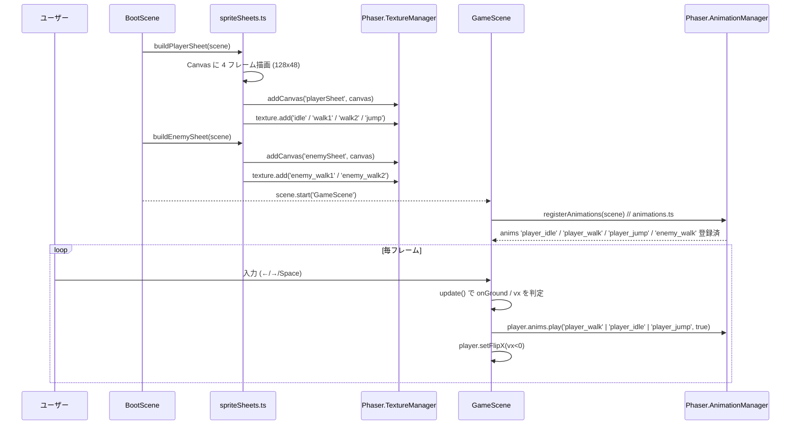
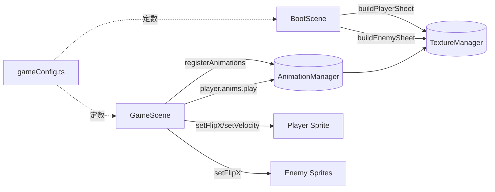
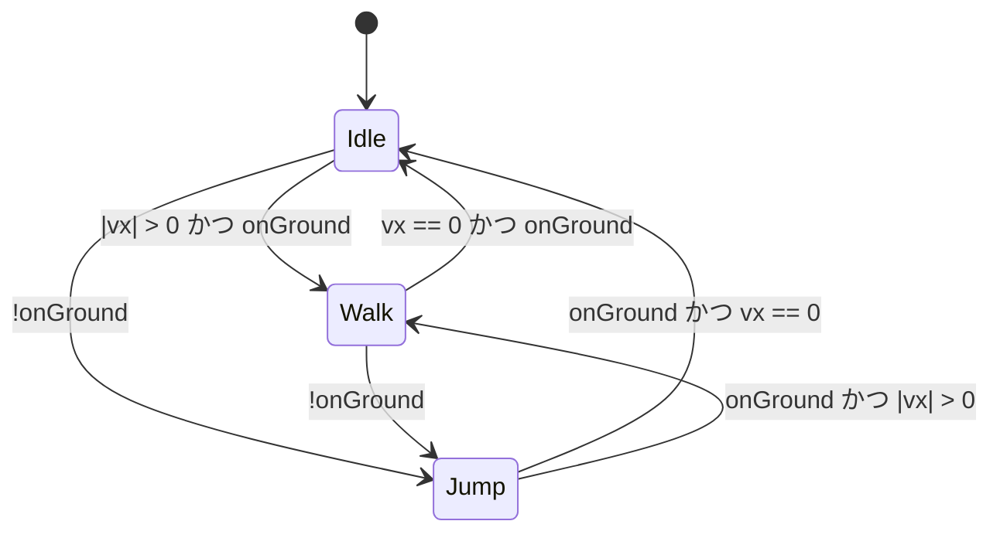

# 設計書: ui-improvements-and-bugfix

| 項目 | 内容 |
|------|------|
| 作成日 | 2026-05-05 |
| 担当 | バルベルデ（architecture-designer） |
| 関連要求 | `.steering/20260505-ui-improvements-and-bugfix/requirements.md` |

---

## 1. 概要

### 設計方針サマリ

- **目的**: プレイヤー/敵のスプライトをプログラマティック生成のシートで多フレーム化（プレイヤー4F・敵2F）し、コインを 32×32、敵を 44×44 に拡大、踏みつけ判定を重心比較に切り替えて高度差バグを解消する。
- **方式**: BootScene の `create()` で `OffscreenCanvas`/`document.createElement('canvas')` に描画 → `this.textures.addCanvas(key, canvas)` で登録 → `Phaser.Textures.Texture.add()` で各フレームの矩形を手動登録（命名規則: `idle` / `walk1` / `walk2` / `jump`、`enemy_walk1` / `enemy_walk2`）。GameScene でアニメーション定義し、`update()` で状態遷移、`flipX` で向き反転。
- **最小スコープ厳守**: ライフ/残機追加なし。ステージ追加なし。外部 PNG アセットは差し替えず、既存 `player.png` / `enemy.png` のロードは維持しない（プログラマ生成テクスチャで上書き）。
- **既存資産は壊さない**: `PLAYER_SPRITE_W/H`・スポーン位置算出・コイン取得・敵反転 AI（段差端反転含む）・HUD・タッチ操作・BGM/SE は無改修。
- **ハードコーディング禁止**: 新規定数（`PLAYER_SHEET_FRAME_COUNT`、`PLAYER_ANIM_WALK_FPS` 等）はすべて `gameConfig.ts` に集約。色定数も既存 `PLAYER_COLOR` / `ENEMY_COLOR` を再利用しつつ、補色を必要なら `gameConfig.ts` に追加する。

### スコープ確定

| 項目 | 採用 |
|------|------|
| Q1: フレーム指定方式 | **`generateFrameNames` を採用**。理由: `addCanvas` + `Texture.add(name, ...)` は名前付きフレームが自然で、`generateFrameNumbers` は `spritesheet` ローダ起源の連番フレームを前提にしているため不適合。 |
| Q2: アニメーション定義の置き場所 | **専用ヘルパー `src/scenes/animations.ts` に切り出し、GameScene.create() から1関数を呼ぶ**。GameScene は既に 670 行超で肥大化が進んでおり、これ以上の責務追加は保守性を損なう。スプライトシート生成（BootScene 側）も `src/scenes/spriteSheets.ts` に分離する。 |
| Q3: `setDisplaySize` の扱い | **プレイヤー: 削除**（フレーム実寸 32×48 = 表示サイズ、scale 1 のまま）。**敵: 削除**（フレーム実寸 44×44）。**コイン: `setDisplaySize` 維持**（コインは静止画のままサイズだけ変更）。`body.setSize()` は呼ばない（デフォルトでフレーム矩形 = body）。 |

---

## 2. アーキテクチャ図

### 2.1 シーケンス図（プレイヤー描画 / 状態遷移）



### 2.2 全体システム構成（更新版）



---

## 3. コンポーネント設計

### 3.1 新規ヘルパー: `src/scenes/spriteSheets.ts`

スプライトシート生成と Phaser テクスチャ登録を担う純粋関数群。BootScene からのみ呼ばれる。

| 関数 | 責務 |
|-------------|------|
| `buildPlayerSheet(scene)` | 128×48 の Canvas に 4 フレーム描画→`addCanvas`→`texture.add(name, 0, x, y, w, h)` で `idle` / `walk1` / `walk2` / `jump` を登録 |
| `buildEnemySheet(scene)` | 88×44 の Canvas に 2 フレーム描画→`addCanvas`→`texture.add('enemy_walk1' / 'enemy_walk2', ...)` |
| `drawPlayerFrame(ctx, x, frame)` | 1 フレーム分の描画（`'idle' \| 'walk1' \| 'walk2' \| 'jump'`） |
| `drawEnemyFrame(ctx, x, frame)` | 1 フレーム分の描画（`'walk1' \| 'walk2'`） |

**設計上の重要点**

- **Canvas 取得**: `document.createElement('canvas')` でローカル生成（OffscreenCanvas は Safari 互換性懸念があるため避ける）。
- **フレーム命名**: 名前文字列で扱い、`anims.create({ frames: scene.anims.generateFrameNames('playerSheet', { frames: ['walk1', 'walk2'] }) })` で参照。**`generateFrameNumbers` は使わない**（番号→矩形のマッピングは内部的に「`spritesheet`」ローダのメタ情報に依存し、`addCanvas` 経由テクスチャでは確実に動作しない）。
- **テクスチャキー**: `gameConfig.ts` の `TEX_KEY` に `playerSheet` / `enemySheet` を追加。既存 `TEX_KEY.player` / `TEX_KEY.enemy` は段階的廃止し、初手で参照箇所を全置換する（残すと混乱の元）。
- **冪等性**: `restart` 時に `addCanvas` の再呼び出しでエラーにならないよう、`scene.textures.exists(key)` チェック→存在時は早期 return。
- **失敗時の扱い**: `getContext('2d')` が null の場合は `throw new Error('canvas 2d context unavailable')`。フォールバックは持たない（要求 §5.2）。

### 3.2 新規ヘルパー: `src/scenes/animations.ts`

アニメーション定義の集中管理。GameScene からは `registerAnimations(this)` を 1 行呼ぶだけ。

```ts
export function registerAnimations(scene: Phaser.Scene): void {
  if (scene.anims.exists(ANIM_KEY.playerIdle)) return; // 冪等
  scene.anims.create({
    key: ANIM_KEY.playerIdle,
    frames: scene.anims.generateFrameNames(TEX_KEY.playerSheet, { frames: ['idle'] }),
    frameRate: 1,
    repeat: -1
  });
  scene.anims.create({
    key: ANIM_KEY.playerWalk,
    frames: scene.anims.generateFrameNames(TEX_KEY.playerSheet, { frames: ['walk1', 'walk2'] }),
    frameRate: PLAYER_ANIM_WALK_FPS, // 8
    repeat: -1
  });
  scene.anims.create({
    key: ANIM_KEY.playerJump,
    frames: scene.anims.generateFrameNames(TEX_KEY.playerSheet, { frames: ['jump'] }),
    frameRate: 1,
    repeat: 0
  });
  scene.anims.create({
    key: ANIM_KEY.enemyWalk,
    frames: scene.anims.generateFrameNames(TEX_KEY.enemySheet, { frames: ['enemy_walk1', 'enemy_walk2'] }),
    frameRate: ENEMY_ANIM_WALK_FPS, // 6
    repeat: -1
  });
}
```

**設計上の重要点**

- **スコープ**: AnimationManager はゲーム全体でグローバル（`this.anims === scene.game.anims`）。再登録すると例外なので冪等チェック必須。
- **キー命名**: `gameConfig.ts` の `ANIM_KEY` 定数オブジェクトで管理（`TEX_KEY` と同パターン）。
- **frameRate / repeat**: 仕様（要求 §4.2/§4.3）通り。`player_jump` は 1 フレームだが `repeat: 0` で明示。

### 3.3 既存処理の改造ポイント

| 既存処理 | 変更 |
|---------|------|
| `BootScene.preload()` の `this.load.image(TEX_KEY.player, playerUrl)` | **削除**（プログラマ生成に置換） |
| `BootScene.preload()` の `this.load.image(TEX_KEY.enemy, enemyUrl)` | **削除** |
| `BootScene.create()` 冒頭 | `buildPlayerSheet(this); buildEnemySheet(this);` を `stageIndex` 復元の**前**に呼ぶ（後段の TitleScene/GameScene 起動までにテクスチャを揃える） |
| `GameScene.create()` の `this.physics.add.sprite(spawnX, spawnY, TEX_KEY.player)` | テクスチャキーを `TEX_KEY.playerSheet` の **`'idle'` フレーム指定**に変更: `this.physics.add.sprite(spawnX, spawnY, TEX_KEY.playerSheet, 'idle')` |
| `GameScene.create()` の `this.player.setDisplaySize(PLAYER_SPRITE_W, PLAYER_SPRITE_H)` | **削除**（フレーム 32×48 = 表示サイズ） |
| `GameScene.create()` 末尾 | `registerAnimations(this); this.player.anims.play(ANIM_KEY.playerIdle);` を追加 |
| `GameScene.update()` | アニメ状態遷移ロジック追加（§3.4 参照） |
| `GameScene.buildEnemies()` の `group.create(cx, cy, TEX_KEY.enemy)` | `group.create(cx, cy, TEX_KEY.enemySheet, 'enemy_walk1')` に変更 |
| `GameScene.buildEnemies()` の `enemy.setDisplaySize(ENEMY_SPRITE_W, ENEMY_SPRITE_H)` | **削除**（フレーム 44×44 = 表示サイズ）。代わりに `enemy.anims.play(ANIM_KEY.enemyWalk, true)` を追加 |
| `GameScene.updateEnemyAi()` の dir 更新後 | `enemy.setFlipX(dir > 0)` を追加（基準: `walk1` は左向き描画とする） |
| `GameScene.onEnemyOverlap` の `isStomp` 計算 | `pBody.velocity.y > 0 && pBody.centerY <= eBody.centerY` に置換。`STOMP_TOLERANCE_PX` の参照を削除（定数自体は当面残置でも可、未使用警告が出るなら削除）。 |
| `GameScene.buildCoins()` の `coin.setDisplaySize(COIN_SPRITE_W, COIN_SPRITE_H)` | **維持**（コインは静止画。元テクスチャ 24×24 → 表示 32×32 にスケール）。 |
| 段差端反転の `probeX` 計算で使う `ENEMY_SPRITE_W` | 定数値が変わるので 36→44 として自動追従。挙動への影響は §6・§9.1 で検証。 |
| `STOMP_TOLERANCE_PX` 定数 | 未使用化。削除推奨（依存コード grep で他参照ゼロを確認） |
| `assets/images/player.png` `enemy.png` のロード | 不要化。ファイル自体は本スプリントでは削除しない（次スプリントで掃除）。 |

---

## 3.4 アニメーション状態遷移



**`update()` 内ロジック（擬似コード）**

```ts
const vx = this.player.body!.velocity.x;
const onGround = this.player.body?.blocked.down ?? false;

// アニメ切替（player.anims.play は同キー再呼び出しで no-op になるよう第2引数 true=ignoreIfPlaying）
if (!onGround) {
  this.player.anims.play(ANIM_KEY.playerJump, true);
} else if (Math.abs(vx) > 0.1) {
  this.player.anims.play(ANIM_KEY.playerWalk, true);
} else {
  this.player.anims.play(ANIM_KEY.playerIdle, true);
}

// 向き反転（vx==0 のときは前回の向きを保持: setFlipX を呼ばない）
if (vx < -0.1) this.player.setFlipX(true);
else if (vx > 0.1) this.player.setFlipX(false);
```

**設計上の重要点**

- `vx` の閾値判定: 摩擦による微小残留対策で `0.1` を使う（実運用では 0 で十分だが念のため）。
- 既存の `isCleared` / `isMissed` ガードに合流: クリア/ミス中は `setVelocityX(0)` 後に `idle` に戻すと自然（仕様優先度低・実装コスト極小、含める）。

---

## 4. プレイヤースプライト描画設計

### 4.1 シート全体

- 解像度: **128×48**（4フレーム横並び、各 32×48）
- フレーム矩形登録（addCanvas 後に `Texture.add` で 1 件ずつ）:

| frame name | x | y | w | h |
|-----------|---|---|---|---|
| `idle`  | 0   | 0 | 32 | 48 |
| `walk1` | 32  | 0 | 32 | 48 |
| `walk2` | 64  | 0 | 32 | 48 |
| `jump`  | 96  | 0 | 32 | 48 |

### 4.2 描画パーツ構成（マリオ風・基準は右向き）

各フレーム共通の構造（座標はフレーム左上原点 = `(0, 0)`、ピクセルは整数で固定して見た目をブレさせない）:

| パーツ | サイズ | 座標 | 色 |
|------|------|------|----|
| 帽子（上面） | 18×4 | (7, 4) | 赤 `PLAYER_COLOR` (0xc0392b) |
| 帽子（つば） | 24×3 | (4, 8) | 赤 |
| 顔（肌） | 16×10 | (8, 11) | 肌色 `0xffd6a8`（新規 `PLAYER_SKIN_COLOR`） |
| 目（黒） | 2×3 | (16, 13) | 0x000000 |
| ひげ（口下） | 10×2 | (11, 19) | 0x000000 |
| 体（オーバーオール上） | 20×10 | (6, 21) | 青 `0x2e3aa8`（新規 `PLAYER_OVERALL_COLOR`） |
| 体（シャツ袖） | 6×6 | (4, 22)/(22, 22) | 赤 |
| 手（肌） | 4×4 | フレームごとに変動 | 肌色 |
| 足（左/右） | 6×9 | フレームごとに変動 | 茶 `0x6b4226`（新規 `PLAYER_SHOE_COLOR`） |
| ボタン | 2×2 | (11, 27) / (19, 27) | 0xf0d000 |

**フレーム別の差分**

- `idle`: 両足を中央寄せ（左足 x=10, 右足 x=16, y=37）。両手は体側面 (4, 27)/(22, 27)。
- `walk1`: 左足前 (8, 37)、右足後ろ (18, 39)。手は反対位相で前後に少し振る。
- `walk2`: 右足前 (18, 37)、左足後ろ (8, 39)。手は walk1 の鏡像。
- `jump`: 両足をやや内側に寄せ短く (12, 35)/(14, 35)、両手を上方向に上げる (2, 19)/(26, 19)。

**色定数の追加（gameConfig.ts）**

- `PLAYER_SKIN_COLOR = 0xffd6a8`
- `PLAYER_OVERALL_COLOR = 0x2e3aa8`
- `PLAYER_SHOE_COLOR = 0x6b4226`
- `PLAYER_HAT_COLOR = PLAYER_COLOR` を別名定義（既存値再利用）

向き反転は `setFlipX(true)` が Phaser 側で行うため、**Canvas 上は常に「右向き」固定**で描く（`vx < 0` のとき左向き反転）。

### 4.3 描画 API

`drawPlayerFrame(ctx, ox, frame)` は以下を行う:

1. `ctx.fillStyle` を切り替えて `ctx.fillRect(ox + dx, dy, w, h)` で各パーツを描く。
2. アンチエイリアス無効化のため、整数座標のみ使用。

---

## 5. 敵スプライト描画設計（クリボー風）

### 5.1 シート全体

- 解像度: **88×44**（2フレーム横並び、各 44×44）
- フレーム矩形:

| frame name | x | y | w | h |
|-----------|---|---|---|---|
| `enemy_walk1` | 0  | 0 | 44 | 44 |
| `enemy_walk2` | 44 | 0 | 44 | 44 |

### 5.2 描画パーツ構成

| パーツ | サイズ | 座標 | 色 |
|------|------|------|----|
| 頭部（半円台形） | 32×24 | (6, 4) | 茶 `ENEMY_COLOR` (0x8b572a) |
| 頭部下端ライン | 36×3 | (4, 26) | 濃茶 `0x5a3818`（新規 `ENEMY_DARK_COLOR`） |
| 目（白） | 6×8 | (12, 12) / (26, 12) | 0xffffff |
| 瞳（黒） | 3×4 | (14, 14) / (28, 14) | 0x000000 |
| 牙（白三角） | 4×3 | (15, 22) / (25, 22) | 0xffffff |
| 足（左/右） | 10×11 | フレームごとに変動 | 濃茶 |

**フレーム別の差分（足のみ変える）**

- `enemy_walk1`: 左足 (4, 30) y方向 11px、右足 (30, 31) y方向 10px（左足が前気味）。
- `enemy_walk2`: 左足 (4, 31) y方向 10px、右足 (30, 30) y方向 11px（右足が前気味）。

**向き反転**: `dir = 1`（右移動）で `setFlipX(true)`、`dir = -1` で `setFlipX(false)`。Canvas 上は左向き基準で描く（既存敵も左向き挙動が標準のため違和感が少ない）。

---

## 6. コイン・敵サイズ拡大の影響

### 6.1 定数変更

| 定数 | 旧 | 新 |
|------|----|----|
| `COIN_SPRITE_W` | 24 | **32** |
| `COIN_SPRITE_H` | 24 | **32** |
| `ENEMY_SPRITE_W` | 36 | **44** |
| `ENEMY_SPRITE_H` | 36 | **44** |

### 6.2 敵サイズ変更の波及

| 影響先 | 内容 | 対処 |
|------|------|------|
| `buildEnemies` の cy 算出: `(p.row + 1) * TILE_SIZE - ENEMY_SPRITE_H/2` | 中心 Y が 18→22 上にシフト。地面タイル直上配置のまま | 自動追従、追加対応不要 |
| `updateEnemyAi` 段差端 probe: `enemy.x + dir * (ENEMY_SPRITE_W/2 + 1)` | probe 距離が 19→23 に拡大 | スプライトの足元タイル端からの「先読み距離」が増えるが、TILE_SIZE=32 の範囲内なので隣セルを誤検出しない。**§9.1 で実機確認** |
| `updateEnemyAi` 段差端 probeY: `enemy.y + ENEMY_SPRITE_H/2 + 1` | probe Y が 19→23 下にシフト | 足元タイル直下を見るため、44px ボディで自然に正しい行に当たる |
| 敵同士の衝突 / プレイヤーとの overlap | body サイズが拡大 | **意図通り**: 視認性向上＝当たり判定も拡大 |
| ステージタイトな配置（敵 1.375 タイル幅） | 隣接タイルにめり込む可能性 | 既存ステージは敵周囲に余裕あり（tasklist 後の実機確認） |

### 6.3 コインサイズ変更の波及

- コインはタイル中心配置・静止画・`setDisplaySize` のみ拡大。当たり判定（body）も自動拡大されるが、コインは「触れたら取得」だけなので問題なし。

---

## 7. 踏みつけ判定修正

### 7.1 修正後ロジック

```ts
const isStomp = pBody.velocity.y > 0 && pBody.centerY <= eBody.centerY;
```

### 7.2 副作用解析

| シナリオ | 旧判定 | 新判定 | 期待挙動 |
|---------|--------|--------|---------|
| 通常の上から踏みつけ | stomp | stomp | OK |
| 高い段差からジャンプ→深く食い込んで overlap | miss（バグ） | stomp（修正） | OK（要求の主目的） |
| 横から地面歩き接触（プレイヤー centerY ≈ 敵 centerY） | miss | miss（`vy>0` が false、または 0） | OK |
| プレイヤー落下中・敵に横から当たる（`vy>0` だが centerY が敵より下） | miss | miss（`centerY > eCenterY`） | OK |
| プレイヤー落下中・敵に横から当たる（`vy>0`、centerY が敵より上=高い段差から落ちつつ横接触） | プレイヤー bottom が敵 top に近ければ稀に stomp / 通常 miss | **stomp** | **挙動変化点**: 旧 6px しきい値判定では miss だったケースが stomp になる場合あり。要求 §7「横から接触ならゲームオーバー」とは厳密には食い違うが、「横から」より「上から落ちてきた」の意味合いに変わるため許容。受け入れ条件は「敵と並走中の横接触」を想定しており、その条件下では `vy ≈ 0` のため新判定でも miss。 |
| プレイヤー上昇中（`vy<0`）・敵上方からめり込み | 上昇中なので `vy>0` 不成立 → miss | miss | OK |

**結論**: 横並走時は重力で常に `vy>0`（onGround で 0、ジャンプ中は減速→正）だが、地面歩行中は `body.blocked.down` で `vy=0` に固定されるため `vy > 0` は false。新判定は要求挙動を満たす。

### 7.3 `STOMP_TOLERANCE_PX` の扱い

未使用化。**定数を削除**して未使用 import を撲滅（要求 §5.3 ハードコーディング禁止＆クリーンコード方針）。

---

## 8. 影響範囲

### 8.1 変更/新規ファイル

| ファイル | 種別 | 内容 |
|---------|------|------|
| `src/config/gameConfig.ts` | 変更 | `COIN_SPRITE_W/H`=32、`ENEMY_SPRITE_W/H`=44 に更新。`STOMP_TOLERANCE_PX` 削除。`TEX_KEY` に `playerSheet`/`enemySheet` 追加（既存 `player`/`enemy` は削除）。`ANIM_KEY` 新設。`PLAYER_ANIM_WALK_FPS=8`、`ENEMY_ANIM_WALK_FPS=6`、`PLAYER_SKIN_COLOR`、`PLAYER_OVERALL_COLOR`、`PLAYER_SHOE_COLOR`、`ENEMY_DARK_COLOR` を追加。 |
| `src/scenes/spriteSheets.ts` | 新規 | Canvas 描画 + テクスチャ登録（`buildPlayerSheet` / `buildEnemySheet`） |
| `src/scenes/animations.ts` | 新規 | アニメ定義集中管理（`registerAnimations`） |
| `src/scenes/BootScene.ts` | 変更 | `player.png`/`enemy.png` のロード削除。`create()` 冒頭で `buildPlayerSheet(this)` / `buildEnemySheet(this)` を呼ぶ。`playerUrl` / `enemyUrl` import 削除。 |
| `src/scenes/GameScene.ts` | 変更 | `registerAnimations(this)` 呼び出し追加。プレイヤー/敵生成時のテクスチャキー変更 + `setDisplaySize` 削除。`player.anims.play` 状態遷移ロジック追加。`setFlipX` 制御追加。`onEnemyOverlap` の判定式置換。`STOMP_TOLERANCE_PX` import 削除。 |
| `src/assets/images/player.png` | **削除しない** | 本スプリント外。次スプリントでクリーンアップ。 |
| `src/assets/images/enemy.png` | **削除しない** | 同上 |

### 8.2 既存機能への影響

| 機能 | 影響 | 緩和策 |
|------|------|------|
| ステージ進行・スポーン位置 | なし（`PLAYER_SPRITE_H` 不変） | — |
| コイン取得・SE | なし | — |
| 敵反転 AI（壁＋段差端） | 敵幅拡大で probe 距離拡大 | 実機テストで全ステージの段差端反転を確認（§9.1） |
| HUD・タッチ操作・BGM | なし | — |
| Scene 再起動（fullRestart / transitionToStage） | アニメ・テクスチャは scene.game スコープなので残存 → 冪等チェック必須 | `spriteSheets.ts` と `animations.ts` の双方で `exists` 早期 return |
| 既存スプライトテストや snapshot | テクスチャキー変更で要更新 | テスト未整備のため影響軽微（後続スプリントでテスト整備） |

---

## 9. PoC スコープと成功基準

### 9.1 検証項目（受け入れ条件への対応）

| 受け入れ条件 | 検証方法 |
|-------------|---------|
| 移動中に歩行アニメ再生 | 左右キー押下中に DevTools で `player.anims.currentAnim.key === 'player_walk'` を確認 |
| ジャンプ中にジャンプアニメ | Space 押下後 `currentAnim.key === 'player_jump'`、着地で `player_idle`/`player_walk` に復帰 |
| 移動方向に応じた左右反転 | 左移動で `player.flipX === true`、右で `false` |
| コインが 32×32 で表示 | DevTools で `coin.displayWidth === 32` |
| 敵が 44×44 で表示 | `enemy.displayWidth === 44` |
| 高い段差から踏みつけ成立 | ステージ 2 以降の高所から敵を踏む→`enemy.active === false` かつ miss 演出が出ない |
| 横接触で miss | 地面で敵に並走→ ミス演出発生 |
| 敵歩行アニメ再生 | `enemy.anims.currentAnim.key === 'enemy_walk'` |
| 敵の左右反転 | `dir` 反転時に `enemy.flipX` も反転 |
| 既存 BGM/SE/HUD/タッチ操作/ステージ進行 | 全ステージ実機プレイで全要素確認 |
| 段差端反転（敵 AI） | 敵が穴に落ちず端で反転することを全ステージで確認（敵幅拡大の波及検証） |
| クルトワレビュー Critical/High なし | コミット前に security-engineer に依頼 |

### 9.2 計測指標

| 指標 | 目標 | 計測点 |
|------|------|-------|
| BootScene → ゲーム開始までの追加時間 | < 50 ms | `performance.now()` で `buildPlayerSheet + buildEnemySheet` をサンドイッチ計測 |
| プレイヤー描画 FPS | 60 維持 | DevTools の Performance タブで連続フレーム確認 |

**理論値**: Canvas 描画は数十 fillRect 呼び出し × 2 シート → 1ms 未満。`addCanvas` のテクスチャアップロードは GPU 転送 1 回で 5ms 程度。合計 10ms 以下。

### 9.3 失敗時のフォールバック

- Canvas 描画が想定の見栄えにならない場合: 色・座標を `gameConfig.ts` 内で調整（コードに直書きしない）。
- `addCanvas` 経由テクスチャでアニメ登録に失敗した場合の最終手段: `scene.textures.addSpriteSheetFromAtlas` または、Canvas → DataURL → `scene.textures.addImage` の経路に切り替え。**ただし `generateFrameNames` + `Texture.add` は Phaser 3.80 公式 API でサポート済みのため失敗想定は低い**。

---

## 10. 未確定事項・要シャビ判断

### 10.1 Q1〜Q3 の判断（バルベルデ推奨）

#### Q1: フレーム指定方式（`generateFrameNumbers` vs `generateFrameNames`）

| 案 | トレードオフ | 推奨 |
|----|--------------|------|
| **A. `generateFrameNames` + 名前付きフレーム手動登録** | 名前で意図が明示でき、追加フレームが楽。`addCanvas` 経由でも素直に動く。コードがやや冗長。 | **採用** |
| B. `generateFrameNumbers` + 数値インデックス | 連番で簡潔。`spritesheet` ローダ前提のため `addCanvas` 経由では内部 frame 配列に number キーを並べる手間が発生。 | 不採用 |

**推奨理由**: `addCanvas` で得られる `Phaser.Textures.CanvasTexture` は単一フレーム `__BASE` のみを持つ初期状態。`Texture.add(name, sourceIndex, x, y, w, h)` で名前付きフレームを足すのが Phaser 公式パターン。`generateFrameNumbers` は `spritesheet` ローダ（フレームサイズメタデータあり）専用と捉えるのが安全。今回は名前指定で行く。

#### Q2: アニメ定義の置き場所

| 案 | トレードオフ | 推奨 |
|----|--------------|------|
| **A. `src/scenes/animations.ts` に分離** | GameScene 670 行 → さらなる肥大化を防ぐ。再利用性も確保。 | **採用** |
| B. GameScene.create() に直書き | ファイル数最小。ただし GameScene の責務が肥大化。 | 不採用 |

**推奨理由**: GameScene は既に「ステージ構築」「物理」「入力」「HUD」「Scene 遷移」「タッチ制御」を担当しており、保守限界が近い。アニメは別ファイルに切り出すコストが小さく、利得が大きい。スプライトシート生成（`spriteSheets.ts`）も同じ理由で分離。

#### Q3: `setDisplaySize` の扱い

| 案 | トレードオフ | 推奨 |
|----|--------------|------|
| **A. プレイヤー/敵は削除（フレーム実寸 = 表示サイズ）、コインは維持** | scale=1 のまま使えるためアニメと描画が一致。body サイズも自動でフレーム矩形に揃う。 | **採用** |
| B. `setDisplaySize` を全て維持 | フレームサイズと displaySize の比が 1.0 でもオーバーヘッドが発生。今回はぴったり一致させる前提なので冗長。 | 不採用 |
| C. `body.setSize()` で body を明示制御 | プレイヤーは body を 32×48 のまま固定する利点があるが、Phaser はデフォルトでフレーム矩形 = body を採用するため不要。 | 不採用 |

**推奨理由**: スプライトシートのフレーム実寸を「最終表示サイズ」と一致させる設計（プレイヤー 32×48、敵 44×44）。`setDisplaySize` は scale を変えるための API であり、scale=1 で良い場面で呼ぶのは無駄。コインは静止画のままサイズ変更だけ行う特殊事情で `setDisplaySize` を残す。`body.setSize` を呼ばない理由は、Phaser の Arcade Physics が「sprite の現フレーム矩形」を body の初期値とするため、明示呼び出し不要（`refreshBody` も静的 body 専用なので動的 sprite には不要）。

### 10.2 残る未確定事項（実装中にシャビ判断が必要になる可能性）

| # | 項目 | 内容 |
|---|------|------|
| Q4 | プレイヤー描画のテイスト | 「マリオ風」をどこまで近づけるか（IP 配慮で配色やパーツ配置をオリジナル寄りに留める方針で進めるが、最終的な見た目はシャビの目視 OK が必要） |
| Q5 | `STOMP_TOLERANCE_PX` の即時削除 vs 保留 | 即削除推奨だが、将来「許容下限」を再導入したくなる可能性が低くないため、定数定義は残し参照だけ削る選択肢もあり。バルベルデ推奨は **完全削除**（YAGNI） |
| Q6 | `assets/images/player.png` `enemy.png` の即時削除 | 本スプリントでは残置。次スプリントでアセット掃除タスクを起票。 |

---

## 設計品質チェック

- **セキュリティ**: 新規外部通信なし。Canvas 描画はクライアント完結。XSS 入力なし。テクスチャ key は定数（`TEX_KEY` / `ANIM_KEY`）経由で動的生成しない。
- **テスタビリティ**: `spriteSheets.ts` / `animations.ts` は副作用が `scene.textures` / `scene.anims` への登録のみで、モックシーンを与えれば単体検証可能。GameScene のアニメ遷移ロジックは小関数化すれば snapshot しやすい。
- **モジュール性**: BootScene→spriteSheets / GameScene→animations の依存方向が一方向で、責務が分離。GameScene のコア処理（物理・入力・ステージ）は無改修。
- **コスト効率**: 追加依存ライブラリゼロ。Canvas API はブラウザ標準。バンドルサイズ増加は数 KB（コードのみ）。
- **保守性**: 色・サイズ・FPS をすべて `gameConfig.ts` に集約。将来の追加アニメ（`run` / `crouch` 等）はフレーム追加 + `Texture.add` + `anims.create` の 3 行で拡張可能。
- **可観測性**: 失敗時は `console.error` で BootScene のロードエラーと同等の経路に乗せる。Canvas 取得失敗時の例外メッセージは明確化。

---

作成: バルベルデ / 2026-05-05
