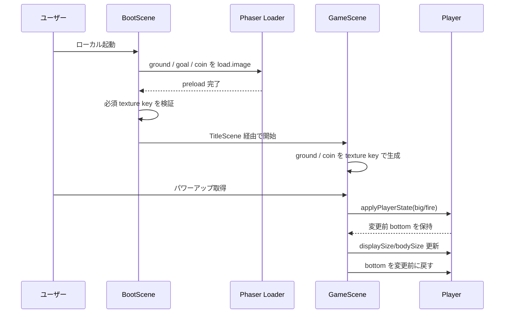
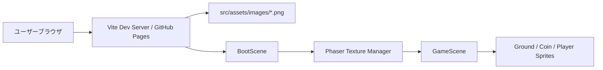
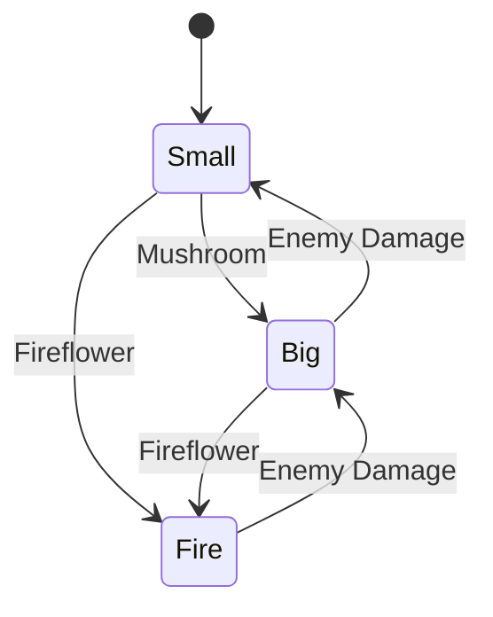

# 設計書: スプライトアセット表示とプレイヤー足元補正

| 項目 | 内容 |
|------|------|
| 作成日 | 2026-05-13 |
| 担当 | モドリッチ |
| 関連要求 | `.steering/20260513-fix-sprite-assets-and-player-anchor/requirements.md` |

---

## 1. 概要

### 設計方針サマリ

- **目的**: ローカル起動時に地面・コインの画像を欠落なく表示し、プレイヤー拡大時も足元の接地位置を維持する。
- **方式**: `BootScene` でロード完了後に必須テクスチャの存在を検証し、`GameScene` ではサイズ変更後の static body / player body を明示的に同期する。ビルド時は PNG を data URI にせず実ファイルとして出力する。
- **最小スコープ厳守**: 新規アセット、ステージ構造、スコア・ライフ仕様、PWA 設定は変更しない。
- **既存資産は壊さない**: `TEX_KEY` 抽象化、Vite import、Arcade Physics、`window.location.reload()` フォールバックを維持する。
- **ハードコーディング禁止**: 新規 URL / エンドポイント / シークレット / AWS 情報は追加しない。寸法は既存 `gameConfig.ts` 定数を使う。

### スコープ確定

| 項目 | 採用 |
|------|------|
| 必須テクスチャ検証 | 採用。ロード失敗や key 不一致を `BootScene` で早期検出する |
| 画像配置の変更 | 不採用。既存の `src/assets/images/` + Vite import を維持し、原因を局所修正する |
| プレイヤー下端維持 | 採用。`applyPlayerState()` 内で状態変更前後の body bottom を保存・復元する |

---

## 2. アーキテクチャ図

### 2.1 シーケンス図

### 2.2 全体システム構成（更新版）

---

## 3. コンポーネント設計

### 3.1 フロントエンド側

| ファイル | 責務 |
|---------|------|
| `src/scenes/BootScene.ts` | 地面・ゴール・コイン画像のロードと必須 texture key の検証 |
| `src/scenes/GameScene.ts` | 地形・コイン生成、プレイヤー状態変更時の表示サイズ・body サイズ・下端位置同期 |
| `src/config/gameConfig.ts` | 既存のテクスチャキーと寸法定数を継続利用 |
| `vite.config.ts` | Phaser Loader が画像 URL を扱えるよう、PNG を build 時に外部 asset として出力 |

**設計上の重要点**

- `BootScene.create()` は Loader 完了後に呼ばれるため、ここで `this.textures.exists(TEX_KEY.ground)` などを検証できる。
- `GameScene.buildStage()` / `buildCoins()` は `setDisplaySize()` 後に `refreshBody()` を維持し、static body と表示サイズを同期する。
- `applyPlayerState()` は body の `bottom` を状態変更前に取得し、`setDisplaySize()` と `setSize()` 後に `body.bottom = previousBottom` へ戻す。

### 3.2 既存処理の改造ポイント

| 既存処理 | 変更 |
|---------|------|
| `BootScene.preload()` | import 済み画像のロードは維持。必要なら source ログを整理する |
| `BootScene.create()` | 必須テクスチャが存在しない場合に明示エラーを出す |
| `GameScene.applyPlayerState()` | サイズ変更前後でプレイヤー下端を維持する |
| ステージ定義・敵 AI・コイン取得 | 変更なし |

---

## 4. 状態変更設計

### 4.1 プレイヤー状態変更

### 4.2 下端維持ルール

| 状態 | 表示幅 | 表示高 | 下端補正 |
|------|--------|--------|----------|
| `small` | `PLAYER_SPRITE_W` | `PLAYER_SPRITE_H` | 状態変更前の body bottom を維持 |
| `big` | `PLAYER_SPRITE_W * BIG_SCALE` | `PLAYER_SPRITE_H * BIG_SCALE` | 状態変更前の body bottom を維持 |
| `fire` | `PLAYER_SPRITE_W * BIG_SCALE` | `PLAYER_SPRITE_H * BIG_SCALE` | 状態変更前の body bottom を維持 |

---

## 5. エラーハンドリング

| シナリオ | フロントエンド側挙動 |
|---------|---------------------|
| PNG ロード失敗 | 既存 `loaderror` で key と src を `console.error` に出す |
| 必須 texture key 不在 | `BootScene.create()` で明示エラーを投げ、原因 key を特定可能にする |
| プレイヤー body 未生成 | `applyPlayerState()` 呼び出し前提を維持し、body がある場合のみ下端補正する |

---

## 6. 影響範囲

### 6.1 変更/新規ファイル

| ファイル | 種別 | 内容 |
|---------|------|------|
| `.steering/20260513-fix-sprite-assets-and-player-anchor/design.md` | 新規 | 本設計書 |
| `src/scenes/BootScene.ts` | 変更 | 必須テクスチャ検証の追加 |
| `src/scenes/GameScene.ts` | 変更 | プレイヤー状態変更時の下端維持 |
| `vite.config.ts` | 変更 | `assetsInlineLimit: 0` により小さい PNG の data URI 化を防ぐ |

### 6.2 既存機能への影響

| 機能 | 影響 | 緩和策 |
|------|------|------|
| 地面・コイン表示 | 軽微 | key 検証と既存 `refreshBody()` 維持で表示・当たり判定を同期 |
| パワーアップ | 軽微 | 状態遷移は変えず、サイズ変更時の座標補正だけ追加 |
| ステージ進行 | なし | `transitionToStage()` と restart 経路は変更しない |

---

## 7. PoC スコープと成功基準

### 7.1 検証項目（受け入れ条件への対応）

| 受け入れ条件 | 検証方法 |
|-------------|---------|
| 地面タイルが画像として表示される | ローカル起動後、ステージ画面を目視確認する |
| コインが画像として表示される | ローカル起動後、コイン配置が目視できることを確認する |
| 拡大時に足元が浮かない | キノコまたはファイアフラワー取得後、プレイヤー下端が床面に接していることを確認する |
| `npm run build` が成功する | TypeScript / Vite build を実行する |

### 7.2 計測指標

| 指標 | 目標 | 計測点 |
|------|------|-------|
| 追加依存 | 0 | `package.json` 差分 |
| 毎フレーム処理増加 | 0 | `update()` 内に新規処理を追加しない |

### 7.3 失敗時のフォールバック

- Vite import 経路が原因の場合は、`new URL('../assets/images/*.png', import.meta.url).href` へ切り替える。
- それでも読み込みが不安定な場合は、既存方針を見直して `public/assets/images/` 参照へ寄せる判断を別途行う。

---

## 8. 未確定事項・要シャビ判断

### 8.1 Q1〜Q3 の判断（モドリッチ推奨）

#### Q1: アセット表示欠落の主因

| 案 | トレードオフ | 推奨 |
|----|--------------|------|
| **A. texture key のロード済み保証を追加** | 小さい変更で原因を特定しやすい | 採用 |
| B. 画像配置を `public/` に移す | 配信パスは単純になるが既存設計との差分が大きい | 不採用 |

**推奨理由**: 既存設計は Vite import に寄せているため、まず key 検証で欠落を明示し、配置変更は最後の手段にする。

#### Q2: 地面・コイン修正の範囲

| 案 | トレードオフ | 推奨 |
|----|--------------|------|
| **A. `src/assets/images/` 維持** | 最小差分で既存ドキュメントと一致する | 採用 |
| B. `public/assets/images/` へ移行 | URL 管理が増え、PWA cache 対象も再整理が必要 | 不採用 |

#### Q3: プレイヤー足元補正の配置

| 案 | トレードオフ | 推奨 |
|----|--------------|------|
| **A. `applyPlayerState()` に閉じる** | 状態変更の責務内に補正を集約できる | 採用 |
| B. 汎用ヘルパー化 | 今回は利用箇所が少なく抽象化が過剰 | 不採用 |

### 8.2 残る未確定事項

| # | 項目 | 内容 |
|---|------|------|
| Q4 | 実機確認結果 | key 検証追加後も表示欠落が残る場合のみ、画像 URL 生成方式の切り替えを判断する |

---

## 設計品質チェック

- セキュリティ: 外部通信、ユーザー入力、認証、シークレット、URL ハードコーディングを追加しない。
- テスタビリティ: `npm run build` とローカル起動の目視確認で検証する。
- モジュール性: 変更は `BootScene` と `GameScene` に限定し、ステージ定義や設定定数を壊さない。
- コスト効率: 追加依存なし、アセット追加なし。
- 保守性: `TEX_KEY` と `gameConfig.ts` 定数利用を維持する。
- 可観測性: 既存 `loaderror` と追加の missing texture エラーで原因 key を特定可能にする。

---

作成: モドリッチ / 2026-05-13
