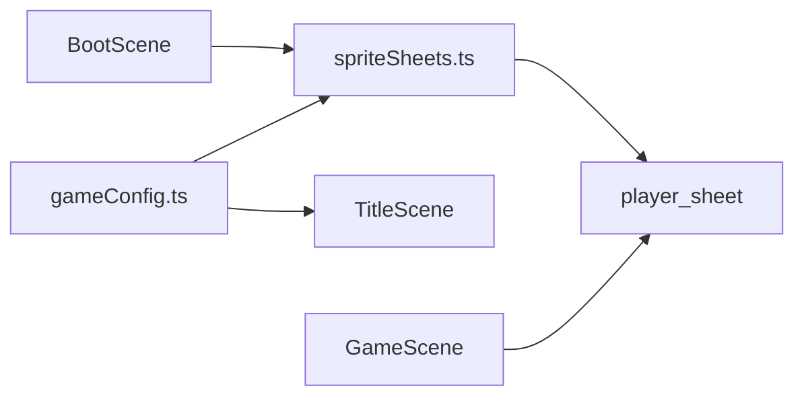

# 設計書: original-character-chiku

| 項目 | 内容 |
|------|------|
| 作成日 | 2026-05-14 |
| 担当 | モドリッチ |
| 関連要求 | `.steering/20260514-original-character-chiku/requirements.md` |

---

## 1. 概要

### 設計方針サマリ

- **目的**: 主人公を時計職人「チク」として再デザインし、既存ゲーム性を維持する。
- **方式**: 既存の Canvas ベーススプライト生成を更新し、色・文言は `gameConfig.ts` に集約する。
- **最小スコープ厳守**: 物理、ステージ、敵、踏みつけ判定、新攻撃アクションは変更しない。
- **既存資産は壊さない**: `PLAYER_SPRITE_W/H` と足元描画ルールを維持する。
- **ハードコーディング禁止**: 主要色とタイトルは `src/config/gameConfig.ts` に集約する。

### スコープ確定

| 項目 | 採用 |
|------|------|
| チクの見た目変更 | 採用。ゴーグル、深緑ベスト、真鍮アクセントで差別化する。 |
| 武器追加 | 不採用。ユーザー要望どおり追加しない。 |
| 物理変更 | 不採用。ジャンプと踏みつけは維持する。 |

---

## 2. システム構成

---

## 3. コンポーネント設計

### 3.1 `src/config/gameConfig.ts`

| 定数 | 変更 |
|------|------|
| `GAME_TITLE` | `CHIKU CLOCK RUN` に変更 |
| `PLAYER_COLOR` | 赤から深緑の作業帽色へ変更 |
| `PLAYER_VEST_COLOR` | 深緑ベスト用に追加 |
| `PLAYER_SHIRT_COLOR` | 白シャツ用に追加 |
| `PLAYER_BRASS_COLOR` | ゴーグル・ボタン用に追加 |
| `PLAYER_GOGGLE_LENS_COLOR` | ゴーグルレンズ用に追加 |
| `PLAYER_SHOE_COLOR` | 既存 E2E と接地判定のため維持 |

### 3.2 `src/scenes/spriteSheets.ts`

`drawPlayerFrame()` を時計職人シルエットへ更新する。
頭部は作業帽とゴーグル、胴体は白シャツと深緑ベスト、足元は既存の茶色ブーツを描く。

`drawPlayerSoleSeal()` は維持し、フレーム下端まで靴色が残ることを保証する。

---

## 4. 影響範囲

| ファイル | 種別 | 内容 |
|---------|------|------|
| `src/config/gameConfig.ts` | 変更 | チク用の色・タイトル定数を追加/変更 |
| `src/scenes/spriteSheets.ts` | 変更 | プレイヤーと成長アイテムの描画更新 |
| `.steering/20260514-original-character-chiku/*` | 新規 | 今回作業の要求・設計・タスク管理 |

---

## 5. 検証

| 受け入れ条件 | 検証方法 |
|-------------|---------|
| タイトル変更 | `GAME_TITLE` と起動画面を確認 |
| チクとして描画 | E2E と目視確認 |
| 既存挙動維持 | `npm run test:e2e` |
| 型・ビルド | `npm run build` |

---

## 設計品質チェック

- セキュリティ: 外部 URL、シークレット、ユーザー入力を追加しない。
- テスタビリティ: 既存 E2E の足元接地検証を維持する。
- 保守性: 色と文言は `gameConfig.ts` に集約する。

---

作成: モドリッチ / 2026-05-14
