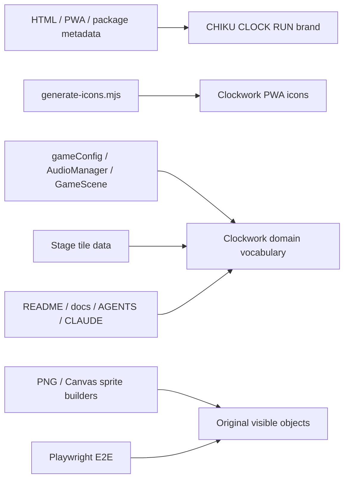

# 設計書

## アーキテクチャ概要

本変更は `CHIKU CLOCK RUN` の既存ゲームループを維持したまま、ブランド識別子、表示用語、描画アセット、内部ドメイン語彙を時計工房の世界観へ置換するフロントエンド変更である。

- Phaser の Scene 構成、ステージ文字配列、物理処理、入力処理、能力効果は変更しない
- 外部サービスや新規ライブラリは追加しない
- PNG アセットは既存の静的ロード方式を継続し、Canvas 生成中のアイテムとアイコンはコードで新意匠を生成する
- 旧ブランドの sessionStorage キーは読み取り移行のみ対応し、書き込みは新キーへ一本化する



## オリジナル語彙マッピング

機能効果は維持し、表示・コード命名・説明で使用するドメイン語彙を以下に統一する。ステージタイル文字はレイアウト互換性と変更範囲を抑えるため維持する。

| 現在の概念 / 識別子 | 新しい概念 | 主な新識別子 | 効果 |
|---|---|---|---|
| `coin` / コイン | 歯車片 / Gear Bit | `gearBit`, `GEAR_BIT_*`, `HUD_GEAR_LABEL` | 収集カウント |
| enemy / クリボー風敵 | 巻きネジ障害機 / Winder | `winderSheet` または `enemySheet` 表示説明更新 | 踏みつけで停止 |
| goal / 赤旗 | クロックビーコン / Clock Beacon | `beacon`, `BEACON_*` | ステージクリア |
| `mushroom` / キノコ | ぜんまい / Spring Coil | `springCoil`, `SPRING_COIL_*` | small → big |
| `fireflower` / ファイアフラワー | パルスコア / Pulse Core | `pulseCore`, `PULSE_CORE_*` | 射撃状態 |
| `fireball` / 火球 | パルス弾 / Pulse Bolt | `pulseBolt`, `PULSE_BOLT_*` | 敵を停止 |
| `star` / スター | クロノクリスタル / Chrono Crystal | `chronoCrystal`, `CHRONO_*` | 一定時間無敵 |

### 命名の境界

- `playerState` の値 `'small' | 'big' | 'fire'` は能力状態を示す内部契約として今回は維持する。画面・文書上では `fire` を「パルス能力」と記述する
- `enemy` は一般語であり既存作品固有ではないため、物理ロジックの型名や `onEnemyOverlap` は必要に応じて維持できる。ただし表示・アセット造形・現行文書では「巻きネジ障害機」とする
- `goal` は一般語であり、イベント処理名 `onGoalHit` は維持可能。表示アセットと説明は「クロックビーコン」へ変える
- タイル文字 `C` / `M` / `F` / `S` はデータ形式であり、全ステージのレイアウトを書き換える必要がないため維持し、コメントと仕様書に新しい意味を定義する

## コンポーネント設計

### 1. ブランドメタデータ

**対象**:

- `index.html`
- `vite.config.ts`
- `package.json`
- `package-lock.json`
- `src/config/gameConfig.ts`

**責務**:

- 表示名を `CHIKU CLOCK RUN` に揃える
- package / PWA の機械識別名を `chiku-clock-run` に揃える
- ストレージキーを新ブランドへ移行する

**実装の要点**:

- HTML `<title>` と PWA `name` は `CHIKU CLOCK RUN`
- PWA `short_name` と npm package 名は `chiku-clock-run`
- `STAGE_INDEX_STORAGE_KEY` を `chiku-clock-run.stageIndex` に変更する
- `LEGACY_STAGE_INDEX_STORAGE_KEY = 'mario-game.stageIndex'` を移行用定数として追加する
- `BootScene` は新キーを優先して読み、存在しない場合のみ旧キーを読み取る。読み取り後は利用したキーと旧キーを削除する
- `GameScene` のハードリロード時書き込みは新キーのみを使用する

### 2. PWA アイコン生成

**対象**:

- `scripts/generate-icons.mjs`
- `public/icons/icon-192.png`
- `public/icons/icon-512.png`
- `public/icons/icon-maskable-512.png`

**意匠**:

- 深緑から青緑の背景
- 真鍮色の外周歯車リング
- 明るい文字盤と時計針
- maskable 版は中心モチーフを safe zone 内に収める

**実装の要点**:

- 現行の `isLetterM()` / 赤白配色を廃止する
- 円・歯・針を正規化座標で描画するピクセル判定関数に置換する
- Node.js 標準ライブラリのみの PNG 出力方式は維持する
- `npm run generate-icons` で生成済み PNG を更新する

### 3. 静的画像アセット

**対象**:

- `src/assets/images/coin.png`
- `src/assets/images/goal.png`
- `src/assets/images/ground.png`（目視判断により必要な場合）
- `src/scenes/BootScene.ts`

**意匠**:

| アセット | 新表現 | 描画条件 |
|---|---|---|
| `coin.png` | 真鍮色の歯車片 | 取得物として背景上で判別可能 |
| `goal.png` | 青緑 / 真鍮色のクロックビーコン | 赤旗の輪郭を残さず、縦長当たり判定に収まる |
| `ground.png` | 時計工房の床タイル | 現物が既存作品を想起させる場合のみ置換 |

**実装の要点**:

- `TEX_KEY.coin` / `TEX_KEY.goal` を `gearBit` / `beacon` へ変更する場合、画像ファイルも `gear-bit.png` / `beacon.png` にリネームし `BootScene` のロード定義を更新する
- 新 PNG はプロジェクト固有のオリジナル画像として作成し、旧 Kenney 画像に依存しない
- `ground.png` は既存の装飾床として特定作品の代表記号ではないため、色調が世界観と大きく衝突しない限り変更対象外とする

### 4. Canvas 生成スプライト

**対象**:

- `src/config/gameConfig.ts`
- `src/scenes/spriteSheets.ts`
- `src/scenes/BootScene.ts`
- `src/scenes/animations.ts`（必要なキー名変更のみ）

**責務**:

- 敵と各能力アイテムを独自シルエットで生成する
- 描画サイズおよび物理当たり判定に影響を与えない

**意匠と実装**:

| オブジェクト | 生成関数 | 造形 |
|---|---|---|
| 巻きネジ障害機 | `buildWinderSheet` | 角形ボディ、巻き鍵、脚部を持つ機械。茶色きのこ形・牙を廃止 |
| ぜんまい | `buildSpringCoilSheet` | 真鍮色の螺旋コイルと台座 |
| パルスコア | `buildPulseCoreSheet` | 発光する六角コアと導線 |
| クロノクリスタル | `buildChronoCrystalSheet` | 水色の結晶と内部時計針 |
| パルス弾 | `buildPulseBoltSheet` | 青白い電力球または菱形パルス |

**制約**:

- 既存の `*_SPRITE_W` / `*_SPRITE_H` の値は維持し、接触判定・ステージ配置を変えない
- 色定数は `gameConfig.ts` に集約する
- `textures.exists()` による二重生成防止を維持する

### 5. ゲームランタイム命名

**対象**:

- `src/config/gameConfig.ts`
- `src/audio/AudioManager.ts`
- `src/scenes/GameScene.ts`
- `src/stages/stage01.ts`
- `src/stages/stage02.ts`
- `src/stages/stage03.ts`

**データ・関数変更**:

| 旧 | 新 |
|---|---|
| `coins`, `coinTotal`, `coinsCollected`, `coinHud` | `gearBits`, `gearBitTotal`, `gearBitsCollected`, `gearHud` |
| `buildCoins`, `onCoinOverlap`, `formatCoinHud` | `buildGearBits`, `onGearBitOverlap`, `formatGearHud` |
| `mushrooms`, `buildMushrooms`, `onMushroomOverlap` | `springCoils`, `buildSpringCoils`, `onSpringCoilOverlap` |
| `fireflowers`, `buildFireflowers`, `onFireflowerOverlap` | `pulseCores`, `buildPulseCores`, `onPulseCoreOverlap` |
| `stars`, `buildStars`, `onStarOverlap` | `chronoCrystals`, `buildChronoCrystals`, `onChronoCrystalOverlap` |
| `fireballs`, `tryShootFireball`, `onFireball...` | `pulseBolts`, `tryShootPulseBolt`, `onPulseBolt...` |
| `isStarInvincible`, `starTimer`, `startStarInvincible` | `isChronoShielded`, `chronoTimer`, `startChronoShield` |

**効果の維持**:

- `Spring Coil`: `small` のときだけ `big` へ移行
- `Pulse Core`: `fire` 状態へ移行し、`Z` / 右ダブルタップでパルス弾発射
- `Chrono Crystal`: 現行の無敵時間・点滅挙動をそのまま利用
- `Gear Bit`: 現行の取得カウント、クリア時表示を維持

**音声イベント**:

`SeKey` と `SE_PARAMS` を見た目の名称に合わせて以下へ変更する。合成音のパラメータはゲームバランス変更を避けるため原則維持する。

| 旧キー | 新キー |
|---|---|
| `coin` | `gearBit` |
| `goal` | `beacon` |
| `mushroom` | `springCoil` |
| `powerup` | `pulseCore` |
| `fireball` | `pulseBolt` |
| `star` | `chronoCrystal` |

### 6. 文書

**対象**:

- `README.md`
- `AGENTS.md`
- `CLAUDE.md`
- `docs/product-requirements.md`
- `docs/functional-design.md`
- `docs/architecture.md`
- `docs/repository-structure.md`
- `docs/development-guidelines.md`
- `docs/glossary.md`

**実装の要点**:

- 現在仕様のブランド名とドメイン語彙を新名称へ変更する
- 既存実装との乖離がある v0.x の説明は現在状態に合わせて更新する
- `.steering/` の過去スプリントは履歴保存のため変更しない
- 公開 URL 例のリポジトリ名は移行がスコープ外なので、既存の実 URL として必要な箇所は「現在の公開パス例」と明記するか、`<repository-name>` プレースホルダに一般化する

## データフロー

### 起動時ストレージキー移行

```text
1. BootScene が `chiku-clock-run.stageIndex` を確認する
2. 新キーが存在しない場合のみ `mario-game.stageIndex` を確認する
3. 値を Number.parseInt と STAGES.length で検証する
4. 有効なら GameScene の stageIndex として利用する
5. 新旧両キーを削除する
6. 以後のハードリロード保存は新キーのみに書き込む
```

### 収集・能力取得

```text
1. StageDefinition の既存タイル文字を GameScene が解析する
2. `C` は Gear Bit、`M` は Spring Coil、`F` は Pulse Core、`S` は Chrono Crystal の Sprite を生成する
3. player overlap により対応する新名称コールバックを実行する
4. 既存と同じ効果・音声合成パラメータ・HUD 更新を適用する
```

## エラーハンドリング戦略

### 画像ロード

- `BootScene` の必須テクスチャ検証を維持する
- 新しい静的画像のロードに失敗した場合は、キーと URL を含む既存エラー経路で起動を中断し、不完全描画を許可しない

### ストレージ移行

- `sessionStorage` 使用不可時は従来どおり stage 0 で起動する
- 旧キー値が不正の場合は無視して削除し、不正な遷移を起こさない

### 生成スプライト

- Canvas context 作成失敗および `textures.addCanvas()` 失敗は現行同様に例外とする

## テスト戦略

### 静的検証

- `rg` で現在仕様の対象ファイルから `mario-game`、`Mario-like`、「マリオ風」、「クリボー風」、`mushroom`、`fireflower`、`fireball` の残存を検査する
- 旧ストレージキーは移行定数および移行テスト対象としてのみ許可する

### E2E テスト

**対象**: `tests/e2e/game-visual.spec.ts`

- 既存の coin 色判定を Gear Bit の真鍮色パレット判定へ変更する
- 起動した canvas 上に Gear Bit と新しいゴールまたは障害機の特徴色が存在することを検証する
- 必要に応じて Stage 1 の能力アイテムへプレイヤーを移動させ、Spring Coil / Pulse Core の描画または状態変化を検証する
- 意味のない固定アサーションは使用せず、ピクセル数またはランタイム状態を入力操作と結び付けて確認する

### コマンド検証

```bash
npm run generate-icons
npm run typecheck
npm run build
npm run test:e2e
```

`package.json` に `lint` または unit test script が存在しないため、存在しないコマンドは実行対象に含めない。

## 依存ライブラリ

新規依存は追加しない。

## ディレクトリ構造

```text
index.html
package.json
package-lock.json
vite.config.ts
scripts/
  generate-icons.mjs
public/icons/
  icon-192.png
  icon-512.png
  icon-maskable-512.png
src/
  assets/images/
    gear-bit.png       # coin.png の置換時
    beacon.png         # goal.png の置換時
  audio/
    AudioManager.ts
  config/
    gameConfig.ts
  scenes/
    BootScene.ts
    GameScene.ts
    spriteSheets.ts
  stages/
    stage01.ts
    stage02.ts
    stage03.ts
tests/e2e/
  game-visual.spec.ts
README.md
AGENTS.md
CLAUDE.md
docs/
  product-requirements.md
  functional-design.md
  architecture.md
  repository-structure.md
  development-guidelines.md
  glossary.md
```

## 実装の順序

1. テストと残存語彙検索の基準を更新し、変更前に新期待値で失敗することを確認する
2. ブランドメタデータ、保存キー移行、PWA アイコンを更新する
3. 静的画像と Canvas 生成スプライトを独自意匠へ置換する
4. `gameConfig` / `AudioManager` / `GameScene` / ステージコメントの語彙を一貫して変更する
5. README と永続ドキュメントを現在仕様へ更新する
6. 生成・型チェック・ビルド・E2E・残存語彙検索を実行する
7. コミットする場合はクルトワによる全変更ファイルのセキュリティレビューを行う

## セキュリティ考慮事項

- 外部画像 URL、外部 API、WebSocket、シークレットを追加しない
- 静的アセットはローカルバンドルのみとし、CSP の許可範囲を拡大しない
- `VITE_BASE_PATH` の環境変数利用を維持し、GitHub Pages URL をソースに固定しない
- ドキュメントの URL 記述はプレースホルダまたは公開配信方式の説明に限定し、秘密情報を記載しない
- 旧 sessionStorage キー移行処理は数値検証を通した値のみ受け付ける

## パフォーマンス考慮事項

- スプライト寸法、同時 Sprite 数、物理コライダー数は変更しない
- PNG と Canvas 描画は既存と同程度の小サイズに保つ
- PWA アイコンの生成はビルド前の手動生成であり、ランタイム性能に影響しない

## 将来の拡張性

- ドメイン語彙を時計工房の設定へ揃えることで、今後のステージ背景、敵派生、能力アイテム追加を同じルールで命名できる
- タイル文字を維持するため、既存ステージデータを壊さずに表示体系だけを拡張できる
- 将来データ形式を刷新する際には `TileChar` の文字も新語彙に対応した識別子へ移行できる
