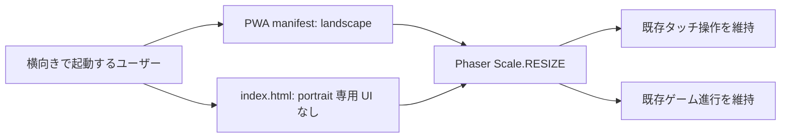
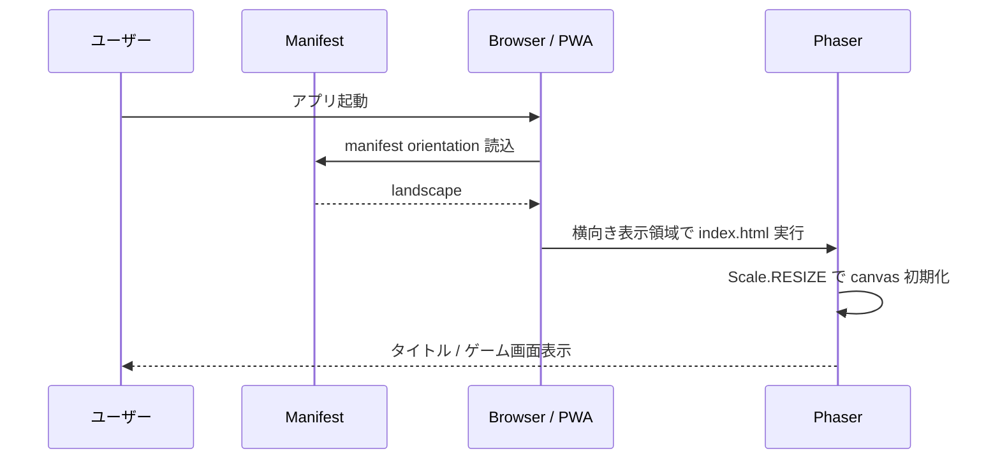

# 設計書: 横画面専用化

| 項目 | 内容 |
|------|------|
| 作成日 | 2026-05-27 |
| 担当 | バルベルデ（architecture-designer） |
| 関連要求 | `.steering/20260527-landscape-only/requirements.md` |

---

## 1. アーキテクチャ概要

本変更は画面向きの責務を「横画面のみをサポートする PWA / ブラウザゲーム」へ整理する局所変更である。
Phaser シーン、ゲームロジック、タッチ入力モデル、ステージ定義は変更せず、起動設定・PWA manifest・永続文書・回帰テストを横画面契約へ同期する。

重要な現状整理:

- `index.html` には既に `#rotate-notice` または `@media (orientation: portrait)` は存在しない。
- `.steering/20260504-mobile-controls-responsive/decisions.md` には、回転促進オーバーレイを実装後に廃止した判断が記録されている。
- `src/main.ts` には `orientationchange` 時の `game.scale.refresh()` フォールバックが残存する。
- `vite.config.ts` の manifest は `orientation: 'any'` で、横向き専用方針と一致しない。
- `docs/` はオーバーレイ実装済み、または旧タッチ長押しモデルを示す箇所が残り、現行コードとも不一致である。



## 2. 設計判断

### D-001: 横画面専用化は manifest と仕様契約で表明する

- `vite.config.ts` の Web App Manifest `orientation` を `'landscape'` に変更する。
- PWA として起動した場合、プラットフォームへ横向き表示を希望することを宣言する。
- `screen.orientation.lock()` 等による実行時の強制回転 API は導入しない。ブラウザ対応差、ユーザー操作要件、例外処理が増えるためスコープ外とする。

### D-002: 縦向き専用の処理は追加せず、残存フォールバックを削除する

- `src/main.ts` の `window.addEventListener('orientationchange', ...)` は、縦横切替を許容する既存対応の残骸であり削除する。
- `Phaser.Scale.RESIZE` は横画面内のブラウザリサイズ、端末差、アドレスバー領域変化に引き続き必要なため維持する。
- `index.html` は現状どおり portrait 用 DOM / CSS を持たない。削除対象が存在しないためコード変更を強制せず、E2E / 静的契約で再混入を防ぐ。

### D-003: タッチ入力は画面向きではなくゲーム操作責務として維持する

- `GameScene` の左スライド移動 / 右タップジャンプ / 右ダブルタップ発射は変更しない。
- タッチ対応デバイスのうち、サポートされるプレイ姿勢を横向きに限定するだけで、入力ロジックの縮小・削除は行わない。

### D-004: 文書の古い仕様差分を同時に正す

- `docs/product-requirements.md`: F-010 を「横向き専用表示」に更新し、対応デバイス制約を横向きスマートフォンとして明記する。
- `docs/functional-design.md`: 横画面契約と現行タッチゾーンモデルを記載し、残存する `TOUCH_HOLD_MS` の旧状態遷移説明を現行実装へ置換する。
- `docs/architecture.md`: モバイル対応説明から縦向きオーバーレイを除去し、manifest の landscape 方針を記録する。
- `docs/development-guidelines.md`: orientation 制約変更時は manifest、エントリポイント、E2E、永続文書を同時確認する規約を追加する。

## 3. コンポーネント設計

### 3.1 `vite.config.ts`

**責務**:

- PWA manifest を生成する。
- インストール起動時の優先表示向きを宣言する。

**変更**:

```typescript
manifest: {
  // ...
  orientation: 'landscape',
}
```

**制約**:

- `landscape-primary` ではなく `landscape` を用いる。端末の左右回転方向を限定せず、横画面全体を許容するためである。
- `start_url`、`scope`、CSP、Service Worker 設定は変更しない。

### 3.2 `src/main.ts`

**責務**:

- Phaser ゲームを起動する。
- `Scale.RESIZE` による通常リサイズ対応を提供する。

**変更**:

削除:

```typescript
// iOS Safari では orientationchange 後に resize イベントが遅延するため強制リフレッシュする
window.addEventListener('orientationchange', () => {
  setTimeout(() => game.scale.refresh(), 200);
});
```

起動インスタンスを後続で参照しなくなるため、型チェックおよび lint 相当の未使用確認に応じて次のいずれかへ整理する:

```typescript
new Phaser.Game(config);
```

または、既存のコード品質規約がインスタンス変数を許容する場合のみ現状維持する。TypeScript の `noUnusedLocals` 設定に従い、不要な変数は残さない。

**維持**:

```typescript
scale: {
  mode: Phaser.Scale.RESIZE,
  autoCenter: Phaser.Scale.NO_CENTER
}
```

### 3.3 `index.html`

**責務**:

- Phaser のホスト要素、CSP、PWA メタ情報を提供する。

**変更方針**:

- 現時点で portrait 専用 DOM / CSS は存在しないため、機能削除のための編集は不要。
- テストは `#rotate-notice` および orientation 用 media rule が存在しないことを確認する。
- viewport のズーム抑止はタッチ中の誤ズーム防止であり、縦画面対応ではないため維持する。

### 3.4 `tests/e2e/`

**責務**:

- 横向きでのプレイ成立と、portrait 専用実装の非存在を検証する。

**追加する契約テスト**:

1. 横向き viewport（既存 `960 x 540`）でタイトルからゲームを開始でき、canvas が描画されること。
2. 生成された `dist/manifest.webmanifest` が `orientation: "landscape"` を含むこと。`npm run test:e2e` はテスト前に本番ビルドを実行し、成果物を構造化 JSON として読み込む。
3. `index.html` の DOM に `#rotate-notice` が存在しないこと。

**静的検査**:

- `src/main.ts` に `orientationchange` が残存しないことは、E2E よりもソース静的検査またはビルド前の明示確認が適切である。既存テスト方式に合わせて Playwright テスト側でファイルを直接読むか、実装検証時の `rg` 記録で担保する。

**既存回帰**:

- `tests/e2e/game-visual.spec.ts` の既存横向き viewport テストは継続して通す。
- マップ改善で追加した通行性・段階難度・状態保持進行の検証も変更せず維持する。

## 4. データフロー

### 横向き PWA / ブラウザ起動



### ブラウザが縦向きの場合

```
1. アプリ側は portrait 用 UI や専用処理を提供しない。
2. 通常の DOM / Phaser canvas がブラウザの表示領域に従って存在する。
3. portrait 状態での遊びやすさとレイアウト品質はサポート保証外とする。
```

## 5. エラーハンドリング戦略

- orientation lock API を導入しないため、許可拒否・未対応ブラウザ例外は発生しない。
- PWA manifest の orientation ヒントがブラウザで尊重されない場合、アプリ側のフォールバック UI は提供しない。横向きでの利用を対応条件として文書へ明記する。
- `Scale.RESIZE` は維持し、横向き状態での表示領域変化による描画破綻を避ける。

## 6. テスト戦略

### Red-Green-Refactor

1. **Red**: manifest が現在 `orientation: 'any'` であること、および `src/main.ts` に `orientationchange` が残ることを検出する契約テストを追加する。
2. **Green**: manifest を landscape に変更し、向き変更専用処理を削除してテストを通す。
3. **Refactor**: 文書を同期し、portrait 対応に関する古い記載・重複記述を整理する。

### 自動テスト

| テスト | 検証内容 |
|-------|----------|
| orientation 契約テスト | manifest が landscape、rotate notice 不在、向き変更専用処理不在 |
| 既存 E2E | 横向き viewport でタイトル、ゲーム開始、操作、能力、進行、描画が維持される |
| `npm run typecheck` | `src/main.ts` の削除後に型エラー・未使用参照がない |
| `npm run build` | manifest / Service Worker を含む本番ビルドが成功する |
| `npm run test:e2e` | 本番ビルド後の manifest 契約と横向きゲーム回帰を同一コマンドで検証する |

### 手動確認

- GitHub Pages / インストール済み PWA を横向きで起動し、タイトルからプレイ開始できること。
- portrait については「サポート対象外であること」を仕様確認するのみで、新しい UX を受け入れ条件にしない。

## 7. 依存ライブラリ

新しい依存ライブラリは追加しない。

## 8. 変更ファイル構造

```text
.steering/20260527-landscape-only/
  requirements.md
  design.md
  tasklist.md
  decisions.md        # 実装中に追加判断が生じた場合のみ
docs/
  product-requirements.md
  functional-design.md
  architecture.md
  development-guidelines.md
src/
  main.ts
tests/e2e/
  game-visual.spec.ts # serial 実行内へ orientation 契約を統合
package.json          # test:e2e が生成 manifest 用 build を前置する
vite.config.ts
```

`index.html` は変更対象候補として調査対象に含むが、現状既に portrait 専用 UI がないため、不要な編集は行わない。

## 9. 実装順序

1. orientation 契約テストを追加し、現在の `orientation: 'any'` / `orientationchange` 残存を Red として確認する。
2. `vite.config.ts` の manifest を landscape に変更する。
3. `src/main.ts` の orientationchange 専用フォールバックを削除し、起動コードを整理する。
4. 永続文書を現行入力モデルと横向き専用方針へ同期する。
5. typecheck、build、E2E、Browser による横向きローカル確認を実施する。
6. 実装整合性レビューを行い、コミットを依頼された場合のみクルトワのレビューへ進む。

## 10. セキュリティ考慮事項

- CSP、外部リソース許可、ユーザー入力処理は変更しない。
- manifest の orientation は公開表示設定であり、シークレット・URL・認証情報を追加しない。
- 文書更新時も実デプロイ URL や資格情報を記載せず、プレースホルダ方針を維持する。
- コミットを行う場合は、変更全体についてクルトワに XSS / インジェクション / CSP / ハードコーディング観点のレビューを依頼する。

## 11. パフォーマンス考慮事項

- `orientationchange` 後の遅延 `game.scale.refresh()` が削除され、向き変更イベント時の余分な処理はなくなる。
- ゲームループ、描画数、アセット、バンドル依存には変更がない。
- manifest 文字列変更とテスト追加による本番バンドル影響は無視できる。

## 12. 将来の拡張性

将来 portrait 対応を再導入する場合は、今回の landscape 契約を暗黙に崩さず、新たなスプリントとして以下を設計する:

- portrait 用レイアウトまたは案内 UI
- manifest orientation の再変更
- タッチ操作領域と HUD 配置の portrait 用受入テスト
- 永続文書と PWA 配信条件の再承認
