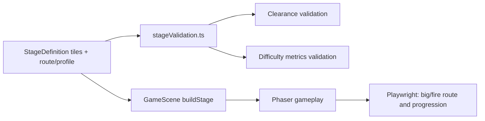

# 設計書

## アーキテクチャ概要

既存の `StageDefinition.tiles` と Phaser ランタイムは維持し、マップ定義に検証用のメタデータを加える。ステージ編集の結果を人の目だけで判断せず、必須ルートの最大プレイヤー通行性と難易度勾配を純粋関数で検査し、Playwright E2E で能力取得後の実進行を確認する。



## 設計判断

### D-001: 拡大状態の必須クリアランスは 3 タイルとする

- `big` / `fire` の表示・物理上の高さは `PLAYER_SPRITE_H * BIG_SCALE = 56 * 1.5 = 84px`。
- `TILE_SIZE = 32px` のため、床面から上に必要な空間は `ceil(84 / 32) = 3` タイル。
- 必須ルートでプレイヤーが立つ足場区間は、支持床の直上 3 セルが `#` でないことを必須条件とする。
- この制約は、しゃがみ・強制縮小を新設せずに能力取得後の進行不能を防ぐ最小のルールである。

### D-002: 必須ルートをステージメタデータとして宣言する

`StageDefinition` に、クリアに使用する足場区間の列範囲と支持床 row を宣言する `criticalPath` を追加する。

```typescript
interface CriticalPathSegment {
  readonly fromCol: number;
  readonly toCol: number;
  readonly supportRow: number;
}

interface StageDefinition {
  readonly id: string;
  readonly cols: number;
  readonly rows: number;
  readonly tiles: readonly string[];
  readonly criticalPath: readonly CriticalPathSegment[];
  readonly difficulty: StageDifficultyTarget;
}
```

- `criticalPath` は歩行・ジャンプ着地点として必ず利用する足場だけを列挙する。
- 穴そのものはセグメントに含めず、穴の前後の着地点を含める。
- 能力アイテムを置いた足場とビーコン足場は必ず `criticalPath` に含める。
- `GameScene` の挙動はメタデータを参照せず、実行時ゲームロジックへ影響を与えない。検証専用契約とする。

### D-003: 体感差のある段階難度を地形・障害機で作る

能力物の効果や敵 AI 速度をステージごとに変えるのではなく、既存メカニクスの組合せで難度を調整する。

| ステージ | 役割 | 地形・配置方針 | 目標 |
|---|---|---|---|
| Stage 01 | 導入 | 広い走路、短い単発ギャップ、低密度の障害機、能力取得後の十分な試走区間 | 操作と拡大状態に慣れる |
| Stage 02 | 中間 | ギャップを増加、上下移動を含む着地点、障害機をジャンプ着地点付近へ配置 | タイミング判断を要求する |
| Stage 03 | 最終 | 最多のギャップ・高低差区間・障害機、能力を維持したまま連続突破する終盤 | 複合的な突破を要求する |

難易度評価は、タイル定義から以下を算出する。

```typescript
interface StageDifficultyMetrics {
  readonly enemyCount: number;          // 'E' の個数
  readonly groundGapCount: number;      // 主床行の '#' 連続区間間にある穴の数
  readonly elevatedSegmentCount: number;// criticalPath のうち主床より上の足場区間数
  readonly difficultyScore: number;     // enemyCount + groundGapCount * 2 + elevatedSegmentCount * 2
}
```

- `difficultyScore` が `stage01 < stage02 < stage03` を満たすことを必須とする。
- さらに難度が敵数だけに依存しないよう、`groundGapCount` と `elevatedSegmentCount` も Stage 01 から Stage 03 に向けて非減少とする。
- `elevatedSegmentCount` は `criticalPath` の分割数ではなく、主床より上にある連続した歩行可能表面をタイルから導出する。
- `difficulty.role` は配列順と対応し、`intro` / `intermediate` / `final` の順序を検証する。
- マップ編集では、Stage 01 の導入性を高めるため過剰な中盤障害を削減し、Stage 02/03 はギャップ後着地や高低差直後に障害機を配置して体感差を明確にする。

## コンポーネント設計

### 1. ステージ定義 (`src/stages/stage01.ts` - `stage03.ts`)

**責務**:
- 各ステージの地形、収集物、能力物、障害機、ビーコン配置を定義する。
- 必須進行ルート `criticalPath` と難易度目標 `difficulty` を宣言する。

**実装の要点**:
- Stage 01 の能力取得後に頭上が塞がる低天井区間を除去またはルート外に変更する。
- Stage 02 / Stage 03 も `big` / `fire` 状態で利用する着地点上の 3 タイルを空ける。
- `M` / `F` の取得後に続く `criticalPath` は、拡大状態のままビーコンまで継続可能にする。
- 段差・空中足場はクリアランスを満たした上で、難易度差を作るために利用する。

### 2. ステージ契約検証 (`src/stages/stageValidation.ts`)

**責務**:
- `criticalPath` の構造と最大プレイヤー用クリアランスを検証する。
- タイル列から難易度 metrics を算出し、ステージ順序を検証する。

**公開 API 案**:

```typescript
export const MAX_PLAYER_CLEARANCE_TILES: number;

export function validateCriticalPathClearance(stage: StageDefinition): string[];
export function measureStageDifficulty(stage: StageDefinition): StageDifficultyMetrics;
export function validateDifficultyProgression(stages: readonly StageDefinition[]): string[];
```

**検証規則**:
- `criticalPath` の各セグメントは stage bounds 内で、`fromCol <= toCol` であること。
- 各セグメントの `supportRow` の全列は `#` で支持されていること。
- 各支持床の直上 3 タイルに `#` が存在しないこと。
- `P` タイルの左右 1 セルに `#` がなく、最大横幅の `big` / `fire` が遷移直後に地形へ食い込まないこと。
- `P`、`M`、`F`、`G` が置かれた必須区間または着地点は通行性検査対象に含めること。
- 全ステージについて clearance error が 0 件であること。
- 難易度 metrics の score が厳密増加し、ギャップ数と高低差区間数が非減少であること。

**エラーハンドリング**:
- 検証関数はテストで具体的に診断できるよう、`stage id`、`row`、`col`、違反種別を含む文字列配列を返す。
- ランタイムの `GameScene` に新たな throw を追加せず、既存プレイに検証コードを混入させない。

### 3. E2E 検証 (`tests/e2e/game-visual.spec.ts`)

**責務**:
- 実際の Phaser body と能力状態で、マップ変更後の進行とステージ遷移を確認する。

**実装の要点**:
- 既存の能力物・ビーコン進行テストは維持する。
- `big` または `fire` 状態の player を変更対象となった必須ルート上の狭路・着地点へ配置し、body が地形に埋まらず移動可能であることを検証する。
- Stage 01 / Stage 02 / Stage 03 の `criticalPath` と metrics は、ブラウザランタイムへ公開されるステージ定義または専用のテスト用 import 経由で純粋関数として検証する。

### 4. 永続ドキュメント

**責務**:
- 今後のステージ追加・改修でも守るべきルールを固定する。

**更新内容**:
- `docs/product-requirements.md`: 能力取得で必須ルートが閉塞しない要求、ステージ難易度の段階上昇を追加。
- `docs/functional-design.md`: `criticalPath` と `StageDifficultyMetrics`、検証フローを追記。
- `docs/development-guidelines.md`: 最大高さに基づく床上 3 タイルクリアランスと難易度計測のルールを追記。

## データフロー

### マップ定義の検証

```text
1. stage01.ts - stage03.ts が tiles / criticalPath / difficulty を export する
2. stageValidation.ts が criticalPath の支持床と直上 3 タイルを走査する
3. stageValidation.ts が E・主床ギャップ・タイル表面由来の高所区間を計数して score を算出し、スポーン左右も検査する
4. テストが clearance error = [] と score の厳密増加を検証する
5. GameScene は従来通り tiles だけを読み、通常プレイを構築する
```

### 実プレイの通行性確認

```text
1. Playwright が対象ステージの GameScene を起動する
2. ぜんまい / パルスコアを実 overlap で取得し playerState を big / fire にする
3. 変更した必須ルートの着地点へ player を移動または操作する
4. player body が床・天井へ不正に埋まらず、ビーコン到達または次区間移動が成立することを確認する
```

## エラーハンドリング戦略

- 不正なマップ契約はテスト失敗として扱い、ゲームプレイ中に補正や自動縮小を行わない。
- ステージデータが bounds 外の `criticalPath` や床なしセグメントを含む場合は、診断可能なエラーメッセージで失敗させる。
- ユーザー操作中の既存ミス・リスタート・ステージ遷移処理は変更しない。

## テスト戦略

### Red-Green-Refactor

1. 現行マップに対して `big` / `fire` クリアランス検証を追加し、低天井違反が検出されることを確認する。
2. 難易度基準テストを追加し、要求するプロファイル未達または段階差不足を検出する。
3. ステージ配列を調整して検証を通す。
4. 実プレイ E2E と既存回帰検証を通し、地形修正が既存体験を壊していないことを確認する。

### 自動検証

- `stageValidation.ts` の純粋関数を Playwright の Node 側またはゲーム内 import で利用し、次を検証する。
  - 全 `criticalPath` セグメントの最大プレイヤークリアランス。
  - 各 stage の metrics と `stage01 < stage02 < stage03`。
- `tests/e2e/game-visual.spec.ts` に、能力取得後の変更地点通過および既存ステージ進行のテストを追加・更新する。
- 最終検証として `npm run typecheck`、`npm run build`、`npm run test:e2e` を実行する。

## 依存ライブラリ

新規依存は追加しない。既存の TypeScript / Phaser / Playwright の範囲で実装する。

## ディレクトリ構造

```text
src/
  stages/
    stage01.ts              # tiles + criticalPath + difficulty の更新
    stage02.ts              # tiles + criticalPath + difficulty の更新
    stage03.ts              # tiles + criticalPath + difficulty の更新
    stageValidation.ts      # 新規: 通行性と難易度 metrics の純粋検証
tests/
  e2e/
    game-visual.spec.ts     # 通行性・難易度・進行の回帰検証
docs/
  product-requirements.md
  functional-design.md
  development-guidelines.md
```

## 実装の順序

1. 通行性と難易度の Red テストを追加し、現行マップの不足を可視化する。
2. `StageDefinition` の検証メタデータ型と `stageValidation.ts` を追加する。
3. Stage 01 の閉塞解消と導入難度化を行う。
4. Stage 02 / Stage 03 をクリアランス維持のまま段階難度化する。
5. 永続ドキュメントへ設計制約を反映する。
6. 型検査、ビルド、E2E、実装検証を実施する。

## セキュリティ考慮事項

- ステージ定義と検証は静的なローカルデータのみを扱い、外部入力、URL、シークレット、ネットワーク通信を追加しない。
- 表示文言へユーザー入力を追加しないため、新たな XSS / インジェクション経路は生じない。
- コミットを行う場合は、マップ定義・テスト・文書を含む全変更をクルトワがレビューする。

## パフォーマンス考慮事項

- 検証関数はテスト時のみに使用し、ゲームループ毎フレームには実行しない。
- ステージごとの走査は `rows * cols` の線形処理であり、現行 3 マップ規模では無視できる。
- ランタイムの敵 AI、物理衝突、描画負荷は変更しない。

## 将来の拡張性

- 新ステージ追加時は `criticalPath` と難易度 profile を併記することで、能力追加後の通行不能や難度逆転を自動検出できる。
- 将来 Tilemap へ移行する場合も、ルートセグメントと metrics の契約をアダプタ経由で維持できる。
