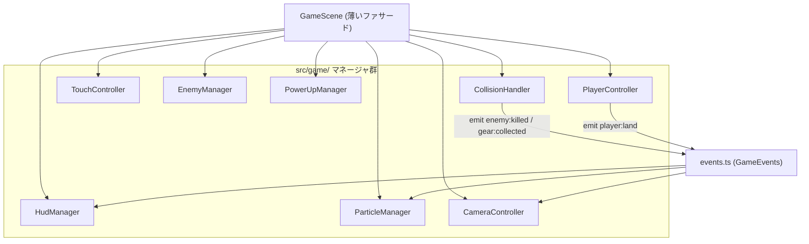

# 設計書: UI・操作性・演出の大規模ブラッシュアップ

| 項目 | 内容 |
|------|------|
| 作成日 | 2026-05-30 |
| 担当 | バルベルデ（architecture-designer） |
| 関連要求 | `.steering/20260530-ui-brushup-sprint/requirements.md` |
| 承認済みプラン | `~/.claude/plans/ui-iridescent-lovelace.md` |

---

## 1. アーキテクチャ概要

肥大化した `GameScene`（1200 行超）を責務ごとのマネージャへ分離し、その上にゲームフィール・UI・演出の改善を載せる。横画面は CSS 強制回転方式で固定する。原則は「**挙動不変の純粋抽出を先に → 抽出後のクラス内で機能追加**」。



## 2. 設計判断

### D-001: マネージャはプレーンクラスとし Scene を注入する
- 各マネージャは `Phaser.Scene` を継承しない。`constructor(scene: GameScene)` で親 Scene を受け取り、`scene.add / physics / tweens / cameras / time` を利用するプレーンクラスとする。
- Scene 継承は SceneManager 管理下での多重起動事故を招くため避ける。

### D-002: ライフサイクルは GameScene が統括する
- 各マネージャに `update(time, delta)` と `destroy()` を実装。`GameScene.update()` から委譲呼び出し、`events.once('shutdown', ...)`（既存のタイマー/AudioManager 破棄箇所）で各 `destroy()` を呼ぶ。

### D-003: マネージャ間連携は scene.events 経由
- グローバル結合を避け、`src/game/events.ts` の `GameEvents` 文字列 union（`player:land` / `enemy:killed` / `gear:collected` / `state:changed` 等）で疎結合化。発火側（CollisionHandler 等）と購読側（ParticleManager / CameraController / HudManager）を分離する。

### D-004: E2E 依存ファサードを GameScene に残す（最重要）
- `tests/e2e/game-visual.spec.ts` が `scene.applyPlayerState()` / `scene.playerState` / `scene.handleMiss()` / `scene.lives` / `scene.player` / `scene.groundMask` / `scene.springCoils` / `scene.pulseCores` / `scene.chronoCrystals` / `scene.isChronoShielded` / `scene.isCleared` / `scene.stageIndex` を直接参照する。
- 責務を移管しても、これらのメソッド/プロパティは GameScene 上に**薄い委譲ファサードとして残す**。最大の回帰リスク源。

### D-005: overlap コールバック移管時は context を新インスタンスへ
- 既存の overlap コールバックはアロー関数プロパティで `this` バインド済み。別クラスへ移す際は `physics.add.overlap(a, b, handler, undefined, ownerInstance)` の第 5 引数 context を新マネージャインスタンスにする。ゴール先登録 / `isCleared` ガード順序は維持する。

### D-006: 横画面は CSS 強制回転で固定する（過去決定の更新）
- `20260527-landscape-only` の D-001/D-002（強制回転・portrait UI を持たない）を、シャビ判断により更新する。縦持ち時に CSS 回転で横画面プレイを可能にする。
- `screen.orientation.lock()` は iOS Safari 非対応のため採用しない（CSS 方式を採る）。

### D-007: 横画面判定は文字列契約を避けて実装する
- E2E は `@media (orientation: portrait)` / `orientationchange` / `rotate-notice` の文字列を禁止している。媒体クエリ直書きや `orientationchange` を使わず、`window.matchMedia('(orientation: portrait)')` の `change` イベントで body にクラス（例 `is-portrait`）を付与し、クラス基準の CSS で回転させる。E2E 契約はこの新方式に合わせて書き換える。

## 3. コンポーネント設計（新規マネージャ）

配置: `src/game/`

### 3.1 events.ts
```ts
export const GameEvents = {
  PlayerLand: 'player:land',
  EnemyKilled: 'enemy:killed',
  GearCollected: 'gear:collected',
  StateChanged: 'state:changed',
  PulseHit: 'pulse:hit',
  Goal: 'goal'
} as const;
export type GameEvent = typeof GameEvents[keyof typeof GameEvents];
```

### 3.2 PlayerController
```ts
class PlayerController {
  constructor(scene: GameScene, sprite: Phaser.Physics.Arcade.Sprite);
  update(time: number, delta: number, input: InputState): void;
  setControlEnabled(enabled: boolean): void; // クリア/ミス時に入力を殺す
  get onGround(): boolean;
}
interface InputState { left: boolean; right: boolean; jumpHeld: boolean; jumpJustPressed: boolean; }
```
- コヨーテ: `lastOnGroundAt` を保持、`time - lastOnGroundAt <= COYOTE_TIME_MS` で許可。
- バッファ: `jumpRequestedAt` を保持、着地時 `time - jumpRequestedAt <= JUMP_BUFFER_MS` で即発火。
- 可変ジャンプ: 上昇中(`vy<0`)にボタンが離れたら `vy *= JUMP_CUT_MULTIPLIER`（`MIN_JUMP_VELOCITY` でクランプ）。
- 着地検出: 前フレーム非接地→接地かつ落下速度 `>= LAND_MIN_FALL_VELOCITY` で `scene.events.emit(GameEvents.PlayerLand, fallVelocity)`。
- 既存 L344-377 の移動/ジャンプ/アニメ/向きロジックを移植。

### 3.3 TouchController
```ts
class TouchController {
  constructor(scene: GameScene);
  getInput(): { left: boolean; right: boolean; jumpJustPressed: boolean };
  onDoubleTapRight?: () => void;
  destroy(): void;
}
```
- 既存 `setupTouchControls` / `handlePointer*`（L1144-1217）を移管。`movePointerId` / `jumpPointerId` / `touchMoveBaseX` を内包。
- `TOUCH_SLIDE_THRESHOLD_PX` を 12→18。右ゾーンに半透明円（`scene.add.circle().setScrollFactor(0)`）、押下で `TOUCH_BUTTON_FEEDBACK_ALPHA`。

### 3.4 EnemyManager
```ts
class EnemyManager {
  constructor(scene: GameScene, group: Phaser.Physics.Arcade.Group, groundMask: boolean[][]);
  update(): void;            // updateEnemyAi (L638-673)
  kill(enemy: Phaser.Physics.Arcade.Sprite): void; // killEnemyWithAnimation (L1074) + emit EnemyKilled
}
```

### 3.5 PowerUpManager
```ts
class PowerUpManager {
  constructor(scene: GameScene, player: Phaser.Physics.Arcade.Sprite);
  get state(): PlayerState;
  apply(state: PlayerState): void;          // applyPlayerState (L900-925)
  startChronoShield(): void; endChronoShield(): void; // L982-1018
  startInvincible(): void;                  // L1087
  get isInvincible(): boolean; get isChronoShielded(): boolean;
  snapToNearbyGround(): void;               // L937-966
  destroy(): void;                          // chrono/invincible タイマー・tween 破棄
}
```
- GameScene 側に `applyPlayerState` / `playerState` / `isChronoShielded` のファサードを残す（D-004）。

### 3.6 CollisionHandler
```ts
class CollisionHandler {
  constructor(scene: GameScene, deps: CollisionDeps);
  register(): void; // physics.add.overlap/collider 群 (L223-235) を集約。context=this
}
```
- 各 `onXxxOverlap`（L675-1064）を移管。ミス確定/踏み/能力アップは `scene.events.emit` で委譲。`handleMiss`（L708）は GameScene ファサードに残しつつ呼ぶ。

### 3.7 HudManager
```ts
class HudManager {
  constructor(scene: GameScene);
  layout(): void;                              // updateHudPositions (L867) + RESIZE 購読
  setGear(c: number, t: number): void; setStage(i: number, n: number): void; setLives(n: number): void;
  showInstruction(text: string): void; fadeInstruction(): void; // 開始時のみ→フェード
  showCenterMessage(text: string, style: object): Phaser.GameObjects.Text; // CLEAR/GAME OVER 共通化
  showPrompt(text: string): void;              // 点滅プロンプト（再開/次へ）
  destroy(): void;
}
```

### 3.8 ParticleManager
```ts
class ParticleManager {
  constructor(scene: GameScene);
  burstGear(x: number, y: number): void; burstEnemy(x: number, y: number): void;
  dust(x: number, y: number): void; burstPulse(x: number, y: number): void; celebrate(x: number, y: number): void;
}
```
- Phaser 3.80 の `scene.add.particles(x, y, key, config)` を使用。`PARTICLE_TEX_KEY`（`particle_dot`）を `spriteSheets.ts` に追加し BootScene で生成。

### 3.9 CameraController
```ts
class CameraController {
  constructor(scene: GameScene, player: Phaser.Physics.Arcade.Sprite, world: { w: number; h: number });
  start(): void;   // setBounds + startFollow + setDeadzone
  update(): void;  // 進行方向 lookahead を followOffset に補間
  applyZoom(): void; // 現 updateAll のズーム計算 (min(w/VW, h/VH))
  shake(ms: number, intensity: number): void;
}
```

## 4. gameConfig.ts 追加定数

requirements の表に準拠（フィール / カメラ / シェイク / タッチ / パーティクル / UI 集約）。新規 SE `land` を `SeKey` union と `SE_PARAMS` の両方へ追加。命名・初期値の確定は `decisions.md` に記録。

## 5. 横画面固定（CSS 強制回転）設計

### 5.1 DOM / CSS
- `index.html` のインライン CSS（CSP `unsafe-inline` 許可済み）に、`body.is-portrait #game` セレクタで回転スタイルを定義。
```css
body.is-portrait #game {
  width: 100vh; height: 100vw;
  transform: rotate(90deg);
  transform-origin: top left;
  position: absolute; top: 0; left: 100vw;
}
```
（`transform-origin` / オフセットは実装時に実機調整）

### 5.2 判定 JS（main.ts または index.html の module）
```ts
const mq = window.matchMedia('(orientation: portrait)');
const apply = () => document.body.classList.toggle('is-portrait', mq.matches);
mq.addEventListener('change', apply);
window.addEventListener('resize', () => game.scale.refresh());
apply();
```
- `orientationchange` 文字列は使わない（E2E 禁止 + 非推奨 API のため `matchMedia` を使用）。

### 5.3 Phaser ポインタ座標ズレ対策（最大リスク）
- CSS transform 後、Phaser の hit-test は getBoundingClientRect ベースで軸が食い違う。
- **対策方針（プロトタイプ検証で確定）**:
  1. 回転時の見かけ寸法（縦横入替）で `game.scale.resize(w, h)` を呼び、canvas 実寸を landscape 基準に保つ。
  2. それでもズレる場合、`scene.input` のポインタ変換を回転に合わせ補正、または回転対象を canvas でなく親ラッパーに限定し Phaser には正規座標を渡す構成へ切替。
- 実装時に「縦持ち実機でタッチ位置がゲーム内座標と一致するか」を必ず手動検証する。

### 5.4 E2E 契約の書き換え
- `game-visual.spec.ts` L31-43 の `rotate-notice` / `@media portrait` / `orientationchange` 禁止アサーションを、CSS 回転方式に合致する契約へ更新（manifest `landscape` 維持 + 回転クラス制御の許容）。過去決定の更新として `decisions.md` に記録。

## 6. 実装順序（フェーズ）

| フェーズ | 内容 | 完了条件 |
|---------|------|---------|
| P0 | gameConfig 定数追加 + 既存ハードコード文言/スタイル集約（挙動不変） | typecheck/build/e2e 緑 |
| P1 | 低リスク抽出: CameraController → HudManager → ParticleManager(新規) → TouchController。particle_dot 追加 | e2e 緑（HUD/カメラ pixel テスト維持） |
| P2 | PlayerController 抽出（挙動不変）→ コヨーテ/バッファ/可変ジャンプ/着地 SE/土煙/軽シェイク | e2e 緑 + 手動フィール確認 |
| P3 | EnemyManager → PowerUpManager → CollisionHandler 抽出（ファサード維持） | e2e 緑（能力/遷移テスト） |
| P4 | 演出接続: パーティクル/シェイク/ヒットストップ、CLEAR 星演出 | e2e 緑 + 手動演出確認 |
| P5 | UI: 再開/次へプロンプト（タッチ/キーで前倒し）、操作説明フェード | e2e 緑 + 手動確認 |
| P6 | 横画面 CSS 回転 + ポインタ検証 + E2E 契約書換 + docs 同期 | 縦持ち実機確認 + 全テスト緑 |

## 7. テスト戦略

### 番人テスト（回帰検出の要）
| テスト | 守る対象 |
|-------|---------|
| `keeps upgraded player feet visually grounded` | プレイヤー位置 / カメラ / HUD リファクタ |
| `collects clockwork abilities` / `preserves fire movement through each stage transition` | 能力 / 遷移 / ファサード維持 |
| `fits a fire-size player on every declared critical path landing` | applyPlayerState 直叩き → ファサード |
| `declares landscape-only...`（書換後） | 横画面 CSS 回転契約 |

### 手動確認
短押し低/長押し高ジャンプ、崖際コヨーテ、着地直前バッファ、着地 SE/土煙、踏みヒットストップ、ゴール星、タッチ仮想ボタン視覚 FB、再開プロンプトのタッチ/キー、操作説明フェード、**縦持ち時の CSS 回転表示とタッチ位置一致**。

## 8. 依存ライブラリ

新規依存は追加しない（Phaser 標準の Particle Emitter / camera.shake / matchMedia を使用）。

## 9. 変更ファイル構造

```text
.steering/20260530-ui-brushup-sprint/
  requirements.md / design.md / tasklist.md / decisions.md
src/
  config/gameConfig.ts          # 定数追加・文言集約・SeKey 'land' 追加
  game/                         # 新規ディレクトリ
    events.ts
    PlayerController.ts / TouchController.ts / EnemyManager.ts
    PowerUpManager.ts / CollisionHandler.ts / HudManager.ts
    ParticleManager.ts / CameraController.ts
  scenes/GameScene.ts           # 委譲 + ファサード維持
  scenes/spriteSheets.ts        # particle_dot 生成
  scenes/BootScene.ts           # particle_dot 登録
  audio/AudioManager.ts         # land SE
  main.ts                       # matchMedia 回転判定
index.html                      # 回転 CSS + is-portrait クラス
tests/e2e/game-visual.spec.ts   # 横画面契約書換
docs/                           # 6 文書同期
```

## 10. セキュリティ考慮事項
- CSP / 外部リソース / 入力処理は変更しない。回転 CSS はインライン（`unsafe-inline` 既許可）。シークレット・URL の追加なし。
- コミット前にクルトワ（security-engineer）へ XSS / インジェクション / CSP / ハードコーディング観点のレビューを依頼（CLAUDE.md 絶対ルール）。

## 11. パフォーマンス考慮事項
- パーティクルは取得・撃破等の単発バーストで lifespan 短く、常時負荷を避ける。60fps 維持が前提。
- ヒットストップは `physics.world.pause()` → `time.delayedCall` で物理のみ一時停止し、描画/音には波及させない。
- バンドルサイズは Phaser 標準機能のみのため大きな増加はない（実測は P6 で再確認）。

## 12. 将来の拡張性
- マネージャ分離後はユニットテスト導入（PlayerController のジャンプ判定等）が容易になる。今回はスコープ外だが基盤を作る。
- ParticleManager / CameraController は今後の演出追加の受け皿になる。
