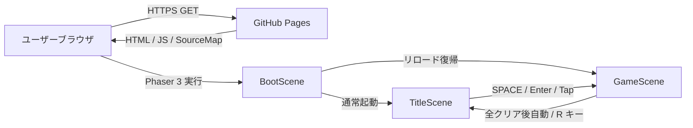
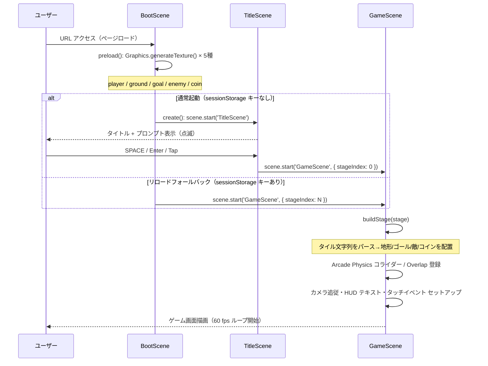
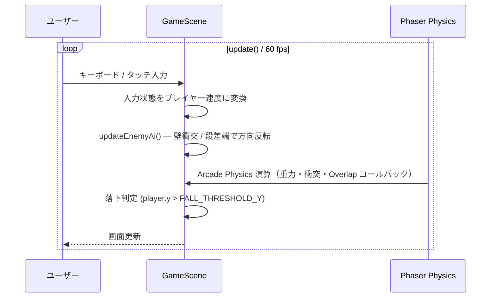
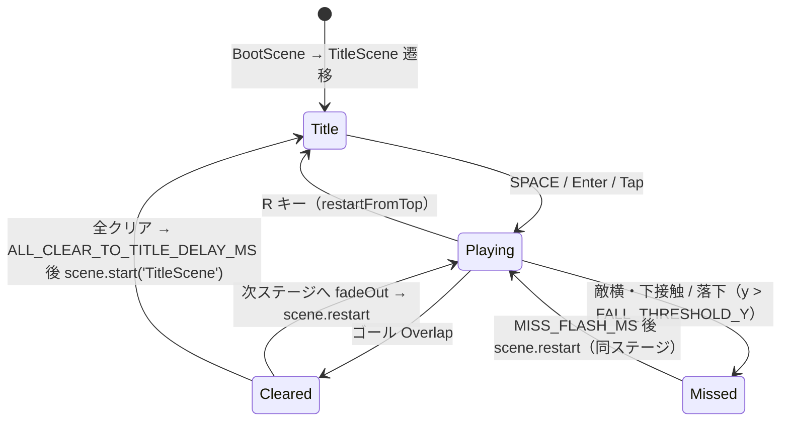
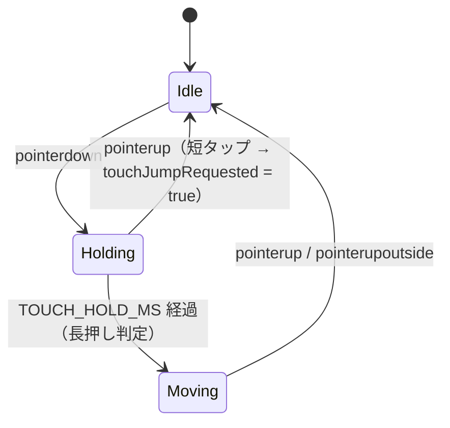

# 機能設計書

| 項目 | 内容 |
|------|------|
| 作成日 | 2026-05-04 |
| 最終更新 | 2026-05-05 |
| 担当 | バルベルデ |
| ステータス | 承認済み |

---

## システム構成図

本プロジェクトはバックエンド・DB・外部 API を持たない 100% 静的サイト構成。



```
+--------+   HTTPS GET   +-----------------+
| Browser| ============> | GitHub Pages    |
|        | <============ | HTML/JS/SrcMap  |
| Phaser |               +-----------------+
+--------+
```

- 外部 CDN・WebSocket・fetch は一切使用しない
- GitHub Pages の前段には GitHub 標準の Fastly CDN が入る（設定不要）

---

## データフロー

### 起動フロー（ページロード → ゲーム開始）



### ゲームループ（update 毎フレーム）



**動作の核:**
- Overlap コールバックはゴール → 敵 → コインの順に登録し、`isCleared` フラグで敵・コインの二重発火を防ぐ
- 敵の速度は毎フレーム強制セットし、衝突後の速度ゼロ化事故を防ぐ
- 敵の段差端検出は `groundMask` を O(1) 参照する（毎フレーム地形走査なし）
- `window.location.reload()` によるリスタートで Phaser の物理ワールド・テクスチャを完全再初期化する

---

## コンポーネント設計

### フロントエンド層

| コンポーネント | ファイル | 責務 |
|-------------|---------|------|
| エントリポイント | `src/main.ts` | `Phaser.Game` インスタンス生成。`gameConfig` から viewport / 重力 / 背景色を取得 |
| BootScene | `src/scenes/BootScene.ts` | `Graphics.generateTexture()` で 5 種のプレースホルダテクスチャを生成。通常起動は `TitleScene`、リロード復帰は `GameScene` へ遷移 |
| TitleScene | `src/scenes/TitleScene.ts` | タイトルテキスト + 点滅プロンプトを画面中央に表示。SPACE / Enter / Tap で `GameScene` へ遷移。全クリア後の自動遷移先。`Scale.RESIZE` 対応 |
| GameScene | `src/scenes/GameScene.ts` | ステージ構築 / プレイヤー操作 / カメラ追従 / 敵 AI / コイン取得 / スコア HUD / ミス演出 / ゴール判定 / 全クリア後 `TitleScene` 遷移 |
| ゲーム定数 | `src/config/gameConfig.ts` | 物理・寸法・閾値・色・テクスチャキー・HUD スタイル・タイトル画面定数の単一集約点。マジックナンバー禁止 |
| ステージ定義 | `src/stages/` | `StageDefinition` 型のステージデータ（`stage01.ts` / `stage02.ts` / `stage03.ts`）と `index.ts`（`STAGES` 配列・`getStage` / `nextStageIndex`） |

### バックエンド層

該当なし（静的サイト構成）。

### データ層

該当なし（外部 DB なし。ゲーム状態はすべてメモリ上の `GameScene` インスタンスフィールドで管理）。

---

## 通信プロトコル設計

### 静的ファイル配信

| メソッド | 対象 | 内容 |
|---------|------|------|
| `GET` | `index.html` | Vite エントリ HTML（CSP `<meta>` 含む） |
| `GET` | `assets/*.js` | Phaser + ゲームロジック バンドル（< 1.5 MB） |
| `GET` | `assets/*.js.map` | ソースマップ（デバッグ用、任意） |

- WebSocket / REST API / GraphQL は使用しない
- CORS 設定不要（同一オリジン完結）

### 上限・タイムアウト

| 項目 | 値 | 設定場所 |
|------|----|---------|
| base パス | 環境変数 `VITE_BASE_PATH` から取得（デフォルト `/`） | `vite.config.ts` |
| バンドルサイズ上限 | 1.5 MB（`dist/assets/*.js` 合計） | CI ビルド時に目視確認 |

---

## データモデル

### ゲーム内インメモリ構造

DB は存在しないが、ゲームロジックで使用する主要な型を定義する。

#### StageDefinition（ステージ定義）

```typescript
interface StageDefinition {
  readonly id: string;       // ステージ識別子（例: 'stage01'）
  readonly cols: number;     // 横タイル数
  readonly rows: number;     // 縦タイル数
  readonly tiles: readonly string[];  // 行ごとの文字列（長さ cols に固定）
}
```

タイル文字の意味:

| 文字 | 意味 | 制約 |
|------|------|------|
| `.` | 空 | なし |
| `#` | 地面（固定 Sprite） | なし |
| `P` | プレイヤースポーン | 1 ステージに 1 個・左三分の一以内 |
| `G` | ゴール | 1 ステージに 1 個 |
| `E` | 敵スポーン | 1〜8 個・真下が `#` 必須 |
| `C` | コイン | 1〜30 個 |

#### BuiltStage（buildStage() 生成物）

```typescript
interface BuiltStage {
  ground: Phaser.Physics.Arcade.StaticGroup;  // 地面 Sprite 群
  goal: Phaser.Physics.Arcade.Sprite;         // ゴール Sprite
  enemies: Phaser.Physics.Arcade.Group;       // 敵 Sprite 群（動的）
  coins: Phaser.Physics.Arcade.StaticGroup;   // コイン Sprite 群（静的）
  coinTotal: number;                          // ステージ内コイン総数
  groundMask: ReadonlyArray<ReadonlyArray<boolean>>;  // 地面有無マスク（敵AI用）
  spawnX: number;                             // プレイヤー初期 X 座標
  spawnY: number;                             // プレイヤー初期 Y 座標
}
```

#### GameScene 状態フィールド

| フィールド | 型 | 意味 |
|------------|----|----|
| `isCleared` | `boolean` | ゴール達成済みフラグ |
| `isMissed` | `boolean` | ミス演出中フラグ |
| `coinsCollected` | `number` | 取得済みコイン数 |
| `coinTotal` | `number` | ステージ内コイン総数 |
| `touchLeft` | `boolean` | タッチ左移動中 |
| `touchRight` | `boolean` | タッチ右移動中 |
| `touchJumpRequested` | `boolean` | タッチジャンプ要求フラグ（1 フレームで消費） |

---

## 機能別詳細

### プレイヤー状態遷移



- `isCleared` / `isMissed` フラグが立った後は `update()` でプレイヤー速度を 0 に固定
- ミス時はプレイヤーを白くフラッシュ（`MISS_FLASH_COLOR`）し `MISS_FLASH_MS` 後にリロード

### 敵 AI（updateEnemyAi）

毎フレーム以下の優先順で方向を決定する:

1. **壁衝突反転**: `body.blocked.left` → 右へ / `body.blocked.right` → 左へ
2. **段差端反転**: 着地中（`body.blocked.down`）に進行方向前方の足元タイルを `groundMask` で参照。地面なし → 方向反転
3. **速度強制セット**: 決定した方向 × `ENEMY_SPEED` を毎フレーム強制して衝突後の速度ゼロ化を防ぐ

```
probeX = enemy.x + dir × (ENEMY_SPRITE_W / 2 + 1)
probeY = enemy.y + ENEMY_SPRITE_H / 2 + 1
probeCol = floor(probeX / TILE_SIZE)
probeRow = floor(probeY / TILE_SIZE)
→ groundMask[probeRow][probeCol] が false なら反転
```

### 踏みつけ判定（onEnemyOverlap）

Overlap コールバック内で以下を評価する:

```
isStomp = player.body.velocity.y > 0
          AND player.body.bottom <= enemy.body.top + STOMP_TOLERANCE_PX
```

| 条件 | 結果 |
|------|------|
| `isStomp = true` | 敵を `disableBody(true, true)` で消滅 + プレイヤーに `STOMP_BOUNCE_VELOCITY` を付与 |
| `isStomp = false` | `handleMiss('enemy')` — ミス処理へ |

### タッチ入力状態遷移



- 短タップ（`TOUCH_HOLD_MS` 未満）でジャンプ発火（`touchJumpRequested`）
- 長押し（`TOUCH_HOLD_MS` 以上）でタッチ側に応じて `touchLeft` / `touchRight` をセット
- `pointerupoutside` も `pointerup` と同一ハンドラで処理

### ゴール / 敵 / コイン優先制御

Overlap の登録順:

1. `player` × `goal` → `onGoalHit`
2. `player` × `enemies` → `onEnemyOverlap`
3. `player` × `coins` → `onCoinOverlap`

ゴールを先に登録することで同フレーム発火時にゴールコールバックが先行する。さらに `onEnemyOverlap` / `onCoinOverlap` 冒頭の `isCleared` ガードにより、ゴール成立後の敵・コインコールバックを無効化する。

---

## 既存機能との互換性・影響範囲

| 機能 | 影響 | 緩和策 |
|------|------|------|
| `window.location.reload()` リスタート | ページ全体を再ロードするため Phaser の物理ワールド・テクスチャが完全再初期化される。ロードに数百 ms 〜 1 秒かかる | 許容済み（`scene.restart()` では床貫通バグが再現するため意図的な選択） |
| `StageDefinition.tiles` 文字列配列 | ステージ追加時は `src/stages/` にファイルを追加するだけ。既存 `GameScene.buildStage()` は `StageDefinition` 型を受け取るため変更不要 | 型で保証 |
| プレースホルダテクスチャ | `BootScene.preload()` の `generateTexture()` を `load.image()` に置換するだけで外部アセット化できる（`TEX_KEY` で抽象化済み） | `TEX_KEY` 定数で抽象化 |

---

## 非機能要件への対応

| 要件カテゴリ | 設計上の対応 |
|------------|-------------|
| パフォーマンス | Arcade Physics（軽量 AABB 判定）を採用。敵 AI の段差端検出は `groundMask` の O(1) 参照で毎フレームの地形走査を回避。バンドルサイズ監視（1.5 MB 上限） |
| 信頼性 | `isCleared` / `isMissed` フラグによる操作無効化。敵速度の毎フレーム強制セットで速度ゼロ化事故防止。`buildStage()` の入力バリデーションで不正なステージ定義を起動時に検出 |
| セキュリティ | Phaser `add.text()` に渡す文字列はリテラル定数または数値型限定（XSS リスクなし）。CSP `<meta>` で外部リソース読み込みを禁止しつつ、Phaser Loader の画像処理に必要な `img-src blob:` は許可。ハードコーディング禁止（全定数を `gameConfig.ts` に集約） |
| 可観測性 | DevTools の Performance タブで fps・バンドルサイズを確認。本番監視ツールは未導入（v0.3 以降で検討） |
