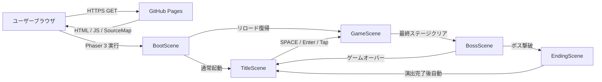
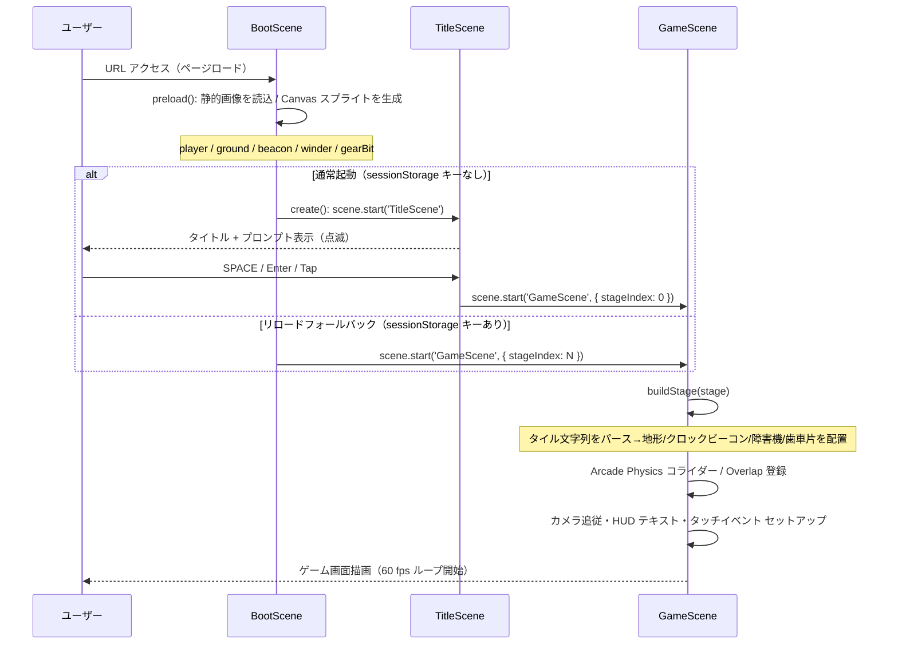
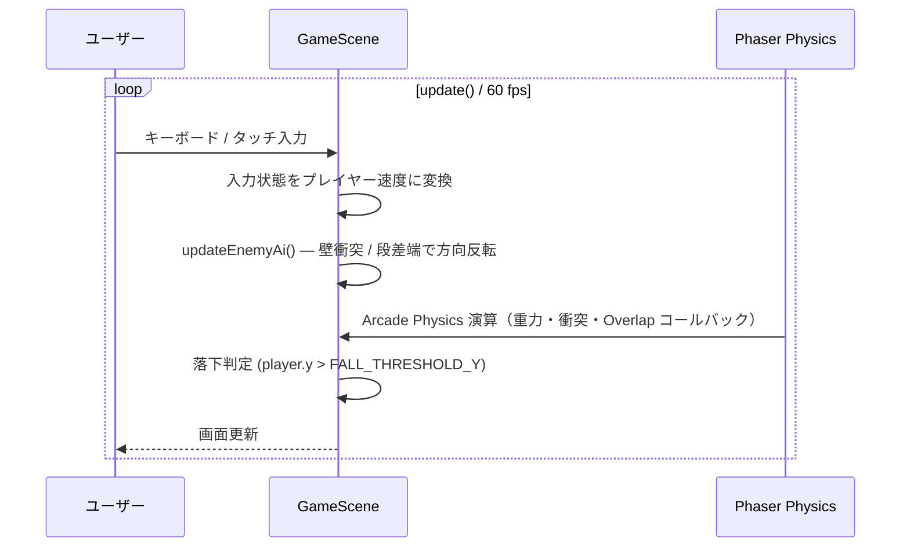
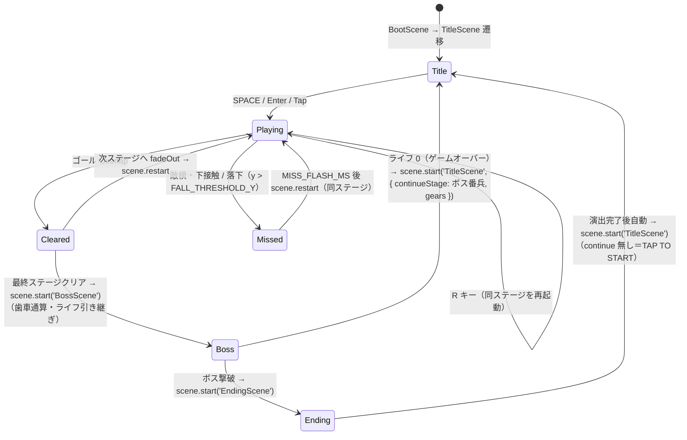
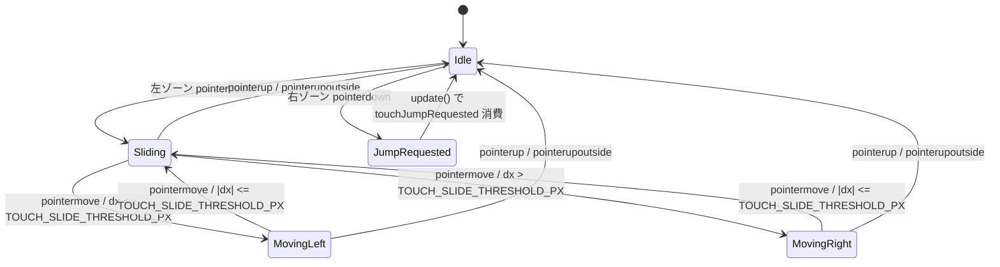

# 機能設計書

| 項目 | 内容 |
|------|------|
| 作成日 | 2026-05-04 |
| 最終更新 | 2026-05-30 |
| 担当 | バルベルデ |
| ステータス | 承認済み |

---

## システム構成図

本プロジェクトはバックエンド・DB・外部 API を持たない 100% 静的サイト構成。



```
+--------+   HTTPS GET   +-----------------+
| Browser| ============> | GitHub Pages    |
|        | <============ | HTML/JS/SrcMap  |
| Phaser |               +-----------------+
+--------+
```

- 外部 CDN・WebSocket・fetch は一切使用しない
- GitHub Pages の前段には GitHub 標準の Fastly CDN が入る（設定不要）

---

## データフロー

### 起動フロー（ページロード → ゲーム開始）



### ゲームループ（update 毎フレーム）



**動作の核:**
- Overlap コールバックはクロックビーコン → 障害機 → 歯車片の順に登録し、`isCleared` フラグで障害機・歯車片の二重発火を防ぐ
- 敵の速度は毎フレーム強制セットし、衝突後の速度ゼロ化事故を防ぐ
- 敵の段差端検出は `groundMask` を O(1) 参照する（毎フレーム地形走査なし）
- 通常のリスタートと次ステージ遷移は `scene.restart()` を使用し、床貫通再発時のみ `USE_HARD_RELOAD_FALLBACK` で全体リロードへ切り替えられる

---

## コンポーネント設計

### フロントエンド層

| コンポーネント | ファイル | 責務 |
|-------------|---------|------|
| エントリポイント | `src/main.ts` | `Phaser.Game` インスタンス生成。`gameConfig` から viewport / 重力 / 背景色を取得 |
| BootScene | `src/scenes/BootScene.ts` | 地面・歯車片・クロックビーコンの静的画像を読み込み、探索者・障害機・背景の Canvas スプライトを生成。通常起動は `TitleScene`、リロード復帰は `GameScene` へ遷移 |
| TitleScene | `src/scenes/TitleScene.ts` | タイトルテキスト + 点滅プロンプトを画面中央に表示。SPACE / Enter / Tap で開始。`init(continueStage, gears)` を受け取り、ゲームオーバー復帰時は `TAP TO CONTINUE`（そのステージ／ボス戦から再開・歯車数保持）、最初から／全クリア後は `TAP TO START`（stage1）。`Scale.RESIZE` 対応 |
| GameScene | `src/scenes/GameScene.ts` | ステージ構築と `src/game/` マネージャ群の生成・接続を担う薄いオーケストレーター。プレイヤー操作・カメラ・HUD・タッチ・AI・衝突・能力・パーティクルは各マネージャへ委譲。E2E ファサード（`applyPlayerState` / `handleMiss` / `player` / `lives` 等）は GameScene 上に維持する。最終ステージクリア時は `BossScene` へ遷移 |
| BossScene | `src/scenes/BossScene.ts` | ラスボス戦シーン。固定アリーナをプログラム生成し、`BossController`（振り子の大時計「グランドファーザー」）と `BossHpBar` を統合。**振り子の錘を上から踏みつけ**て撃破し `EndingScene` へ遷移。被弾・ライフ・ゲームオーバーは GameScene と同方式 |
| マネージャ群 | `src/game/` | `CameraController` / `HudManager` / `ParticleManager` / `TouchController` / `PlayerController` / `EnemyManager` / `PowerUpManager` / `CollisionHandler` の 8 クラス。プレーンクラス（Scene 非継承）として scene を受け取り責務を実行する |
| ゲーム定数 | `src/config/gameConfig.ts` | 物理・寸法・閾値・色・テクスチャキー・HUD スタイル・タイトル画面定数の単一集約点。マジックナンバー禁止 |
| ステージ定義 | `src/stages/` | `StageDefinition` 型のステージデータ（`stage01.ts` / `stage02.ts` / `stage03.ts`）と `index.ts`（`STAGES` 配列・`getStage` / `nextStageIndex`） |
| ステージ契約検証 | `src/stages/stageValidation.ts` | 必須ルートの最大プレイヤー用クリアランス検証と、敵数・ギャップ数・高所区間数に基づく難易度進行の計測 |

### バックエンド層

該当なし（静的サイト構成）。

### データ層

該当なし（外部 DB なし。ゲーム状態はすべてメモリ上の `GameScene` インスタンスフィールドで管理）。

---

## 通信プロトコル設計

### 静的ファイル配信

| メソッド | 対象 | 内容 |
|---------|------|------|
| `GET` | `index.html` | Vite エントリ HTML（CSP `<meta>` 含む） |
| `GET` | `assets/*.js` | Phaser + ゲームロジック バンドル（< 1.6 MB） |
| `GET` | `assets/*.js.map` | ソースマップ（デバッグ用、任意） |

- WebSocket / REST API / GraphQL は使用しない
- CORS 設定不要（同一オリジン完結）

### 上限・タイムアウト

| 項目 | 値 | 設定場所 |
|------|----|---------|
| base パス | 環境変数 `VITE_BASE_PATH` から取得（デフォルト `/`） | `vite.config.ts` |
| バンドルサイズ上限 | 1.6 MB（`dist/assets/*.js` 合計、gzip 後 360 KB 目安） | CI ビルド時に目視確認 |

---

## データモデル

### ゲーム内インメモリ構造

DB は存在しないが、ゲームロジックで使用する主要な型を定義する。

#### StageDefinition（ステージ定義）

```typescript
interface StageDefinition {
  readonly id: string;       // ステージ識別子（例: 'stage01'）
  readonly cols: number;     // 横タイル数
  readonly rows: number;     // 縦タイル数
  readonly tiles: readonly string[];  // 行ごとの文字列（長さ cols に固定）
  readonly criticalPath: readonly CriticalPathSegment[]; // 必須走路の支持床区間
  readonly difficulty: StageDifficultyTarget; // ステージ役割と最低難度
}
```

`criticalPath` の各区間は `supportRow` の床上を歩く必須ルートを表す。プレイヤーが詰まらないよう支持床の直上 3 タイルに `#` がないことを `validateCriticalPathClearance()` で検証する。同時に `P` タイル左右 1 セルに `#` がないことを確認し、スポーン / ステージ遷移直後に body が地形へ食い込まないようにする。

難易度は `measureStageDifficulty()` が `enemyCount + groundGapCount * 2 + elevatedSegmentCount * 2` を算出する。`enemyCount` は 3 種すべて（`E` 巻きネジ障害機 + `F` 時計トンボ + `B` チクタク爆弾）の合算。`elevatedSegmentCount` は宣言区間数ではなく、主床より上のタイル表面から導出する。`validateDifficultyProgression()` は役割 `intro` / `intermediate` / `final` と score の Stage 01 から Stage 03 への厳密増加を確認する。

タイル文字の意味:

| 文字 | 意味 | 制約 |
|------|------|------|
| `.` | 空 | なし |
| `#` | 地面（固定 Sprite） | なし |
| `P` | プレイヤースポーン | 1 ステージに 1 個・左三分の一以内 |
| `G` | ゴール | 1 ステージに 1 個 |
| `E` | 巻きネジ障害機（地上歩行敵）スポーン | 真下が `#` 必須 |
| `F` | 時計トンボ（飛行敵）スポーン | 空中配置可（真下 `#` 不要） |
| `B` | チクタク爆弾（追尾自爆敵）スポーン | 真下が `#` 必須 |
| 敵合計（`E`+`F`+`B`） | — | 1〜`MAX_ENEMIES_PER_STAGE`（20）個 |
| `C` | 歯車片 | 1〜30 個 |
| `H` | 回復アイテム「予備ゼンマイ」 | 各ステージちょうど 1 個・取得でライフ +1（上限 `INITIAL_LIVES`=3） |

#### BuiltStage（buildStage() 生成物）

```typescript
interface BuiltStage {
  ground: Phaser.Physics.Arcade.StaticGroup;  // 地面 Sprite 群
  goal: Phaser.Physics.Arcade.Sprite;         // ゴール Sprite
  enemies: Phaser.Physics.Arcade.Group;       // 敵 Sprite 群（動的）
  gearBits: Phaser.Physics.Arcade.StaticGroup;  // 歯車片 Sprite 群（静的）
  gearBitTotal: number;                         // ステージ内歯車片総数
  healItems: Phaser.Physics.Arcade.StaticGroup; // 回復アイテム「予備ゼンマイ」群（静的・各ステージ1個）
  groundMask: ReadonlyArray<ReadonlyArray<boolean>>;  // 地面有無マスク（敵AI用）
  spawnX: number;                             // プレイヤー初期 X 座標
  spawnY: number;                             // プレイヤー初期 Y 座標
}
```

#### GameScene 状態フィールド

| フィールド | 型 | 意味 |
|------------|----|----|
| `isCleared` | `boolean` | ゴール達成済みフラグ |
| `isMissed` | `boolean` | ミス演出中フラグ |
| `gearBitsCollected` | `number` | 取得済み歯車片数 |
| `gearBitTotal` | `number` | ステージ内歯車片総数 |
| `touchLeft` | `boolean` | タッチ左移動中 |
| `touchRight` | `boolean` | タッチ右移動中 |
| `touchJumpRequested` | `boolean` | タッチジャンプ要求フラグ（1 フレームで消費） |

---

## 機能別詳細

### プレイヤー状態遷移



ボス戦（`BossScene`）の状態遷移は別途 `BossController` の状態機械（`intro` → `attack` ⇄ `stagger` → `defeated`）が駆動する。`attack` は振り子スイープ + 落下歯車で、**振り子の錘を上から踏む**とダメージが入る。被ダメージ直後は `stagger`（短いよろけ・当たり判定無効・点滅）で多重ヒットを防ぎ、攻撃へ復帰するたびに振り子の角速度が 1 段上がる。錘を 3 回踏みつける（HP=0）と `defeated` → `EndingScene` へ遷移する。（旧仕様の弱点コア露出方式は 20260603 に廃止。）

- `isCleared` / `isMissed` フラグが立った後は `update()` でプレイヤー速度を 0 に固定
- ミス時はプレイヤーを白くフラッシュ（`MISS_FLASH_COLOR`）し `MISS_FLASH_MS` 後に同ステージを再起動

### 敵 AI（EnemyManager.update）

`EnemyManager` は単一の `enemies` グループを管理し、各スプライトの `data: type`（`winder` / `flyer` / `bomb`）で AI を分岐する。

**巻きネジ障害機（winder, `'E'`）** — 毎フレーム以下の優先順で方向を決定する:

1. **壁衝突反転**: `body.blocked.left` → 右へ / `body.blocked.right` → 左へ
2. **段差端反転**: 着地中（`body.blocked.down`）に進行方向前方の足元タイルを `groundMask` で参照。地面なし → 方向反転
3. **速度強制セット**: 決定した方向 × `ENEMY_SPEED` を毎フレーム強制して衝突後の速度ゼロ化を防ぐ

```
probeX = enemy.x + dir × (halfW + 1)   // halfW は種別ごとのスプライト半幅
probeY = enemy.y + ENEMY_SPRITE_H / 2 + 1
probeCol = floor(probeX / TILE_SIZE)
probeRow = floor(probeY / TILE_SIZE)
→ groundMask[probeRow][probeCol] が false なら反転
```

**時計トンボ（flyer, `'F'`）** — `body.allowGravity = false`。水平は巡回範囲端（原点 ± `FLYER_PATROL_HALF_PX`）または壁で反転。垂直は目標 `originY + FLYER_BOB_AMP_PX × sin(FLYER_BOB_OMEGA × now + phase)` へ P 制御（`FLYER_BOB_K`）で追従し、ドリフトを自己補正する。

**チクタク爆弾（bomb, `'B'`）** — 状態遷移 `idle → chase → fuse`:

1. `idle`: 停止。プレイヤーが検知範囲（`BOMB_DETECT_PX` / `BOMB_DETECT_Y_PX`）に入ると `chase` へ。
2. `chase`: プレイヤー方向へ `BOMB_SPEED` で追尾。崖際・壁では停止（落下/めり込み防止）。至近（`BOMB_FUSE_TRIGGER_PX`）かつ接地で `fuse` へ。
3. `fuse`: 停止し点滅テレグラフ（`bombTick`）。`BOMB_FUSE_MS` 経過で `explode()` → `EnemyExploded` 発火し自身を破棄。GameScene 側が爆風（`BOMB_BLAST_RADIUS_PX`）内のプレイヤーへ被弾・演出を適用。

### 踏みつけ判定（onEnemyOverlap）

Overlap コールバック内で以下を評価する:

```
isStomp = player.body.velocity.y > 0
          AND player.body.bottom <= enemy.body.top + STOMP_TOLERANCE_PX
```

| 条件 | 結果 |
|------|------|
| `isStomp = true` | 3 種共通: `EnemyManager.kill()` でやられ演出 + プレイヤーに `STOMP_BOUNCE_VELOCITY` を付与（爆弾は導火前に解除される）|
| `isStomp = false` かつ 爆弾 | `EnemyManager.explode()` — 自爆。被弾は `EnemyExploded` ハンドラの爆風判定に委ねる |
| `isStomp = false` かつ その他 | `handleMiss('enemy')` — ミス処理へ |

### タッチ入力状態遷移



- 左ゾーンのスライド距離が `TOUCH_SLIDE_THRESHOLD_PX` を超えると `touchLeft` / `touchRight` をセットする
- 右ゾーンのタップでジャンプを要求する
- `pointerupoutside` も `pointerup` と同一ハンドラで処理

### 対応画面向き

- サポートするプレイ向きは横画面（landscape）のみとする。PWA manifest の `orientation` は `landscape` を指定する。
- 縦持ち（portrait）端末には CSS 強制回転方式で対応する: `body.is-portrait #game { transform: rotate(90deg); transform-origin: top left; position: absolute; top: 0; left: 100vw; width: 100vh; height: 100vw; }`。
- 向き判定は `window.matchMedia('(orientation: portrait)')` の `change` イベントで `body.is-portrait` クラスを付与する。`orientationchange` API は非推奨のため使用しない。
- `Phaser.Scale.RESIZE` は横画面内での表示領域変化への対応として維持する。

### タッチ入力改善（V2）

- スライド感度を `TOUCH_SLIDE_THRESHOLD_PX_V2 = 18px` に改善（旧値 12px）。誤反応を低減する。
- 右ゾーンに仮想ジャンプボタン（半透明円）を表示し、押下中は `TOUCH_BUTTON_FEEDBACK_ALPHA` に変化させて視覚フィードバックを提供する。
- クリア / ゲームオーバー待機中のタップは `consumeAdvanceTap()` で検出し、自動遷移を前倒しできる。

### UI 再開フロー

- STAGE CLEAR / ALL CLEAR / GAME OVER の各状態では `HudManager.showCenterMessage` + `showPrompt` で中央メッセージと点滅プロンプトを表示する。
- `GameScene.pendingAdvance` に遷移アクション（next stage fade / TitleScene / fullRestart）を設定し、プレイヤーがキー（Space / ↑）またはタッチでタップすると `firePendingAdvance()` で前倒し実行できる。自動遷移タイマーも同じ `firePendingAdvance()` を呼ぶため、一度実行されると 2 回目は空振りする（null チェック）。

### クロックビーコン / 障害機 / 歯車片優先制御

Overlap の登録順:

1. `player` × `goal` → `onGoalHit`
2. `player` × `enemies` → `onEnemyOverlap`
3. `player` × `gearBits` → `onGearBitOverlap`

クロックビーコンを先に登録することで同フレーム発火時にクリアコールバックが先行する。さらに `onEnemyOverlap` / `onGearBitOverlap` 冒頭の `isCleared` ガードにより、クリア成立後の障害機・歯車片コールバックを無効化する。

---

## 既存機能との互換性・影響範囲

| 機能 | 影響 | 緩和策 |
|------|------|------|
| リスタート方式 | 通常は `scene.restart()` で同一ステージまたは次ステージへ遷移する。床貫通問題が再発した場合のみ `USE_HARD_RELOAD_FALLBACK = true` で `window.location.reload()` 経路へ切り替える | フォールバック定数で切替可能 |
| `StageDefinition.tiles` 文字列配列 | ステージ追加時は `src/stages/` にファイルを追加するだけ。既存 `GameScene.buildStage()` は `StageDefinition` 型を受け取るため変更不要 | 型で保証 |
| 通路の閉塞 | 低天井でプレイヤーが進行不能になり得る | `criticalPath` と床上 3 タイル検証を Playwright で実行 |
| ステージ間の難易度差 | 地形変更で難易度が逆転または同等化し得る | 敵数・ギャップ数・高所区間数による score の厳密増加を検証 |
| 時計工房アセット | 静的画像は `BootScene.preload()` の `load.image()`、キャラ・敵・背景スプライトは Canvas ビルダーを使用する | `TEX_KEY` 定数で抽象化 |

---

## 非機能要件への対応

| 要件カテゴリ | 設計上の対応 |
|------------|-------------|
| パフォーマンス | Arcade Physics（軽量 AABB 判定）を採用。敵 AI の段差端検出は `groundMask` の O(1) 参照で毎フレームの地形走査を回避。バンドルサイズ監視（1.6 MB 上限） |
| 信頼性 | `isCleared` / `isMissed` フラグによる操作無効化。敵速度の毎フレーム強制セットで速度ゼロ化事故防止。`buildStage()` の入力バリデーションに加え、テスト時に `criticalPath` の通行性と段階難度を検証 |
| セキュリティ | Phaser `add.text()` に渡す文字列はリテラル定数または数値型限定（XSS リスクなし）。CSP `<meta>` で外部リソース読み込みを禁止しつつ、Phaser Loader の画像処理に必要な `img-src blob:` は許可。ハードコーディング禁止（全定数を `gameConfig.ts` に集約） |
| 可観測性 | DevTools の Performance タブで fps・バンドルサイズを確認。本番監視ツールは未導入（v0.3 以降で検討） |
